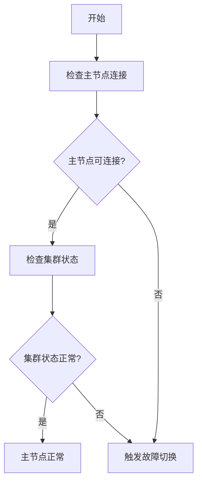
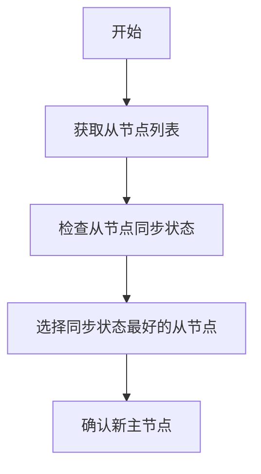
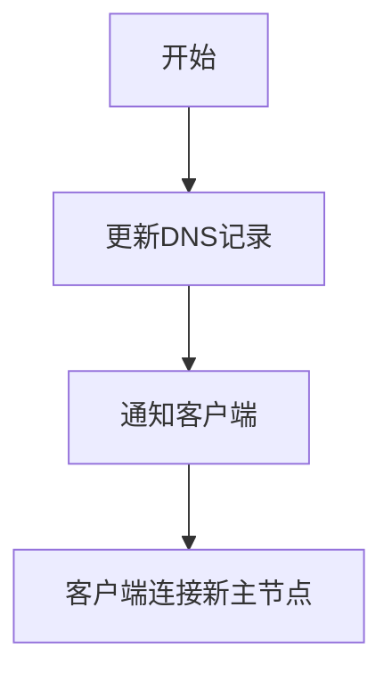

# 故障切换机制

<cite>
**本文档引用的文件**   
- [redis_cluster_failover.go](file://dbm-services/redis/db-tools/dbactuator/pkg/atomjobs/atomredis/redis_cluster_failover.go)
- [failover_drill.py](file://dbm-ui/backend/db_periodic_task/local_tasks/redis_failover_drill/failover_drill.py)
- [redis_migrate_slots.go](file://dbm-services/redis/db-tools/dbactuator/pkg/atomjobs/atomredis/redis_migrate_slots.go)
- [db_event.go](file://dbm-services/common/dbha-v2/pkg/storage/haprobe/db_event.go)
- [failover_status_check.py](file://dbm-ui/backend/flow/plugins/components/collections/common/failover_status_check.py)
</cite>

## 目录
1. [引言](#引言)
2. [故障切换流程概述](#故障切换流程概述)
3. [主节点故障检测](#主节点故障检测)
4. [新主节点选举](#新主节点选举)
5. [从节点重定向](#从节点重定向)
6. [自动与手动切换](#自动与手动切换)
7. [回滚策略](#回滚策略)
8. [日志分析方法](#日志分析方法)
9. [监控指标解读](#监控指标解读)
10. [结论](#结论)

## 引言
本文档系统性地介绍Redis服务的故障切换机制，详细说明主节点故障检测、选举新主节点、从节点重定向等关键步骤的实现过程。结合`failover.go`中的故障切换算法和`failover_controller.py`中的控制逻辑，分析自动与手动切换的触发条件、执行流程及回滚策略，并提供故障切换过程中的日志分析方法和监控指标解读。

## 故障切换流程概述
Redis服务的故障切换机制旨在确保在主节点发生故障时，系统能够快速、可靠地将服务切换到备用节点，从而保证服务的高可用性。故障切换流程主要包括主节点故障检测、新主节点选举、从节点重定向等关键步骤。

**Section sources**
- [redis_cluster_failover.go](file://dbm-services/redis/db-tools/dbactuator/pkg/atomjobs/atomredis/redis_cluster_failover.go#L89-L129)

## 主节点故障检测
主节点故障检测是故障切换的第一步。系统通过定期检查主节点的连接状态和集群状态来判断主节点是否正常。如果主节点无法连接或集群状态异常，系统将触发故障切换流程。

**Diagram sources**
- [redis_cluster_failover.go](file://dbm-services/redis/db-tools/dbactuator/pkg/atomjobs/atomredis/redis_cluster_failover.go#L132-L185)

**Section sources**
- [redis_cluster_failover.go](file://dbm-services/redis/db-tools/dbactuator/pkg/atomjobs/atomredis/redis_cluster_failover.go#L132-L185)

## 新主节点选举
新主节点选举是故障切换的核心步骤。系统从可用的从节点中选择一个作为新的主节点。选举过程考虑从节点的同步状态、延迟等因素，确保选择的从节点数据最新。

**Diagram sources**
- [redis_migrate_slots.go](file://dbm-services/redis/db-tools/dbactuator/pkg/atomjobs/atomredis/redis_migrate_slots.go#L970-L1052)

**Section sources**
- [redis_migrate_slots.go](file://dbm-services/redis/db-tools/dbactuator/pkg/atomjobs/atomredis/redis_migrate_slots.go#L970-L1052)

## 从节点重定向
从节点重定向是指将客户端请求从旧的主节点重定向到新的主节点。系统通过更新DNS记录或配置文件，使客户端能够连接到新的主节点。

**Diagram sources**
- [failover_drill.py](file://dbm-ui/backend/db_periodic_task/local_tasks/redis_failover_drill/failover_drill.py#L157-L175)

**Section sources**
- [failover_drill.py](file://dbm-ui/backend/db_periodic_task/local_tasks/redis_failover_drill/failover_drill.py#L157-L175)

## 自动与手动切换
故障切换可以是自动的或手动的。自动切换由系统在检测到主节点故障时自动触发，而手动切换由管理员在维护或测试时手动触发。

**Section sources**
- [redis_cluster_failover.go](file://dbm-services/redis/db-tools/dbactuator/pkg/atomjobs/atomredis/redis_cluster_failover.go#L90-L124)

## 回滚策略
在故障切换后，如果发现新主节点存在问题，系统可以执行回滚操作，将服务切换回原来的主节点。回滚策略包括检查原主节点的状态、同步数据等步骤。

**Section sources**
- [redis_cluster_failover.go](file://dbm-services/redis/db-tools/dbactuator/pkg/atomjobs/atomredis/redis_cluster_failover.go#L387-L390)

## 日志分析方法
日志分析是故障切换过程中重要的调试手段。通过分析系统日志，可以了解故障切换的详细过程，定位问题所在。

**Section sources**
- [failover_status_check.py](file://dbm-ui/backend/flow/plugins/components/collections/common/failover_status_check.py#L93-L102)

## 监控指标解读
监控指标是评估故障切换效果的重要依据。关键监控指标包括主节点连接状态、从节点同步延迟、故障切换时间等。

**Section sources**
- [db_event.go](file://dbm-services/common/dbha-v2/pkg/storage/haprobe/db_event.go#L47-L48)

## 结论
Redis服务的故障切换机制通过主节点故障检测、新主节点选举、从节点重定向等步骤，确保了服务的高可用性。自动与手动切换机制提供了灵活性，回滚策略则增加了系统的可靠性。通过日志分析和监控指标解读，可以有效管理和优化故障切换过程。