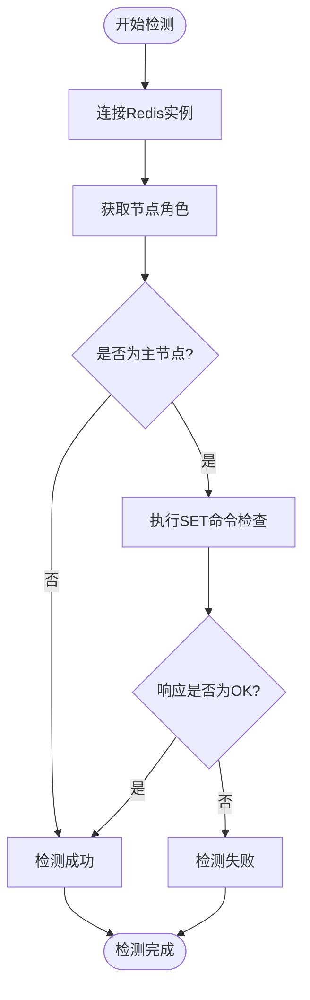
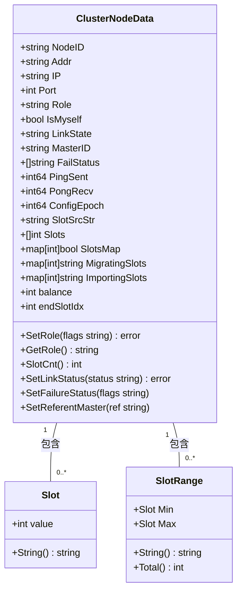
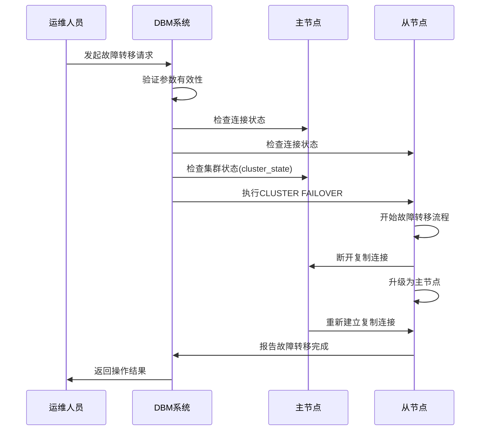
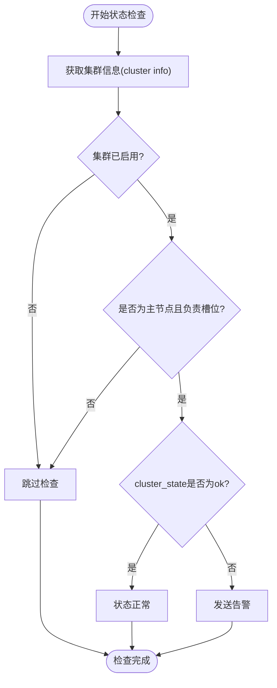

# 集群模式高可用

<cite>
**本文档引用的文件**   
- [rediscluster_detect.go](file://dbm-services/common/dbha/ha-module/dbmodule/redis/rediscluster_detect.go)
- [rediscluster_switch.go](file://dbm-services/common/dbha/ha-module/dbmodule/redis/rediscluster_switch.go)
- [rediscluster_callback.go](file://dbm-services/common/dbha/ha-module/dbmodule/redis/rediscluster_callback.go)
- [cluster_info.go](file://dbm-services/redis/db-tools/dbmon/models/myredis/cluster_info.go)
- [redis_task.go](file://dbm-services/redis/db-tools/dbmon/pkg/redismonitor/redis_task.go)
- [redis_cluster_failover.go](file://dbm-services/redis/db-tools/dbactuator/pkg/atomjobs/atomredis/redis_cluster_failover.go)
- [cluster_nodes.go](file://dbm-services/redis/db-tools/dbactuator/models/myredis/cluster_nodes.go)
- [slot.go](file://dbm-services/redis/db-tools/dbactuator/models/myredis/slot.go)
- [redis_cluster_status.go](file://dbm-services/common/dbha-v2/pkg/storage/haprobe/redis_cluster_status.go)
- [redis_cluster_nodes.py](file://dbm-ui/backend/flow/utils/redis/redis_cluster_nodes.py)
</cite>

## 目录
1. [引言](#引言)
2. [集群节点发现机制](#集群节点发现机制)
3. [槽位分配与管理](#槽位分配与管理)
4. [故障转移实现原理](#故障转移实现原理)
5. [重新分片与扩缩容](#重新分片与扩缩容)
6. [数据一致性与网络分区处理](#数据一致性与网络分区处理)
7. [集群监控与状态检查](#集群监控与状态检查)
8. [操作指南](#操作指南)
9. [结论](#结论)

## 引言

本文档深入解析Redis集群模式的高可用架构设计，涵盖集群节点发现、槽位分配、故障转移和重新分片的实现原理。通过分析关键组件的底层实现，探讨集群模式下的数据一致性保障和网络分区处理策略，并提供集群扩容、缩容的操作指南。

## 集群节点发现机制

Redis集群通过Gossip协议实现节点发现和状态传播。每个节点定期与其他节点交换信息，维护集群的拓扑结构。在BlueKing DBM系统中，`rediscluster_detect.go`文件实现了对Redis集群节点的检测逻辑。检测实例通过`Detection`方法执行检测，首先尝试连接Redis实例，然后通过`INFO Replication`命令获取角色信息。如果节点是主节点，则执行`SET`命令验证写入能力。

**Diagram sources**
- [rediscluster_detect.go](file://dbm-services/common/dbha/ha-module/dbmodule/redis/rediscluster_detect.go#L22-L83)

**Section sources**
- [rediscluster_detect.go](file://dbm-services/common/dbha/ha-module/dbmodule/redis/rediscluster_detect.go#L1-L162)

## 槽位分配与管理

Redis集群将整个键空间划分为16384个槽位（slots），这些槽位被分配给集群中的各个主节点。槽位分配信息通过`cluster nodes`命令获取和维护。`cluster_nodes.go`文件中的`ClusterNodeData`结构体定义了节点数据模型，包含节点ID、地址、角色、主节点ID、槽位范围等信息。

槽位管理的关键操作包括：
- **槽位解析**：`DecodeSlotsFromStr`函数解析槽位字符串，如"0-10,12,100-200"
- **槽位转换**：`ConvertSlotToStr`和`ConvertSlotToShellFormat`函数将槽位列表转换为可读格式
- **槽位差异计算**：`SlotSliceDiff`函数计算两个槽位列表的差异

**Diagram sources**
- [cluster_nodes.go](file://dbm-services/redis/db-tools/dbactuator/models/myredis/cluster_nodes.go#L19-L443)
- [slot.go](file://dbm-services/redis/db-tools/dbactuator/models/myredis/slot.go#L1-L239)

**Section sources**
- [cluster_nodes.go](file://dbm-services/redis/db-tools/dbactuator/models/myredis/cluster_nodes.go#L1-L443)
- [slot.go](file://dbm-services/redis/db-tools/dbactuator/models/myredis/slot.go#L1-L239)

## 故障转移实现原理

Redis集群的故障转移机制确保在主节点失效时，其从节点能够自动或手动升级为主节点，维持集群的可用性。`redis_cluster_failover.go`文件实现了故障转移的完整流程，包括预检查、执行故障转移和状态验证。

故障转移流程如下：
1. **预检查**：验证所有相关节点的连接状态、集群状态和复制链路
2. **执行故障转移**：在从节点上执行`CLUSTER FAILOVER`命令
3. **状态验证**：等待旧主节点成为新主节点的从节点，确保复制链路正常

**Diagram sources**
- [redis_cluster_failover.go](file://dbm-services/redis/db-tools/dbactuator/pkg/atomjobs/atomredis/redis_cluster_failover.go#L1-L538)

**Section sources**
- [redis_cluster_failover.go](file://dbm-services/redis/db-tools/dbactuator/pkg/atomjobs/atomredis/redis_cluster_failover.go#L1-L538)

## 重新分片与扩缩容

重新分片（resharding）是Redis集群动态调整槽位分布的核心机制，用于实现集群的扩容和缩容。当需要增加或减少集群节点时，通过重新分片将槽位从现有节点迁移到新节点或从待移除节点迁移到其他节点。

重新分片的关键步骤：
1. **准备阶段**：确定源节点和目标节点，计算需要迁移的槽位
2. **迁移阶段**：使用`CLUSTER SETSLOT`命令将槽位标记为迁移状态
3. **数据迁移**：逐个槽位迁移数据，使用`MIGRATE`命令
4. **切换阶段**：更新集群配置，使客户端开始向新节点发送请求
5. **清理阶段**：从源节点删除已迁移的槽位信息

在BlueKing DBM系统中，`redis_migrate_slots.go`文件实现了槽位迁移的重试机制，处理迁移过程中可能出现的网络中断或节点故障。

## 数据一致性与网络分区处理

Redis集群采用最终一致性模型，在网络分区（network partition）情况下，遵循CAP理论中的AP原则，优先保证可用性。集群通过以下机制处理网络分区：

- **多数派原则**：只有当集群中大多数主节点可达时，集群才被认为是可用的
- **脑裂防护**：在网络分区情况下，较小的分区会停止服务，防止数据不一致
- **延迟检测**：通过`cluster info`命令中的`cluster_stats_messages_ping_sent`等指标监控节点间通信延迟

`redis_task.go`文件中的`CheckClusterState`方法定期检查集群状态，当`cluster_state`不为"ok"时触发告警，提示运维人员介入处理。

**Diagram sources**
- [redis_task.go](file://dbm-services/redis/db-tools/dbmon/pkg/redismonitor/redis_task.go#L502-L539)
- [cluster_info.go](file://dbm-services/redis/db-tools/dbmon/models/myredis/cluster_info.go#L1-L105)

**Section sources**
- [redis_task.go](file://dbm-services/redis/db-tools/dbmon/pkg/redismonitor/redis_task.go#L1-L588)
- [cluster_info.go](file://dbm-services/redis/db-tools/dbmon/models/myredis/cluster_info.go#L1-L105)

## 集群监控与状态检查

BlueKing DBM系统通过`redis_task.go`文件实现了全面的Redis集群监控。监控任务定期执行以下检查：

- **连接检查**：验证所有Redis实例的网络连接
- **同步检查**：监控主从复制状态，确保`master_link_status`为"up"
- **持久化检查**：验证主节点有从节点，缓存Redis从节点开启AOF
- **内存检查**：监控内存使用率，避免达到`maxmemory`限制
- **集群状态检查**：确保`cluster_state`为"ok"

`redis_cluster_status.go`文件定义了集群状态的数据结构，包含基础信息、内存状态、主节点信息、持久化状态以及集群特有的连接数、从节点状态等指标。

## 操作指南

### 集群扩容操作
1. 准备新节点，安装Redis并配置集群模式
2. 使用`CLUSTER MEET`命令将新节点加入集群
3. 重新分片，将部分槽位从现有节点迁移到新节点
4. 更新集群配置，通知客户端新拓扑

### 集群缩容操作
1. 确定要移除的节点
2. 重新分片，将该节点负责的槽位迁移到其他节点
3. 使用`CLUSTER FORGET`命令从集群中移除节点
4. 停止并清理节点上的Redis服务

### 故障转移操作
1. 确认主节点已失效
2. 在从节点上执行`CLUSTER FAILOVER`命令
3. 验证故障转移结果，确保新主节点正常服务
4. 修复原主节点后，将其作为从节点重新加入集群

## 结论

Redis集群模式通过节点发现、槽位分配、故障转移和重新分片等机制实现了高可用性。BlueKing DBM系统在此基础上提供了完善的监控、管理和自动化操作能力，确保Redis集群的稳定运行。理解这些底层原理对于有效运维和优化Redis集群至关重要。