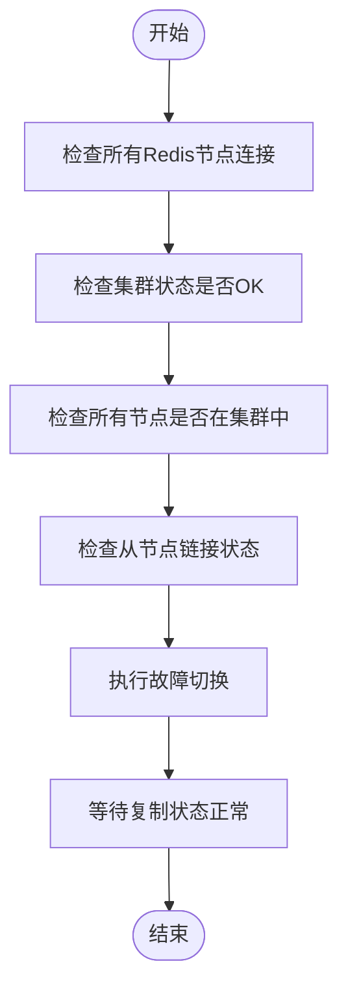
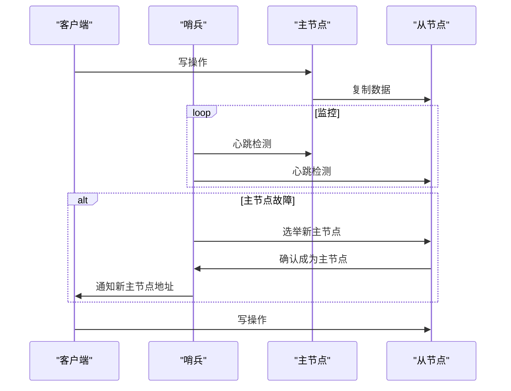
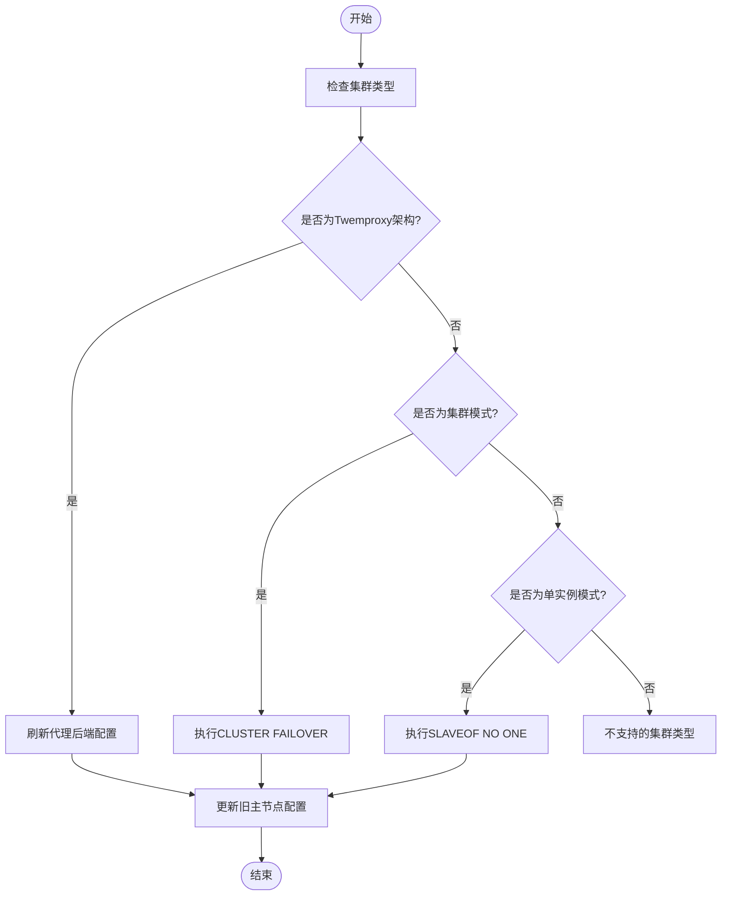
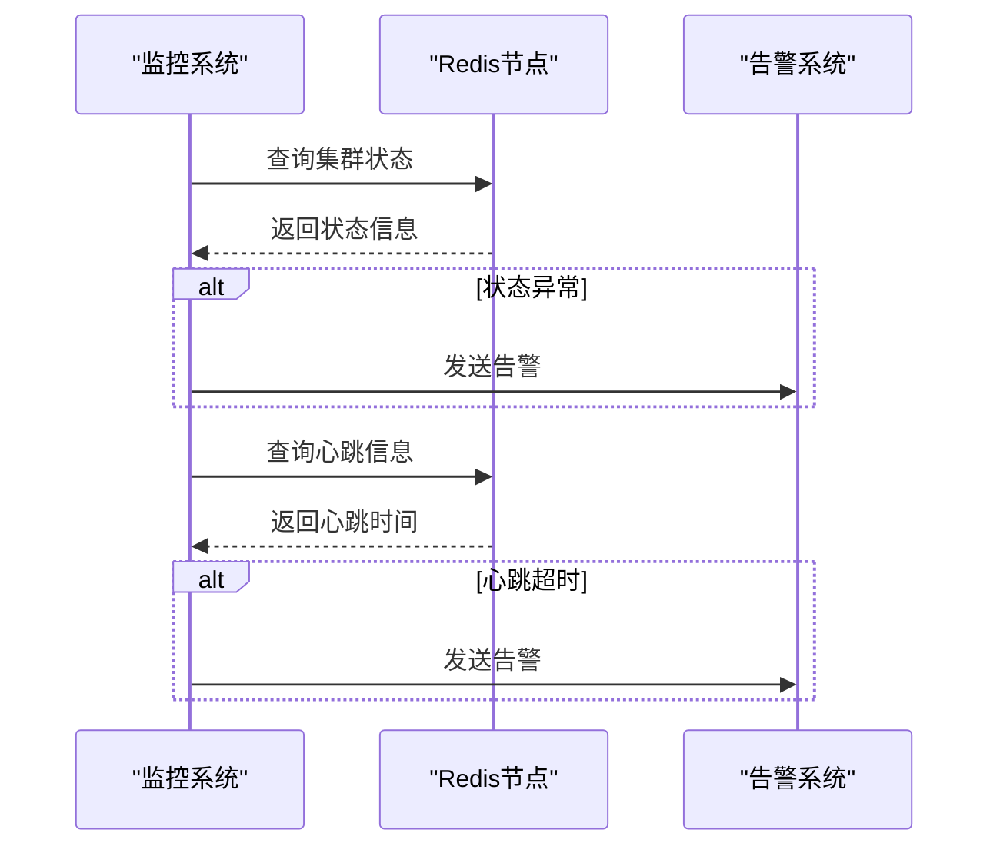

# 高可用保障

<cite>
**本文档引用的文件**   
- [redis_cluster_failover.go](file://dbm-services/redis/db-tools/dbactuator/pkg/atomjobs/atomredis/redis_cluster_failover.go)
- [redis_switch.go](file://dbm-services/redis/db-tools/dbactuator/pkg/atomjobs/atomredis/redis_switch.go)
- [redis_task.go](file://dbm-services/redis/db-tools/dbmon/pkg/redismonitor/redis_task.go)
- [heartbeat_report.py](file://dbm-ui/backend/db_periodic_task/local_tasks/dbmon_heartbeat/heartbeat_report.py)
- [redis_cluster_nodes.py](file://dbm-ui/backend/flow/utils/redis/redis_cluster_nodes.py)
- [Redis dbha切换redis成功策略.json](file://dbm-ui/backend/db_monitor/tpls/alarm/redis/Redis dbha切换redis成功策略.json)
- [Redis dbha切换redis失败策略.json](file://dbm-ui/backend/db_monitor/tpls/alarm/redis/Redis dbha切换redis失败策略.json)
- [initial.json](file://dbm-ui/backend/iam_app/migration_json_files/initial.json)
</cite>

## 目录
1. [引言](#引言)
2. [高可用方案概述](#高可用方案概述)
3. [主从复制机制](#主从复制机制)
4. [哨兵模式与集群模式](#哨兵模式与集群模式)
5. [dbactuator中的高可用操作](#dbactuator中的高可用操作)
6. [故障切换与主从切换流程](#故障切换与主从切换流程)
7. [高可用事件监控与告警](#高可用事件监控与告警)
8. [不同高可用方案的优缺点及适用场景](#不同高可用方案的优缺点及适用场景)
9. [配置优化建议](#配置优化建议)
10. [结论](#结论)

## 引言
本文档深入探讨Redis服务的高可用保障机制，详细说明系统如何通过主从复制、哨兵模式或集群模式实现Redis实例的高可用。我们将分析`dbactuator`中与高可用相关的操作，如故障切换、主从切换、节点替换等，并结合`db_services/redis/high_availability`中的代码，描述高可用事件的监控、告警和自动处理流程。此外，我们还将讨论不同高可用方案的优缺点及适用场景，以及如何通过配置优化提升Redis服务的稳定性。

## 高可用方案概述
Redis的高可用性是确保数据服务在面对硬件故障、网络中断或其他异常情况时仍能持续提供服务的关键。在当前系统中，主要通过主从复制、哨兵模式和集群模式来实现高可用。这些方案不仅能够保证数据的冗余备份，还能在主节点发生故障时自动进行故障转移，从而最小化服务中断时间。

**Section sources**
- [redis_cluster_failover.go](file://dbm-services/redis/db-tools/dbactuator/pkg/atomjobs/atomredis/redis_cluster_failover.go#L382-L430)
- [redis_switch.go](file://dbm-services/redis/db-tools/dbactuator/pkg/atomjobs/atomredis/redis_switch.go#L383-L408)

## 主从复制机制
主从复制是Redis实现高可用的基础。在这种模式下，一个Redis实例作为主节点（Master），负责处理写操作，而一个或多个从节点（Slave）则复制主节点的数据。从节点可以处理读请求，从而分担主节点的负载。当主节点出现故障时，可以通过手动或自动的方式将一个从节点提升为新的主节点，继续提供服务。

在`dbactuator`中，主从复制的管理通过`RedisClusterFailover`结构体实现。该结构体定义了主从切换的参数和方法，包括检查所有Redis节点是否连接、验证集群状态是否正常、确认所有节点都在集群中等。通过这些检查，确保了在执行故障切换前，整个集群处于健康状态。

**Diagram sources **
- [redis_cluster_failover.go](file://dbm-services/redis/db-tools/dbactuator/pkg/atomjobs/atomredis/redis_cluster_failover.go#L132-L313)

## 哨兵模式与集群模式
哨兵模式和集群模式是Redis提供的两种高级高可用解决方案。哨兵模式通过一组哨兵进程监控主从节点的状态，在主节点故障时自动选举新的主节点并通知客户端。集群模式则将数据分布在多个节点上，每个节点负责一部分数据，同时每个分片都有一个或多个从节点用于数据冗余。

在`dbactuator`中，`RedisSwitch`结构体实现了集群模式下的主从切换逻辑。该结构体支持多种集群类型，包括Twemproxy + Tendis架构和Predixy + RedisCluster架构。通过`doTendisStorageSwitch4Cluster`方法，可以在集群模式下执行人工故障切换，确保新主节点成为集群的领导者，并更新旧主节点的配置以指向新的主节点。

**Diagram sources **
- [redis_switch.go](file://dbm-services/redis/db-tools/dbactuator/pkg/atomjobs/atomredis/redis_switch.go#L373-L440)

## dbactuator中的高可用操作
`dbactuator`是实现Redis高可用的核心组件之一，它提供了丰富的API和工具来管理和维护Redis集群。其中，`RedisClusterFailover`和`RedisSwitch`是两个关键的结构体，分别用于处理故障切换和主从切换。

`RedisClusterFailover`结构体通过`Run()`方法执行故障切换流程。该方法首先进行一系列预检查，包括检查所有Redis节点的连接状态、集群状态、节点是否在集群中以及从节点的链接状态。只有当所有检查都通过后，才会执行实际的故障切换操作。故障切换完成后，还会等待一段时间以确保新的主从关系稳定。

`RedisSwitch`结构体则通过`Run()`方法执行主从切换。该方法支持多种集群类型，并根据不同的架构选择相应的切换策略。例如，在Twemproxy架构下，需要刷新代理的后端配置；而在集群模式下，则需要执行`CLUSTER FAILOVER`命令来触发故障切换。

**Section sources**
- [redis_cluster_failover.go](file://dbm-services/redis/db-tools/dbactuator/pkg/atomjobs/atomredis/redis_cluster_failover.go#L89-L129)
- [redis_switch.go](file://dbm-services/redis/db-tools/dbactuator/pkg/atomjobs/atomredis/redis_switch.go#L214-L307)

## 故障切换与主从切换流程
故障切换和主从切换是Redis高可用的核心操作。在`dbactuator`中，这两个操作通过`RedisClusterFailover`和`RedisSwitch`结构体实现。

故障切换流程如下：
1. 检查所有Redis节点的连接状态。
2. 验证集群状态是否正常。
3. 确认所有节点都在集群中。
4. 检查从节点的链接状态。
5. 执行故障切换操作。
6. 等待新的主从关系稳定。

主从切换流程如下：
1. 检查集群类型是否支持。
2. 根据不同的架构选择相应的切换策略。
3. 在Twemproxy架构下，刷新代理的后端配置。
4. 在集群模式下，执行`CLUSTER FAILOVER`命令。
5. 更新旧主节点的配置以指向新的主节点。

**Diagram sources **
- [redis_switch.go](file://dbm-services/redis/db-tools/dbactuator/pkg/atomjobs/atomredis/redis_switch.go#L267-L300)

## 高可用事件监控与告警
高可用事件的监控和告警是确保系统稳定运行的重要环节。在`dbm-ui`中，通过`db_monitor`模块实现了对Redis集群的实时监控。该模块定期检查集群状态、节点健康状况和数据同步情况，并在发现问题时触发告警。

具体来说，`redis_task.go`文件中的`CheckClusterState`方法负责检查集群状态。该方法会遍历所有Redis节点，检查其是否为集群模式，并验证集群状态是否为`OK`。如果发现集群状态异常，会立即发送告警信息。

此外，`heartbeat_report.py`文件中的`check_dbmon_heartbeat`函数负责检查`dbmon`的心跳。该函数会定期查询集群中所有节点的心跳信息，并在心跳超时时触发告警。通过这种方式，可以及时发现并处理潜在的问题。

**Diagram sources **
- [redis_task.go](file://dbm-services/redis/db-tools/dbmon/pkg/redismonitor/redis_task.go#L502-L539)
- [heartbeat_report.py](file://dbm-ui/backend/db_periodic_task/local_tasks/dbmon_heartbeat/heartbeat_report.py#L108-L130)

## 不同高可用方案的优缺点及适用场景
不同的高可用方案各有优缺点，适用于不同的应用场景。

**主从复制**：
- **优点**：简单易用，成本低，适合小规模部署。
- **缺点**：故障切换需要手动干预，无法实现自动故障转移。
- **适用场景**：小型应用、测试环境。

**哨兵模式**：
- **优点**：支持自动故障转移，提高了系统的可用性。
- **缺点**：配置复杂，哨兵节点本身也需要高可用。
- **适用场景**：中等规模的应用，对可用性要求较高的场景。

**集群模式**：
- **优点**：支持数据分片，提高了系统的扩展性和性能。
- **缺点**：配置和管理复杂，对网络要求高。
- **适用场景**：大规模应用，对性能和可用性要求极高的场景。

## 配置优化建议
为了进一步提升Redis服务的稳定性，建议采取以下配置优化措施：
1. **合理设置超时时间**：根据网络延迟和业务需求，合理设置连接超时、读写超时等参数。
2. **启用持久化**：根据数据重要性选择合适的持久化方式（RDB或AOF），并定期备份数据。
3. **优化内存使用**：合理设置最大内存限制，避免因内存不足导致服务中断。
4. **监控和告警**：建立完善的监控体系，及时发现并处理潜在问题。
5. **定期维护**：定期检查集群状态，清理过期数据，优化索引等。

## 结论
通过主从复制、哨兵模式和集群模式，Redis能够实现高可用性，确保在面对各种故障时仍能持续提供服务。`dbactuator`作为核心组件，提供了丰富的工具和API来管理和维护Redis集群。通过合理的配置优化和监控告警，可以进一步提升Redis服务的稳定性和可靠性。