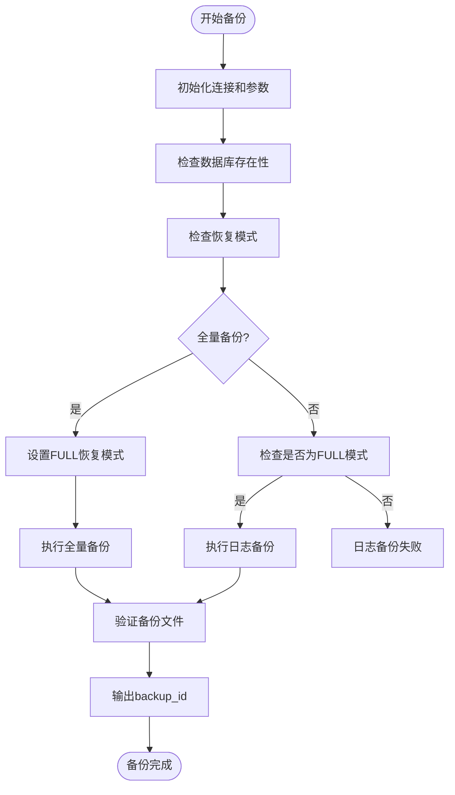
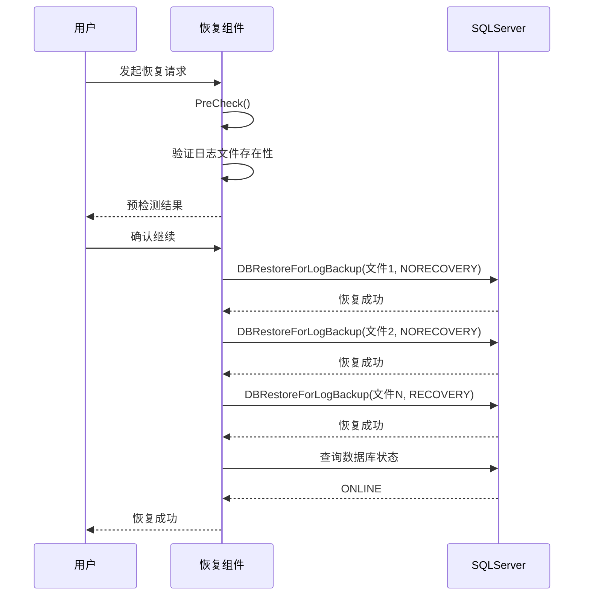
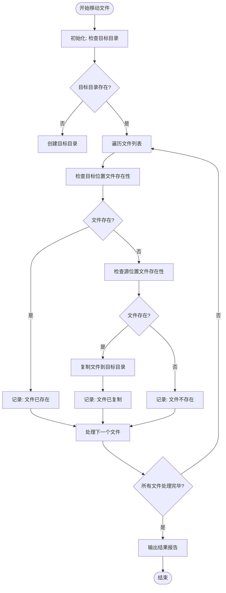
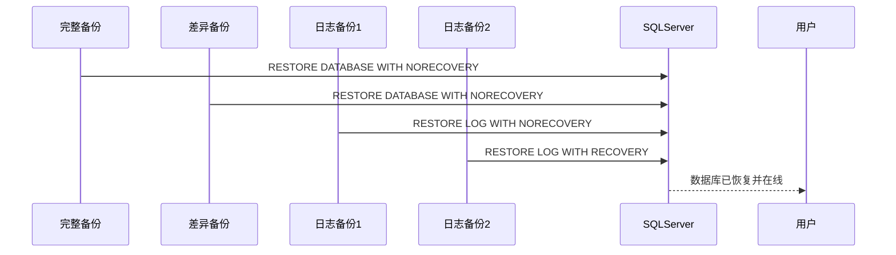

# SQL Server备份恢复模块

<cite>
**本文档引用的文件**   
- [backup_dbs.go](file://dbm-services/sqlserver/db-tools/dbactuator/pkg/components/sqlserver/backup_dbs.go)
- [restore_dbs_log_backup.go](file://dbm-services/sqlserver/db-tools/dbactuator/pkg/components/sqlserver/restore_dbs_log_backup.go)
- [move_backup_file.go](file://dbm-services/sqlserver/db-tools/dbactuator/pkg/components/sqlserver/move_backup_file.go)
- [sqlserver.go](file://dbm-services/sqlserver/db-tools/dbactuator/pkg/util/sqlserver/sqlserver.go)
- [monitor_dbm.sql](file://dbm-services/sqlserver/db-tools/dbactuator/pkg/core/staticembed/monitor_dbm.sql)
</cite>

## 目录
1. [引言](#引言)
2. [备份策略配置与执行逻辑](#备份策略配置与执行逻辑)
3. [事务日志备份恢复流程](#事务日志备份恢复流程)
4. [备份文件传输与管理机制](#备份文件传输与管理机制)
5. [完整备份、差异备份和日志备份的组合恢复过程](#完整备份差异备份和日志备份的组合恢复过程)
6. [备份策略优化建议与恢复点目标(RPO)实现](#备份策略优化建议与恢复点目标rpo实现)
7. [结论](#结论)

## 引言

SQL Server备份恢复功能是数据库管理系统中的关键组成部分，确保了数据的安全性和业务的连续性。本系统通过`backup_dbs.go`、`restore_dbs_log_backup.go`和`move_backup_file.go`三个核心文件实现了完整的备份与恢复机制。这些模块协同工作，提供了从备份策略配置、执行到恢复的全流程支持。

**本文档引用的文件**   
- [backup_dbs.go](file://dbm-services/sqlserver/db-tools/dbactuator/pkg/components/sqlserver/backup_dbs.go)
- [restore_dbs_log_backup.go](file://dbm-services/sqlserver/db-tools/dbactuator/pkg/components/sqlserver/restore_dbs_log_backup.go)
- [move_backup_file.go](file://dbm-services/sqlserver/db-tools/dbactuator/pkg/components/sqlserver/move_backup_file.go)

## 备份策略配置与执行逻辑

`backup_dbs.go`文件实现了SQL Server数据库的备份功能，支持全量备份和日志备份两种模式。该模块通过`BackupDBSComp`结构体封装了备份操作的核心逻辑。

备份参数通过`BackupDBSParam`结构体定义，包含主机IP、端口、备份数据库列表、备份类型、文件标签等关键信息。系统支持两种备份类型：`full_backup`（全量备份）和`log_backup`（日志备份）。在初始化阶段，系统会建立到SQL Server实例的连接，并验证目标数据库的存在性。

全量备份执行时，系统会检查数据库的恢复模式。如果数据库当前不是FULL模式且配置了强制设置，则会先将数据库模式更改为FULL模式。然后调用存储过程`MONITOR.DBO.TOOL_BACKUP_DATABASE`执行实际的备份操作。日志备份则要求数据库必须处于FULL或BULK_LOGGED恢复模式，否则备份将失败。

备份完成后，系统会通过查询`BACKUP_TRACE`表来验证备份文件是否成功生成，并检查文件在文件系统中的存在性，确保备份的完整性。

**图表来源**  
- [backup_dbs.go](file://dbm-services/sqlserver/db-tools/dbactuator/pkg/components/sqlserver/backup_dbs.go#L148-L251)

**本节来源**  
- [backup_dbs.go](file://dbm-services/sqlserver/db-tools/dbactuator/pkg/components/sqlserver/backup_dbs.go#L26-L302)

## 事务日志备份恢复流程

`restore_dbs_log_backup.go`文件实现了事务日志备份的恢复流程。该模块通过`RestoreDBSForLogComp`结构体管理恢复操作，支持从一个或多个日志备份文件进行恢复。

恢复参数通过`RestoreDBSForLogParam`结构体定义，包含主机信息、端口以及`LogRestoreInfo`数组，每个`LogRestoreInfo`包含数据库名称、目标数据库名称和日志备份文件列表。系统支持两种恢复模式：`RECOVERY`（恢复并使数据库在线）和`NORECOVERY`（恢复但保持数据库非在线状态，用于后续继续恢复）。

恢复流程首先进行预检测，验证所有指定的日志备份文件在本地文件系统中是否存在。然后按顺序执行日志恢复操作：对于非最后一个日志文件，使用`NORECOVERY`模式；对于最后一个日志文件，使用配置的恢复模式（`RECOVERY`或`NORECOVERY`）。如果指定了恢复时间点，系统会在最后一个日志恢复时使用`STOPAT`选项。

恢复完成后，系统会检查数据库的状态，确保在`RECOVERY`模式下数据库处于`ONLINE`状态。整个恢复过程采用事务性设计，任何一步失败都会导致整个恢复操作失败，确保数据一致性。

**图表来源**  
- [restore_dbs_log_backup.go](file://dbm-services/sqlserver/db-tools/dbactuator/pkg/components/sqlserver/restore_dbs_log_backup.go#L112-L169)
- [sqlserver.go](file://dbm-services/sqlserver/db-tools/dbactuator/pkg/util/sqlserver/sqlserver.go#L413-L433)

**本节来源**  
- [restore_dbs_log_backup.go](file://dbm-services/sqlserver/db-tools/dbactuator/pkg/components/sqlserver/restore_dbs_log_backup.go#L23-L170)

## 备份文件传输与管理机制

`move_backup_file.go`文件实现了备份文件的传输和管理功能。该模块通过`MoveBackupFileComp`结构体管理文件移动操作，确保备份文件在不同存储位置之间的可靠传输。

文件移动参数通过`MoveBackupFileParam`结构体定义，包含文件列表和目标路径。每个文件条目包含源文件路径、文件名和任务ID。系统首先检查目标目录是否存在，如果不存在则创建该目录。

文件移动逻辑采用智能判断机制：首先检查目标目录中是否已存在同名文件，如果存在则直接记录结果；如果不存在，则检查源位置的文件是否存在，如果存在则将其复制到目标目录。这种设计避免了不必要的文件传输，提高了效率。

系统为每个处理的文件生成`checkResult`记录，包含文件名、任务ID和是否在本地存在的标志。所有结果最终被汇总并输出，供上层系统进行状态跟踪和审计。整个过程具有错误处理机制，任何文件操作失败都会被记录并可能导致整个操作失败。

**图表来源**  
- [move_backup_file.go](file://dbm-services/sqlserver/db-tools/dbactuator/pkg/components/sqlserver/move_backup_file.go#L65-L114)

**本节来源**  
- [move_backup_file.go](file://dbm-services/sqlserver/db-tools/dbactuator/pkg/components/sqlserver/move_backup_file.go#L22-L126)

## 完整备份、差异备份和日志备份的组合恢复过程

虽然当前代码主要实现了全量备份和日志备份，但通过组合这些功能可以实现完整的恢复策略。典型的恢复流程遵循"完整备份 -> 差异备份 -> 日志备份"的顺序，以实现最小的数据丢失。

在实际操作中，系统首先恢复最近的完整备份，使用`NORECOVERY`模式以保持数据库非在线状态。然后恢复最新的差异备份（如果有），同样使用`NORECOVERY`模式。最后，按时间顺序恢复所有相关的日志备份，直到目标恢复点。最后一个日志备份使用`RECOVERY`模式，使数据库进入在线状态。

这种分层恢复策略允许系统实现精确的恢复点目标(RPO)。通过分析日志备份链中的LSN（日志序列号），系统可以确定从完整备份到任意时间点的连续性，确保恢复过程的可靠性。`RESTORE HEADERONLY`命令用于读取备份文件的元数据，验证备份链的完整性。

**图表来源**  
- [backup_dbs.go](file://dbm-services/sqlserver/db-tools/dbactuator/pkg/components/sqlserver/backup_dbs.go#L160-L251)
- [restore_dbs_log_backup.go](file://dbm-services/sqlserver/db-tools/dbactuator/pkg/components/sqlserver/restore_dbs_log_backup.go#L112-L169)
- [monitor_dbm.sql](file://dbm-services/sqlserver/db-tools/dbactuator/pkg/core/staticembed/monitor_dbm.sql#L2991-L3114)

**本节来源**  
- [backup_dbs.go](file://dbm-services/sqlserver/db-tools/dbactuator/pkg/components/sqlserver/backup_dbs.go)
- [restore_dbs_log_backup.go](file://dbm-services/sqlserver/db-tools/dbactuator/pkg/components/sqlserver/restore_dbs_log_backup.go)

## 备份策略优化建议与恢复点目标RPO实现

基于对现有代码的分析，提出以下备份策略优化建议：

1. **分层备份策略**：实施完整备份、差异备份和日志备份的组合策略。完整备份每周执行一次，差异备份每天执行，日志备份每15分钟执行一次。这种策略在恢复时间和存储成本之间取得平衡。

2. **备份链管理**：通过`BACKUP_ID`和LSN链严格管理备份依赖关系。每个备份操作都应记录其基础备份的LSN，确保恢复时能够验证备份链的连续性。

3. **自动化验证**：在备份完成后自动执行恢复测试，验证备份文件的可恢复性。这可以通过在隔离环境中恢复备份并执行一致性检查来实现。

4. **多副本存储**：将备份文件复制到多个地理位置不同的存储位置，防止单点故障导致的数据丢失。

恢复点目标(RPO)的实现依赖于日志备份的频率。系统通过`RestoreDBSForLogComp`组件支持时间点恢复(PITR)，允许将数据库恢复到任意指定时间点。RPO的理论最小值等于日志备份的间隔时间。例如，每15分钟执行一次日志备份，则最大数据丢失为15分钟。

为了进一步降低RPO，可以考虑实现以下改进：
- 增加日志备份频率至5分钟或更短
- 实现日志流实时传输，接近实时恢复
- 使用Always On可用性组提供高可用性，将RPO降至秒级

**本节来源**  
- [backup_dbs.go](file://dbm-services/sqlserver/db-tools/dbactuator/pkg/components/sqlserver/backup_dbs.go)
- [restore_dbs_log_backup.go](file://dbm-services/sqlserver/db-tools/dbactuator/pkg/components/sqlserver/restore_dbs_log_backup.go)
- [move_backup_file.go](file://dbm-services/sqlserver/db-tools/dbactuator/pkg/components/sqlserver/move_backup_file.go)

## 结论

SQL Server备份恢复模块通过`backup_dbs.go`、`restore_dbs_log_backup.go`和`move_backup_file.go`三个核心组件实现了完整的数据保护解决方案。系统支持灵活的备份策略配置，可靠的恢复流程，以及高效的备份文件管理。

通过分析代码实现，可以看出该系统设计合理，具有良好的错误处理和验证机制。未来可以通过实施分层备份策略、增强自动化验证和优化日志备份频率来进一步提高数据保护水平，实现更严格的恢复点目标(RPO)。