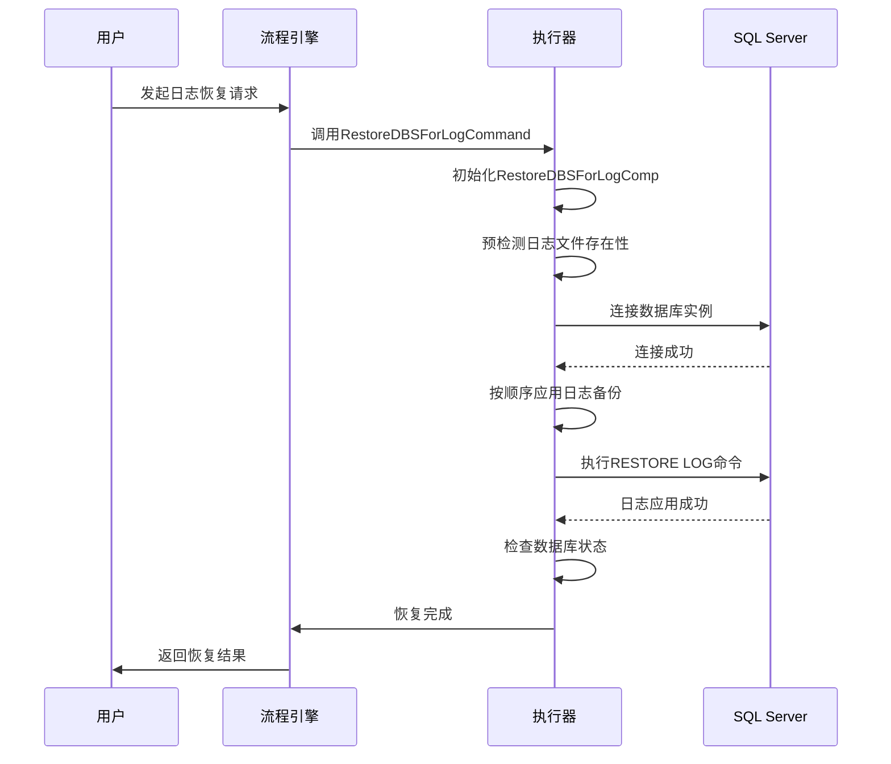
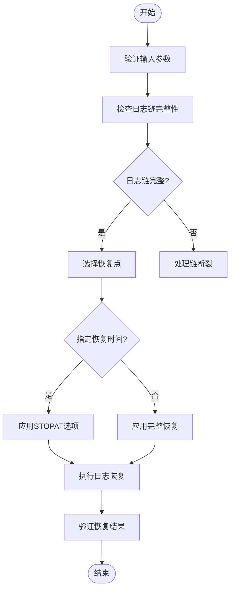
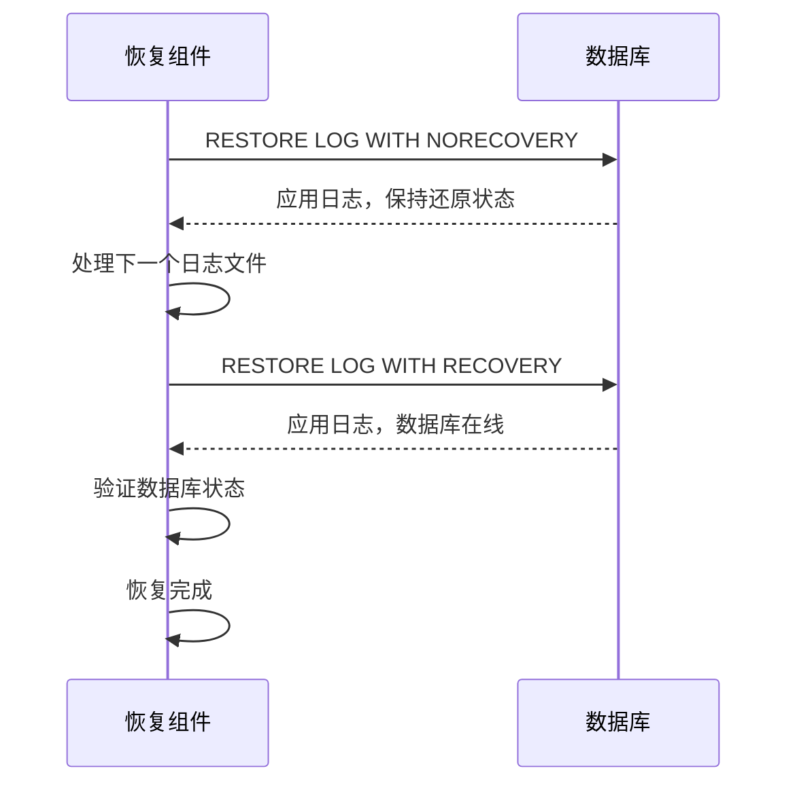
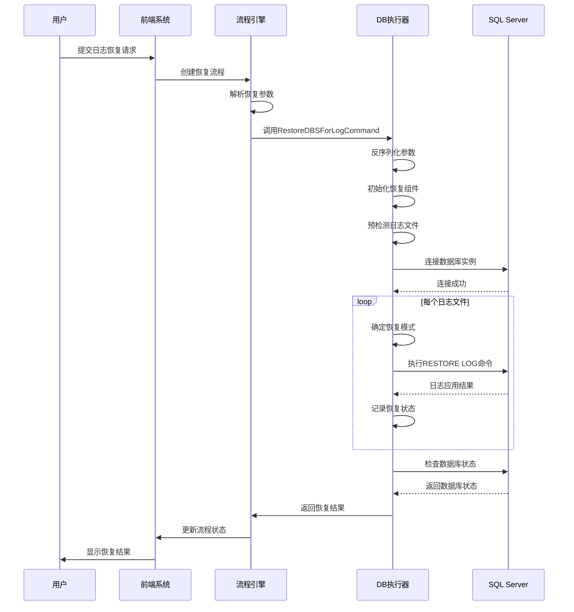
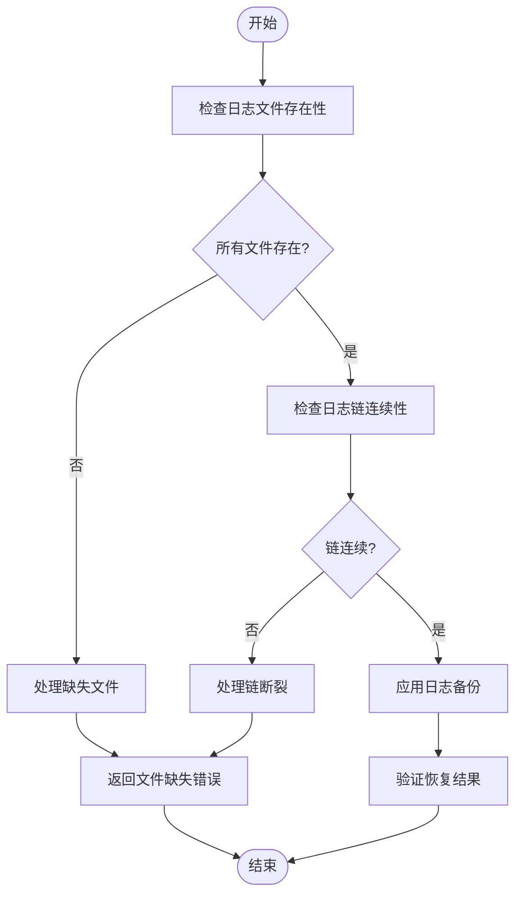

# 事务日志备份与恢复

<cite>
**本文档引用的文件**
- [restore_dbs_log_backup.go](file://dbm-services/sqlserver/db-tools/dbactuator/internal/subcmd/sqlservercmd/restore_dbs_log_backup.go)
- [restore_dbs_log_backup.go](file://dbm-services/sqlserver/db-tools/dbactuator/pkg/components/sqlserver/restore_dbs_log_backup.go)
- [sqlserver.go](file://dbm-services/sqlserver/db-tools/dbactuator/pkg/util/sqlserver/sqlserver.go)
- [sqlserver_db_construct.py](file://dbm-ui/backend/flow/engine/bamboo/scene/sqlserver/sqlserver_db_construct.py)
</cite>

## 目录
1. [引言](#引言)
2. [日志备份恢复流程分析](#日志备份恢复流程分析)
3. [日志链维护与恢复点选择](#日志链维护与恢复点选择)
4. [事务一致性保证机制](#事务一致性保证机制)
5. [日志备份恢复时序图](#日志备份恢复时序图)
6. [低恢复点目标(RPO)实现](#低恢复点目标rpo实现)
7. [日志截断与备份链断裂处理](#日志截断与备份链断裂处理)
8. [结论](#结论)

## 引言
本文档深入分析SQL Server事务日志备份恢复的实现机制。重点解析`restore_dbs_log_backup.go`中的日志备份恢复流程，包括日志链的维护、恢复点的选择和事务一致性保证。通过时序图展示从日志备份到恢复的完整过程。讨论日志备份在实现低恢复点目标(RPO)中的关键作用，以及如何处理日志截断和备份链断裂等常见问题。

## 日志备份恢复流程分析

SQL Server事务日志备份恢复流程主要由`restore_dbs_log_backup.go`文件中的`RestoreDBSForLogComp`组件实现。该流程分为三个主要阶段：初始化、预检测和执行恢复。

在初始化阶段，系统首先建立与目标SQL Server实例的连接，获取数据库版本信息，并设置恢复模式。预检测阶段验证所有待恢复的日志备份文件是否存在。执行恢复阶段则按顺序应用日志备份，确保事务的完整性和一致性。

**Diagram sources**
- [restore_dbs_log_backup.go](file://dbm-services/sqlserver/db-tools/dbactuator/internal/subcmd/sqlservercmd/restore_dbs_log_backup.go#L37-L87)
- [restore_dbs_log_backup.go](file://dbm-services/sqlserver/db-tools/dbactuator/pkg/components/sqlserver/restore_dbs_log_backup.go#L54-L169)

**Section sources**
- [restore_dbs_log_backup.go](file://dbm-services/sqlserver/db-tools/dbactuator/internal/subcmd/sqlservercmd/restore_dbs_log_backup.go#L24-L87)
- [restore_dbs_log_backup.go](file://dbm-services/sqlserver/db-tools/dbactuator/pkg/components/sqlserver/restore_dbs_log_backup.go#L23-L169)

## 日志链维护与恢复点选择

日志链的维护是确保数据库可恢复性的关键。系统通过`RestoreDBSForLogParam`结构体管理日志备份文件组，其中`LogBakFiles`字段存储了按时间顺序排列的日志备份文件列表。

恢复点的选择通过`RestoreTime`参数实现，允许用户指定精确的恢复时间点。当`RestoreTime`参数被设置时，系统会在最后一个日志备份文件上应用`STOPAT`选项，实现时间点恢复(PITR)。

**Diagram sources**
- [restore_dbs_log_backup.go](file://dbm-services/sqlserver/db-tools/dbactuator/pkg/components/sqlserver/restore_dbs_log_backup.go#L31-L37)
- [sqlserver.go](file://dbm-services/sqlserver/db-tools/dbactuator/pkg/util/sqlserver/sqlserver.go#L412-L431)

**Section sources**
- [restore_dbs_log_backup.go](file://dbm-services/sqlserver/db-tools/dbactuator/pkg/components/sqlserver/restore_dbs_log_backup.go#L30-L37)
- [sqlserver.go](file://dbm-services/sqlserver/db-tools/dbactuator/pkg/util/sqlserver/sqlserver.go#L412-L431)

## 事务一致性保证机制

事务一致性保证是日志备份恢复的核心。系统通过`NORECOVERY`和`RECOVERY`两种恢复模式的组合使用来确保事务的一致性。

在应用中间日志备份时，系统使用`NORECOVERY`模式，使数据库保持在"正在还原"状态，允许继续应用后续日志。只有在应用最后一个日志备份时，才根据`RestoreMode`参数决定是否使用`RECOVERY`模式使数据库在线。

**Diagram sources**
- [restore_dbs_log_backup.go](file://dbm-services/sqlserver/db-tools/dbactuator/pkg/components/sqlserver/restore_dbs_log_backup.go#L120-L129)
- [sqlserver.go](file://dbm-services/sqlserver/db-tools/dbactuator/pkg/util/sqlserver/sqlserver.go#L412-L431)

**Section sources**
- [restore_dbs_log_backup.go](file://dbm-services/sqlserver/db-tools/dbactuator/pkg/components/sqlserver/restore_dbs_log_backup.go#L112-L169)

## 日志备份恢复时序图

以下时序图展示了从日志备份到恢复的完整过程，包括用户请求、流程引擎调度、执行器执行和数据库响应等环节。

**Diagram sources**
- [sqlserver_db_construct.py](file://dbm-ui/backend/flow/engine/bamboo/scene/sqlserver/sqlserver_db_construct.py#L274-L297)
- [restore_dbs_log_backup.go](file://dbm-services/sqlserver/db-tools/dbactuator/internal/subcmd/sqlservercmd/restore_dbs_log_backup.go#L37-L87)

## 低恢复点目标RPO实现

日志备份在实现低恢复点目标(RPO)中起着关键作用。通过频繁的日志备份，系统可以将数据丢失窗口缩小到几分钟甚至几秒钟。

系统通过以下机制实现低RPO：
1. **高频日志备份**：支持按分钟级别进行日志备份
2. **增量备份链**：每个日志备份只包含自上次备份以来的事务日志
3. **快速恢复**：优化的恢复算法确保快速应用日志备份
4. **并行处理**：支持多个数据库的并行恢复

**Diagram sources**
- [restore_dbs_log_backup.go](file://dbm-services/sqlserver/db-tools/dbactuator/pkg/components/sqlserver/restore_dbs_log_backup.go#L34-L36)
- [sqlserver_db_construct.py](file://dbm-ui/backend/flow/engine/bamboo/scene/sqlserver/sqlserver_db_construct.py#L274-L297)

## 日志截断与备份链断裂处理

日志截断和备份链断裂是日志备份恢复中的常见问题。系统通过多种机制来处理这些问题：

1. **日志截断处理**：在完整恢复后，系统会自动截断已备份的日志，释放存储空间
2. **备份链断裂检测**：预检测阶段会验证日志链的连续性
3. **异常处理**：当检测到链断裂时，系统会返回明确的错误信息
4. **恢复策略**：提供多种恢复策略应对不同的断裂情况

**Diagram sources**
- [restore_dbs_log_backup.go](file://dbm-services/sqlserver/db-tools/dbactuator/pkg/components/sqlserver/restore_dbs_log_backup.go#L85-L108)
- [restore_dbs_log_backup.go](file://dbm-services/sqlserver/db-tools/dbactuator/pkg/components/sqlserver/restore_dbs_log_backup.go#L112-L169)

**Section sources**
- [restore_dbs_log_backup.go](file://dbm-services/sqlserver/db-tools/dbactuator/pkg/components/sqlserver/restore_dbs_log_backup.go#L85-L108)

## 结论
SQL Server事务日志备份恢复机制通过精心设计的流程和严格的事务一致性保证，实现了高效可靠的数据保护。系统通过日志链的维护、精确的恢复点选择和完善的异常处理机制，确保了在各种情况下都能成功恢复数据。高频的日志备份策略和优化的恢复算法共同作用，实现了极低的恢复点目标(RPO)，为业务连续性提供了有力保障。