# 备份文件管理

<cite>
**本文档引用的文件**   
- [move_backup_file.go](file://dbm-services/sqlserver/db-tools/dbactuator/internal/subcmd/sqlservercmd/move_backup_file.go)
- [move_backup_file.go](file://dbm-services/sqlserver/db-tools/dbactuator/pkg/components/sqlserver/move_backup_file.go)
- [monitor_dbm.sql](file://dbm-services/sqlserver/db-tools/dbactuator/pkg/core/staticembed/monitor_dbm.sql)
- [monitor_dbm_v2.sql](file://dbm-services/sqlserver/db-tools/dbactuator/pkg/core/staticembed/monitor_dbm_v2.sql)
- [backup_path_file_trans.py](file://dbm-ui/backend/flow/plugins/components/collections/sqlserver/backup_path_file_trans.py)
</cite>

## 目录
1. [引言](#引言)
2. [文件传输逻辑分析](#文件传输逻辑分析)
3. [备份文件命名规范与存储路径管理](#备份文件命名规范与存储路径管理)
4. [生命周期控制机制](#生命周期控制机制)
5. [安全性、完整性与可访问性保障](#安全性完整性与可访问性保障)
6. [存储与检索性能优化](#存储与检索性能优化)
7. [总结](#总结)

## 引言
本文档详细说明SQL Server备份文件的传输和管理机制，重点分析`move_backup_file.go`中的文件传输逻辑。内容涵盖本地存储、网络传输和远程存储的实现方式，解释备份文件的命名规范、存储路径管理和生命周期控制策略。同时讨论备份文件的安全性、完整性和可访问性保障措施，以及如何优化备份文件的存储和检索性能。

## 文件传输逻辑分析

SQL Server备份文件的传输逻辑主要通过`move_backup_file.go`文件中的`MoveBackupFileComp`组件实现。该组件负责判断备份文件是否存在，并根据情况执行移动操作。

### 本地存储实现
本地存储的实现通过`Init()`方法完成，该方法检查目标目录是否存在，如果不存在则创建。具体逻辑如下：
- 使用`osutil.WINSFile`工具检查目标路径是否存在
- 如果路径不存在，则调用`Create(0777)`方法创建目录
- 记录创建成功的日志信息

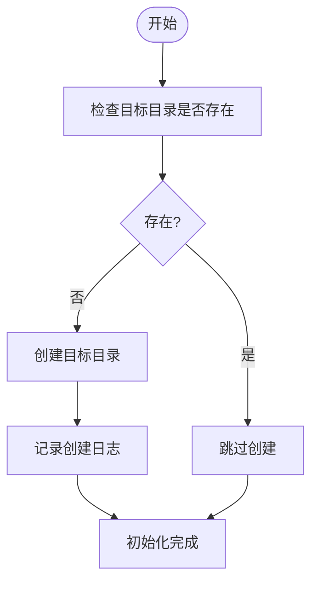

**图示来源**
- [move_backup_file.go](file://dbm-services/sqlserver/db-tools/dbactuator/pkg/components/sqlserver/move_backup_file.go#L47-L63)

### 网络传输与远程存储实现
网络传输和远程存储的实现通过SQL Server的存储过程`TOOL_BACKUP_DATABASE`完成。该过程使用`xp_cmdshell`执行备份客户端命令，将备份文件注册到指定的存储类型中。

关键实现细节包括：
- 构建命令行参数，包含备份文件路径、标签和存储类型
- 使用`xp_cmdshell`执行备份客户端注册命令
- 通过临时表`BACKUP_COMMON_TABLE`获取任务ID
- 支持全量备份和日志备份两种类型

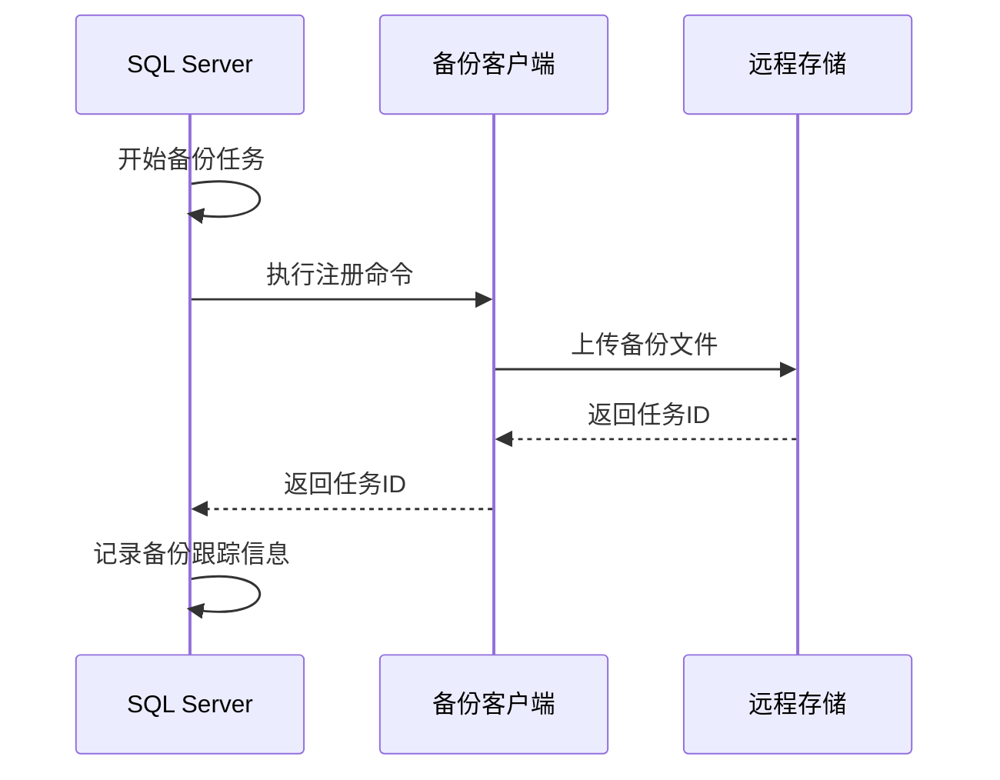

**图示来源**
- [monitor_dbm.sql](file://dbm-services/sqlserver/db-tools/dbactuator/pkg/core/staticembed/monitor_dbm.sql#L2991-L3420)
- [monitor_dbm_v2.sql](file://dbm-services/sqlserver/db-tools/dbactuator/pkg/core/staticembed/monitor_dbm_v2.sql#L2904-L3302)

### 文件移动核心逻辑
文件移动的核心逻辑在`MoveBackupFile()`方法中实现，其处理流程如下：
1. 遍历文件列表，检查目标目录是否已存在同名文件
2. 如果目标目录已存在文件，则标记为本地存在并跳过
3. 如果目标目录不存在文件，则检查源路径是否存在备份文件
4. 如果源路径存在文件，则执行复制操作到目标目录
5. 记录每个文件的处理结果

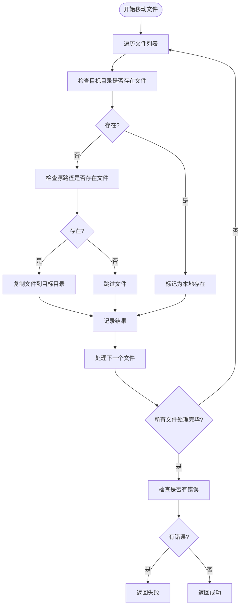

**图示来源**
- [move_backup_file.go](file://dbm-services/sqlserver/db-tools/dbactuator/pkg/components/sqlserver/move_backup_file.go#L65-L114)

**本节来源**
- [move_backup_file.go](file://dbm-services/sqlserver/db-tools/dbactuator/pkg/components/sqlserver/move_backup_file.go#L1-L126)
- [move_backup_file.go](file://dbm-services/sqlserver/db-tools/dbactuator/internal/subcmd/sqlservercmd/move_backup_file.go#L1-L88)

## 备份文件命名规范与存储路径管理

### 命名规范
SQL Server备份文件的命名遵循特定的规范，确保文件名具有唯一性和可识别性。命名格式如下：

```
{数据库名}__{应用标识}_{IP地址}_{端口号}_{时间戳}.bak
```

其中：
- `{数据库名}`：数据库的名称
- `{应用标识}`：应用的标识符
- `{IP地址}`：数据库服务器的IP地址
- `{端口号}`：数据库服务的端口号
- `{时间戳}`：备份开始时间的短格式（YYYYMMDDHHMMSS）
- `.bak`：文件扩展名

这种命名方式确保了在同一环境中不会出现文件名冲突，并且可以通过文件名快速识别备份的来源和时间。

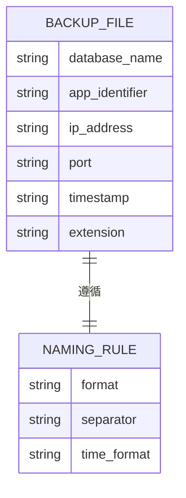

**图示来源**
- [monitor_dbm.sql](file://dbm-services/sqlserver/db-tools/dbactuator/pkg/core/staticembed/monitor_dbm.sql#L3215)
- [monitor_dbm_v2.sql](file://dbm-services/sqlserver/db-tools/dbactuator/pkg/core/staticembed/monitor_dbm_v2.sql#L3097)

### 存储路径管理
存储路径管理通过配置参数实现，主要包括：
- `BACKUP_PATH`：备份文件的存储路径
- `FULL_BACKUP_PATH`：全量备份文件的存储路径
- `LOG_BACKUP_PATH`：日志备份文件的存储路径

系统在执行备份时会根据备份类型选择相应的存储路径。同时，系统会检查磁盘剩余空间，确保有足够的空间存储备份文件。

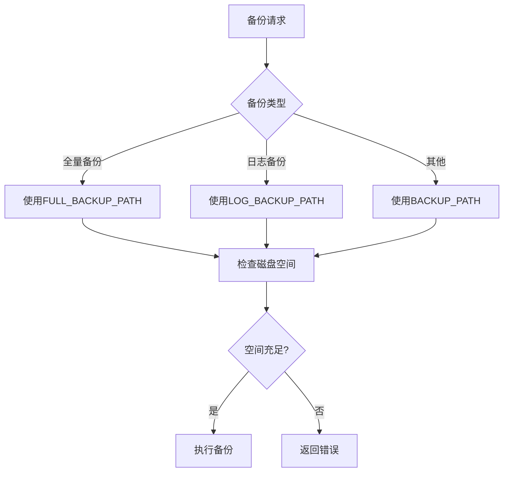

**图示来源**
- [monitor_dbm.sql](file://dbm-services/sqlserver/db-tools/dbactuator/pkg/core/staticembed/monitor_dbm.sql#L3010-L3012)
- [monitor_dbm_v2.sql](file://dbm-services/sqlserver/db-tools/dbactuator/pkg/core/staticembed/monitor_dbm_v2.sql#L2923-L2925)

**本节来源**
- [monitor_dbm.sql](file://dbm-services/sqlserver/db-tools/dbactuator/pkg/core/staticembed/monitor_dbm.sql#L2991-L3420)
- [monitor_dbm_v2.sql](file://dbm-services/sqlserver/db-tools/dbactuator/pkg/core/staticembed/monitor_dbm_v2.sql#L2904-L3302)

## 生命周期控制机制

### 过期策略
备份文件的生命周期控制通过过期策略实现。系统根据配置的保留天数自动清理过期的备份文件。不同类型的备份文件有不同的保留策略：

| 备份类型 | 保留天数 | 标签 |
|---------|---------|------|
| 全量备份 | 7天 | MYSQL_FULL_BACKUP |
| 1个月备份 | 30天 | DBFILE1M |
| 3个月备份 | 90天 | DBFILE3M |
| 6个月备份 | 180天 | DBFILE6M |
| 1年备份 | 365天 | DBFILE1Y |


**图示来源**
- [mysql_backup_result.py](file://dbm-ui/backend/db_periodic_task/local_tasks/backup_files_expire/mysql_backup_result.py#L36-L46)

### 磁盘空间管理
系统实现了智能的磁盘空间管理机制，根据磁盘使用率采取不同的策略：

- **正常状态**（磁盘使用率 < 25%）：只清理超过2天且已同步完成的文件
- **紧急状态**（磁盘使用率 > 50%）：备份完成后立即删除本地文件

这种分级管理策略确保了在磁盘空间紧张时能够及时释放空间，同时在正常情况下保留足够的本地备份以提高恢复效率。

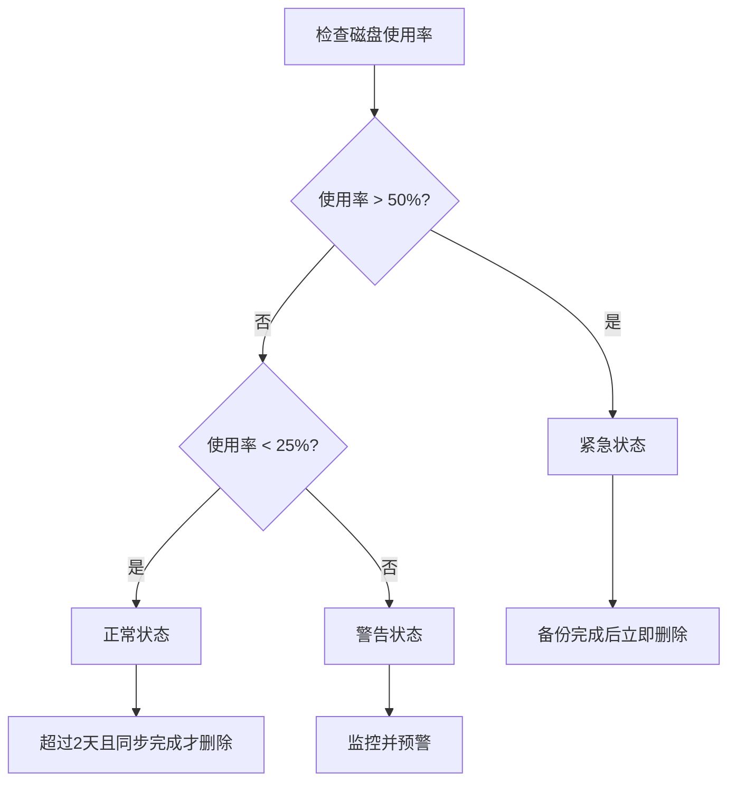

**图示来源**
- [metav2.go](file://dbm-services/mongodb/db-tools/mongo-toolkit-go/toolkit/pitr/metav2.go#L80-L83)

**本节来源**
- [mysql_backup_result.py](file://dbm-ui/backend/db_periodic_task/local_tasks/backup_files_expire/mysql_backup_result.py#L32-L63)
- [metav2.go](file://dbm-services/mongodb/db-tools/mongo-toolkit-go/toolkit/pitr/metav2.go#L80-L126)

## 安全性、完整性与可访问性保障

### 安全性保障
备份文件的安全性通过以下机制保障：
- **传输安全**：使用安全的传输协议进行文件传输
- **存储安全**：支持多种存储类型，包括蓝鲸制品库等安全存储
- **访问控制**：通过权限系统控制对备份文件的访问

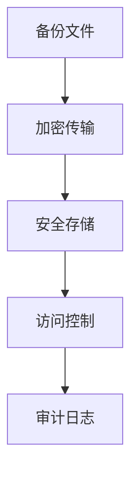

**图示来源**
- [backupclient.go](file://dbm-services/common/go-pubpkg/backupclient/backupclient.go#L78)
- [bkrepo.py](file://dbm-ui/backend/env/bkrepo.py#L14)

### 完整性验证
系统通过多种方式确保备份文件的完整性：
- **校验和验证**：计算并验证文件的MD5校验和
- **元数据验证**：检查备份文件的元数据信息
- **结构验证**：验证备份文件的内部结构是否完整

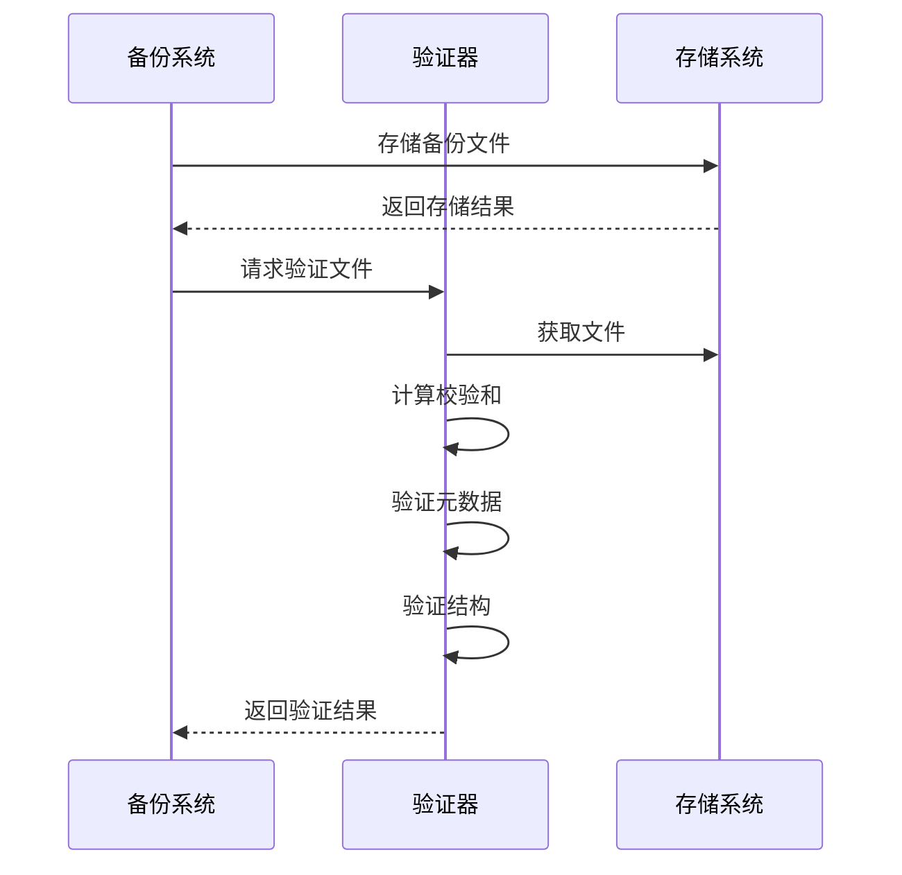

**图示来源**
- [misc.go](file://dbm-services/mysql/db-tools/mysql-dbbackup/pkg/util/misc.go#L88-L106)
- [backup.go](file://dbm-services/mysql/db-tools/dbactuator/pkg/components/mysql/restore/backup.go#L50-L83)

### 可访问性保障
为确保备份文件的可访问性，系统实现了：
- **多副本存储**：在不同位置存储多个副本
- **快速检索**：建立索引以快速定位备份文件
- **状态监控**：实时监控备份文件的状态

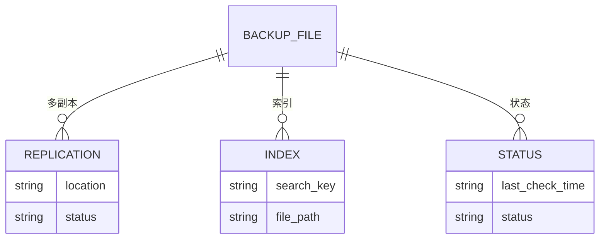

**本节来源**
- [misc.go](file://dbm-services/mysql/db-tools/mysql-dbbackup/pkg/util/misc.go#L88-L106)
- [backup.go](file://dbm-services/mysql/db-tools/dbactuator/pkg/components/mysql/restore/backup.go#L50-L83)
- [backupclient.go](file://dbm-services/common/go-pubpkg/backupclient/backupclient.go#L78)

## 存储与检索性能优化

### 存储性能优化
为优化存储性能，系统采用了以下策略：
- **并行传输**：支持多个文件同时传输
- **压缩存储**：对备份文件进行压缩以减少存储空间
- **分块上传**：大文件分块上传以提高传输效率

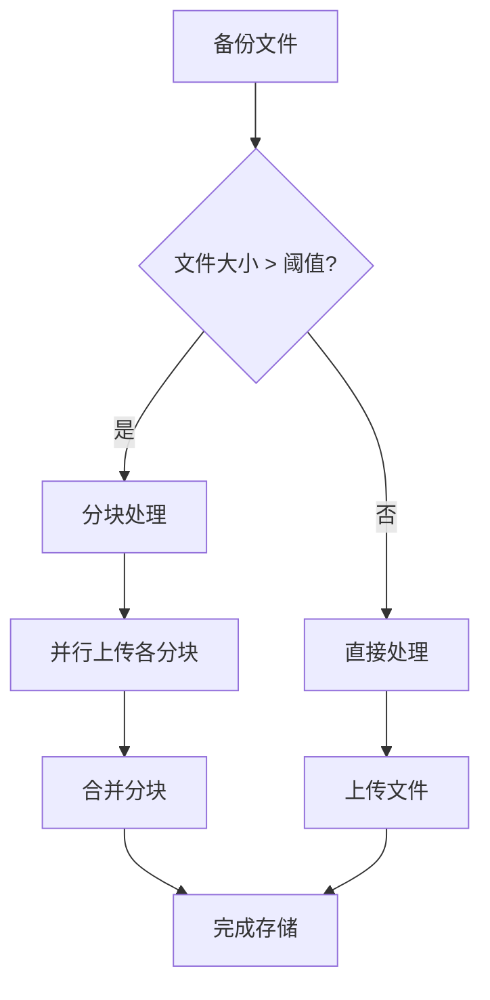

### 检索性能优化
为提高检索性能，系统实现了：
- **索引机制**：建立文件名、时间戳等字段的索引
- **缓存机制**：缓存常用的查询结果
- **分层存储**：根据访问频率将文件存储在不同性能的存储介质上

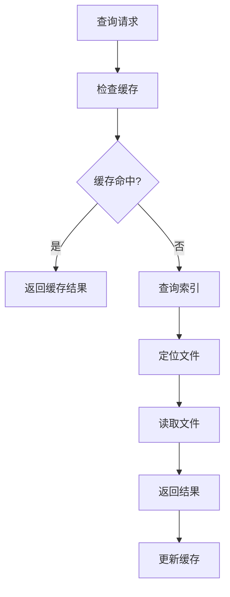

**本节来源**
- [binlogbackup.json](file://dbm-ui/backend/components/dbconfig/migrations/TwemproxyRedisInstance/config/binlogbackup.json#L19-L21)
- [binlogbackup.json](file://dbm-ui/backend/components/dbconfig/migrations/rediscomm/config/binlogbackup.json#L19-L21)

## 总结
本文档详细分析了SQL Server备份文件的传输和管理机制。通过`move_backup_file.go`文件中的实现，系统能够有效地管理备份文件的本地存储、网络传输和远程存储。备份文件的命名规范和存储路径管理确保了文件的有序组织和快速定位。生命周期控制机制通过过期策略和磁盘空间管理，实现了备份文件的自动化管理。安全性、完整性和可访问性保障措施确保了备份数据的可靠性和可用性。最后，通过存储和检索性能优化策略，提高了备份系统的整体效率。

**本节来源**
- [move_backup_file.go](file://dbm-services/sqlserver/db-tools/dbactuator/internal/subcmd/sqlservercmd/move_backup_file.go)
- [move_backup_file.go](file://dbm-services/sqlserver/db-tools/dbactuator/pkg/components/sqlserver/move_backup_file.go)
- [monitor_dbm.sql](file://dbm-services/sqlserver/db-tools/dbactuator/pkg/core/staticembed/monitor_dbm.sql)
- [monitor_dbm_v2.sql](file://dbm-services/sqlserver/db-tools/dbactuator/pkg/core/staticembed/monitor_dbm_v2.sql)
- [backup_path_file_trans.py](file://dbm-ui/backend/flow/plugins/components/collections/sqlserver/backup_path_file_trans.py)