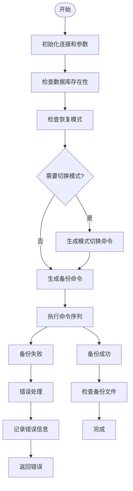
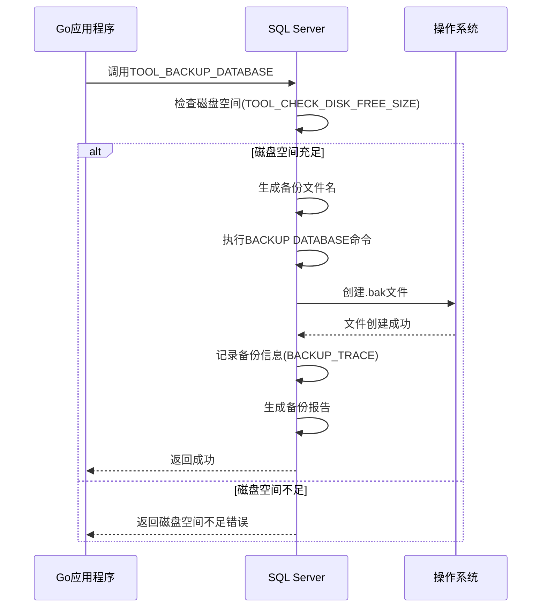
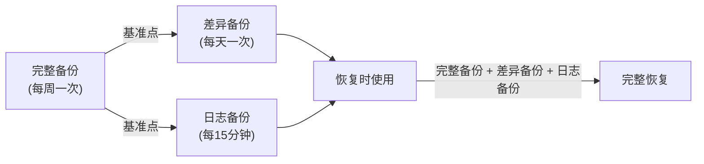
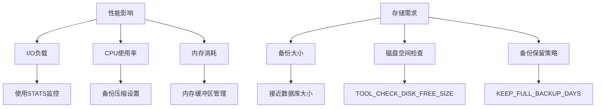

# 完整备份

<cite>
**本文档引用的文件**   
- [backup_dbs.go](file://dbm-services/sqlserver/db-tools/dbactuator/pkg/components/sqlserver/backup_dbs.go)
- [monitor_dbm.sql](file://dbm-services/sqlserver/db-tools/dbactuator/pkg/core/staticembed/monitor_dbm.sql)
- [common_sub_flow.py](file://dbm-ui/backend/flow/engine/bamboo/scene/sqlserver/common_sub_flow.py)
- [dbbackup.conf.json](file://dbm-ui/backend/components/dbconfig/migrations/sqlservercomm/backup/dbbackup.conf.json)
- [consts.py](file://dbm-ui/backend/flow/consts.py)
</cite>

## 目录
1. [完整备份概述](#完整备份概述)
2. [备份策略配置](#备份策略配置)
3. [执行逻辑分析](#执行逻辑分析)
4. [备份文件生成过程](#备份文件生成过程)
5. [备份类型配合使用](#备份类型配合使用)
6. [备份命令示例与参数说明](#备份命令示例与参数说明)
7. [性能影响与存储需求](#性能影响与存储需求)
8. [最佳实践](#最佳实践)

## 完整备份概述

完整备份是SQL Server数据库备份的基础，它创建数据库在特定时间点的完整副本。这种备份类型是所有其他备份操作的基础，为数据库恢复提供了最完整的数据保护。在蓝鲸DBM系统中，完整备份通过`backup_dbs.go`文件中的`DoFullDackup`方法实现，该方法负责执行完整的数据库备份操作。

完整备份的主要优势在于它包含了数据库的所有数据和对象，使得恢复过程简单直接。当需要从灾难性故障中恢复时，完整备份是首选的恢复起点。此外，完整备份还为差异备份和日志备份提供了基准点，这些增量备份类型依赖于最近的完整备份来确定其备份范围。

在蓝鲸DBM系统中，完整备份不仅关注数据的完整性，还注重备份过程的可靠性和可追溯性。系统通过生成唯一的备份ID（BackupID）来标识每次备份操作，并将备份相关信息记录到`BACKUP_TRACE`表中，以便后续的监控和审计。

**Section sources**
- [backup_dbs.go](file://dbm-services/sqlserver/db-tools/dbactuator/pkg/components/sqlserver/backup_dbs.go#L160-L204)

## 备份策略配置

蓝鲸DBM系统中的完整备份策略配置主要通过`BackupDBSParam`结构体定义，该结构体包含了执行备份所需的所有参数。这些参数确保了备份操作的灵活性和可配置性，允许根据不同的业务需求调整备份行为。

关键配置参数包括：
- **Host**: 指定执行备份的本地主机IP地址
- **Port**: 指定需要操作的SQL Server实例端口
- **BackupDBS**: 指定需要备份的数据库列表
- **JobID**: 备份单据ID，用于跟踪和关联备份任务
- **BackupType**: 备份类型，区分完整备份和日志备份
- **FileTag**: 备份文件存储类型标签
- **IsSetFullModel**: 隐藏参数，用于强制将数据库设置为完整恢复模式
- **TargetBackupDir**: 隐藏参数，指定备份文件的存储位置

系统还通过`APP_SETTING`表存储全局备份配置，包括：
- `FULL_BACKUP_PATH`: 完整备份路径
- `LOG_BACKUP_PATH`: 日志备份路径
- `KEEP_FULL_BACKUP_DAYS`: 完整备份保留天数
- `FULL_BACKUP_MIN_SIZE_MB`: 完整备份最小大小（MB）
- `FULL_BACKUP_FILETAG`: 完整备份文件标签

这些配置参数共同构成了完整的备份策略，确保备份操作能够适应不同的环境和需求。例如，`IsSetFullModel`参数允许在备份前强制将数据库切换到完整恢复模式，这对于确保备份的一致性和完整性至关重要。

**Section sources**
- [backup_dbs.go](file://dbm-services/sqlserver/db-tools/dbactuator/pkg/components/sqlserver/backup_dbs.go#L37-L46)
- [monitor_dbm.sql](file://dbm-services/sqlserver/db-tools/dbactuator/pkg/core/staticembed/monitor_dbm.sql#L197-L238)

## 执行逻辑分析

完整备份的执行逻辑在`backup_dbs.go`文件的`DoFullDackup`方法中实现，该方法遵循一系列有序的步骤来确保备份操作的成功。执行流程可以分为初始化、预检查、命令生成和执行四个主要阶段。

在初始化阶段，系统首先建立与SQL Server实例的连接，使用SA账户进行身份验证。然后，系统计算需要备份的数据库列表，通过查询`master.sys.databases`系统表来验证每个数据库的存在性。如果数据库不存在，系统会发出警告并跳过该数据库的备份。

预检查阶段涉及对每个待备份数据库的恢复模式检查。系统通过执行SQL查询`select recovery_model from master.sys.databases where name = '%s'`来获取数据库的恢复模式。如果数据库当前不是完整恢复模式（recovery_model != 1）且`IsSetFullModel`参数为true，系统会生成`ALTER DATABASE [%s] SET RECOVERY FULL WITH NO_WAIT`命令，将数据库切换到完整恢复模式。

命令生成阶段，系统构建完整的备份命令序列。首先，系统为每个数据库生成恢复模式检查和可能的模式切换命令。然后，系统生成调用`TOOL_BACKUP_DATABASE`存储过程的主备份命令，该命令包含备份ID、数据库列表、备份目录和文件标签等参数。

最后，在执行阶段，系统通过`ExecMore`方法批量执行所有生成的SQL命令。执行过程中，系统会记录详细的日志信息，包括执行的SQL命令和任何错误信息。如果执行过程中出现错误，系统会收集所有错误信息并返回一个综合的错误报告。



**Diagram sources **
- [backup_dbs.go](file://dbm-services/sqlserver/db-tools/dbactuator/pkg/components/sqlserver/backup_dbs.go#L160-L204)

**Section sources**
- [backup_dbs.go](file://dbm-services/sqlserver/db-tools/dbactuator/pkg/components/sqlserver/backup_dbs.go#L160-L204)

## 备份文件生成过程

备份文件的生成过程由SQL Server的`TOOL_BACKUP_DATABASE`和`TOOL_BACKUP_DATABASE_OPERATOR`存储过程协同完成。这个过程涉及多个步骤，从磁盘空间检查到实际的备份操作，再到备份信息的记录和报告。

首先，系统执行磁盘空间检查，确保备份目标路径有足够的可用空间。这通过`TOOL_CHECK_DISK_FREE_SIZE`存储过程实现，该过程查询指定驱动器的可用空间，并与配置的最小大小要求进行比较。如果可用空间不足，系统会抛出错误并终止备份操作。



**Diagram sources **
- [monitor_dbm.sql](file://dbm-services/sqlserver/db-tools/dbactuator/pkg/core/staticembed/monitor_dbm.sql#L3173-L3178)

**Section sources**
- [monitor_dbm.sql](file://dbm-services/sqlserver/db-tools/dbactuator/pkg/core/staticembed/monitor_dbm.sql#L3173-L3178)

接下来，系统为每个数据库生成唯一的备份文件名。文件名格式为`{数据库名}__{应用名}_{IP}_{端口}_{时间戳}.bak`，这种命名约定确保了文件的唯一性和可追溯性。时间戳部分使用`CONVERT(CHAR(19),GETDATE(),120)`函数生成，格式为`YYYY-MM-DD HH:MI:SS`。

实际的备份操作通过`BACKUP DATABASE` T-SQL命令执行。该命令使用`WITH INIT`选项覆盖现有备份文件，`STATS = 10`选项提供每10%进度的反馈，帮助监控备份进度。备份完成后，系统会自动将备份信息记录到`BACKUP_TRACE`表中，包括备份ID、数据库名、文件路径、开始和结束时间等关键信息。

最后，系统生成备份报告并将其写入指定的日志文件（如`D:\dbbak\backup_result.log`）。报告内容为JSON格式，包含备份任务的详细信息，如集群ID、主机信息、备份类型、LSN值、文件大小等。这些信息对于后续的备份管理和恢复操作至关重要。

## 备份类型配合使用

在蓝鲸DBM系统中，完整备份与其他备份类型（如差异备份和日志备份）协同工作，形成一个完整的备份策略。这种多层次的备份策略在数据保护和恢复效率之间提供了良好的平衡。

完整备份作为基础，为所有其他备份类型提供基准点。差异备份只包含自上次完整备份以来发生变化的数据，而日志备份则记录了自上次备份以来的所有事务日志。这种组合允许在保证数据安全的同时，减少备份所需的时间和存储空间。



**Diagram sources **
- [backup_dbs.go](file://dbm-services/sqlserver/db-tools/dbactuator/pkg/components/sqlserver/backup_dbs.go#L27-L28)

**Section sources**
- [backup_dbs.go](file://dbm-services/sqlserver/db-tools/dbactuator/pkg/components/sqlserver/backup_dbs.go#L27-L28)

在恢复过程中，系统首先应用最近的完整备份，然后应用最新的差异备份（如果有），最后应用所有相关的日志备份。这种顺序确保了数据的一致性和完整性。例如，在`monitor_dbm.sql`文件中，当执行日志备份时，系统会检查是否需要先执行完整备份："IF '+LTRIM(@TYPE)+' <> 1 AND NOT EXISTS(select 1 from msdb.dbo.backupset a, msdb.dbo.backupmediafamily b where a.media_set_id = b.media_set_id and a.database_name = '''+replace(NAME,'-','#')+''' and backup_finish_date between getdate()-2 and getdate())"。

这种备份策略的灵活性还体现在配置参数上。通过`SqlserverBackupMode`枚举类型，系统支持`FULL_BACKUP`和`LOG_BACKUP`两种模式，允许根据业务需求选择合适的备份类型。同时，`SqlserverBackupFileTagEnum`枚举定义了不同的文件标签，如`DBFILE1M`和`INCREMENT_BACKUP`，用于区分不同类型的备份文件。

## 备份命令示例与参数说明

以下是蓝鲸DBM系统中完整备份的典型命令示例和参数说明：

```python
# Python调用示例
sub_pipeline.add_act(
    act_name=_("执行数据库备份"),
    act_component_code=SqlserverActuatorScriptComponent.code,
    kwargs=asdict(
        ExecActuatorKwargs(
            exec_ips=[master_host],
            get_payload_func=SqlserverActPayload.get_backup_dbs_payload.__name__,
            job_timeout=DBM_SQLSERVER_JOB_LONG_TIMEOUT,
            custom_params={
                "port": port,
                "file_tag": SqlserverBackupFileTagEnum.DBFILE1M.value,
                "backup_type": SqlserverBackupMode.FULL_BACKUP.value,
            },
        )
    ),
    write_payload_var=SqlserverBackupIDContext.full_backup_id_var_name(),
)
```

**Section sources**
- [common_sub_flow.py](file://dbm-ui/backend/flow/engine/bamboo/scene/sqlserver/common_sub_flow.py#L724-L741)

关键参数说明：

| 参数 | 说明 | 示例值 |
|------|------|--------|
| **port** | SQL Server实例端口 | 1433 |
| **file_tag** | 备份文件存储类型标签 | DBFILE1M |
| **backup_type** | 备份类型 | FULL_BACKUP |
| **host** | 主机IP地址 | 192.168.1.100 |
| **JobID** | 备份单据ID | BKSQL-20240101-001 |

在Go代码层面，备份参数通过`BackupDBSParam`结构体定义：

```go
type BackupDBSParam struct {
    Host            string   `json:"host" validate:"required,ip" `
    Port            int      `json:"port"  validate:"required,gt=0"`
    BackupDBS       []string `json:"backup_dbs"  validate:"required"`
    JobID           string   `json:"job_id"  validate:"required"`
    BackupType      string   `json:"backup_type"  validate:"required"`
    FileTag         string   `json:"file_tag"  validate:"required"`
    IsSetFullModel  bool     `json:"is_set_full_model"`
    TargetBackupDir string   `json:"target_backup_dir"`
}
```

**Section sources**
- [backup_dbs.go](file://dbm-services/sqlserver/db-tools/dbactuator/pkg/components/sqlserver/backup_dbs.go#L37-L46)

这些参数通过JSON格式传递给备份组件，确保了配置的灵活性和可扩展性。例如，`file_tag`参数不仅用于标识备份文件的类型，还可能影响备份文件的存储位置和保留策略。

## 性能影响与存储需求

完整备份对系统性能和存储资源有显著影响，需要仔细规划和管理。备份过程中的主要性能影响包括：

1. **I/O负载**: 备份操作涉及大量的磁盘读写，可能会对数据库的正常I/O性能产生影响。系统通过`STATS = 10`选项监控备份进度，帮助评估I/O性能。

2. **CPU使用率**: 数据压缩和加密操作会增加CPU负载。虽然SQL Server默认启用备份压缩（`BACKUP COMPRESSION DEFAULT`设置为1），但这会增加CPU使用率。

3. **内存消耗**: 大型数据库的备份需要大量内存缓冲区，可能会影响其他数据库操作的内存可用性。

存储需求方面，完整备份的大小通常接近数据库的实际大小。系统通过以下配置参数管理存储：

- `FULL_BACKUP_MIN_SIZE_MB`: 设置完整备份的最小大小阈值（默认40960MB），防止因磁盘空间不足导致备份失败
- `KEEP_FULL_BACKUP_DAYS`: 设置完整备份的保留天数（默认2天），自动清理过期备份
- `FULL_BACKUP_PATH`: 指定备份文件的存储路径（默认D:\dbbak\full\）



**Diagram sources **
- [monitor_dbm.sql](file://dbm-services/sqlserver/db-tools/dbactuator/pkg/core/staticembed/monitor_dbm.sql#L197-L238)

**Section sources**
- [monitor_dbm.sql](file://dbm-services/sqlserver/db-tools/dbactuator/pkg/core/staticembed/monitor_dbm.sql#L197-L238)

系统还通过定期清理过期备份来管理存储空间。在`monitor_dbm.sql`中，系统执行以下清理操作：
```sql
UPDATE [Monitor].[dbo].[BACKUP_TRACE] SET UPLOADED=1 WHERE TYPE=@TYPE AND UPLOADED=0 AND STARTTIME<= dateadd(dd,-@KEEP_BACKUP_DAYS,dateadd(mi,2,getdate()))
```
这确保了备份存储不会无限增长，同时保留了足够的历史备份用于恢复。

## 最佳实践

基于蓝鲸DBM系统的实现，以下是SQL Server完整备份的最佳实践：

1. **定期执行完整备份**: 建议每周执行一次完整备份，作为数据保护的基础。可以通过配置`KEEP_FULL_BACKUP_DAYS`参数来管理备份保留策略。

2. **监控磁盘空间**: 在执行备份前，确保目标磁盘有足够的可用空间。系统通过`TOOL_CHECK_DISK_FREE_SIZE`存储过程自动检查磁盘空间，建议设置合理的`FULL_BACKUP_MIN_SIZE_MB`阈值。

3. **使用完整恢复模式**: 对于生产环境，建议将数据库设置为完整恢复模式，以便支持差异备份和日志备份。可以通过`IsSetFullModel`参数在备份时强制切换恢复模式。

4. **合理规划备份时间**: 避免在业务高峰期执行完整备份，以减少对系统性能的影响。可以利用系统提供的`job_timeout`参数设置合理的超时时间。

5. **验证备份完整性**: 备份完成后，应验证备份文件的完整性和可恢复性。系统通过`CheckBackupSuccess`方法检查备份文件是否存在，并记录到`BACKUP_TRACE`表中。

6. **实施多层次备份策略**: 结合完整备份、差异备份和日志备份，形成完整的数据保护策略。这种策略可以在保证数据安全的同时，减少备份所需的时间和存储空间。

7. **定期测试恢复过程**: 定期进行恢复演练，确保备份文件的有效性和恢复流程的可靠性。可以利用备份ID（BackupID）来精确指定恢复点。

8. **监控和告警**: 启用备份监控和告警功能，及时发现和处理备份失败的情况。系统生成的备份报告（如`backup_result.log`）可以用于审计和故障排查。

通过遵循这些最佳实践，可以确保SQL Server数据库的完整备份既高效又可靠，为业务数据提供坚实的安全保障。

**Section sources**
- [backup_dbs.go](file://dbm-services/sqlserver/db-tools/dbactuator/pkg/components/sqlserver/backup_dbs.go#L256-L294)