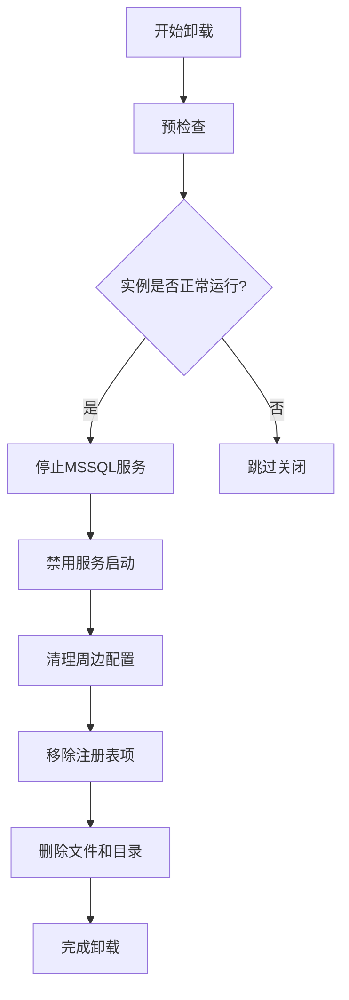
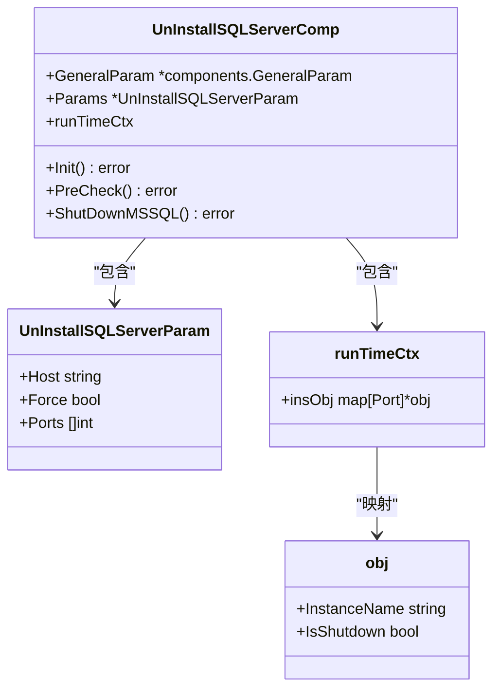
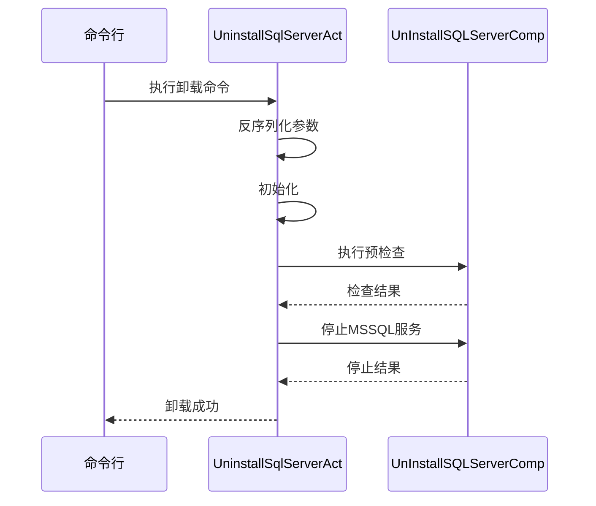
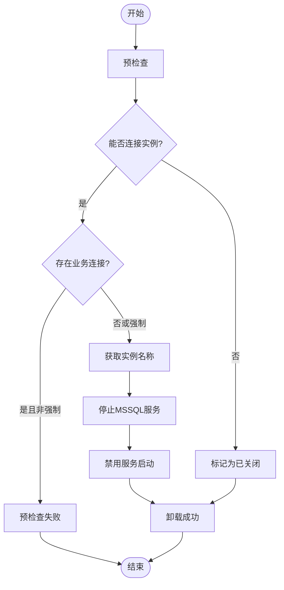
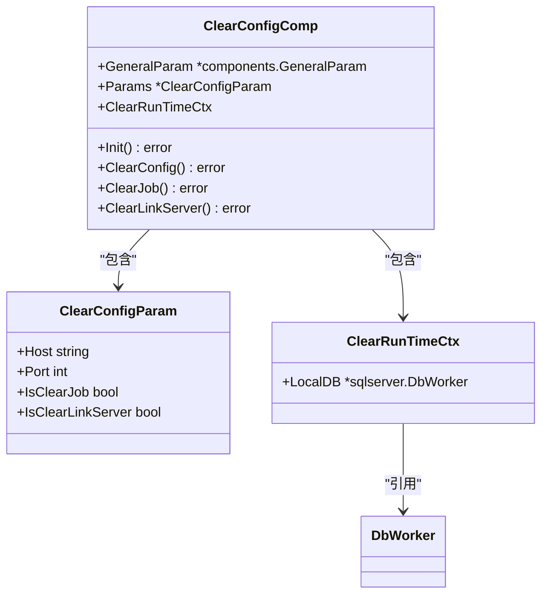
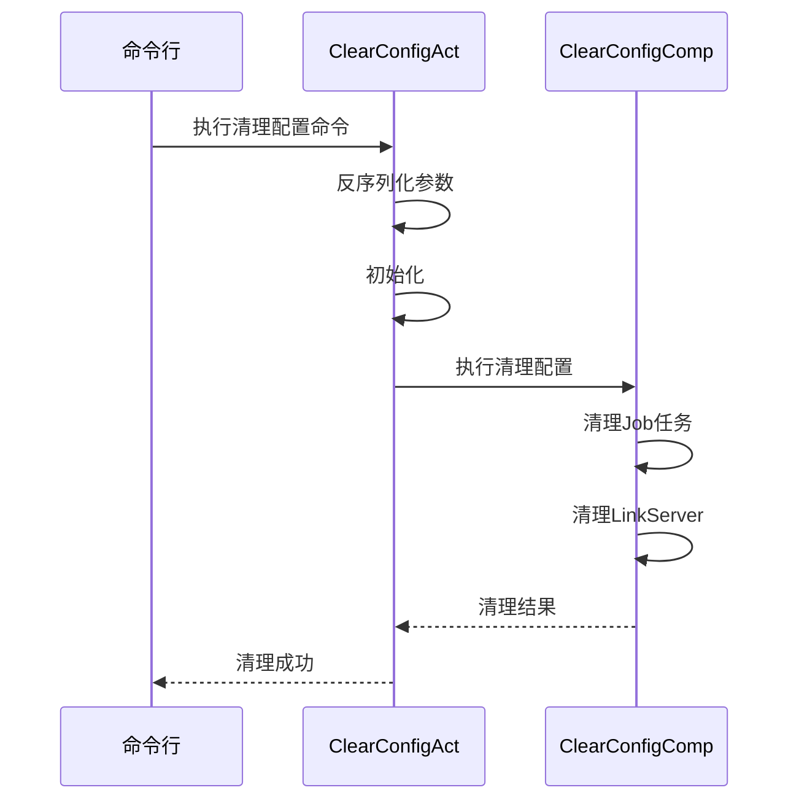
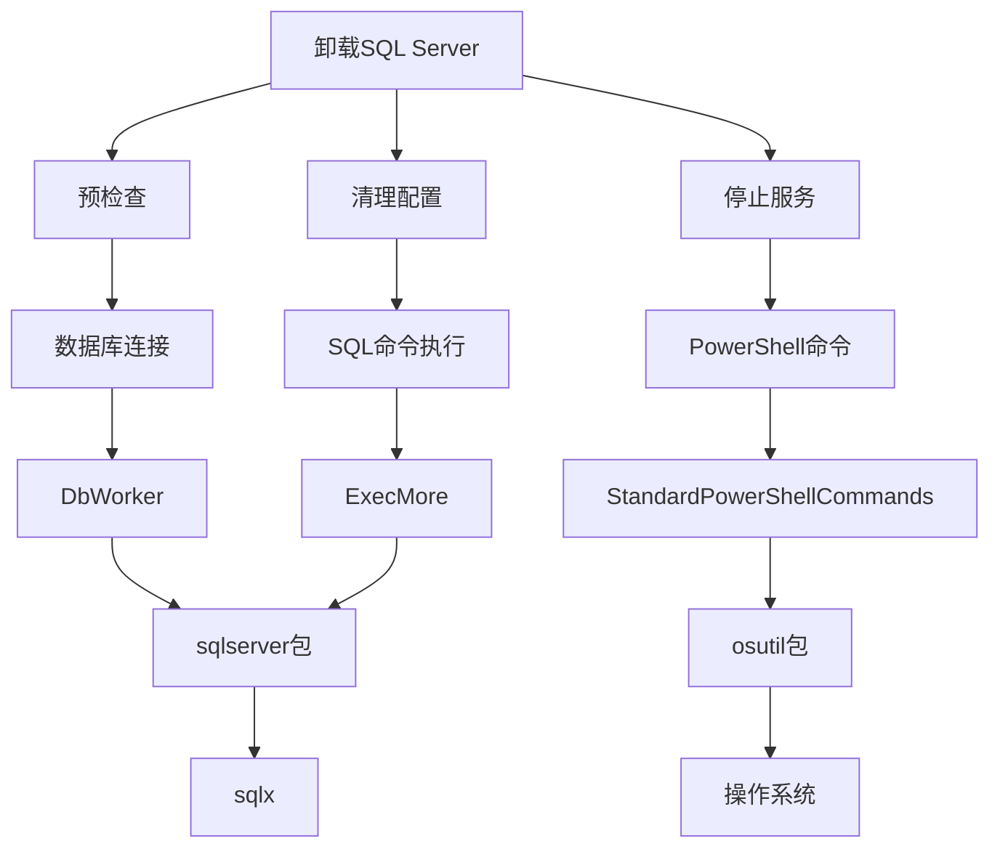

# SQL Server卸载流程

<cite>
**本文档引用的文件**   
- [uninstall_sqlserver.go](file://dbm-services/sqlserver/db-tools/dbactuator/pkg/components/sqlserver/uninstall_sqlserver.go)
- [uninstall_sqlserver.go](file://dbm-services/sqlserver/db-tools/dbactuator/internal/subcmd/sqlservercmd/uninstall_sqlserver.go)
- [clear_config.go](file://dbm-services/sqlserver/db-tools/dbactuator/pkg/components/clear/clear_config.go)
- [clear_config.go](file://dbm-services/sqlserver/db-tools/dbactuator/internal/subcmd/sqlservercmd/clear_config.go)
- [sqlserver.go](file://dbm-services/sqlserver/db-tools/dbactuator/pkg/util/sqlserver/sqlserver.go)
- [const.go](file://dbm-services/sqlserver/db-tools/dbactuator/pkg/core/cst/const.go)
- [init_sqlserver.ps1](file://dbm-services/sqlserver/db-tools/dbactuator/pkg/core/staticembed/init_sqlserver.ps1)
- [sysinit.ps1](file://dbm-services/sqlserver/db-tools/dbactuator/pkg/core/staticembed/sysinit.ps1)
</cite>

## 目录
1. [引言](#引言)
2. [核心组件分析](#核心组件分析)
3. [卸载流程架构](#卸载流程架构)
4. [详细组件分析](#详细组件分析)
5. [依赖关系分析](#依赖关系分析)
6. [性能与安全考虑](#性能与安全考虑)
7. [故障排除指南](#故障排除指南)
8. [结论](#结论)

## 引言
本文档深入分析SQL Server实例的卸载逻辑，重点解析`uninstall_sqlserver.go`中的实现细节。文档涵盖服务停止、配置清理、文件删除和注册表项移除等关键步骤，讨论卸载过程中可能遇到的问题及其处理策略，并强调卸载操作的安全性和完整性保障措施。

## 核心组件分析

**本文档引用的文件**   
- [uninstall_sqlserver.go](file://dbm-services/sqlserver/db-tools/dbactuator/pkg/components/sqlserver/uninstall_sqlserver.go)
- [uninstall_sqlserver.go](file://dbm-services/sqlserver/db-tools/dbactuator/internal/subcmd/sqlservercmd/uninstall_sqlserver.go)

## 卸载流程架构

**图表来源**
- [uninstall_sqlserver.go](file://dbm-services/sqlserver/db-tools/dbactuator/pkg/components/sqlserver/uninstall_sqlserver.go#L62-L133)
- [init_sqlserver.ps1](file://dbm-services/sqlserver/db-tools/dbactuator/pkg/core/staticembed/init_sqlserver.ps1#L127-L187)

## 详细组件分析

### 卸载组件分析

#### 对象导向组件：

**图表来源**
- [uninstall_sqlserver.go](file://dbm-services/sqlserver/db-tools/dbactuator/pkg/components/sqlserver/uninstall_sqlserver.go#L23-L47)

#### API/服务组件：

**图表来源**
- [uninstall_sqlserver.go](file://dbm-services/sqlserver/db-tools/dbactuator/internal/subcmd/sqlservercmd/uninstall_sqlserver.go#L37-L87)
- [uninstall_sqlserver.go](file://dbm-services/sqlserver/db-tools/dbactuator/pkg/components/sqlserver/uninstall_sqlserver.go#L62-L133)

#### 复杂逻辑组件：

**图表来源**
- [uninstall_sqlserver.go](file://dbm-services/sqlserver/db-tools/dbactuator/pkg/components/sqlserver/uninstall_sqlserver.go#L62-L133)

**本文档引用的文件**
- [uninstall_sqlserver.go](file://dbm-services/sqlserver/db-tools/dbactuator/pkg/components/sqlserver/uninstall_sqlserver.go#L1-L133)
- [uninstall_sqlserver.go](file://dbm-services/sqlserver/db-tools/dbactuator/internal/subcmd/sqlservercmd/uninstall_sqlserver.go#L1-L88)

### 配置清理组件分析

#### 对象导向组件：

**图表来源**
- [clear_config.go](file://dbm-services/sqlserver/db-tools/dbactuator/pkg/components/clear/clear_config.go#L22-L35)

#### API/服务组件：

**图表来源**
- [clear_config.go](file://dbm-services/sqlserver/db-tools/dbactuator/internal/subcmd/sqlservercmd/clear_config.go#L37-L84)
- [clear_config.go](file://dbm-services/sqlserver/db-tools/dbactuator/pkg/components/clear/clear_config.go#L61-L77)

**本文档引用的文件**
- [clear_config.go](file://dbm-services/sqlserver/db-tools/dbactuator/pkg/components/clear/clear_config.go#L1-L95)
- [clear_config.go](file://dbm-services/sqlserver/db-tools/dbactuator/internal/subcmd/sqlservercmd/clear_config.go#L1-L84)

## 依赖关系分析

**图表来源**
- [uninstall_sqlserver.go](file://dbm-services/sqlserver/db-tools/dbactuator/pkg/components/sqlserver/uninstall_sqlserver.go#L13-L21)
- [sqlserver.go](file://dbm-services/sqlserver/db-tools/dbactuator/pkg/util/sqlserver/sqlserver.go#L23-L27)

**本文档引用的文件**
- [uninstall_sqlserver.go](file://dbm-services/sqlserver/db-tools/dbactuator/pkg/components/sqlserver/uninstall_sqlserver.go#L13-L21)
- [sqlserver.go](file://dbm-services/sqlserver/db-tools/dbactuator/pkg/util/sqlserver/sqlserver.go#L23-L27)

## 性能与安全考虑

**本文档引用的文件**
- [const.go](file://dbm-services/sqlserver/db-tools/dbactuator/pkg/core/cst/const.go#L75-L95)
- [sysinit.ps1](file://dbm-services/sqlserver/db-tools/dbactuator/pkg/core/staticembed/sysinit.ps1#L1-L32)

## 故障排除指南

**本文档引用的文件**
- [uninstall_sqlserver.go](file://dbm-services/sqlserver/db-tools/dbactuator/pkg/components/sqlserver/uninstall_sqlserver.go#L62-L111)
- [uninstall_sqlserver.go](file://dbm-services/sqlserver/db-tools/dbactuator/pkg/components/sqlserver/uninstall_sqlserver.go#L115-L133)

## 结论
SQL Server实例的卸载流程是一个复杂而严谨的过程，涉及多个关键步骤和组件的协同工作。通过预检查、服务停止、配置清理等步骤，确保了卸载操作的安全性和完整性。系统提供了强制卸载选项以应对特殊情况，同时通过详细的日志记录和错误处理机制保障了操作的可追溯性和可靠性。