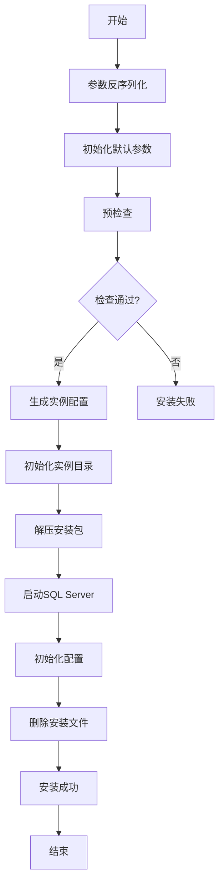

# SQL Server安装与维护模块

<cite>
**本文档引用的文件**   
- [install_sqlserver.go](file://dbm-services/sqlserver/db-tools/dbactuator/internal/subcmd/sqlservercmd/install_sqlserver.go)
- [uninstall_sqlserver.go](file://dbm-services/sqlserver/db-tools/dbactuator/internal/subcmd/sqlservercmd/uninstall_sqlserver.go)
- [clean_dbs.go](file://dbm-services/sqlserver/db-tools/dbactuator/internal/subcmd/sqlservercmd/clean_dbs.go)
- [install_sqlserver.go](file://dbm-services/sqlserver/db-tools/dbactuator/pkg/components/sqlserver/install_sqlserver.go)
- [uninstall_sqlserver.go](file://dbm-services/sqlserver/db-tools/dbactuator/pkg/components/sqlserver/uninstall_sqlserver.go)
- [clean_dbs.go](file://dbm-services/sqlserver/db-tools/dbactuator/pkg/components/sqlserver/clean_dbs.go)
- [sqlserver.go](file://dbm-services/sqlserver/db-tools/dbactuator/pkg/util/sqlserver/sqlserver.go)
- [cst.go](file://dbm-services/sqlserver/db-tools/dbactuator/pkg/core/cst/cst.go)
- [staticembed.go](file://dbm-services/sqlserver/db-tools/dbactuator/pkg/core/staticembed/staticembed.go)
</cite>

## 目录
1. [SQL Server实例安装流程](#sql-server实例安装流程)
2. [SQL Server实例卸载逻辑](#sql-server实例卸载逻辑)
3. [数据库清理机制](#数据库清理机制)
4. [安装流程图](#安装流程图)
5. [日常维护最佳实践](#日常维护最佳实践)
6. [性能监控指标](#性能监控指标)

## SQL Server实例安装流程

SQL Server实例的自动化安装流程由`install_sqlserver.go`文件中的`DeploySqlServerAct`结构体实现。该流程支持多实例同时安装，通过一系列有序步骤完成部署。安装流程首先进行参数反序列化和默认参数初始化，然后执行一系列预检查、配置生成和实例启动操作。

安装流程的核心组件是`InstallSqlServerComp`结构体，它定义了安装过程所需的所有参数和配置。关键参数包括端口列表、SQL Server版本、字符集、主机信息、安装密钥、内存分配百分比和最大保留内存等。安装流程通过`Run`方法执行，该方法定义了多个执行步骤，包括预检查、配置文件生成、目录初始化、安装包解压、实例启动、配置初始化和文件清理。

预检查阶段验证安装介质的MD5值、必要目录的存在性以及系统中是否已存在运行中的MSSQL服务。配置文件生成阶段使用模板渲染技术为每个实例生成独立的安装配置文件。目录初始化阶段为每个实例创建必要的数据目录，并设置正确的权限。安装包解压阶段支持.7z格式的安装文件解压。实例启动阶段通过PowerShell命令调用setup.exe执行安装。配置初始化阶段执行一系列后续配置操作，包括内存分配、账号初始化和监控配置。

**Section sources**
- [install_sqlserver.go](file://dbm-services/sqlserver/db-tools/dbactuator/internal/subcmd/sqlservercmd/install_sqlserver.go#L26-L138)
- [install_sqlserver.go](file://dbm-services/sqlserver/db-tools/dbactuator/pkg/components/sqlserver/install_sqlserver.go#L36-L714)

## SQL Server实例卸载逻辑

SQL Server实例的卸载逻辑由`uninstall_sqlserver.go`文件中的`UninstallSqlServerAct`结构体实现。该流程支持多实例同时卸载，通过预检查和停止服务两个主要步骤完成。卸载流程首先进行参数反序列化和初始化，然后执行预检查和停止服务操作。

卸载流程的核心组件是`UnInstallSQLServerComp`结构体，它定义了卸载过程所需的所有参数和运行时上下文。关键参数包括主机信息、是否强制卸载以及需要卸载的端口列表。卸载流程通过`Run`方法执行，该方法定义了两个主要步骤：预检查和停止服务。

预检查阶段连接到每个指定端口的SQL Server实例，检查是否存在用户连接。如果存在用户连接且未设置强制卸载标志，则预检查失败。对于连接失败的实例，系统会标记为已关闭状态并跳过后续操作。停止服务阶段通过PowerShell命令停止SQL Server和SQL Agent服务，并将服务启动类型设置为禁用，确保实例不会在系统重启后自动启动。

**Section sources**
- [uninstall_sqlserver.go](file://dbm-services/sqlserver/db-tools/dbactuator/internal/subcmd/sqlservercmd/uninstall_sqlserver.go#L24-L88)
- [uninstall_sqlserver.go](file://dbm-services/sqlserver/db-tools/dbactuator/pkg/components/sqlserver/uninstall_sqlserver.go#L23-L134)

## 数据库清理机制

数据库清理机制由`clean_dbs.go`文件中的`CleanDBSAct`结构体实现。该机制支持多种清理模式，包括清空表数据、删除表和删除数据库。清理流程首先进行参数反序列化和初始化，然后执行预检测和清理操作。

清理流程的核心组件是`CleanDBSComp`结构体，它定义了清理过程所需的所有参数和运行时上下文。关键参数包括主机信息、操作端口、待清理数据库列表、集群同步模式、清理模式、从实例列表、清理表列表、忽略清理表列表以及是否强制清理。清理流程通过`Run`方法执行，该方法定义了两个主要步骤：预检测和执行清理。

预检测阶段检查每个待清理数据库是否存在用户连接，如果存在连接且未设置强制清理标志，则预检测失败。同时检查数据库是否存在，如果不存在则跳过。执行清理阶段根据指定的清理模式执行相应的操作。对于清空表数据模式，使用`TRUNCATE TABLE`命令清空指定表的数据。对于删除表模式，使用`DROP TABLE`命令删除指定表。对于删除数据库模式，根据集群同步模式执行相应的删除操作，包括解除镜像关系、删除快照库和删除源库。

**Section sources**
- [clean_dbs.go](file://dbm-services/sqlserver/db-tools/dbactuator/internal/subcmd/sqlservercmd/clean_dbs.go#L24-L88)
- [clean_dbs.go](file://dbm-services/sqlserver/db-tools/dbactuator/pkg/components/sqlserver/clean_dbs.go#L23-L412)

## 安装流程图

**Diagram sources **
- [install_sqlserver.go](file://dbm-services/sqlserver/db-tools/dbactuator/internal/subcmd/sqlservercmd/install_sqlserver.go#L92-L137)
- [install_sqlserver.go](file://dbm-services/sqlserver/db-tools/dbactuator/pkg/components/sqlserver/install_sqlserver.go#L235-L371)

## 日常维护最佳实践

SQL Server实例的日常维护应遵循以下最佳实践：

1. **定期备份**：配置定期全量备份和日志备份，确保数据安全。备份策略应根据业务需求和数据变化频率进行调整。

2. **监控告警**：设置关键性能指标的监控和告警，及时发现和解决潜在问题。监控应覆盖CPU、内存、磁盘I/O、连接数等关键指标。

3. **性能优化**：定期分析查询性能，优化慢查询。使用索引优化、查询重写等技术提高查询效率。

4. **安全加固**：定期更新补丁，关闭不必要的服务和端口，配置防火墙规则，限制访问权限。

5. **容量规划**：监控存储空间使用情况，提前规划容量扩展。定期清理无用数据，释放存储空间。

6. **高可用性**：配置AlwaysOn或镜像等高可用方案，确保业务连续性。定期测试故障切换，验证高可用方案的有效性。

7. **文档记录**：详细记录系统配置、变更历史和故障处理过程，便于问题排查和知识传承。

**Section sources**
- [install_sqlserver.go](file://dbm-services/sqlserver/db-tools/dbactuator/pkg/components/sqlserver/install_sqlserver.go#L373-L424)
- [uninstall_sqlserver.go](file://dbm-services/sqlserver/db-tools/dbactuator/pkg/components/sqlserver/uninstall_sqlserver.go#L113-L134)

## 性能监控指标

SQL Server实例的关键性能监控指标包括：

- **CPU使用率**：监控SQL Server进程的CPU使用情况，识别CPU瓶颈。
- **内存使用率**：监控SQL Server的内存分配和使用情况，确保内存配置合理。
- **磁盘I/O**：监控数据文件和日志文件的读写性能，识别I/O瓶颈。
- **连接数**：监控当前连接数和连接池使用情况，防止连接耗尽。
- **缓存命中率**：监控数据缓存和执行计划缓存的命中率，评估缓存效率。
- **锁等待**：监控锁等待时间和锁等待队列，识别锁竞争问题。
- **死锁**：监控死锁发生频率和死锁图，分析死锁原因并优化。
- **查询性能**：监控慢查询和执行计划，识别性能瓶颈。
- **备份性能**：监控备份和恢复操作的性能，确保备份策略的有效性。
- **日志增长**：监控事务日志的增长速度，防止日志文件过大。

这些指标可以通过系统视图、性能计数器和第三方监控工具进行收集和分析。建议设置合理的阈值和告警规则，及时发现和解决性能问题。

**Section sources**
- [sqlserver.go](file://dbm-services/sqlserver/db-tools/dbactuator/pkg/util/sqlserver/sqlserver.go#L236-L241)
- [cst.go](file://dbm-services/sqlserver/db-tools/dbactuator/pkg/core/cst/cst.go#L1-L13)
- [staticembed.go](file://dbm-services/sqlserver/db-tools/dbactuator/pkg/core/staticembed/staticembed.go#L1-L40)