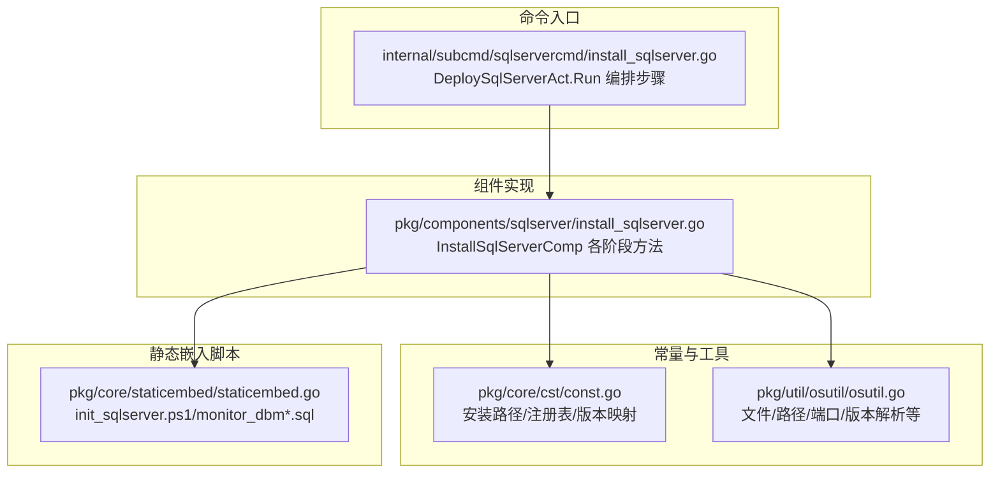
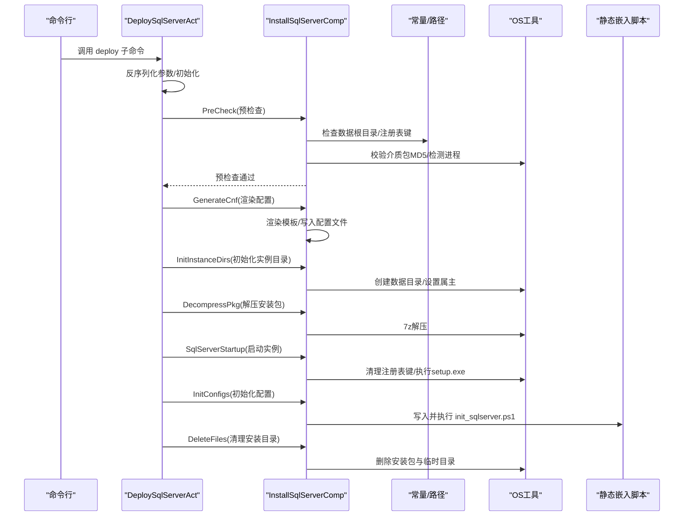
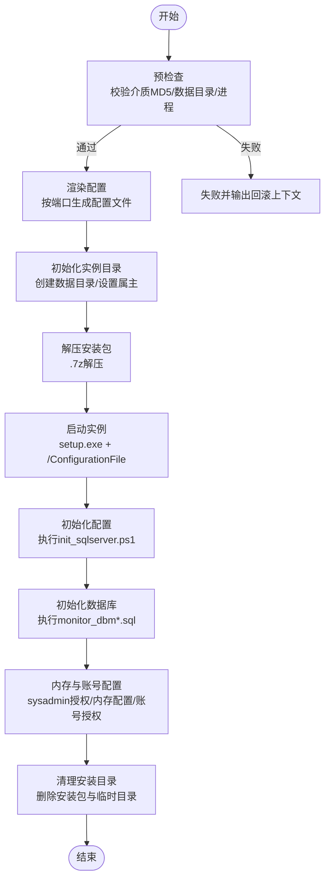
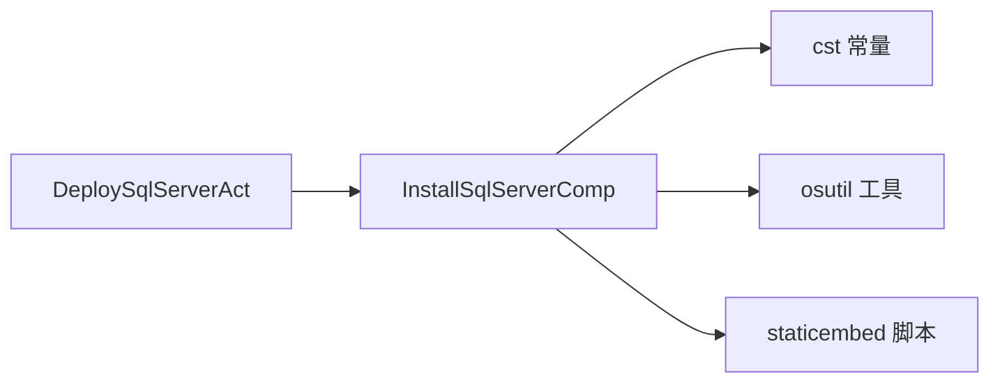

# SQL Server安装流程

<cite>
**本文引用的文件**
- [install_sqlserver.go](file://dbm-services/sqlserver/db-tools/dbactuator/pkg/components/sqlserver/install_sqlserver.go)
- [install_sqlserver.go](file://dbm-services/sqlserver/db-tools/dbactuator/internal/subcmd/sqlservercmd/install_sqlserver.go)
- [const.go](file://dbm-services/sqlserver/db-tools/dbactuator/pkg/core/cst/const.go)
- [osutil.go](file://dbm-services/sqlserver/db-tools/dbactuator/pkg/util/osutil/osutil.go)
- [staticembed.go](file://dbm-services/sqlserver/db-tools/dbactuator/pkg/core/staticembed/staticembed.go)
- [init_sqlserver.ps1](file://dbm-services/sqlserver/db-tools/dbactuator/pkg/core/staticembed/init_sqlserver.ps1)
- [sysinit.ps1](file://dbm-services/sqlserver/db-tools/dbactuator/pkg/core/staticembed/sysinit.ps1)
- [monitor_dbm.sql](file://dbm-services/sqlserver/db-tools/dbactuator/pkg/core/staticembed/monitor_dbm.sql)
- [monitor_dbm_v2.sql](file://dbm-services/sqlserver/db-tools/dbactuator/pkg/core/staticembed/monitor_dbm_v2.sql)
- [MSSQL_Enterprise_2014.json](file://dbm-ui/backend/components/dbconfig/migrations/sqlserver_single/dbconf/MSSQL_Enterprise_2014.json)
</cite>

## 目录
1. [引言](#引言)
2. [项目结构](#项目结构)
3. [核心组件](#核心组件)
4. [架构总览](#架构总览)
5. [详细组件分析](#详细组件分析)
6. [依赖分析](#依赖分析)
7. [性能考虑](#性能考虑)
8. [故障排查指南](#故障排查指南)
9. [结论](#结论)

## 引言
本文围绕 SQL Server 实例的自动化安装流程展开，聚焦于安装组件与命令入口的实现，系统梳理从环境准备、安装包解压、服务配置、实例初始化与启动，到初始化数据库与内存配置的完整链路。文档同时对参数配置、依赖关系、常见问题与排障方法进行说明，帮助读者快速理解并落地自动化安装。

## 项目结构
SQL Server 安装相关代码位于 dbactuator 子模块中，采用“命令入口 + 组件实现”的分层组织：
- 命令入口：internal/subcmd/sqlservercmd 下的 deploy 命令，负责步骤编排与回滚上下文输出。
- 组件实现：pkg/components/sqlserver 下的 InstallSqlServerComp，封装安装全流程的各阶段方法。
- 常量与工具：pkg/core/cst 定义安装路径、注册表键、版本映射；pkg/util/osutil 提供操作系统与文件系统辅助能力。
- 静态嵌入脚本：pkg/core/staticembed 内置 PowerShell 与 SQL 脚本，用于安装后初始化与监控脚本注入。

图表来源
- [install_sqlserver.go](file://dbm-services/sqlserver/db-tools/dbactuator/internal/subcmd/sqlservercmd/install_sqlserver.go#L92-L137)
- [install_sqlserver.go](file://dbm-services/sqlserver/db-tools/dbactuator/pkg/components/sqlserver/install_sqlserver.go#L235-L317)
- [const.go](file://dbm-services/sqlserver/db-tools/dbactuator/pkg/core/cst/const.go#L35-L73)
- [osutil.go](file://dbm-services/sqlserver/db-tools/dbactuator/pkg/util/osutil/osutil.go#L134-L153)
- [staticembed.go](file://dbm-services/sqlserver/db-tools/dbactuator/pkg/core/staticembed/staticembed.go#L1-L39)

章节来源
- [install_sqlserver.go](file://dbm-services/sqlserver/db-tools/dbactuator/internal/subcmd/sqlservercmd/install_sqlserver.go#L92-L137)
- [install_sqlserver.go](file://dbm-services/sqlserver/db-tools/dbactuator/pkg/components/sqlserver/install_sqlserver.go#L235-L317)

## 核心组件
- InstallSqlServerComp：封装安装全流程，包含参数校验、配置渲染、目录初始化、安装包解压、实例启动、初始化配置、数据库初始化、内存与账号配置等。
- DeploySqlServerAct：命令入口，负责参数反序列化、步骤编排、回滚上下文输出。
- 常量与工具：提供安装路径、注册表键、版本映射、端口计算、版本年份解析、导出器配置生成等能力。
- 静态嵌入脚本：包含安装后初始化脚本与监控脚本，用于实例启用高可用模块、SSMS 版本适配、创建 DBM 监控对象等。

章节来源
- [install_sqlserver.go](file://dbm-services/sqlserver/db-tools/dbactuator/pkg/components/sqlserver/install_sqlserver.go#L36-L116)
- [install_sqlserver.go](file://dbm-services/sqlserver/db-tools/dbactuator/internal/subcmd/sqlservercmd/install_sqlserver.go#L26-L61)
- [const.go](file://dbm-services/sqlserver/db-tools/dbactuator/pkg/core/cst/const.go#L35-L73)
- [osutil.go](file://dbm-services/sqlserver/db-tools/dbactuator/pkg/util/osutil/osutil.go#L134-L153)
- [staticembed.go](file://dbm-services/sqlserver/db-tools/dbactuator/pkg/core/staticembed/staticembed.go#L1-L39)

## 架构总览
下图展示了从命令入口到组件实现、再到静态脚本与工具函数的调用关系，以及安装步骤的顺序执行。

图表来源
- [install_sqlserver.go](file://dbm-services/sqlserver/db-tools/dbactuator/internal/subcmd/sqlservercmd/install_sqlserver.go#L92-L137)
- [install_sqlserver.go](file://dbm-services/sqlserver/db-tools/dbactuator/pkg/components/sqlserver/install_sqlserver.go#L235-L371)
- [const.go](file://dbm-services/sqlserver/db-tools/dbactuator/pkg/core/cst/const.go#L89-L93)
- [osutil.go](file://dbm-services/sqlserver/db-tools/dbactuator/pkg/util/osutil/osutil.go#L134-L153)
- [staticembed.go](file://dbm-services/sqlserver/db-tools/dbactuator/pkg/core/staticembed/staticembed.go#L1-L39)

## 详细组件分析

### 参数与配置模型
- InstallSqlServerParams：定义安装所需的核心参数，包括介质包、目标主机、端口集合、SQL Server 版本、字符集、安装密钥、缓冲区百分比、最大剩余内存、SQL Server 配置、自定义初始化 SQL 等。
- RenderConfig：用于模板渲染的上下文，包含实例 ID/名称、安装密钥、数据目录、服务账户、SA 密码、字符集等。
- Cnf：记录每个端口对应的配置文件路径与原始配置内容。

章节来源
- [install_sqlserver.go](file://dbm-services/sqlserver/db-tools/dbactuator/pkg/components/sqlserver/install_sqlserver.go#L50-L116)
- [install_sqlserver.go](file://dbm-services/sqlserver/db-tools/dbactuator/pkg/components/sqlserver/install_sqlserver.go#L64-L83)

### 环境检查与预处理
- PreCheck：校验介质包 MD5、确认数据根目录存在、检测是否存在运行中的 MSSQL 进程，确保安装环境干净。
- PreCheckForInitSqlserver：针对“初始化 SQL Server”场景，预先验证端口连通性。
- InitDefaultParam：初始化安装目录、数据根目录、备份根目录（优先 E 盘）、端口集合等。

章节来源
- [install_sqlserver.go](file://dbm-services/sqlserver/db-tools/dbactuator/pkg/components/sqlserver/install_sqlserver.go#L235-L254)
- [install_sqlserver.go](file://dbm-services/sqlserver/db-tools/dbactuator/pkg/components/sqlserver/install_sqlserver.go#L118-L145)
- [install_sqlserver.go](file://dbm-services/sqlserver/db-tools/dbactuator/pkg/components/sqlserver/install_sqlserver.go#L147-L160)

### 配置渲染与目录初始化
- GenerateCnf：基于传入的 JSON 配置，按端口渲染模板，生成安装配置文件。
- InitInstanceDirs：为每个端口创建数据目录，设置目录属主（OSMssqlUser 与 SQLServerUser），保证安装时数据目录可用。

章节来源
- [install_sqlserver.go](file://dbm-services/sqlserver/db-tools/dbactuator/pkg/components/sqlserver/install_sqlserver.go#L256-L274)
- [install_sqlserver.go](file://dbm-services/sqlserver/db-tools/dbactuator/pkg/components/sqlserver/install_sqlserver.go#L276-L300)

### 安装包解压与实例启动
- DecompressPkg：当前仅支持 .7z 格式解压，解压至数据盘根目录。
- SqlServerStartup：导入 Windows 功能模块、清理可能导致重启的注册表项、等待注册表变更生效、逐端口执行 setup.exe 并传递 /ConfigurationFile 参数，安装完成后删除配置文件。

章节来源
- [install_sqlserver.go](file://dbm-services/sqlserver/db-tools/dbactuator/pkg/components/sqlserver/install_sqlserver.go#L302-L317)
- [install_sqlserver.go](file://dbm-services/sqlserver/db-tools/dbactuator/pkg/components/sqlserver/install_sqlserver.go#L319-L359)
- [const.go](file://dbm-services/sqlserver/db-tools/dbactuator/pkg/core/cst/const.go#L89-L93)

### 安装后初始化与数据库部署
- InitConfigs：读取静态嵌入的 init_sqlserver.ps1，动态写入临时脚本，根据 SQL Server 版本决定是否启用 AlwaysOn 与 SSMS 版本适配，然后执行脚本，最后清理临时脚本。
- InitDB：将 monitor_dbm.sql 或 monitor_dbm_v2.sql 写入本地，使用 SQLCMD 执行，完成 DBM 监控对象的创建与初始化。
- ExecInitSQL：若传入自定义初始化 SQL（Base64 编码），则写入临时 SQL 文件并执行。

章节来源
- [install_sqlserver.go](file://dbm-services/sqlserver/db-tools/dbactuator/pkg/components/sqlserver/install_sqlserver.go#L373-L424)
- [install_sqlserver.go](file://dbm-services/sqlserver/db-tools/dbactuator/pkg/components/sqlserver/install_sqlserver.go#L426-L449)
- [install_sqlserver.go](file://dbm-services/sqlserver/db-tools/dbactuator/pkg/components/sqlserver/install_sqlserver.go#L685-L714)
- [staticembed.go](file://dbm-services/sqlserver/db-tools/dbactuator/pkg/core/staticembed/staticembed.go#L1-L39)
- [monitor_dbm.sql](file://dbm-services/sqlserver/db-tools/dbactuator/pkg/core/staticembed/monitor_dbm.sql#L664-L711)
- [monitor_dbm_v2.sql](file://dbm-services/sqlserver/db-tools/dbactuator/pkg/core/staticembed/monitor_dbm_v2.sql#L563-L610)

### 内存与账号配置
- InitInstanceBuffer：根据系统总内存、BufferPercent 与 MaxRemainMemGB 计算每个实例的最小/最大服务器内存，先赋予系统账户 sysadmin 权限，再通过 SQL 执行配置。
- InitUsers：为多个内置账号（admin、drs、drs_data_read、drs_sys_read、mssql_exporter、dbha）创建登录并授权，确保监控与运维能力。
- CreateExporterConf：为每个端口生成 exporter 配置文件，供监控采集使用。

章节来源
- [install_sqlserver.go](file://dbm-services/sqlserver/db-tools/dbactuator/pkg/components/sqlserver/install_sqlserver.go#L451-L503)
- [install_sqlserver.go](file://dbm-services/sqlserver/db-tools/dbactuator/pkg/components/sqlserver/install_sqlserver.go#L505-L598)
- [install_sqlserver.go](file://dbm-services/sqlserver/db-tools/dbactuator/pkg/components/sqlserver/install_sqlserver.go#L599-L614)

### 命令入口与步骤编排
- DeploySqlServerAct：定义 deploy 子命令，按顺序执行 PreCheck、GenerateCnf、InitInstanceDirs、DecompressPkg、SqlServerStartup、InitConfigs、DeleteFiles，并在失败时输出回滚上下文。

章节来源
- [install_sqlserver.go](file://dbm-services/sqlserver/db-tools/dbactuator/internal/subcmd/sqlservercmd/install_sqlserver.go#L92-L137)

### 关键流程图：从环境准备到实例部署

图表来源
- [install_sqlserver.go](file://dbm-services/sqlserver/db-tools/dbactuator/internal/subcmd/sqlservercmd/install_sqlserver.go#L92-L137)
- [install_sqlserver.go](file://dbm-services/sqlserver/db-tools/dbactuator/pkg/components/sqlserver/install_sqlserver.go#L235-L371)
- [install_sqlserver.go](file://dbm-services/sqlserver/db-tools/dbactuator/pkg/components/sqlserver/install_sqlserver.go#L373-L449)
- [install_sqlserver.go](file://dbm-services/sqlserver/db-tools/dbactuator/pkg/components/sqlserver/install_sqlserver.go#L451-L614)

## 依赖分析
- 组件耦合与内聚
  - InstallSqlServerComp 将“环境检查、配置渲染、目录初始化、安装包解压、实例启动、初始化配置、数据库初始化、内存与账号配置、清理”等职责聚合在一个组件中，内聚度高，便于一次性编排。
  - 与常量/工具的耦合通过 cst 与 osutil 明确边界，降低跨模块复杂度。
- 外部依赖与集成点
  - Windows 注册表键：用于清理重启提示与会话管理键，保障安装过程不受系统状态影响。
  - PowerShell 模块与命令：导入 Windows 功能模块、执行安装与清理命令。
  - 静态嵌入脚本：init_sqlserver.ps1、monitor_dbm*.sql，作为安装后初始化与监控对象创建的关键脚本。
- 潜在环形依赖
  - 当前文件未见环形依赖迹象；组件与工具之间为单向依赖。

图表来源
- [install_sqlserver.go](file://dbm-services/sqlserver/db-tools/dbactuator/pkg/components/sqlserver/install_sqlserver.go#L235-L317)
- [const.go](file://dbm-services/sqlserver/db-tools/dbactuator/pkg/core/cst/const.go#L35-L73)
- [osutil.go](file://dbm-services/sqlserver/db-tools/dbactuator/pkg/util/osutil/osutil.go#L134-L153)
- [staticembed.go](file://dbm-services/sqlserver/db-tools/dbactuator/pkg/core/staticembed/staticembed.go#L1-L39)
- [install_sqlserver.go](file://dbm-services/sqlserver/db-tools/dbactuator/internal/subcmd/sqlservercmd/install_sqlserver.go#L92-L137)

章节来源
- [install_sqlserver.go](file://dbm-services/sqlserver/db-tools/dbactuator/pkg/components/sqlserver/install_sqlserver.go#L235-L317)
- [const.go](file://dbm-services/sqlserver/db-tools/dbactuator/pkg/core/cst/const.go#L89-L93)
- [osutil.go](file://dbm-services/sqlserver/db-tools/dbactuator/pkg/util/osutil/osutil.go#L134-L153)
- [staticembed.go](file://dbm-services/sqlserver/db-tools/dbactuator/pkg/core/staticembed/staticembed.go#L1-L39)
- [install_sqlserver.go](file://dbm-services/sqlserver/db-tools/dbactuator/internal/subcmd/sqlservercmd/install_sqlserver.go#L92-L137)

## 性能考虑
- 并发与顺序：安装流程按端口顺序执行，避免资源竞争；若需提升吞吐，可在确保幂等与隔离的前提下评估并行策略（需谨慎处理共享资源与注册表状态）。
- 内存分配：InitInstanceBuffer 基于系统内存与 BufferPercent 计算每个实例内存，结合 MaxRemainMemGB 限制剩余内存，避免过度占用导致系统抖动。
- I/O 与网络：解压与脚本写入均在本地执行，建议确保数据盘空间充足与权限正确，减少 I/O 阻塞。
- 日志与可观测性：组件广泛使用日志记录关键步骤与错误，便于定位性能瓶颈与异常。

[本节为通用指导，无需列出具体文件来源]

## 故障排查指南
- 安装前检查失败
  - 症状：预检查阶段报错。
  - 排查要点：确认介质包 MD5 正确、数据根目录存在、无运行中的 MSSQL 进程；检查网络连通性与端口占用情况。
  - 参考实现位置
    - [install_sqlserver.go](file://dbm-services/sqlserver/db-tools/dbactuator/pkg/components/sqlserver/install_sqlserver.go#L235-L254)
- 安装包解压失败
  - 症状：解压阶段报错或返回非 7z 格式。
  - 排查要点：确认安装包为 .7z 格式；检查数据盘空间与权限；确认 7-Zip 工具路径有效。
  - 参考实现位置
    - [install_sqlserver.go](file://dbm-services/sqlserver/db-tools/dbactuator/pkg/components/sqlserver/install_sqlserver.go#L302-L317)
- 实例启动失败
  - 症状：setup.exe 执行失败或返回错误。
  - 排查要点：检查注册表键清理是否成功、配置文件路径与内容是否正确、Windows 功能模块导入是否成功；查看安装日志定位具体错误。
  - 参考实现位置
    - [install_sqlserver.go](file://dbm-services/sqlserver/db-tools/dbactuator/pkg/components/sqlserver/install_sqlserver.go#L319-L359)
    - [const.go](file://dbm-services/sqlserver/db-tools/dbactuator/pkg/core/cst/const.go#L89-L93)
- 安装后初始化失败
  - 症状：init_sqlserver.ps1 执行失败或监控对象未创建。
  - 排查要点：确认版本年份解析正确、AlwaysOn/SSMS 适配开关合理、monitor_dbm*.sql 脚本执行成功；检查账号权限与数据库状态。
  - 参考实现位置
    - [install_sqlserver.go](file://dbm-services/sqlserver/db-tools/dbactuator/pkg/components/sqlserver/install_sqlserver.go#L373-L424)
    - [staticembed.go](file://dbm-services/sqlserver/db-tools/dbactuator/pkg/core/staticembed/staticembed.go#L1-L39)
- 数据库初始化失败
  - 症状：monitor_dbm*.sql 执行失败。
  - 排查要点：确认 SQLCMD 路径与版本匹配、端口可达、SA 密码正确；检查脚本中对象命名与权限。
  - 参考实现位置
    - [install_sqlserver.go](file://dbm-services/sqlserver/db-tools/dbactuator/pkg/components/sqlserver/install_sqlserver.go#L426-L449)
    - [monitor_dbm.sql](file://dbm-services/sqlserver/db-tools/dbactuator/pkg/core/staticembed/monitor_dbm.sql#L664-L711)
    - [monitor_dbm_v2.sql](file://dbm-services/sqlserver/db-tools/dbactuator/pkg/core/staticembed/monitor_dbm_v2.sql#L563-L610)
- 内存与账号配置失败
  - 症状：sysadmin 授权或内存配置失败。
  - 排查要点：确认系统账户具备足够权限、SQLCMD 可用、端口连通；检查 BufferPercent 与 MaxRemainMemGB 设置是否合理。
  - 参考实现位置
    - [install_sqlserver.go](file://dbm-services/sqlserver/db-tools/dbactuator/pkg/components/sqlserver/install_sqlserver.go#L451-L598)
- 常见配置参考
  - SQL Server 配置模板字段示例（如 INSTALLSQLDATADIR）与默认值，可用于核对渲染结果。
  - 参考实现位置
    - [MSSQL_Enterprise_2014.json](file://dbm-ui/backend/components/dbconfig/migrations/sqlserver_single/dbconf/MSSQL_Enterprise_2014.json#L216-L274)

章节来源
- [install_sqlserver.go](file://dbm-services/sqlserver/db-tools/dbactuator/pkg/components/sqlserver/install_sqlserver.go#L235-L449)
- [const.go](file://dbm-services/sqlserver/db-tools/dbactuator/pkg/core/cst/const.go#L89-L93)
- [staticembed.go](file://dbm-services/sqlserver/db-tools/dbactuator/pkg/core/staticembed/staticembed.go#L1-L39)
- [monitor_dbm.sql](file://dbm-services/sqlserver/db-tools/dbactuator/pkg/core/staticembed/monitor_dbm.sql#L664-L711)
- [monitor_dbm_v2.sql](file://dbm-services/sqlserver/db-tools/dbactuator/pkg/core/staticembed/monitor_dbm_v2.sql#L563-L610)
- [MSSQL_Enterprise_2014.json](file://dbm-ui/backend/components/dbconfig/migrations/sqlserver_single/dbconf/MSSQL_Enterprise_2014.json#L216-L274)

## 结论
该安装流程以 InstallSqlServerComp 为核心，通过命令入口进行步骤编排，结合常量与工具函数完成环境准备、配置渲染、目录初始化、安装包解压、实例启动、初始化配置与数据库部署，并在最后进行清理。流程覆盖了从环境检查到实例成功部署的完整生命周期，同时提供了内存与账号配置、导出器配置等运维能力。通过静态嵌入脚本与标准 PowerShell/SQLCMD 工具，实现了跨版本的兼容与可维护性。建议在生产环境中关注注册表清理、端口规划、内存分配与权限授予等关键环节，以提升安装成功率与稳定性。