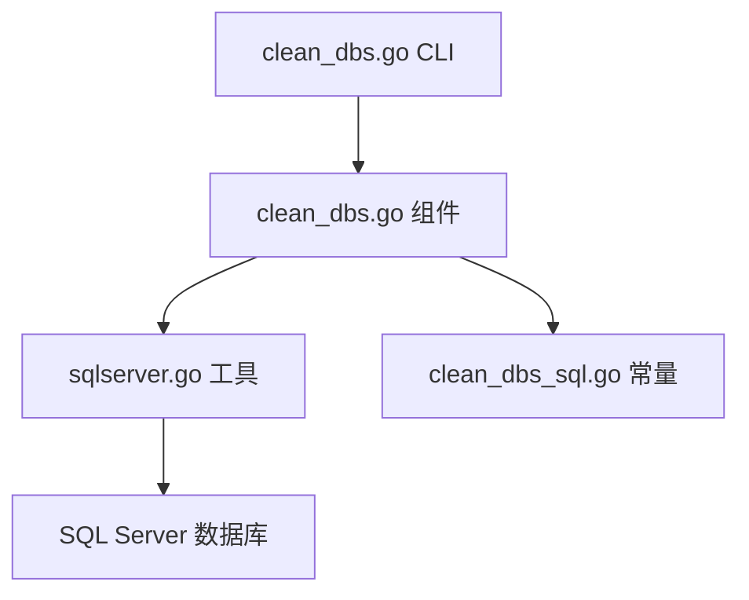
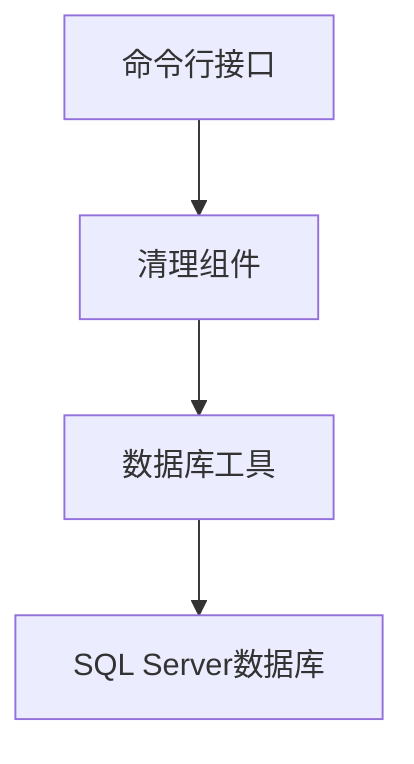
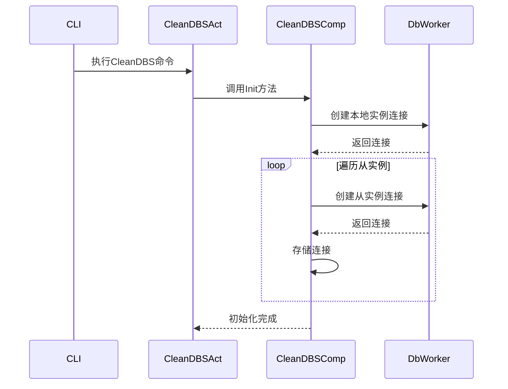
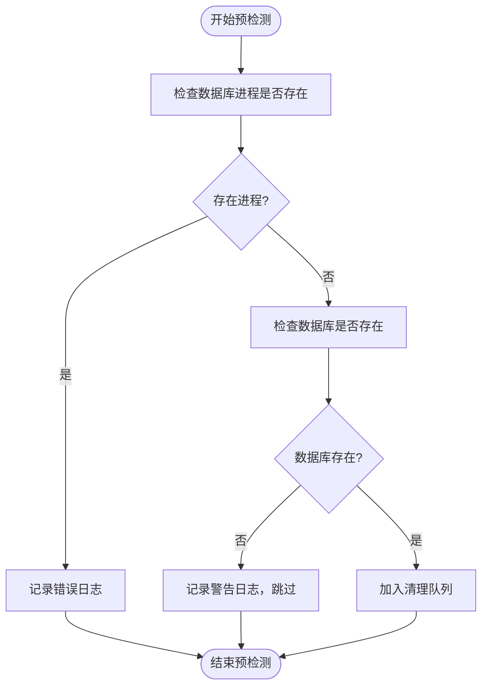
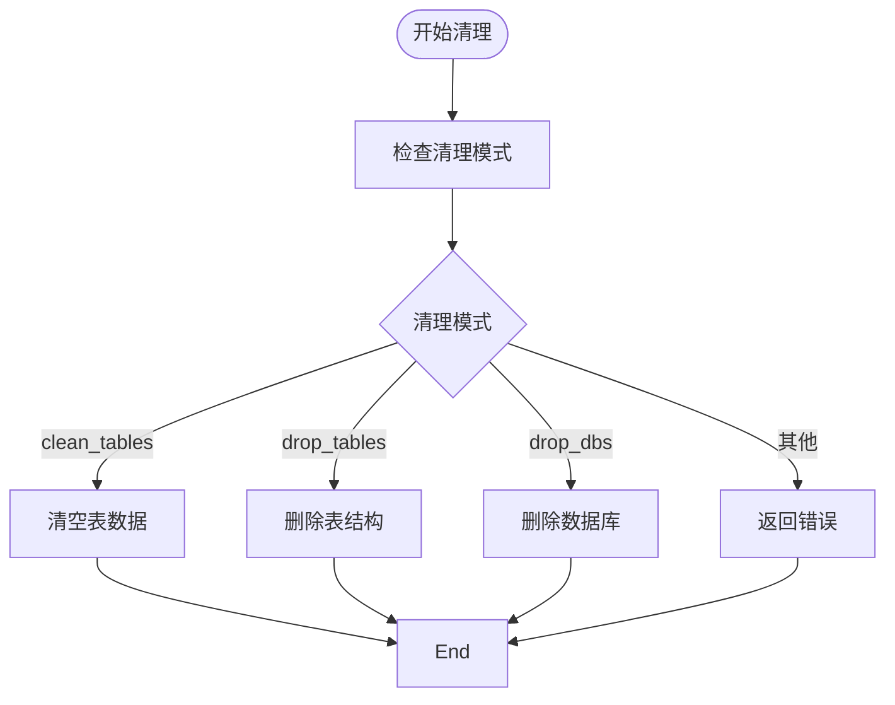
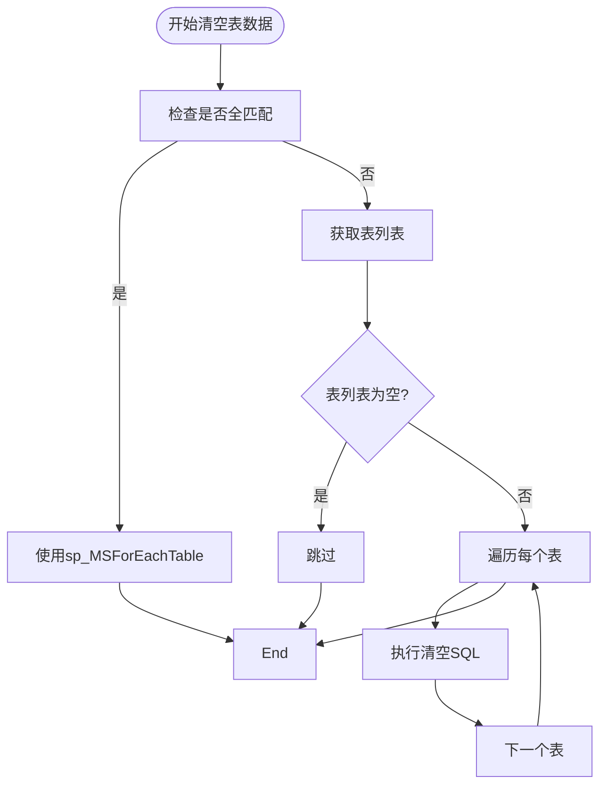
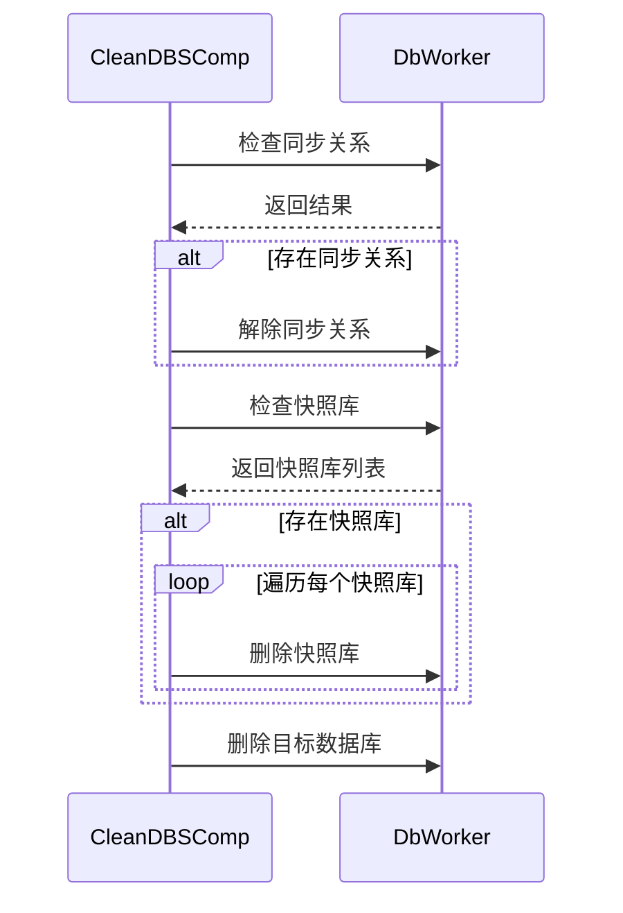
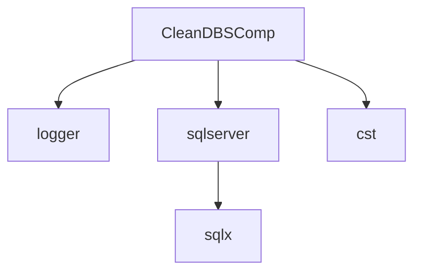

# 数据库清理机制

<cite>
**本文档引用的文件**  
- [clean_dbs.go](file://dbm-services/sqlserver/db-tools/dbactuator/internal/subcmd/sqlservercmd/clean_dbs.go)
- [clean_dbs.go](file://dbm-services/sqlserver/db-tools/dbactuator/pkg/components/sqlserver/clean_dbs.go)
- [sqlserver.go](file://dbm-services/sqlserver/db-tools/dbactuator/pkg/util/sqlserver/sqlserver.go)
- [clean_dbs_sql.go](file://dbm-services/sqlserver/db-tools/dbactuator/pkg/core/cst/clean_dbs_sql.go)
</cite>

## 目录
1. [项目结构](#项目结构)
2. [核心组件](#核心组件)
3. [架构概述](#架构概述)
4. [详细组件分析](#详细组件分析)
5. [依赖分析](#依赖分析)
6. [性能考虑](#性能考虑)
7. [故障排除指南](#故障排除指南)
8. [结论](#结论)

## 项目结构

SQL Server数据库清理机制主要由两个核心文件实现：`internal/subcmd/sqlservercmd/clean_dbs.go` 和 `pkg/components/sqlserver/clean_dbs.go`。前者是命令行接口层，负责接收参数和调用执行；后者是实际的清理逻辑实现层。此外，清理操作依赖于SQL Server工具包中的数据库连接和操作功能，这些功能定义在`pkg/util/sqlserver/sqlserver.go`中。常量和SQL语句模板则定义在`pkg/core/cst/clean_dbs_sql.go`中。

**图源**  
- [clean_dbs.go](file://dbm-services/sqlserver/db-tools/dbactuator/internal/subcmd/sqlservercmd/clean_dbs.go)
- [clean_dbs.go](file://dbm-services/sqlserver/db-tools/dbactuator/pkg/components/sqlserver/clean_dbs.go)
- [sqlserver.go](file://dbm-services/sqlserver/db-tools/dbactuator/pkg/util/sqlserver/sqlserver.go)
- [clean_dbs_sql.go](file://dbm-services/sqlserver/db-tools/dbactuator/pkg/core/cst/clean_dbs_sql.go)

**本节来源**  
- [clean_dbs.go](file://dbm-services/sqlserver/db-tools/dbactuator/internal/subcmd/sqlservercmd/clean_dbs.go)
- [clean_dbs.go](file://dbm-services/sqlserver/db-tools/dbactuator/pkg/components/sqlserver/clean_dbs.go)

## 核心组件

SQL Server数据库清理机制的核心是`CleanDBSComp`结构体，它封装了清理操作所需的所有参数和运行时上下文。该组件通过`Init`方法初始化数据库连接，通过`PerCheck`方法进行预检测，最后通过`DoCleanDBS`方法执行具体的清理逻辑。清理逻辑根据`CleanMode`参数的不同，可以执行清空表数据、删除表结构或删除整个数据库等操作。

**本节来源**  
- [clean_dbs.go](file://dbm-services/sqlserver/db-tools/dbactuator/pkg/components/sqlserver/clean_dbs.go#L23-L48)

## 架构概述

整个清理机制采用分层架构设计。最上层是命令行接口（CLI），由`CleanDBSAct`结构体实现，负责解析命令行参数并调用底层组件。中间层是清理组件层，由`CleanDBSComp`结构体实现，负责具体的业务逻辑处理。最底层是数据库操作工具层，由`DbWorker`结构体实现，提供统一的数据库连接和操作接口。这种分层设计使得代码结构清晰，职责分明，易于维护和扩展。

**图源**  
- [clean_dbs.go](file://dbm-services/sqlserver/db-tools/dbactuator/internal/subcmd/sqlservercmd/clean_dbs.go)
- [clean_dbs.go](file://dbm-services/sqlserver/db-tools/dbactuator/pkg/components/sqlserver/clean_dbs.go)
- [sqlserver.go](file://dbm-services/sqlserver/db-tools/dbactuator/pkg/util/sqlserver/sqlserver.go)

## 详细组件分析

### CleanDBSComp 组件分析

`CleanDBSComp`是清理操作的核心组件，它包含三个主要部分：通用参数`GeneralParam`、清理参数`Params`和运行时上下文`cleanDBSrunTimeCtx`。`Params`结构体定义了所有清理操作所需的参数，包括目标主机、端口、待清理的数据库列表、同步模式、清理模式等。`cleanDBSrunTimeCtx`则在运行时存储数据库连接和实际需要清理的数据库列表。

#### 初始化流程

**图源**  
- [clean_dbs.go](file://dbm-services/sqlserver/db-tools/dbactuator/pkg/components/sqlserver/clean_dbs.go#L51-L85)
- [sqlserver.go](file://dbm-services/sqlserver/db-tools/dbactuator/pkg/util/sqlserver/sqlserver.go#L87-L110)

#### 预检测流程

**图源**  
- [clean_dbs.go](file://dbm-services/sqlserver/db-tools/dbactuator/pkg/components/sqlserver/clean_dbs.go#L89-L117)

#### 清理执行流程

**图源**  
- [clean_dbs.go](file://dbm-services/sqlserver/db-tools/dbactuator/pkg/components/sqlserver/clean_dbs.go#L128-L143)

**本节来源**  
- [clean_dbs.go](file://dbm-services/sqlserver/db-tools/dbactuator/pkg/components/sqlserver/clean_dbs.go)

### 清理策略执行分析

清理策略的执行根据`CleanMode`参数的不同而有所区别。当`CleanMode`为`clean_tables`时，系统会清空指定数据库中的所有表数据，但保留表结构。当`CleanMode`为`drop_tables`时，系统会删除指定数据库中的所有表，包括表结构和数据。当`CleanMode`为`drop_dbs`时，系统会删除整个数据库。

#### 清空表数据
当使用`clean_tables`模式时，系统会根据是否全匹配来选择不同的执行策略。如果`CleanTables`参数为`["*"]`且`IgnoreCleanTables`为空，则直接使用SQL Server内置的`sp_MSForEachTable`存储过程来批量清空所有表。否则，系统会先获取需要清理的表列表，然后逐个执行清空操作。

**图源**  
- [clean_dbs.go](file://dbm-services/sqlserver/db-tools/dbactuator/pkg/components/sqlserver/clean_dbs.go#L148-L175)
- [clean_dbs_sql.go](file://dbm-services/sqlserver/db-tools/dbactuator/pkg/core/cst/clean_dbs_sql.go#L13-L20)

#### 删除数据库
当使用`drop_dbs`模式时，系统需要特别处理数据库的同步关系。对于AlwaysOn和Mirroring模式，系统需要先解除同步关系，然后才能删除数据库。此外，系统还需要检查并删除与目标数据库相关的快照库。

**图源**  
- [clean_dbs.go](file://dbm-services/sqlserver/db-tools/dbactuator/pkg/components/sqlserver/clean_dbs.go#L235-L359)

**本节来源**  
- [clean_dbs.go](file://dbm-services/sqlserver/db-tools/dbactuator/pkg/components/sqlserver/clean_dbs.go)

## 依赖分析

清理机制依赖于多个组件和外部库。核心依赖包括`dbm-services/common/go-pubpkg/logger`用于日志记录，`dbm-services/sqlserver/db-tools/dbactuator/pkg/util/sqlserver`提供数据库连接和操作功能，以及`github.com/jmoiron/sqlx`作为底层的SQL操作库。这些依赖关系确保了清理机制能够稳定地连接到SQL Server数据库并执行各种操作。

**图源**  
- [clean_dbs.go](file://dbm-services/sqlserver/db-tools/dbactuator/pkg/components/sqlserver/clean_dbs.go)
- [sqlserver.go](file://dbm-services/sqlserver/db-tools/dbactuator/pkg/util/sqlserver/sqlserver.go)

**本节来源**  
- [clean_dbs.go](file://dbm-services/sqlserver/db-tools/dbactuator/pkg/components/sqlserver/clean_dbs.go)
- [sqlserver.go](file://dbm-services/sqlserver/db-tools/dbactuator/pkg/util/sqlserver/sqlserver.go)

## 性能考虑

数据库清理操作对系统性能有显著影响，特别是在处理大型数据库时。清空表数据或删除表结构的操作会产生大量的日志记录，可能导致事务日志快速增长。删除整个数据库虽然操作简单，但需要确保没有其他进程正在使用该数据库。建议在业务低峰期执行清理操作，并监控系统资源使用情况。

## 故障排除指南

在执行数据库清理操作时，可能会遇到各种问题。常见的问题包括数据库连接失败、权限不足、数据库正在被使用等。系统通过预检测机制来提前发现这些问题，并在日志中记录详细的错误信息。如果清理操作失败，可以根据日志中的错误信息进行排查和修复。

**本节来源**  
- [clean_dbs.go](file://dbm-services/sqlserver/db-tools/dbactuator/pkg/components/sqlserver/clean_dbs.go#L93-L95)
- [clean_dbs.go](file://dbm-services/sqlserver/db-tools/dbactuator/pkg/components/sqlserver/clean_dbs.go#L277-L282)

## 结论

SQL Server数据库清理机制是一个功能完整、设计合理的系统，能够安全有效地清理数据库中的数据和结构。通过分层架构设计和详细的预检测机制，系统能够在执行清理操作前发现潜在问题，确保操作的安全性。同时，系统支持多种清理模式和同步模式，能够满足不同场景下的需求。