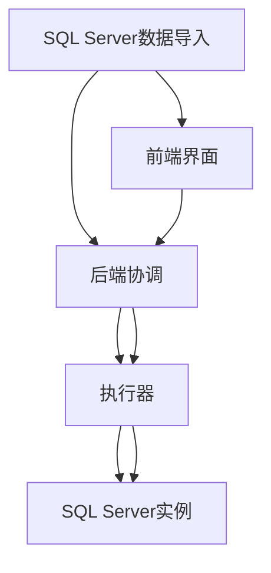
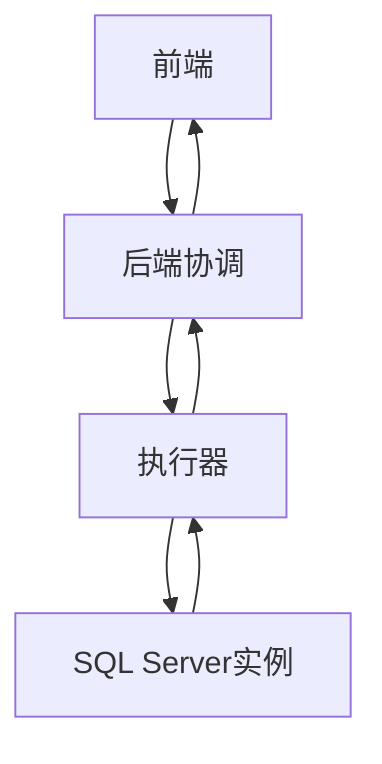
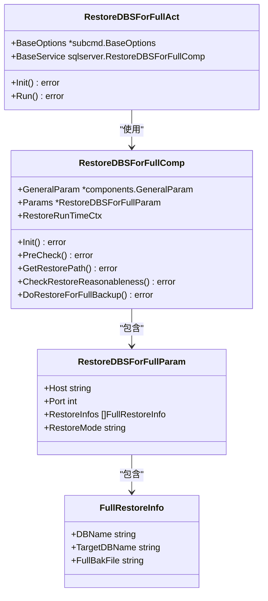
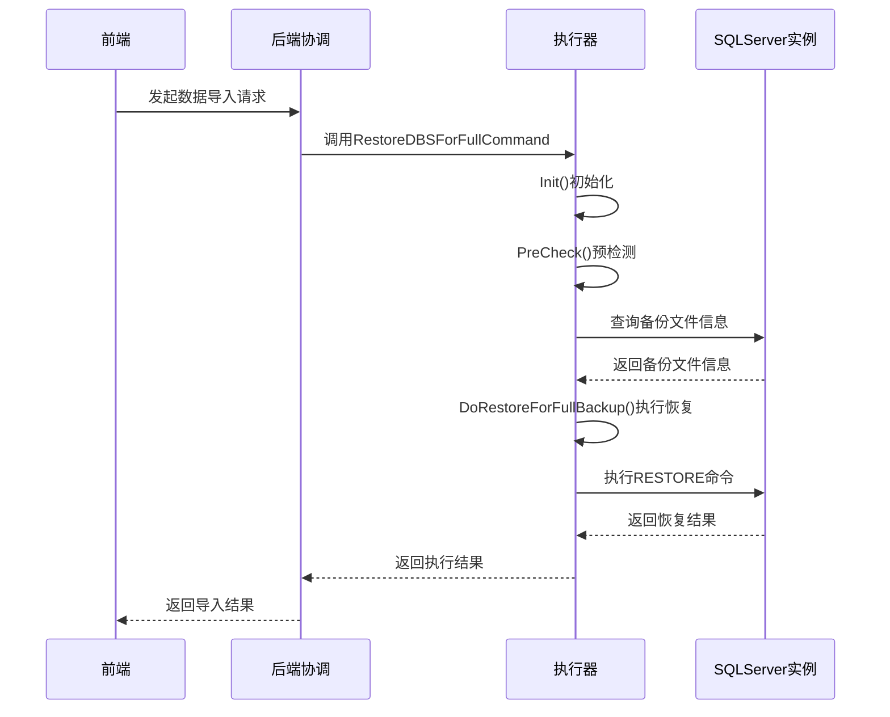
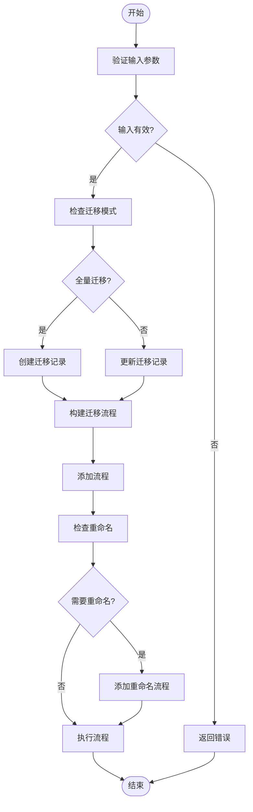
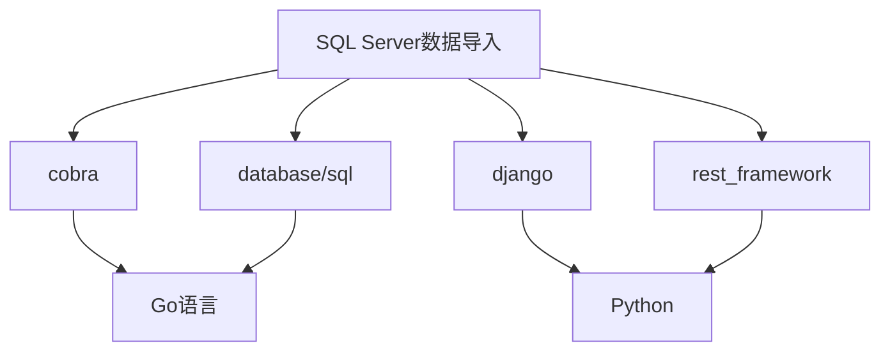

# SQL Server数据导入功能

<cite>
**本文档引用的文件**  
- [restore_dbs_full_backup.go](file://dbm-services/sqlserver/db-tools/dbactuator/internal/subcmd/sqlservercmd/restore_dbs_full_backup.go)
- [restore_dbs_full_backup.go](file://dbm-services/sqlserver/db-tools/dbactuator/pkg/components/sqlserver/restore_dbs_full_backup.go)
- [sqlserver_data_migrate.py](file://dbm-ui/backend/ticket/builders/sqlserver/sqlserver_data_migrate.py)
- [sqlserver_dts.py](file://dbm-ui/backend/flow/engine/bamboo/scene/sqlserver/sqlserver_dts.py)
- [sqlserver_db_construct.py](file://dbm-ui/backend/flow/engine/bamboo/scene/sqlserver/sqlserver_db_construct.py)
- [sqlserver_sql_execute.py](file://dbm-ui/backend/flow/engine/bamboo/scene/sqlserver/sqlserver_sql_execute.py)
- [monitor_dbm.sql](file://dbm-services/sqlserver/db-tools/dbactuator/pkg/core/staticembed/monitor_dbm.sql)
- [monitor_dbm_v2.sql](file://dbm-services/sqlserver/db-tools/dbactuator/pkg/core/staticembed/monitor_dbm_v2.sql)
</cite>

## 目录
1. [简介](#简介)
2. [项目结构](#项目结构)
3. [核心组件](#核心组件)
4. [架构概述](#架构概述)
5. [详细组件分析](#详细组件分析)
6. [依赖分析](#依赖分析)
7. [性能考虑](#性能考虑)
8. [故障排除指南](#故障排除指南)
9. [结论](#结论)

## 简介
本文档详细阐述了SQL Server数据导入功能的实现，重点分析`restore_dbs_full_backup.go`中的完整备份恢复流程，包括备份文件解析、数据库重建和数据加载过程。同时解释`db_services/sqlserver/data_migrate/import.py`如何协调导入操作。通过流程图展示从备份文件到数据库实例的完整恢复路径，讨论导入过程中的事务管理、错误回滚机制和性能优化策略。

## 项目结构
项目结构清晰地展示了SQL Server数据导入功能的实现路径。主要涉及`dbm-services/sqlserver/db-tools/dbactuator`目录下的Go语言实现和`dbm-ui/backend`目录下的Python协调逻辑。

**图表来源**  
- [sqlserver_data_migrate.py](file://dbm-ui/backend/ticket/builders/sqlserver/sqlserver_data_migrate.py)
- [restore_dbs_full_backup.go](file://dbm-services/sqlserver/db-tools/dbactuator/internal/subcmd/sqlservercmd/restore_dbs_full_backup.go)

**章节来源**  
- [sqlserver_data_migrate.py](file://dbm-ui/backend/ticket/builders/sqlserver/sqlserver_data_migrate.py)
- [restore_dbs_full_backup.go](file://dbm-services/sqlserver/db-tools/dbactuator/internal/subcmd/sqlservercmd/restore_dbs_full_backup.go)

## 核心组件
核心组件包括`restore_dbs_full_backup.go`中的完整备份恢复流程和`sqlserver_data_migrate.py`中的迁移协调逻辑。这些组件共同实现了SQL Server数据的导入功能。

**章节来源**  
- [restore_dbs_full_backup.go](file://dbm-services/sqlserver/db-tools/dbactuator/internal/subcmd/sqlservercmd/restore_dbs_full_backup.go)
- [sqlserver_data_migrate.py](file://dbm-ui/backend/ticket/builders/sqlserver/sqlserver_data_migrate.py)

## 架构概述
SQL Server数据导入功能的架构分为前端、后端协调和执行器三层。前端负责用户交互，后端协调负责流程控制，执行器负责具体操作。

**图表来源**  
- [sqlserver_data_migrate.py](file://dbm-ui/backend/ticket/builders/sqlserver/sqlserver_data_migrate.py)
- [restore_dbs_full_backup.go](file://dbm-services/sqlserver/db-tools/dbactuator/internal/subcmd/sqlservercmd/restore_dbs_full_backup.go)

## 详细组件分析

### 完整备份恢复流程分析
`restore_dbs_full_backup.go`实现了完整的备份恢复流程，包括预检测、恢复全量备份文件等步骤。

#### 对象导向组件：

**图表来源**  
- [restore_dbs_full_backup.go](file://dbm-services/sqlserver/db-tools/dbactuator/internal/subcmd/sqlservercmd/restore_dbs_full_backup.go)
- [restore_dbs_full_backup.go](file://dbm-services/sqlserver/db-tools/dbactuator/pkg/components/sqlserver/restore_dbs_full_backup.go)

#### API/服务组件：

**图表来源**  
- [restore_dbs_full_backup.go](file://dbm-services/sqlserver/db-tools/dbactuator/internal/subcmd/sqlservercmd/restore_dbs_full_backup.go)
- [sqlserver_dts.py](file://dbm-ui/backend/flow/engine/bamboo/scene/sqlserver/sqlserver_dts.py)

### 数据迁移协调分析
`sqlserver_data_migrate.py`负责协调数据迁移流程，包括创建迁移记录、更新迁移状态等。

#### 复杂逻辑组件：

**图表来源**  
- [sqlserver_data_migrate.py](file://dbm-ui/backend/ticket/builders/sqlserver/sqlserver_data_migrate.py)
- [sqlserver_db_construct.py](file://dbm-ui/backend/flow/engine/bamboo/scene/sqlserver/sqlserver_db_construct.py)

**章节来源**  
- [sqlserver_data_migrate.py](file://dbm-ui/backend/ticket/builders/sqlserver/sqlserver_data_migrate.py)
- [sqlserver_db_construct.py](file://dbm-ui/backend/flow/engine/bamboo/scene/sqlserver/sqlserver_db_construct.py)

## 依赖分析
SQL Server数据导入功能依赖于多个组件和库，包括Go语言的`cobra`库、`database/sql`库，以及Python的`django`框架。

**图表来源**  
- [restore_dbs_full_backup.go](file://dbm-services/sqlserver/db-tools/dbactuator/internal/subcmd/sqlservercmd/restore_dbs_full_backup.go)
- [sqlserver_data_migrate.py](file://dbm-ui/backend/ticket/builders/sqlserver/sqlserver_data_migrate.py)

**章节来源**  
- [restore_dbs_full_backup.go](file://dbm-services/sqlserver/db-tools/dbactuator/internal/subcmd/sqlservercmd/restore_dbs_full_backup.go)
- [sqlserver_data_migrate.py](file://dbm-ui/backend/ticket/builders/sqlserver/sqlserver_data_migrate.py)

## 性能考虑
在SQL Server数据导入过程中，性能优化策略包括使用并行处理、优化SQL查询、合理分配资源等。同时，通过设置合理的超时时间，避免长时间等待。

## 故障排除指南
在数据导入过程中，可能遇到备份文件不存在、数据库版本不兼容等问题。通过详细的日志记录和错误提示，可以快速定位和解决问题。

**章节来源**  
- [restore_dbs_full_backup.go](file://dbm-services/sqlserver/db-tools/dbactuator/pkg/components/sqlserver/restore_dbs_full_backup.go)
- [sqlserver_data_migrate.py](file://dbm-ui/backend/ticket/builders/sqlserver/sqlserver_data_migrate.py)

## 结论
SQL Server数据导入功能通过`restore_dbs_full_backup.go`和`sqlserver_data_migrate.py`的协同工作，实现了高效、可靠的数据导入。通过详细的流程控制和错误处理，确保了数据导入的完整性和一致性。