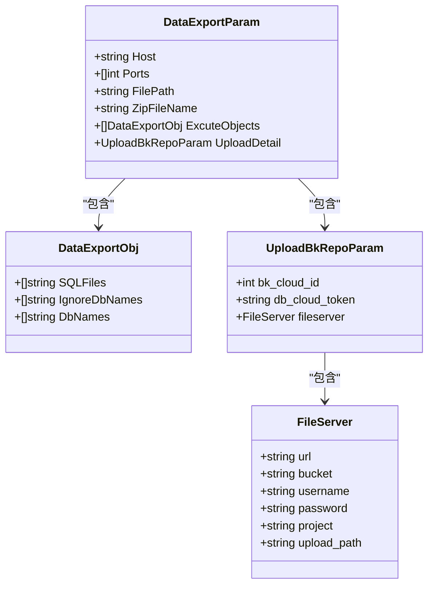
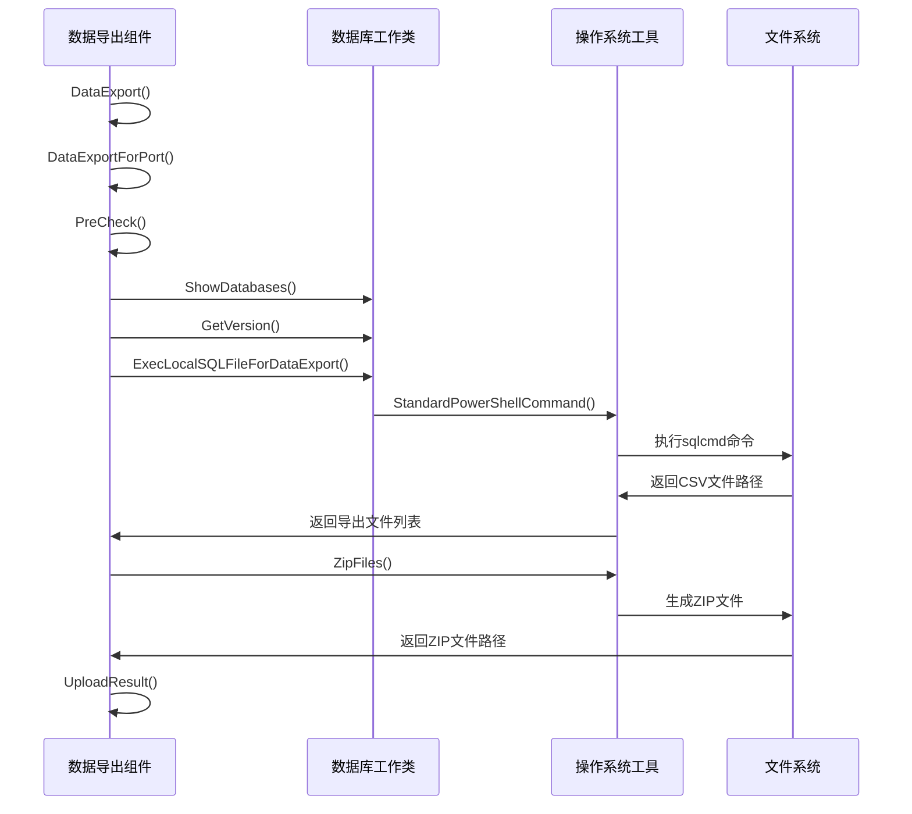
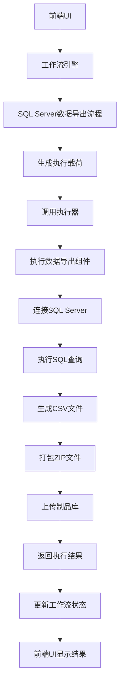
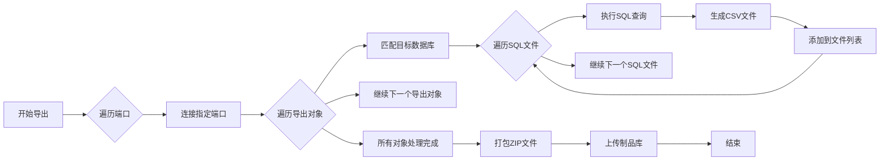

# SQL Server数据导出功能

<cite>
**本文档引用的文件**   
- [data_export.go](file://dbm-services/sqlserver/db-tools/dbactuator/pkg/components/sqlserver/data_export.go)
- [sqlserver.go](file://dbm-services/sqlserver/db-tools/dbactuator/pkg/util/sqlserver/sqlserver.go)
- [osutil.go](file://dbm-services/sqlserver/db-tools/dbactuator/pkg/util/osutil/osutil.go)
- [sqlserver_data_export.py](file://dbm-ui/backend/flow/engine/bamboo/scene/sqlserver/sqlserver_data_export.py)
- [sqlserver_act_payload.py](file://dbm-ui/backend/flow/utils/sqlserver/sqlserver_act_payload.py)
</cite>

## 目录
1. [简介](#简介)
2. [核心组件分析](#核心组件分析)
3. [导出参数配置](#导出参数配置)
4. [数据序列化与文件生成](#数据序列化与文件生成)
5. [后端工具协同工作流程](#后端工具协同工作流程)
6. [调用方式示例](#调用方式示例)
7. [大容量数据导出优化](#大容量数据导出优化)
8. [编码问题与解决方案](#编码问题与解决方案)

## 简介
SQL Server数据导出功能是蓝鲸智云DB管理系统中的重要特性，用于将数据库中的数据导出为CSV格式文件并打包为ZIP文件。该功能通过后端执行器与前端工作流协同工作，支持灵活的导出配置和自动化处理流程。

## 核心组件分析

SQL Server数据导出功能主要由以下几个核心组件构成：

- **DataExportComp**: 数据导出主组件，负责协调整个导出流程
- **DataExportParam**: 导出参数配置结构体，定义导出所需的各种参数
- **DbWorker**: 数据库操作工作类，负责与SQL Server数据库的交互
- **ExecLocalSQLFileForDataExport**: 本地SQL文件执行函数，负责执行导出操作

**Section sources**
- [data_export.go](file://dbm-services/sqlserver/db-tools/dbactuator/pkg/components/sqlserver/data_export.go#L27-L32)
- [sqlserver.go](file://dbm-services/sqlserver/db-tools/dbactuator/pkg/util/sqlserver/sqlserver.go#L32-L38)

## 导出参数配置

数据导出功能通过`DataExportParam`结构体进行参数配置，主要包含以下配置项：



**Diagram sources**
- [data_export.go](file://dbm-services/sqlserver/db-tools/dbactuator/pkg/components/sqlserver/data_export.go#L35-L42)
- [sqlserver_act_payload.py](file://dbm-ui/backend/flow/utils/sqlserver/sqlserver_act_payload.py#L762-L771)

### 参数说明

| 参数名称 | 类型 | 说明 |
|--------|-----|------|
| Host | string | SQL Server实例的主机地址 |
| Ports | []int | 需要导出数据的端口列表 |
| FilePath | string | SQL文件和导出文件的存储路径 |
| ZipFileName | string | 最终生成的ZIP文件名称 |
| ExcuteObjects | []DataExportObj | 导出对象配置，包含SQL文件、目标数据库等信息 |
| UploadDetail | UploadBkRepoParam | 制品库上传配置 |

**Section sources**
- [data_export.go](file://dbm-services/sqlserver/db-tools/dbactuator/pkg/components/sqlserver/data_export.go#L35-L42)

## 数据序列化与文件生成

数据导出过程中的序列化和文件生成主要通过以下步骤完成：



**Diagram sources**
- [data_export.go](file://dbm-services/sqlserver/db-tools/dbactuator/pkg/components/sqlserver/data_export.go#L189-L196)
- [sqlserver.go](file://dbm-services/sqlserver/db-tools/dbactuator/pkg/util/sqlserver/sqlserver.go#L632-L659)
- [osutil.go](file://dbm-services/sqlserver/db-tools/dbactuator/pkg/util/osutil/osutil.go#L217-L234)

### 数据序列化流程

1. **预检查阶段**：连接数据库，获取版本信息，验证实例状态
2. **数据库匹配**：根据配置的数据库名称模式匹配实际存在的数据库
3. **SQL文件执行**：调用本地sqlcmd工具执行SQL查询并将结果导出为CSV
4. **文件打包**：将生成的CSV文件打包为ZIP格式
5. **结果上传**：将ZIP文件上传至制品库

**Section sources**
- [data_export.go](file://dbm-services/sqlserver/db-tools/dbactuator/pkg/components/sqlserver/data_export.go#L81-L184)

## 后端工具协同工作流程

SQL Server数据导出功能涉及多个后端组件的协同工作，包括前端工作流、执行器和数据库工具。



**Diagram sources**
- [sqlserver_data_export.py](file://dbm-ui/backend/flow/engine/bamboo/scene/sqlserver/sqlserver_data_export.py#L93-L121)
- [sqlserver_act_payload.py](file://dbm-ui/backend/flow/utils/sqlserver/sqlserver_act_payload.py#L733-L776)

### 协同工作细节

1. **工作流触发**：用户在前端界面发起数据导出请求
2. **载荷生成**：工作流引擎调用`get_data_export_payload`生成执行载荷
3. **执行调度**：通过`SqlserverActuatorScriptComponent`组件调度执行器
4. **参数传递**：将业务参数转换为执行器可识别的格式
5. **结果处理**：执行完成后更新工作流状态并返回结果

**Section sources**
- [sqlserver_data_export.py](file://dbm-ui/backend/flow/engine/bamboo/scene/sqlserver/sqlserver_data_export.py#L93-L121)
- [sqlserver_act_payload.py](file://dbm-ui/backend/flow/utils/sqlserver/sqlserver_act_payload.py#L733-L776)

## 调用方式示例

以下是SQL Server数据导出功能的典型调用方式：

```mermaid
classDiagram
class DataExportComp {
+Example() interface{}
+PreCheck() error
+DataExportForPort(port int) error
+DataExport() error
+UploadResult() error
}
class DataExportParam {
+Host string
+Ports []int
+FilePath string
+ZipFileName string
+ExcuteObjects []DataExportObj
+UploadDetail UploadBkRepoParam
}
class DataExportObj {
+SQLFiles []string
+IgnoreDbNames []string
+DbNames []string
}
DataExportComp --> DataExportParam : "使用"
DataExportParam --> DataExportObj : "包含"
```

**Diagram sources**
- [data_export.go](file://dbm-services/sqlserver/db-tools/dbactuator/pkg/components/sqlserver/data_export.go#L60-L77)

### 示例代码

```go
// 创建数据导出组件实例
exportComp := &DataExportComp{
    GeneralParam: &components.GeneralParam{
        RuntimeAccountParam: &components.RuntimeAccountParam{
            DRSDataReadUser: "export_user",
            DRSDataReadPwd:  "export_password",
        },
    },
    Params: &DataExportParam{
        Host:        "192.168.1.100",
        Ports:       []int{1433},
        FilePath:    "C:\\export\\",
        ZipFileName: "export_data.zip",
        ExcuteObjects: []DataExportObj{
            {
                SQLFiles:      []string{"query1.sql", "query2.sql"},
                DbNames:       []string{"database1", "database2"},
                IgnoreDbNames: []string{"tempdb"},
            },
        },
        UploadDetail: osutil.UploadBkRepoParam{
            bk_cloud_id:   1,
            db_cloud_token: "token_value",
            fileserver: osutil.FileServer{
                url:      "https://bkrepo.example.com",
                bucket:   "sqlserver-export",
                project:  "dbm",
                upload_path: "/export/data",
            },
        },
    },
}

// 执行数据导出
if err := exportComp.PreCheck(); err != nil {
    log.Error("预检查失败: %v", err)
    return err
}

if err := exportComp.DataExport(); err != nil {
    log.Error("数据导出失败: %v", err)
    return err
}

if err := exportComp.UploadResult(); err != nil {
    log.Error("结果上传失败: %v", err)
    return err
}
```

**Section sources**
- [data_export.go](file://dbm-services/sqlserver/db-tools/dbactuator/pkg/components/sqlserver/data_export.go#L60-L77)

## 大容量数据导出优化

针对大容量数据导出，系统实现了多项优化策略以提高性能和稳定性。

### 分页处理机制

虽然当前实现中没有显式的分页处理，但通过以下方式优化大容量数据导出：

1. **批量处理**：按端口和数据库分批处理，避免单次处理过多数据
2. **内存控制**：使用流式处理方式，避免将全部数据加载到内存
3. **资源隔离**：每个导出任务在独立的工作目录中执行，避免资源冲突



**Diagram sources**
- [data_export.go](file://dbm-services/sqlserver/db-tools/dbactuator/pkg/components/sqlserver/data_export.go#L190-L195)

### 内存优化策略

1. **临时文件存储**：导出的CSV文件直接写入磁盘，避免内存占用
2. **连接池管理**：复用数据库连接，减少连接开销
3. **资源及时释放**：使用defer语句确保资源及时释放
4. **日志级别控制**：在生产环境中调整日志级别，减少I/O开销

**Section sources**
- [data_export.go](file://dbm-services/sqlserver/db-tools/dbactuator/pkg/components/sqlserver/data_export.go#L153-L174)

## 编码问题与解决方案

在SQL Server数据导出过程中，编码问题是需要特别关注的重要方面。

### 编码配置

系统通过以下方式处理编码问题：

1. **默认编码设置**：在`CSVExportOptions`结构体中定义默认编码为UTF-8
2. **命令行参数**：在执行sqlcmd时指定编码参数
3. **文件输出**：使用UTF8编码保存CSV文件

```go
// 在sqlserver.go中定义的导出选项
type CSVExportOptions struct {
    FileName   string // 文件名
    Directory  string // 导出目录
    WithHeader bool   // 是否包含表头
    Encoding   string // 文件编码
    AutoName   bool   // 是否自动生成文件名
}

func DefaultExportOptions() *CSVExportOptions {
    return &CSVExportOptions{
        WithHeader: true,
        Encoding:   "utf-8",
        AutoName:   true,
        Directory:  "./exports",
    }
}
```

### 常见编码问题及解决方案

| 问题现象 | 可能原因 | 解决方案 |
|--------|---------|---------|
| 中文乱码 | 客户端编码与服务器编码不匹配 | 确保sqlcmd命令中指定正确的编码 |
| 特殊字符丢失 | 字符集转换问题 | 使用UTF-8编码进行数据导出 |
| 文件打开异常 | BOM头缺失 | 在CSV文件开头添加UTF-8 BOM头 |
| 数据截断 | 字段长度超过限制 | 检查目标列的数据类型和长度 |

### SQLCMD命令中的编码处理

在`ExecLocalSQLFileForDataExport`函数中，通过以下方式处理编码：

```go
cmd := fmt.Sprintf(
    "& '%s' -S '127.0.0.1,%d' -C -I -d %s -f %d -b -i %s -U '%s' -P '%s' -s ',' -W | Out-File -FilePath '%s' -Encoding UTF8",
    cmdSql, port, dbName, 936, filename, userName, pwd, outPutFile,
)
```

其中：
- `-f 936` 指定输入文件的代码页为GBK
- `Out-File -Encoding UTF8` 指定输出文件编码为UTF-8

**Section sources**
- [sqlserver.go](file://dbm-services/sqlserver/db-tools/dbactuator/pkg/util/sqlserver/sqlserver.go#L68-L83)
- [sqlserver.go](file://dbm-services/sqlserver/db-tools/dbactuator/pkg/util/sqlserver/sqlserver.go#L646-L648)