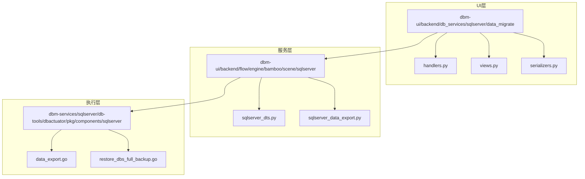
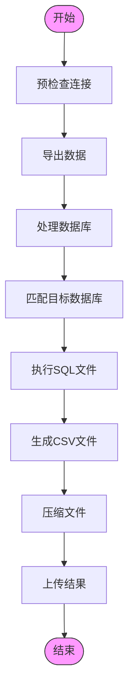
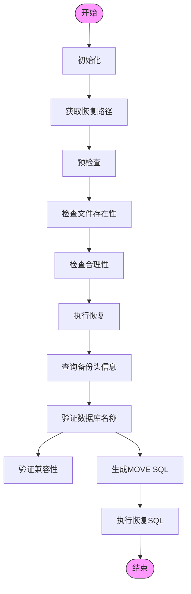
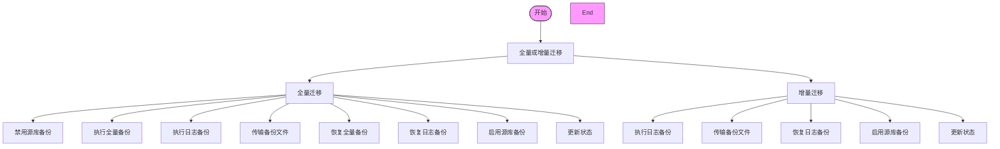
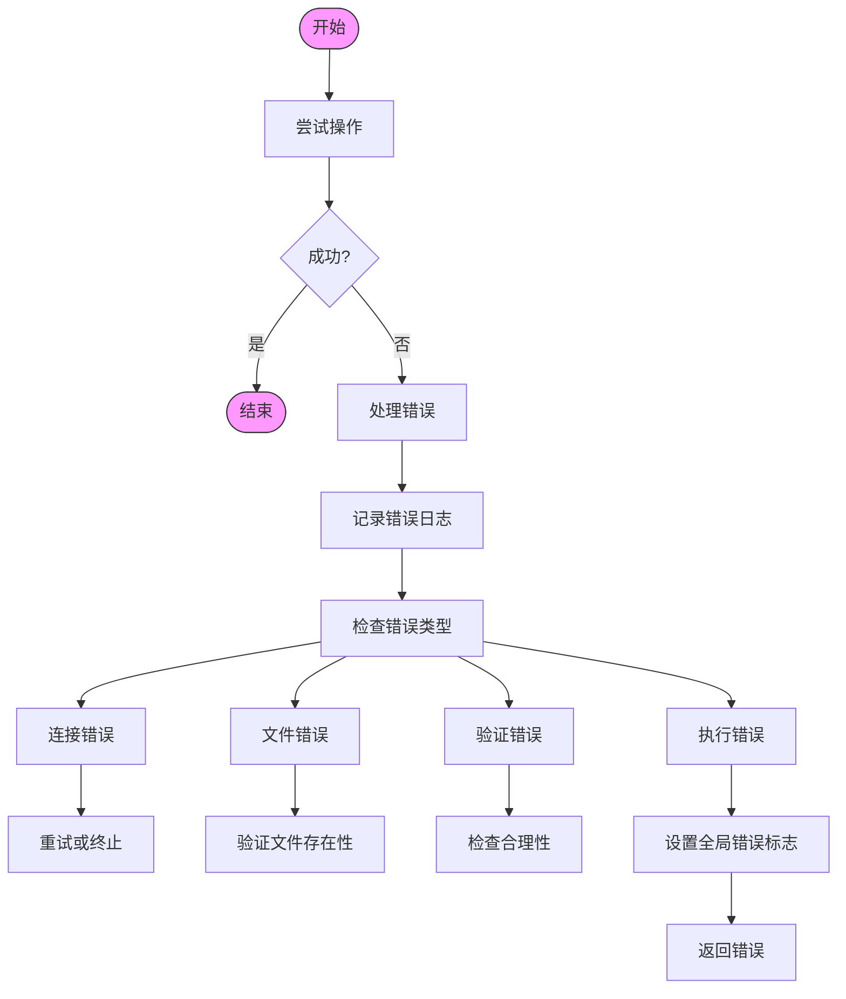

# SQL Server数据迁移模块

<cite>
**本文档引用的文件**
- [data_export.go](file://dbm-services/sqlserver/db-tools/dbactuator/pkg/components/sqlserver/data_export.go)
- [restore_dbs_full_backup.go](file://dbm-services/sqlserver/db-tools/dbactuator/pkg/components/sqlserver/restore_dbs_full_backup.go)
- [sqlserver_dts.py](file://dbm-ui/backend/flow/engine/bamboo/scene/sqlserver/sqlserver_dts.py)
- [sqlserver_data_export.py](file://dbm-ui/backend/flow/engine/bamboo/scene/sqlserver/sqlserver_data_export.py)
- [handlers.py](file://dbm-ui/backend/db_services/sqlserver/data_migrate/handlers.py)
- [views.py](file://dbm-ui/backend/db_services/sqlserver/data_migrate/views.py)
</cite>

## 目录
1. [项目结构](#项目结构)
2. [核心组件](#核心组件)
3. [数据导出逻辑](#数据导出逻辑)
4. [完整备份恢复流程](#完整备份恢复流程)
5. [数据迁移流程](#数据迁移流程)
6. [性能优化策略](#性能优化策略)
7. [错误处理机制](#错误处理机制)

## 项目结构

SQL Server数据迁移功能主要分布在两个核心目录中：`dbm-services/sqlserver/db-tools/dbactuator` 和 `dbm-ui/backend/db_services/sqlserver/data_migrate`。前者包含底层执行组件，后者提供上层API接口和业务逻辑处理。

**图源**
- [handlers.py](file://dbm-ui/backend/db_services/sqlserver/data_migrate/handlers.py)
- [sqlserver_dts.py](file://dbm-ui/backend/flow/engine/bamboo/scene/sqlserver/sqlserver_dts.py)
- [data_export.go](file://dbm-services/sqlserver/db-tools/dbactuator/pkg/components/sqlserver/data_export.go)

## 核心组件

SQL Server数据迁移功能由多个核心组件构成，包括数据导出组件、完整备份恢复组件、数据迁移服务流程等。这些组件协同工作，实现了从源数据库导出到目标数据库恢复的完整数据迁移路径。

**组件源**
- [data_export.go](file://dbm-services/sqlserver/db-tools/dbactuator/pkg/components/sqlserver/data_export.go#L27-L208)
- [restore_dbs_full_backup.go](file://dbm-services/sqlserver/db-tools/dbactuator/pkg/components/sqlserver/restore_dbs_full_backup.go#L27-L306)
- [sqlserver_dts.py](file://dbm-ui/backend/flow/engine/bamboo/scene/sqlserver/sqlserver_dts.py#L61-L600)

## 数据导出逻辑

数据导出功能由`DataExportComp`结构体实现，主要包含预检查、数据导出和结果上传三个阶段。

**图源**
- [data_export.go](file://dbm-services/sqlserver/db-tools/dbactuator/pkg/components/sqlserver/data_export.go#L79-L197)

### 预检查阶段

在数据导出前，系统会进行预检查，确保所有端口的数据库连接正常，并获取数据库版本信息。`PreCheck`方法会为每个端口创建数据库连接，并存储在`DbConns`映射中。

### 数据导出阶段

`DataExportForPort`方法负责实际的数据导出操作。它会：
1. 获取实例的数据库列表
2. 根据配置的数据库名称和忽略列表，确定需要导出的目标数据库
3. 遍历每个SQL文件，在目标数据库上执行并生成CSV文件
4. 将所有CSV文件压缩成ZIP包

### 结果上传阶段

`UploadResult`方法负责将生成的ZIP文件上传到制品库。它使用`UploadBkRepoParam`参数配置上传细节，并调用`Upload`方法完成上传。

**组件源**
- [data_export.go](file://dbm-services/sqlserver/db-tools/dbactuator/pkg/components/sqlserver/data_export.go#L79-L207)

## 完整备份恢复流程

完整备份恢复功能由`RestoreDBSForFullComp`结构体实现，包含初始化、预检查和恢复执行三个主要阶段。

**图源**
- [restore_dbs_full_backup.go](file://dbm-services/sqlserver/db-tools/dbactuator/pkg/components/sqlserver/restore_dbs_full_backup.go#L81-L305)

### 初始化阶段

`Init`方法负责初始化恢复环境，包括：
- 建立到目标数据库的连接
- 获取SQL Server版本信息
- 设置恢复模式（默认为RECOVERY）
- 获取恢复路径

### 预检查阶段

`PreCheck`方法执行恢复前的必要检查：
- 验证恢复文件组是否为空
- 检查每个备份文件的本地存在性
- 调用`CheckRestoreReasonableness`方法验证备份文件的合理性

### 恢复执行阶段

`DoRestoreForFullBackup`方法执行实际的恢复操作：
1. 查询备份文件的文件列表信息
2. 验证备份文件与目标数据库的匹配性
3. 生成MOVE SQL语句，将逻辑文件名映射到新的物理文件路径
4. 执行完整的恢复SQL命令

**组件源**
- [restore_dbs_full_backup.go](file://dbm-services/sqlserver/db-tools/dbactuator/pkg/components/sqlserver/restore_dbs_full_backup.go#L81-L305)

## 数据迁移流程

数据迁移流程由`SqlserverDTSFlow`类实现，支持全量迁移和增量迁移两种模式。

**图源**
- [sqlserver_dts.py](file://dbm-ui/backend/flow/engine/bamboo/scene/sqlserver/sqlserver_dts.py#L96-L411)

### 全量迁移流程

`full_dts_flow_v2`方法定义了全量数据迁移的完整流程：
1. 创建临时账号用于迁移操作
2. 禁用源集群的例行备份
3. 在源集群执行全量备份和日志备份
4. 将备份文件传输到目标集群
5. 在目标集群恢复全量和日志备份
6. 重新启用源集群的例行备份
7. 更新迁移记录状态

### 增量迁移流程

`incr_dts_flow_v2`方法定义了增量数据迁移的流程：
1. 创建临时账号
2. 在源集群执行日志备份
3. 传输日志备份文件到目标集群
4. 在目标集群恢复日志备份
5. 根据是否为最后一次迁移，决定是否重新启用源集群的例行备份
6. 更新迁移记录状态

**组件源**
- [sqlserver_dts.py](file://dbm-ui/backend/flow/engine/bamboo/scene/sqlserver/sqlserver_dts.py#L96-L411)

## 性能优化策略

SQL Server数据迁移功能采用了多种性能优化策略：

1. **并行处理**：主流程使用`add_parallel_sub_pipeline`方法并发执行多个子流程，提高整体执行效率。

2. **文件传输优化**：当源和目标在同一台机器上时，直接使用备份目录作为恢复目录，避免不必要的文件传输。

3. **批量操作**：在数据导出时，将多个CSV文件一次性压缩成ZIP包，减少I/O操作次数。

4. **连接复用**：在预检查阶段建立数据库连接并复用，避免重复连接开销。

5. **超时设置**：为长时间运行的任务设置合理的超时时间（如`DBM_SQLSERVER_JOB_LONG_TIMEOUT`），避免任务无限期等待。

**组件源**
- [sqlserver_dts.py](file://dbm-ui/backend/flow/engine/bamboo/scene/sqlserver/sqlserver_dts.py#L114-L268)
- [data_export.go](file://dbm-services/sqlserver/db-tools/dbactuator/pkg/components/sqlserver/data_export.go#L180-L183)

## 错误处理机制

系统实现了完善的错误处理机制，确保数据迁移过程的可靠性和可恢复性。

**图源**
- [data_export.go](file://dbm-services/sqlserver/db-tools/dbactuator/pkg/components/sqlserver/data_export.go#L81-L117)
- [restore_dbs_full_backup.go](file://dbm-services/sqlserver/db-tools/dbactuator/pkg/components/sqlserver/restore_dbs_full_backup.go#L116-L143)

### 连接错误处理

在`PreCheck`方法中，系统会为每个端口尝试建立数据库连接。如果连接失败，会立即返回错误，避免后续无效操作。

### 文件错误处理

在恢复前，系统会检查每个备份文件的本地存在性。如果文件不存在，会记录错误并聚合输出，便于用户一次性了解所有问题。

### 验证错误处理

系统会验证备份文件的合理性，包括：
- 备份文件是否属于指定的数据库
- 备份文件的兼容性级别是否支持在当前数据库系统中恢复

### 执行错误处理

在恢复过程中，系统使用`isGlobalErr`和`isErr`标志来跟踪错误状态。如果某个数据库的恢复失败，会跳过该数据库的后续操作，但继续尝试其他数据库的恢复。

**组件源**
- [data_export.go](file://dbm-services/sqlserver/db-tools/dbactuator/pkg/components/sqlserver/data_export.go#L81-L117)
- [restore_dbs_full_backup.go](file://dbm-services/sqlserver/db-tools/dbactuator/pkg/components/sqlserver/restore_dbs_full_backup.go#L116-L143)