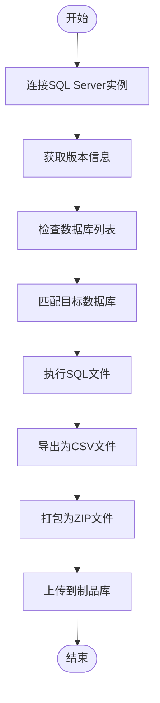
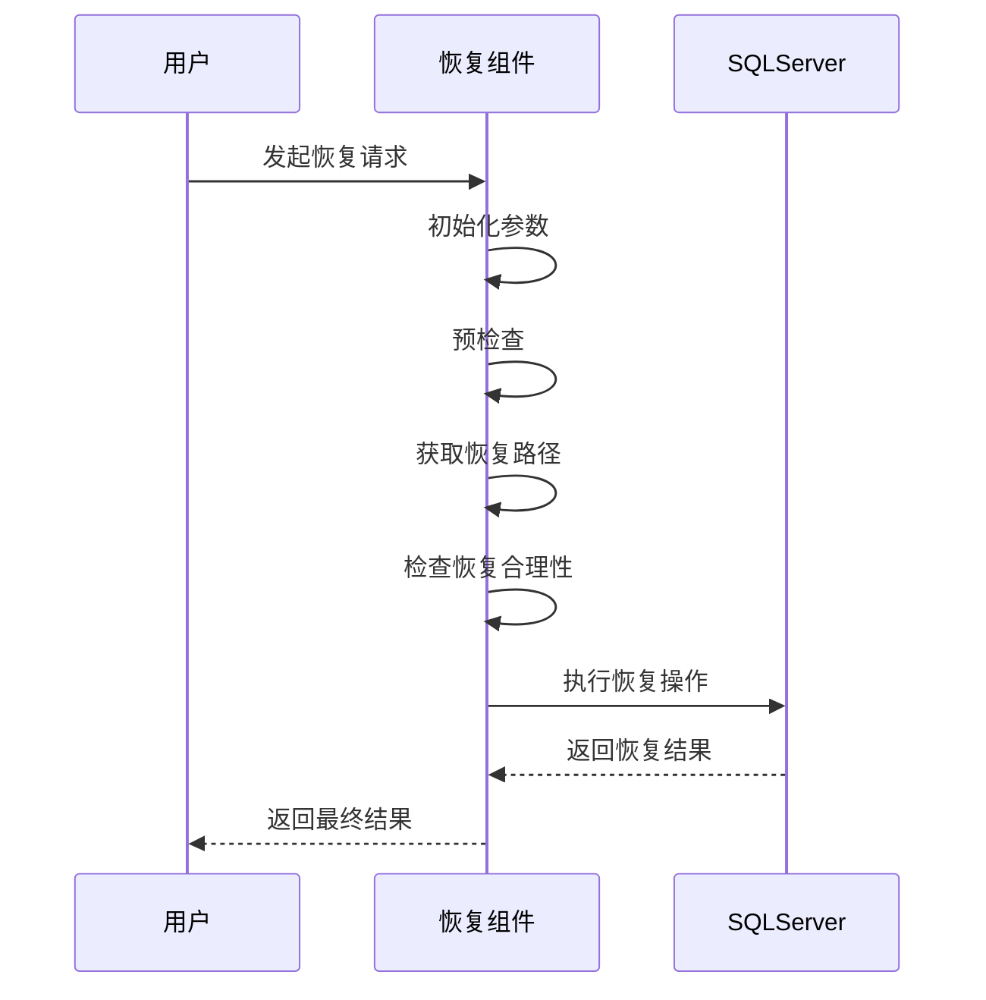
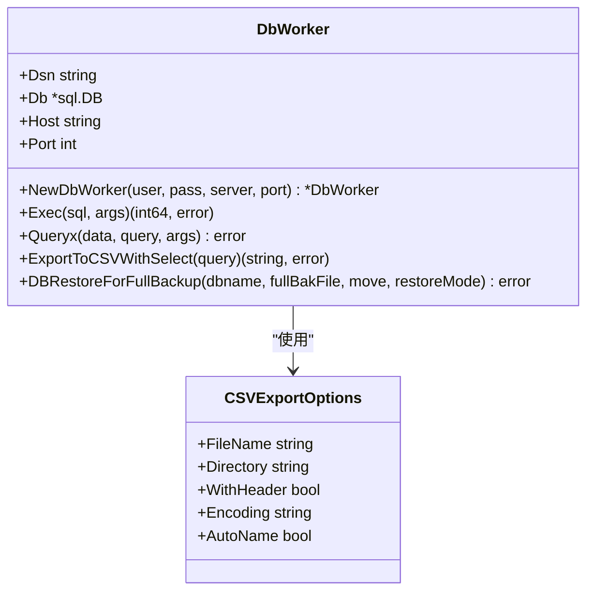

# 数据迁移性能优化

<cite>
**本文档引用的文件**   
- [data_export.go](file://dbm-services/sqlserver/db-tools/dbactuator/pkg/components/sqlserver/data_export.go)
- [restore_dbs_full_backup.go](file://dbm-services/sqlserver/db-tools/dbactuator/pkg/components/sqlserver/restore_dbs_full_backup.go)
- [sqlserver.go](file://dbm-services/sqlserver/db-tools/dbactuator/pkg/util/sqlserver/sqlserver.go)
- [osutil.go](file://dbm-services/sqlserver/db-tools/dbactuator/pkg/util/osutil/osutil.go)
- [util.go](file://dbm-services/sqlserver/db-tools/dbactuator/pkg/util/util.go)
- [utils.py](file://dbm-ui/backend/db_monitor/utils.py)
</cite>

## 目录
1. [引言](#引言)
2. [数据导出性能优化](#数据导出性能优化)
3. [全量备份恢复性能优化](#全量备份恢复性能优化)
4. [辅助工具函数分析](#辅助工具函数分析)
5. [性能调优最佳实践](#性能调优最佳实践)
6. [配置参数推荐](#配置参数推荐)
7. [结论](#结论)

## 引言
本文档深入分析SQL Server数据迁移的性能优化策略，基于`data_export.go`和`restore_dbs_full_backup.go`的实现，探讨大容量数据迁移的批处理机制、并行化策略和I/O优化技术。同时分析`utils.py`中提供的辅助函数如何提升迁移效率，并提供性能调优的最佳实践和具体配置参数推荐。

## 数据导出性能优化

### 批处理机制
在`data_export.go`文件中，`DataExportComp`结构体实现了数据导出的核心功能。该组件通过`DataExport`方法遍历所有指定端口，对每个端口执行数据导出操作。批处理机制体现在对多个数据库和SQL文件的批量处理上，通过`DataExportForPort`方法实现。

批处理流程如下：
1. 连接指定端口的SQL Server实例
2. 获取实例的版本信息
3. 遍历所有执行对象（`ExcuteObjects`）
4. 对每个执行对象中的SQL文件进行处理
5. 将结果导出为CSV文件并打包

**Diagram sources**
- [data_export.go](file://dbm-services/sqlserver/db-tools/dbactuator/pkg/components/sqlserver/data_export.go#L189-L196)

**Section sources**
- [data_export.go](file://dbm-services/sqlserver/db-tools/dbactuator/pkg/components/sqlserver/data_export.go#L28-L208)

### 并行化策略
虽然当前实现中没有显式的并行化处理，但可以通过外部调度实现多实例并行执行。`DataExportCommand`函数创建了一个Cobra命令，支持多实例执行数据导出任务。通过合理配置执行计划，可以实现多个实例的并行数据导出。

### I/O优化技术
I/O优化主要体现在CSV文件的导出和ZIP打包过程中。`DataExportForPort`方法在执行SQL文件后，将结果保存为CSV文件，最后通过`osutil.ZipFiles`方法将所有CSV文件打包为一个ZIP文件。这种批量打包的方式减少了文件传输的开销。

## 全量备份恢复性能优化

### 恢复流程分析
`restore_dbs_full_backup.go`文件中的`RestoreDBSForFullComp`结构体负责全量备份的恢复工作。恢复流程包括预检查、路径获取、合理性检查和实际恢复四个阶段。

**Diagram sources**
- [restore_dbs_full_backup.go](file://dbm-services/sqlserver/db-tools/dbactuator/pkg/components/sqlserver/restore_dbs_full_backup.go#L229-L305)

**Section sources**
- [restore_dbs_full_backup.go](file://dbm-services/sqlserver/db-tools/dbactuator/pkg/components/sqlserver/restore_dbs_full_backup.go#L27-L306)

### 恢复路径优化
恢复路径的获取遵循优先级策略：
1. 优先从`APP_SETTING`表中获取`RESTORE_PATH`
2. 其次尝试获取`DATA_PATH`和`LOG_PATH`
3. 最后使用实例的默认路径

这种分层的路径选择策略确保了恢复操作的灵活性和可靠性。

### 文件移动策略
在恢复过程中，系统会根据文件类型生成新的文件名：
- 主文件组：`{dbname}_{randstr}.mdf`
- 辅助文件组：`{dbname}_{randstr}.ndf`
- 日志文件组：`{dbname}_{randstr}.ldf`
- 内存文件组：`{dbname}_InMemory_{randstr}`

这种命名策略避免了文件名冲突，确保了恢复操作的顺利进行。

## 辅助工具函数分析

### SQL Server工具函数
`sqlserver.go`文件提供了丰富的SQL Server操作工具函数，包括连接管理、查询执行、数据导出等。

**Diagram sources**
- [sqlserver.go](file://dbm-services/sqlserver/db-tools/dbactuator/pkg/util/sqlserver/sqlserver.go#L32-L678)

**Section sources**
- [sqlserver.go](file://dbm-services/sqlserver/db-tools/dbactuator/pkg/util/sqlserver/sqlserver.go#L1-L678)

### 操作系统工具函数
`osutil.go`文件提供了操作系统级别的工具函数，包括文件操作、压缩解压、随机字符串生成等。

关键功能包括：
- `ZipFiles`: 压缩文件
- `GenerateRandomString`: 生成随机字符串
- `GetVersionYears`: 从版本号提取年份
- `FileExist`: 检查文件是否存在

### 通用工具函数
`util.go`文件提供了通用的工具函数，包括：
- `Retry`: 重试机制
- `IOLimitRate`: I/O限速
- `DbMatch`: 数据库名称匹配
- `ChangeToMatch`: 将通配符转换为正则表达式

## 性能调优最佳实践

### 网络带宽利用
1. **批量传输**：将多个小文件打包为一个大文件进行传输，减少网络连接开销
2. **压缩传输**：使用ZIP压缩减少传输数据量
3. **限速控制**：通过`IOLimitRate`函数控制传输速度，避免影响其他业务

### 磁盘I/O优化
1. **分离数据和日志路径**：将数据文件和日志文件存储在不同的物理磁盘上
2. **预分配空间**：预先分配足够的磁盘空间，避免恢复过程中频繁扩展
3. **使用SSD**：关键数据使用SSD存储，提高读写性能

### 内存管理
1. **合理配置缓冲池**：根据服务器内存大小合理配置SQL Server的内存使用
2. **监控内存使用**：通过`GetDefaultPath`等方法监控内存使用情况
3. **避免内存泄漏**：及时关闭数据库连接，释放资源

## 配置参数推荐

### 数据导出配置
| 参数 | 推荐值 | 说明 |
|------|--------|------|
| 批处理大小 | 1000-5000行 | 根据数据量和内存情况调整 |
| 压缩级别 | Deflate | 平衡压缩率和CPU开销 |
| 超时时间 | 3小时 | 根据数据量调整 |

### 备份恢复配置
| 参数 | 推荐值 | 说明 |
|------|--------|------|
| 恢复模式 | RECOVERY | 正常恢复模式 |
| 文件移动 | 启用 | 避免文件名冲突 |
| 并行度 | 4-8 | 根据CPU核心数调整 |

### 系统配置
| 参数 | 推荐值 | 说明 |
|------|--------|------|
| 最大内存 | 80%物理内存 | 为操作系统留出足够内存 |
| 最小内存 | 1GB | 确保基本运行需求 |
| 最大工作线程 | 0（自动） | 让系统自动管理 |

## 结论
通过对`data_export.go`和`restore_dbs_full_backup.go`的深入分析，我们了解了SQL Server数据迁移的核心机制。通过合理的批处理、I/O优化和配置调优，可以显著提升大容量数据迁移的性能。建议在实际应用中结合具体场景，灵活调整各项参数，以达到最佳的迁移效果。