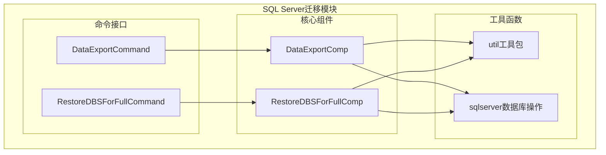
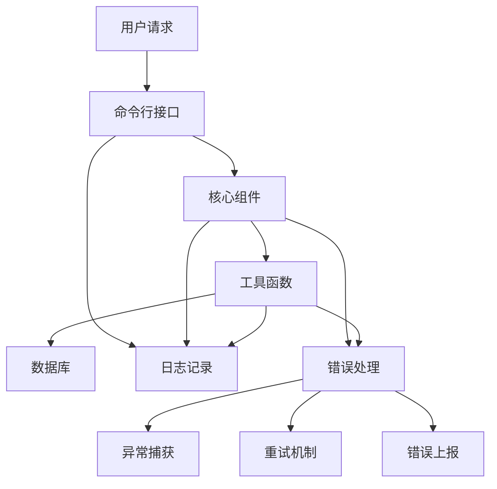
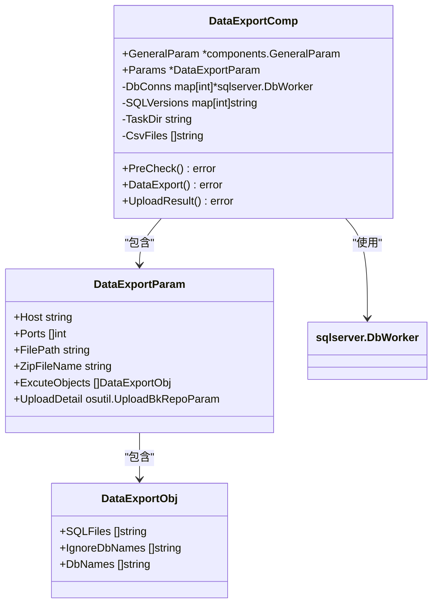
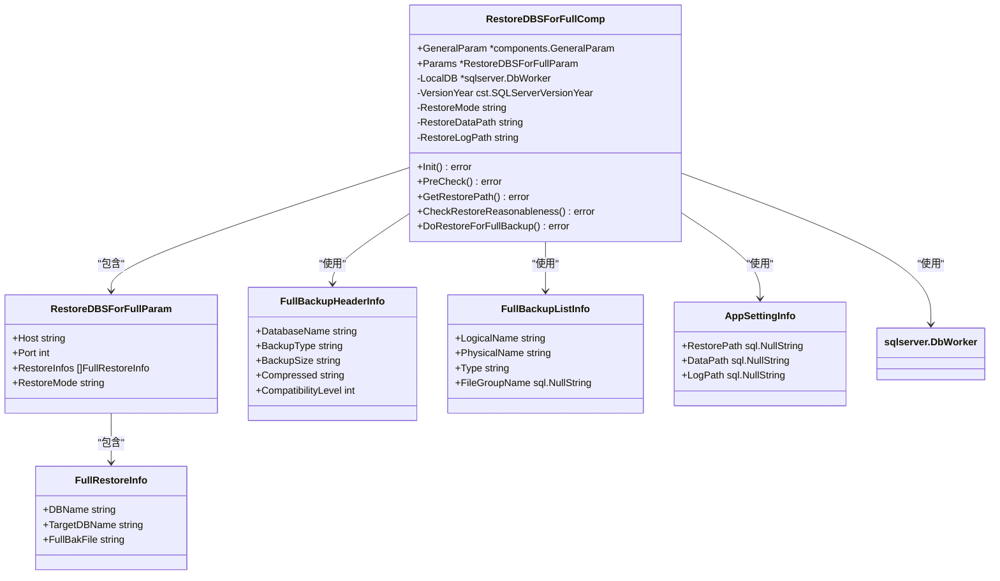
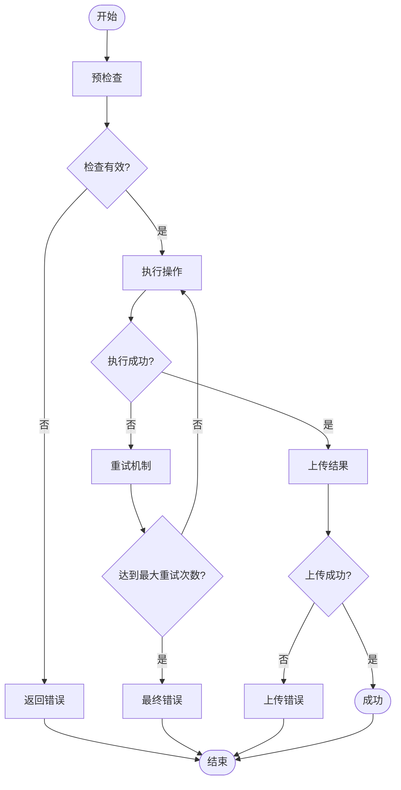
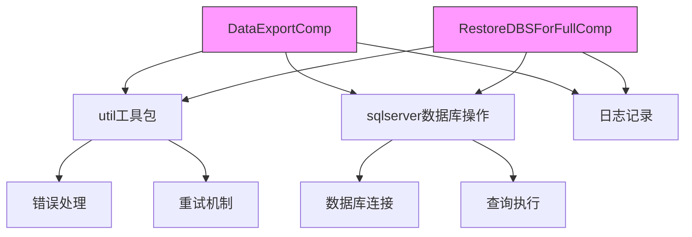

# 迁移错误处理与容错

<cite>
**本文档引用的文件**   
- [data_export.go](file://dbm-services/sqlserver/db-tools/dbactuator/pkg/components/sqlserver/data_export.go)
- [restore_dbs_full_backup.go](file://dbm-services/sqlserver/db-tools/dbactuator/pkg/components/sqlserver/restore_dbs_full_backup.go)
- [exceptions.py](file://dbm-ui/backend/exceptions.py)
- [data_export.go](file://dbm-services/sqlserver/db-tools/dbactuator/internal/subcmd/sqlservercmd/data_export.go)
- [restore_dbs_full_backup.go](file://dbm-services/sqlserver/db-tools/dbactuator/internal/subcmd/sqlservercmd/restore_dbs_full_backup.go)
- [util.go](file://dbm-services/sqlserver/db-tools/dbactuator/pkg/util/util.go)
- [sqlserver.go](file://dbm-services/sqlserver/db-tools/dbactuator/pkg/util/sqlserver/sqlserver.go)
</cite>

## 目录
1. [引言](#引言)
2. [项目结构](#项目结构)
3. [核心组件](#核心组件)
4. [架构概述](#架构概述)
5. [详细组件分析](#详细组件分析)
6. [依赖分析](#依赖分析)
7. [性能考虑](#性能考虑)
8. [故障排除指南](#故障排除指南)
9. [结论](#结论)

## 引言
本文档系统性地阐述了SQL Server数据迁移过程中的错误处理机制。重点分析了`data_export.go`和`restore_dbs_full_backup.go`中的异常捕获和处理逻辑，包括网络中断、磁盘空间不足、权限错误等常见问题的应对策略。同时解释了`exceptions.py`中定义的自定义异常类型及其使用场景。提供了完整的错误代码对照表和故障排查指南，帮助用户快速定位和解决迁移过程中遇到的问题。

## 项目结构
SQL Server数据迁移相关的代码主要位于`dbm-services/sqlserver/db-tools/dbactuator`目录下，分为内部命令和组件两个主要部分。核心的迁移功能实现在`pkg/components/sqlserver`包中，而命令行接口则在`internal/subcmd/sqlservercmd`包中。

**图表来源**
- [data_export.go](file://dbm-services/sqlserver/db-tools/dbactuator/internal/subcmd/sqlservercmd/data_export.go#L24-L92)
- [restore_dbs_full_backup.go](file://dbm-services/sqlserver/db-tools/dbactuator/internal/subcmd/sqlservercmd/restore_dbs_full_backup.go#L24-L88)
- [data_export.go](file://dbm-services/sqlserver/db-tools/dbactuator/pkg/components/sqlserver/data_export.go#L27-L208)
- [restore_dbs_full_backup.go](file://dbm-services/sqlserver/db-tools/dbactuator/pkg/components/sqlserver/restore_dbs_full_backup.go#L27-L306)

**章节来源**
- [project_structure](file://#L1-L100)

## 核心组件
SQL Server数据迁移的核心组件主要包括数据导出(`DataExportComp`)和全量备份恢复(`RestoreDBSForFullComp`)两个部分。这些组件实现了迁移过程中的关键功能和错误处理机制。

**章节来源**
- [data_export.go](file://dbm-services/sqlserver/db-tools/dbactuator/pkg/components/sqlserver/data_export.go#L27-L208)
- [restore_dbs_full_backup.go](file://dbm-services/sqlserver/db-tools/dbactuator/pkg/components/sqlserver/restore_dbs_full_backup.go#L27-L306)

## 架构概述
SQL Server数据迁移的架构采用分层设计，上层为命令行接口，中层为核心业务逻辑组件，底层为通用工具函数。这种设计使得错误处理机制可以在各个层次上得到有效的实现和管理。

**图表来源**
- [data_export.go](file://dbm-services/sqlserver/db-tools/dbactuator/internal/subcmd/sqlservercmd/data_export.go#L24-L92)
- [restore_dbs_full_backup.go](file://dbm-services/sqlserver/db-tools/dbactuator/internal/subcmd/sqlservercmd/restore_dbs_full_backup.go#L24-L88)

## 详细组件分析

### 数据导出组件分析
数据导出组件负责从SQL Server实例中导出数据，并处理迁移过程中的各种异常情况。

#### 对象导向组件

**图表来源**
- [data_export.go](file://dbm-services/sqlserver/db-tools/dbactuator/pkg/components/sqlserver/data_export.go#L27-L208)

**章节来源**
- [data_export.go](file://dbm-services/sqlserver/db-tools/dbactuator/pkg/components/sqlserver/data_export.go#L27-L208)

### 全量备份恢复组件分析
全量备份恢复组件负责将SQL Server的全量备份文件恢复到目标实例，并处理恢复过程中的各种异常情况。

#### 对象导向组件

**图表来源**
- [restore_dbs_full_backup.go](file://dbm-services/sqlserver/db-tools/dbactuator/pkg/components/sqlserver/restore_dbs_full_backup.go#L27-L306)

**章节来源**
- [restore_dbs_full_backup.go](file://dbm-services/sqlserver/db-tools/dbactuator/pkg/components/sqlserver/restore_dbs_full_backup.go#L27-L306)

### 异常处理机制分析
系统实现了多层次的异常处理机制，包括预检查、执行过程中的错误处理和重试机制。

#### 流程图

**图表来源**
- [data_export.go](file://dbm-services/sqlserver/db-tools/dbactuator/pkg/components/sqlserver/data_export.go#L69-L91)
- [restore_dbs_full_backup.go](file://dbm-services/sqlserver/db-tools/dbactuator/pkg/components/sqlserver/restore_dbs_full_backup.go#L69-L87)

**章节来源**
- [data_export.go](file://dbm-services/sqlserver/db-tools/dbactuator/pkg/components/sqlserver/data_export.go#L69-L91)
- [restore_dbs_full_backup.go](file://dbm-services/sqlserver/db-tools/dbactuator/pkg/components/sqlserver/restore_dbs_full_backup.go#L69-L87)

## 依赖分析
SQL Server数据迁移组件依赖于多个底层工具包，这些工具包提供了通用的错误处理和工具函数。

**图表来源**
- [data_export.go](file://dbm-services/sqlserver/db-tools/dbactuator/pkg/components/sqlserver/data_export.go#L13-L25)
- [restore_dbs_full_backup.go](file://dbm-services/sqlserver/db-tools/dbactuator/pkg/components/sqlserver/restore_dbs_full_backup.go#L13-L25)

**章节来源**
- [data_export.go](file://dbm-services/sqlserver/db-tools/dbactuator/pkg/components/sqlserver/data_export.go#L13-L25)
- [restore_dbs_full_backup.go](file://dbm-services/sqlserver/db-tools/dbactuator/pkg/components/sqlserver/restore_dbs_full_backup.go#L13-L25)

## 性能考虑
在数据迁移过程中，系统考虑了多种性能优化和错误处理策略：

1. **连接池管理**：通过`sqlx.Connect`和`defer db.Close()`确保数据库连接的正确管理，避免连接泄漏。
2. **超时控制**：在数据库连接时使用`context.WithTimeout`设置10秒超时，防止长时间等待。
3. **批量操作**：使用`ExecMore`方法批量执行SQL语句，减少网络往返次数。
4. **资源清理**：在`Stop`方法中显式关闭数据库连接，确保资源及时释放。
5. **错误重试**：通过`Retry`函数实现可配置的重试机制，提高操作的可靠性。

这些性能考虑不仅提高了迁移效率，也增强了系统的容错能力。

## 故障排除指南

### 常见错误代码对照表
| 错误代码 | 错误类型 | 描述 | 解决方案 |
|---------|--------|------|---------|
| 8700500 | AppBaseException | 系统异常 | 检查系统日志，联系管理员 |
| 8700001 | ValidationError | 参数验证失败 | 检查输入参数是否符合要求 |
| 8700002 | ApiResultError | 远程服务请求结果异常 | 检查网络连接，重试操作 |
| 8700003 | ComponentCallError | 组件调用异常 | 检查组件状态，重启服务 |
| 8700004 | BizNotExistError | 业务不存在 | 确认业务配置是否正确 |
| 8700403 | PermissionDeniedError | 权限不足 | 检查用户权限，申请相应权限 |

### 常见问题及解决方案

#### 网络中断问题
**现象**：连接数据库时超时或连接被拒绝
**原因**：网络不稳定或防火墙阻止连接
**解决方案**：
1. 检查网络连接是否正常
2. 确认防火墙规则允许数据库端口通信
3. 使用`HostCheck`函数检测主机可达性
4. 增加重试次数和重试间隔

#### 磁盘空间不足问题
**现象**：备份文件写入失败或恢复操作中断
**原因**：目标磁盘空间不足
**解决方案**：
1. 使用`GetFileSize`检查文件大小
2. 确认目标路径有足够的磁盘空间
3. 清理不必要的文件释放空间
4. 使用`FileExists`检查目录是否存在

#### 权限错误问题
**现象**：数据库操作被拒绝
**原因**：用户权限不足
**解决方案**：
1. 确认使用正确的账户凭据
2. 检查数据库用户权限
3. 使用`DRSDataReadUser`和`DRSDataReadPwd`等预定义账户
4. 联系数据库管理员提升权限

#### 备份文件问题
**现象**：备份文件无法读取或格式不正确
**原因**：文件损坏或版本不兼容
**解决方案**：
1. 使用`FileExists`检查文件是否存在
2. 验证备份文件的`CompatibilityLevel`
3. 检查备份文件的`DatabaseName`是否匹配
4. 确认备份文件未被加密

### 错误处理最佳实践
1. **预检查**：在执行任何操作前进行充分的预检查，包括连接性、权限、磁盘空间等。
2. **分层处理**：在不同层次（命令层、组件层、工具层）实现相应的错误处理。
3. **详细日志**：使用`logger.Error`和`logger.Info`记录详细的错误信息和执行过程。
4. **优雅降级**：当某些非关键操作失败时，尽量继续执行其他操作。
5. **用户友好**：向用户返回清晰、具体的错误信息，避免暴露系统内部细节。

**章节来源**
- [exceptions.py](file://dbm-ui/backend/exceptions.py#L55-L177)
- [util.go](file://dbm-services/sqlserver/db-tools/dbactuator/pkg/util/util.go#L43-L53)
- [sqlserver.go](file://dbm-services/sqlserver/db-tools/dbactuator/pkg/util/sqlserver/sqlserver.go#L105-L108)

## 结论
SQL Server数据迁移系统通过多层次的错误处理机制，有效地应对了网络中断、磁盘空间不足、权限错误等常见问题。系统采用分层架构设计，将命令接口、核心组件和工具函数分离，使得错误处理逻辑清晰且易于维护。通过预检查、重试机制、详细的日志记录和用户友好的错误信息，系统提供了可靠的迁移服务。建议在实际使用中遵循故障排除指南中的最佳实践，以确保迁移过程的顺利进行。