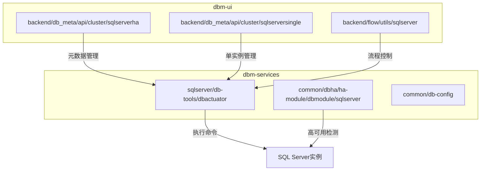
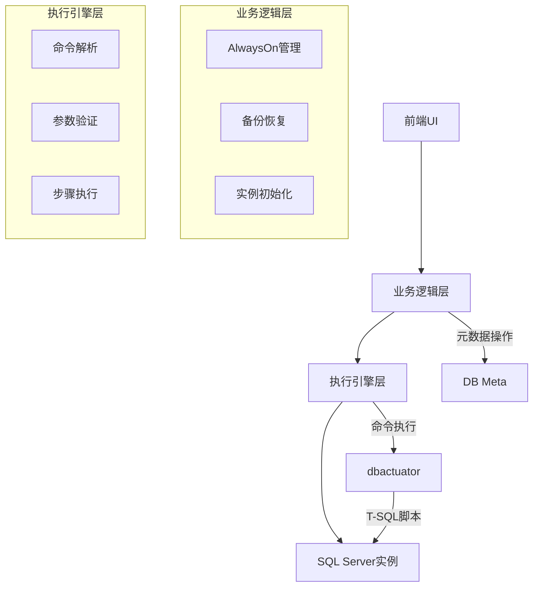
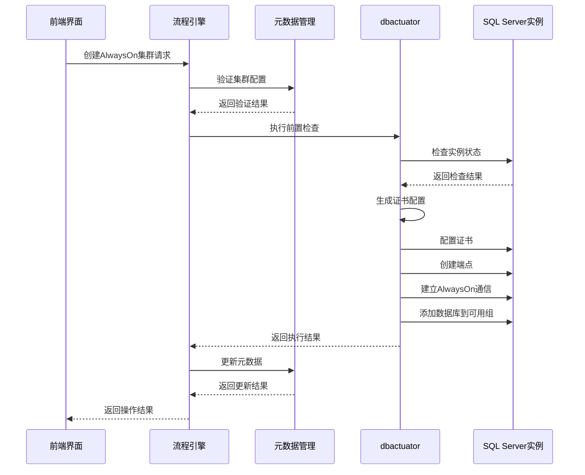
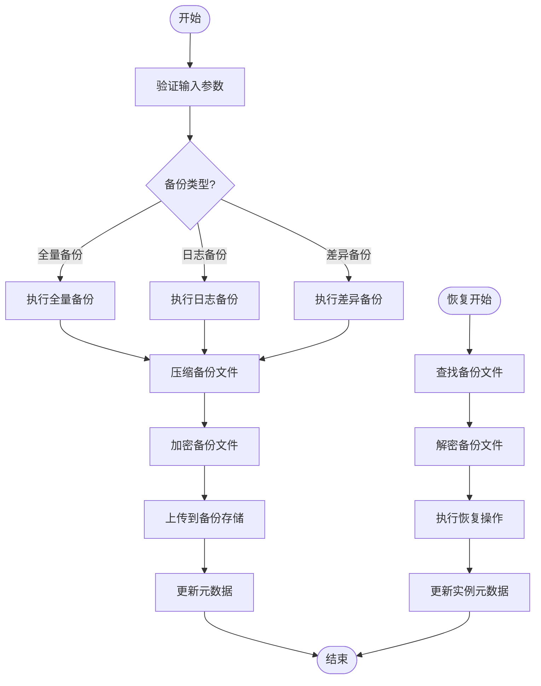
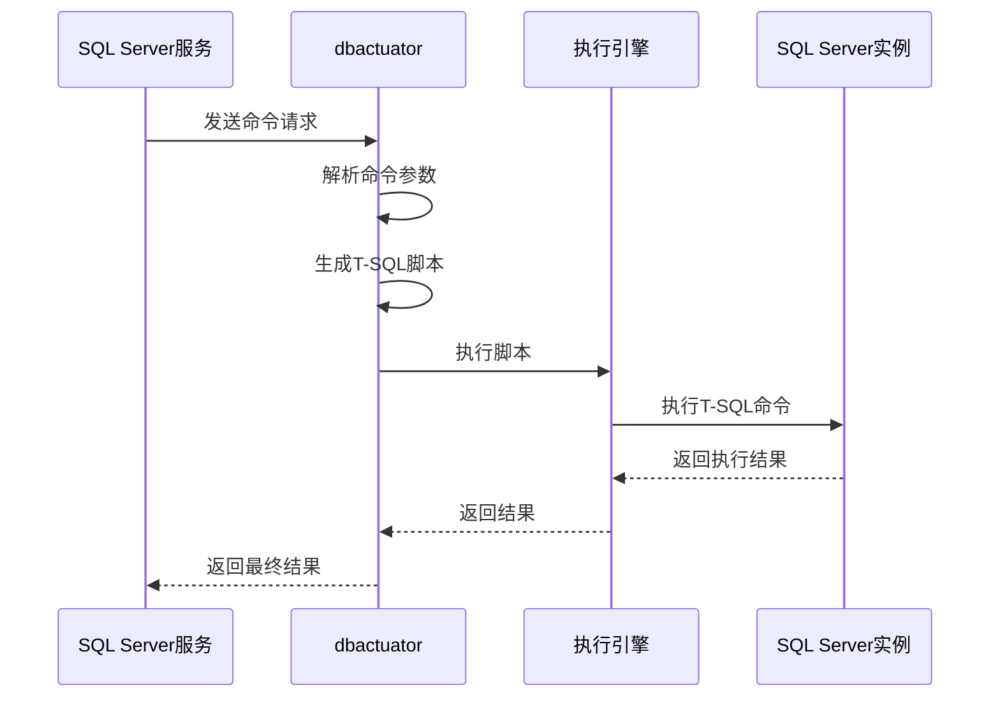
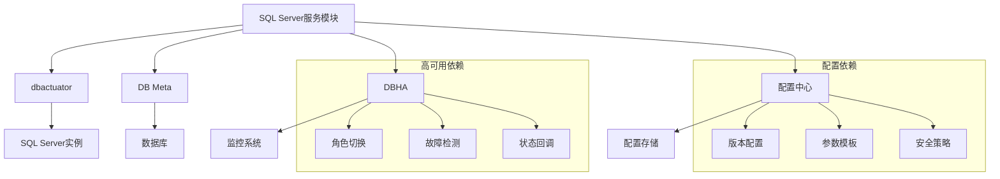

# SQL Server服务模块

<cite>
**本文档引用的文件**
- [build_alwayson.go](file://dbm-services/sqlserver/db-tools/dbactuator/internal/subcmd/sqlservercmd/build_alwayson.go)
- [add_databases_in_alwayson.go](file://dbm-services/sqlserver/db-tools/dbactuator/internal/subcmd/sqlservercmd/add_databases_in_alwayson.go)
- [init_sqlserver_instance.go](file://dbm-services/sqlserver/db-tools/dbactuator/internal/subcmd/sqlservercmd/init_sqlserver_instance.go)
- [backup_dbs.go](file://dbm-services/sqlserver/db-tools/dbactuator/internal/subcmd/sqlservercmd/backup_dbs.go)
- [restore_dbs_full_backup.go](file://dbm-services/sqlserver/db-tools/dbactuator/internal/subcmd/sqlservercmd/restore_dbs_full_backup.go)
- [restore_dbs_log_backup.go](file://dbm-services/sqlserver/db-tools/dbactuator/internal/subcmd/sqlservercmd/restore_dbs_log_backup.go)
- [sqlserver_switch.go](file://dbm-services/common/dbha/ha-module/dbmodule/sqlserver/sqlserver_switch.go)
- [sqlserver_callback.go](file://dbm-services/common/dbha/ha-module/dbmodule/sqlserver/sqlserver_callback.go)
- [sqlserver_detect.go](file://dbm-services/common/dbha/ha-module/dbmodule/sqlserver/sqlserver_detect.go)
- [sqlserver_util.go](file://dbm-services/common/dbha/ha-module/dbmodule/sqlserver/sqlserver_util.go)
- [sqlserver_db_meta.py](file://dbm-ui/backend/flow/utils/sqlserver/sqlserver_db_meta.py)
- [handler.py](file://dbm-ui/backend/db_meta/api/cluster/sqlserverha/handler.py)
- [handler.py](file://dbm-ui/backend/db_meta/api/cluster/sqlserversingle/handler.py)
- [init_sqlserver.ps1](file://dbm-services/sqlserver/db-tools/dbactuator/pkg/core/staticembed/init_sqlserver.ps1)
- [const.go](file://dbm-services/sqlserver/db-tools/dbactuator/pkg/core/cst/const.go)
</cite>

## 目录

1. [引言](#引言)
2. [项目结构](#项目结构)
3. [核心组件](#核心组件)
4. [架构概述](#架构概述)
5. [详细组件分析](#详细组件分析)
6. [依赖分析](#依赖分析)
7. [性能考虑](#性能考虑)
8. [故障排除指南](#故障排除指南)
9. [结论](#结论)

## 引言

SQL Server服务模块是蓝鲸DBM系统中用于管理Microsoft SQL Server数据库的核心组件。该模块提供了对SQL Server特有功能的全面支持，包括AlwaysOn高可用组、数据库镜像、备份恢复等关键功能。通过与dbactuator工具的深度集成，实现了自动化部署、配置和管理SQL Server实例的能力。

## 项目结构

SQL Server服务模块的实现分布在多个目录中，主要包含dbactuator子命令、元数据管理、高可用处理等组件。

**图源**
- [build_alwayson.go](file://dbm-services/sqlserver/db-tools/dbactuator/internal/subcmd/sqlservercmd/build_alwayson.go)
- [handler.py](file://dbm-ui/backend/db_meta/api/cluster/sqlserverha/handler.py)
- [handler.py](file://dbm-ui/backend/db_meta/api/cluster/sqlserversingle/handler.py)

**章节源**
- [build_alwayson.go](file://dbm-services/sqlserver/db-tools/dbactuator/internal/subcmd/sqlservercmd/build_alwayson.go)
- [handler.py](file://dbm-ui/backend/db_meta/api/cluster/sqlserverha/handler.py)
- [handler.py](file://dbm-ui/backend/db_meta/api/cluster/sqlserversingle/handler.py)

## 核心组件

SQL Server服务模块的核心组件包括AlwaysOn高可用组管理、数据库镜像配置、备份恢复功能以及与dbactuator的集成。这些组件通过标准化的接口和流程，实现了对SQL Server实例的自动化管理。

**章节源**
- [build_alwayson.go](file://dbm-services/sqlserver/db-tools/dbactuator/internal/subcmd/sqlservercmd/build_alwayson.go)
- [backup_dbs.go](file://dbm-services/sqlserver/db-tools/dbactuator/internal/subcmd/sqlservercmd/backup_dbs.go)
- [restore_dbs_full_backup.go](file://dbm-services/sqlserver/db-tools/dbactuator/internal/subcmd/sqlservercmd/restore_dbs_full_backup.go)
- [restore_dbs_log_backup.go](file://dbm-services/sqlserver/db-tools/dbactuator/internal/subcmd/sqlservercmd/restore_dbs_log_backup.go)

## 架构概述

SQL Server服务模块采用分层架构设计，分为前端UI层、业务逻辑层、执行引擎层和数据库层。各层之间通过清晰的接口进行通信，确保系统的可维护性和可扩展性。

**图源**
- [build_alwayson.go](file://dbm-services/sqlserver/db-tools/dbactuator/internal/subcmd/sqlservercmd/build_alwayson.go)
- [sqlserver_db_meta.py](file://dbm-ui/backend/flow/utils/sqlserver/sqlserver_db_meta.py)
- [handler.py](file://dbm-ui/backend/db_meta/api/cluster/sqlserverha/handler.py)

## 详细组件分析

### AlwaysOn高可用组管理

AlwaysOn高可用组管理是SQL Server服务模块的核心功能之一，通过一系列步骤实现高可用集群的构建和管理。

#### 构建AlwaysOn集群流程

**图源**
- [build_alwayson.go](file://dbm-services/sqlserver/db-tools/dbactuator/internal/subcmd/sqlservercmd/build_alwayson.go)
- [add_databases_in_alwayson.go](file://dbm-services/sqlserver/db-tools/dbactuator/internal/subcmd/sqlservercmd/add_databases_in_alwayson.go)
- [init_sqlserver_instance.go](file://dbm-services/sqlserver/db-tools/dbactuator/internal/subcmd/sqlservercmd/init_sqlserver_instance.go)

**章节源**
- [build_alwayson.go](file://dbm-services/sqlserver/db-tools/dbactuator/internal/subcmd/sqlservercmd/build_alwayson.go)
- [add_databases_in_alwayson.go](file://dbm-services/sqlserver/db-tools/dbactuator/internal/subcmd/sqlservercmd/add_databases_in_alwayson.go)

### 备份恢复功能

备份恢复功能提供了对SQL Server数据库的完整保护机制，支持全量备份、日志备份和差异备份等多种模式。

#### 备份恢复流程

**图源**
- [backup_dbs.go](file://dbm-services/sqlserver/db-tools/dbactuator/internal/subcmd/sqlservercmd/backup_dbs.go)
- [restore_dbs_full_backup.go](file://dbm-services/sqlserver/db-tools/dbactuator/internal/subcmd/sqlservercmd/restore_dbs_full_backup.go)
- [restore_dbs_log_backup.go](file://dbm-services/sqlserver/db-tools/dbactuator/internal/subcmd/sqlservercmd/restore_dbs_log_backup.go)

**章节源**
- [backup_dbs.go](file://dbm-services/sqlserver/db-tools/dbactuator/internal/subcmd/sqlservercmd/backup_dbs.go)
- [restore_dbs_full_backup.go](file://dbm-services/sqlserver/db-tools/dbactuator/internal/subcmd/sqlservercmd/restore_dbs_full_backup.go)
- [restore_dbs_log_backup.go](file://dbm-services/sqlserver/db-tools/dbactuator/internal/subcmd/sqlservercmd/restore_dbs_log_backup.go)

### 与dbactuator的集成

SQL Server服务模块与dbactuator工具深度集成，通过标准化的接口实现命令的生成和执行。

#### 命令执行流程

**图源**
- [build_alwayson.go](file://dbm-services/sqlserver/db-tools/dbactuator/internal/subcmd/sqlservercmd/build_alwayson.go)
- [const.go](file://dbm-services/sqlserver/db-tools/dbactuator/pkg/core/cst/const.go)
- [init_sqlserver.ps1](file://dbm-services/sqlserver/db-tools/dbactuator/pkg/core/staticembed/init_sqlserver.ps1)

**章节源**
- [build_alwayson.go](file://dbm-services/sqlserver/db-tools/dbactuator/internal/subcmd/sqlservercmd/build_alwayson.go)
- [const.go](file://dbm-services/sqlserver/db-tools/dbactuator/pkg/core/cst/const.go)

## 依赖分析

SQL Server服务模块依赖于多个核心组件和外部服务，形成了复杂的依赖关系网络。

**图源**
- [sqlserver_switch.go](file://dbm-services/common/dbha/ha-module/dbmodule/sqlserver/sqlserver_switch.go)
- [sqlserver_callback.go](file://dbm-services/common/dbha/ha-module/dbmodule/sqlserver/sqlserver_callback.go)
- [sqlserver_detect.go](file://dbm-services/common/dbha/ha-module/dbmodule/sqlserver/sqlserver_detect.go)
- [sqlserver_util.go](file://dbm-services/common/dbha/ha-module/dbmodule/sqlserver/sqlserver_util.go)

**章节源**
- [sqlserver_switch.go](file://dbm-services/common/dbha/ha-module/dbmodule/sqlserver/sqlserver_switch.go)
- [sqlserver_callback.go](file://dbm-services/common/dbha/ha-module/dbmodule/sqlserver/sqlserver_callback.go)
- [sqlserver_detect.go](file://dbm-services/common/dbha/ha-module/dbmodule/sqlserver/sqlserver_detect.go)

## 性能考虑

在设计和实现SQL Server服务模块时，需要考虑以下性能优化建议：

1. **连接池管理**：合理配置数据库连接池大小，避免连接过多导致资源耗尽。
2. **批量操作**：对于大量数据的操作，采用批量处理方式，减少网络往返次数。
3. **索引优化**：为频繁查询的字段创建合适的索引，提高查询效率。
4. **缓存策略**：对频繁访问的元数据进行缓存，减少数据库查询压力。
5. **异步处理**：对于耗时较长的操作，采用异步处理方式，提高系统响应速度。

## 故障排除指南

当遇到SQL Server服务模块相关问题时，可以按照以下步骤进行排查：

1. **检查日志**：查看dbactuator和SQL Server实例的日志文件，定位错误信息。
2. **验证配置**：确认AlwaysOn配置、备份策略等配置项是否正确。
3. **网络连通性**：检查SQL Server实例之间的网络连通性，确保端口开放。
4. **权限验证**：确认执行操作的账户具有足够的权限。
5. **资源监控**：检查CPU、内存、磁盘等系统资源使用情况。

**章节源**
- [sqlserver_switch.go](file://dbm-services/common/dbha/ha-module/dbmodule/sqlserver/sqlserver_switch.go)
- [sqlserver_callback.go](file://dbm-services/common/dbha/ha-module/dbmodule/sqlserver/sqlserver_callback.go)
- [sqlserver_detect.go](file://dbm-services/common/dbha/ha-module/dbmodule/sqlserver/sqlserver_detect.go)

## 结论

SQL Server服务模块通过与dbactuator工具的深度集成，实现了对SQL Server特有功能的全面支持。模块采用分层架构设计，具有良好的可维护性和可扩展性。通过AlwaysOn高可用组、数据库镜像、备份恢复等功能，为SQL Server数据库提供了可靠的管理解决方案。未来可以进一步优化性能，增强安全特性，提升用户体验。