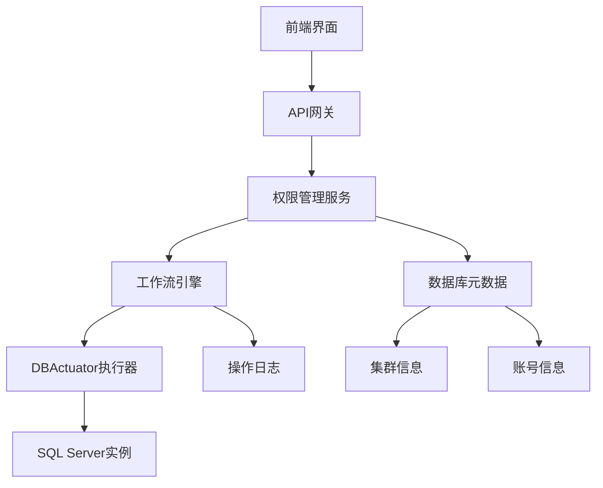
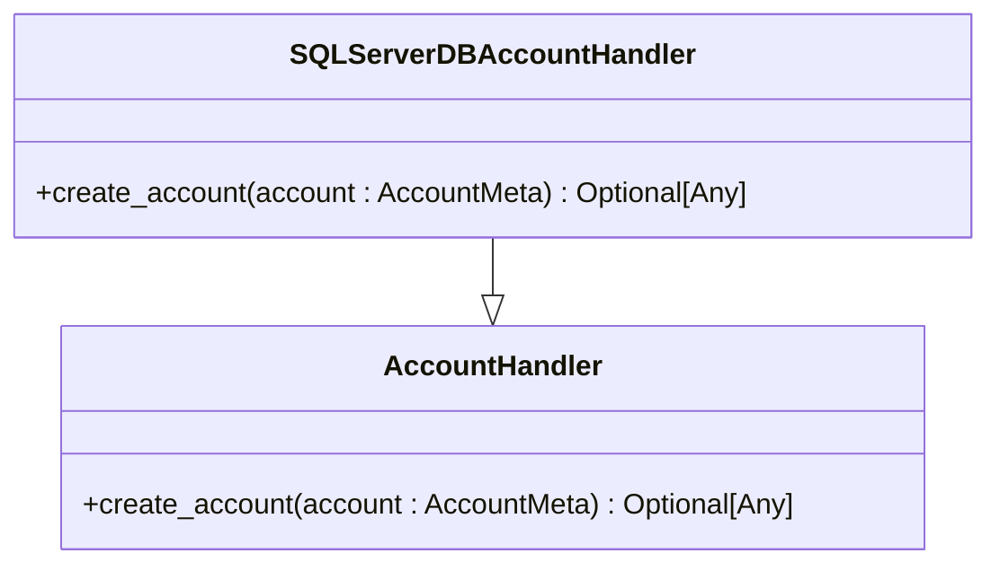
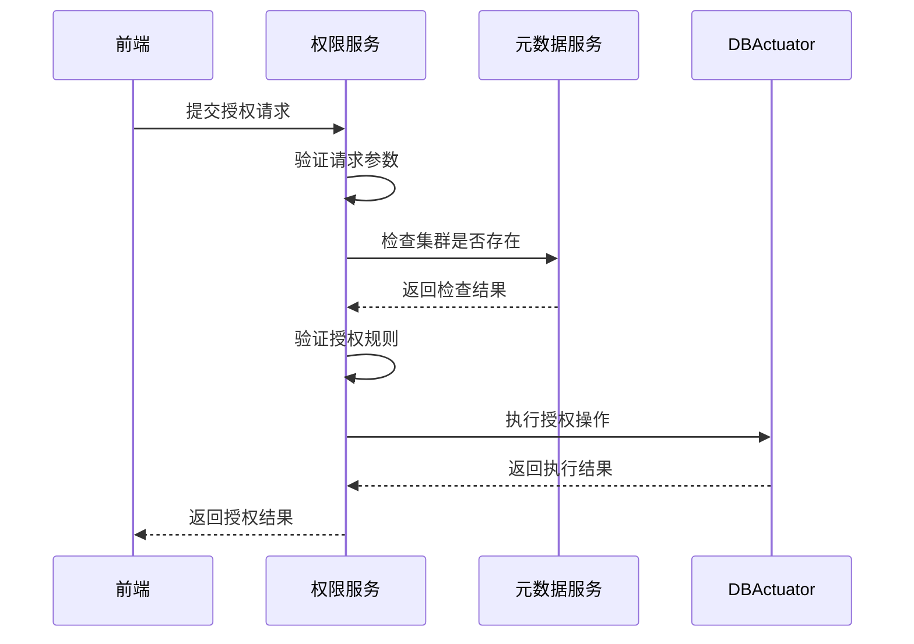
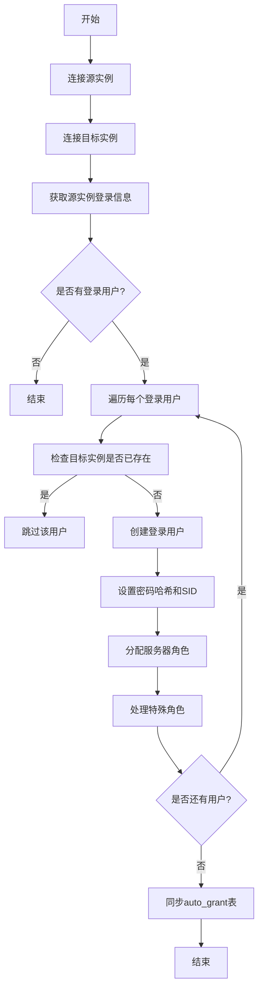
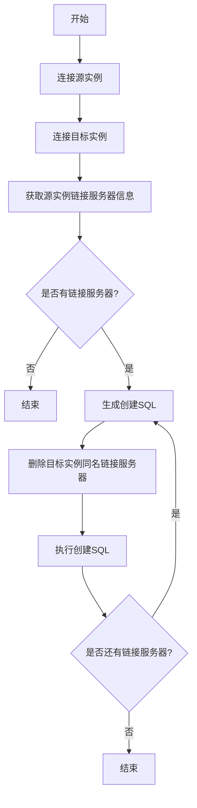
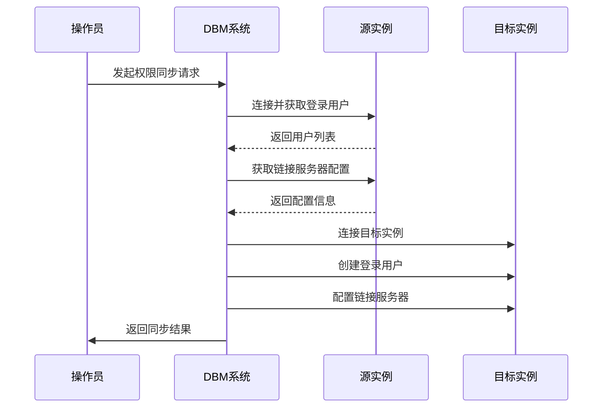

# SQL Server权限管理模块

<cite>
**本文档引用的文件**
- [clone_grants.go](file://dbm-services/sqlserver/db-tools/dbactuator/pkg/components/sqlserver/clone_grants.go)
- [clone_linkserver.go](file://dbm-services/sqlserver/db-tools/dbactuator/pkg/components/sqlserver/clone_linkservers.go)
- [handlers.py](file://dbm-ui/backend/db_services/sqlserver/permission/db_authorize/handlers.py)
- [dataclass.py](file://dbm-ui/backend/db_services/sqlserver/permission/db_authorize/dataclass.py)
- [get_linkservers_sql.go](file://dbm-services/sqlserver/db-tools/dbactuator/pkg/core/cst/get_linkservers_sql.go)
- [get_login_info.go](file://dbm-services/sqlserver/db-tools/dbactuator/pkg/core/cst/get_login_info.go)
- [sqlserver_act_payload.py](file://dbm-ui/backend/flow/utils/sqlserver/sqlserver_act_payload.py)
- [constants.py](file://dbm-ui/backend/db_services/sqlserver/permission/constants.py)
</cite>

## 目录
1. [引言](#引言)
2. [权限管理架构](#权限管理架构)
3. [数据库账号管理](#数据库账号管理)
4. [权限授权处理](#权限授权处理)
5. [权限克隆逻辑](#权限克隆逻辑)
6. [链接服务器配置](#链接服务器配置)
7. [跨实例权限同步示例](#跨实例权限同步示例)
8. [安全最佳实践](#安全最佳实践)
9. [审计日志配置](#审计日志配置)
10. [结论](#结论)

## 引言
蓝鲸智云-DB管理系统(BK-DBM)为SQL Server数据库提供了全面的权限管理功能。本系统通过前后端分离架构，实现了数据库账号管理、权限授权、链接服务器配置以及跨实例权限同步等核心功能。权限管理模块确保了数据库访问的安全性和合规性，同时提供了高效的操作流程，支持批量授权和权限克隆等高级功能。

## 权限管理架构
SQL Server权限管理模块采用分层架构设计，包括前端界面层、业务逻辑层和底层执行层。前端通过API与后端交互，后端服务处理业务逻辑并调用底层执行器完成具体操作。整个权限管理流程通过工作流引擎协调，确保操作的原子性和可追溯性。

**图示来源**
- [handlers.py](file://dbm-ui/backend/db_services/sqlserver/permission/db_authorize/handlers.py)
- [sqlserver_act_payload.py](file://dbm-ui/backend/flow/utils/sqlserver/sqlserver_act_payload.py)

## 数据库账号管理
数据库账号管理功能通过`SQLServerDBAccountHandler`类实现，负责处理SQL Server账号的创建和管理。系统在创建账号时需要生成唯一的SID（安全标识符），确保账号在不同实例间的一致性。

**图示来源**
- [handlers.py](file://dbm-ui/backend/db_services/sqlserver/permission/db_account/handlers.py)
- [views.py](file://dbm-ui/backend/db_services/sqlserver/permission/db_account/views.py)

**本节来源**
- [handlers.py](file://dbm-ui/backend/db_services/sqlserver/permission/db_account/handlers.py)
- [views.py](file://dbm-ui/backend/db_services/sqlserver/permission/db_account/views.py)

## 权限授权处理
权限授权处理由`SQLServerAuthorizeHandler`类负责，实现了SQL Server特有的授权检查和处理逻辑。系统支持单用户和多用户批量授权，通过前置检查确保授权操作的合法性。

**图示来源**
- [handlers.py](file://dbm-ui/backend/db_services/sqlserver/permission/db_authorize/handlers.py)
- [dataclass.py](file://dbm-ui/backend/db_services/sqlserver/permission/db_authorize/dataclass.py)

**本节来源**
- [handlers.py](file://dbm-ui/backend/db_services/sqlserver/permission/db_authorize/handlers.py)
- [dataclass.py](file://dbm-ui/backend/db_services/sqlserver/permission/db_authorize/dataclass.py)

## 权限克隆逻辑
权限克隆功能通过`CloneLoginUsersComp`组件实现，能够将一个SQL Server实例的登录用户权限完整复制到另一个实例。该功能主要用于数据库迁移、灾备同步等场景。

**图示来源**
- [clone_grants.go](file://dbm-services/sqlserver/db-tools/dbactuator/pkg/components/sqlserver/clone_grants.go)
- [get_login_info.go](file://dbm-services/sqlserver/db-tools/dbactuator/pkg/core/cst/get_login_info.go)

**本节来源**
- [clone_grants.go](file://dbm-services/sqlserver/db-tools/dbactuator/pkg/components/sqlserver/clone_grants.go)

## 链接服务器配置
链接服务器配置功能通过`CloneLinkserversComp`组件实现，能够将一个SQL Server实例的链接服务器配置复制到另一个实例。链接服务器允许跨数据库查询和操作，是分布式数据库环境中的重要功能。

**图示来源**
- [clone_linkservers.go](file://dbm-services/sqlserver/db-tools/dbactuator/pkg/components/sqlserver/clone_linkservers.go)
- [get_linkservers_sql.go](file://dbm-services/sqlserver/db-tools/dbactuator/pkg/core/cst/get_linkservers_sql.go)

**本节来源**
- [clone_linkservers.go](file://dbm-services/sqlserver/db-tools/dbactuator/pkg/components/sqlserver/clone_linkservers.go)

## 跨实例权限同步示例
跨实例权限同步是SQL Server权限管理的核心功能之一，通过以下步骤实现：

1. **准备阶段**：确定源实例和目标实例的连接信息
2. **连接建立**：使用SA账号同时连接源实例和目标实例
3. **权限提取**：从源实例提取登录用户信息和链接服务器配置
4. **权限同步**：将提取的权限信息应用到目标实例
5. **验证阶段**：验证同步结果的正确性

**图示来源**
- [clone_grants.go](file://dbm-services/sqlserver/db-tools/dbactuator/pkg/components/sqlserver/clone_grants.go)
- [clone_linkservers.go](file://dbm-services/sqlserver/db-tools/dbactuator/pkg/components/sqlserver/clone_linkservers.go)

## 安全最佳实践
SQL Server权限管理遵循以下安全最佳实践：

1. **最小权限原则**：为用户分配完成工作所需的最小权限
2. **定期审计**：定期审查用户权限，移除不必要的访问权限
3. **强密码策略**：实施强密码策略，定期更换密码
4. **多因素认证**：对关键账户实施多因素认证
5. **权限分离**：将管理权限分配给不同用户，避免单一用户拥有过多权限

系统通过`AUTO_GRANT`表记录自动授权信息，便于追踪和审计。同时，所有权限变更操作都记录在操作日志中，确保可追溯性。

**本节来源**
- [clone_grants.go](file://dbm-services/sqlserver/db-tools/dbactuator/pkg/components/sqlserver/clone_grants.go)
- [constants.py](file://dbm-ui/backend/db_services/sqlserver/permission/constants.py)

## 审计日志配置
审计日志配置是权限管理的重要组成部分，系统通过以下方式实现审计功能：

1. **操作日志记录**：所有权限管理操作都被记录在操作日志中
2. **变更追踪**：记录权限变更前后的状态，便于审计
3. **访问控制**：限制对审计日志的访问权限，确保日志安全
4. **日志保留**：配置合理的日志保留策略，满足合规要求

系统在`monitor_dbm.sql`脚本中配置了审计相关参数，包括C2审计模式、远程访问控制等，确保数据库操作的可审计性。

**本节来源**
- [monitor_dbm.sql](file://dbm-services/sqlserver/db-tools/dbactuator/pkg/core/staticembed/monitor_dbm.sql)
- [clone_grants.go](file://dbm-services/sqlserver/db-tools/dbactuator/pkg/components/sqlserver/clone_grants.go)

## 结论
SQL Server权限管理模块通过完善的架构设计和功能实现，提供了全面的权限管理解决方案。系统不仅支持基本的账号和权限管理，还提供了高级的权限克隆和跨实例同步功能，大大提高了数据库管理的效率。通过遵循安全最佳实践和完善的审计机制，确保了数据库访问的安全性和合规性。未来可以进一步增强权限分析和风险预警功能，提升系统的智能化水平。