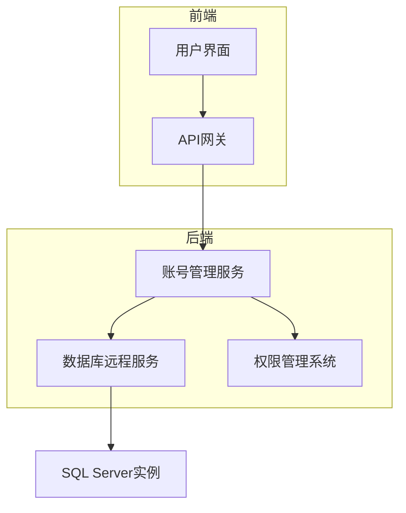
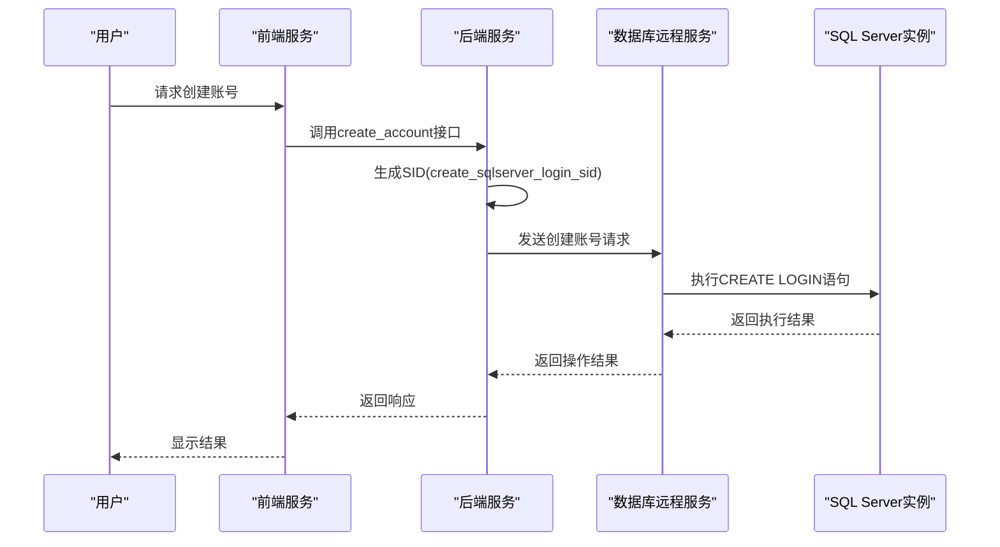
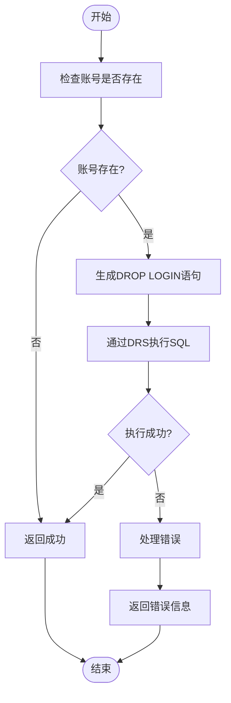
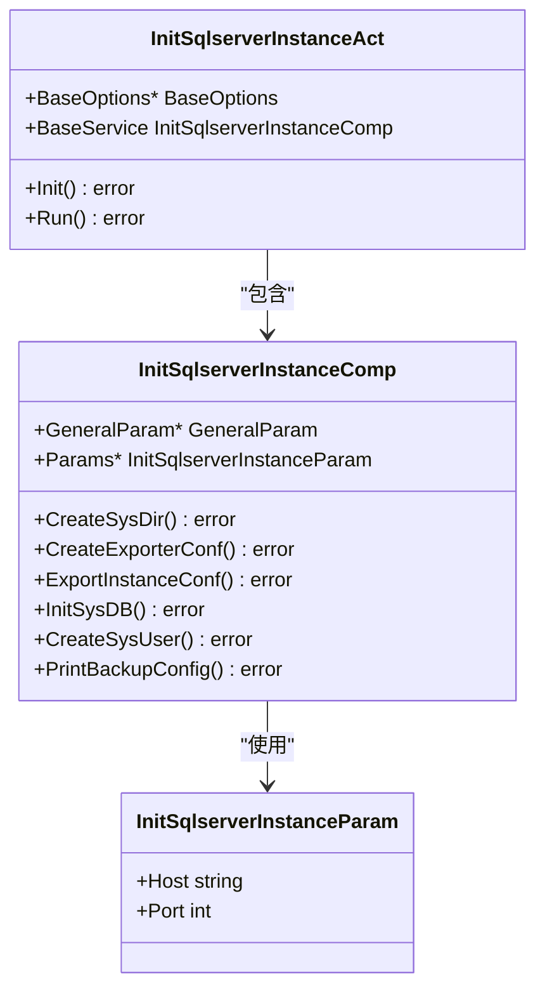
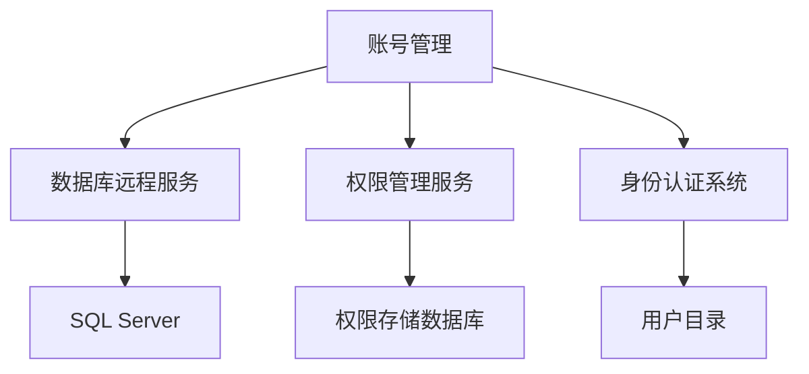

# SQL Server账号管理

<cite>
**本文档引用的文件**  
- [init_sqlserver_instance.go](file://dbm-services/sqlserver/db-tools/dbactuator/pkg/components/sqlserver/init_sqlserver_instance.go)
- [account.py](file://dbm-services/sqlserver/permission/account.py)
- [handlers.py](file://dbm-ui/backend/db_services/sqlserver/permission/db_account/handlers.py)
- [sqlserver_db_function.py](file://dbm-ui/backend/flow/utils/sqlserver/sqlserver_db_function.py)
- [init_sqlserver_instance.go](file://dbm-services/sqlserver/db-tools/dbactuator/internal/subcmd/sqlservercmd/init_sqlserver_instance.go)
</cite>

## 目录
1. [引言](#引言)
2. [项目结构](#项目结构)
3. [核心组件](#核心组件)
4. [架构概述](#架构概述)
5. [详细组件分析](#详细组件分析)
6. [依赖分析](#依赖分析)
7. [性能考虑](#性能考虑)
8. [故障排除指南](#故障排除指南)
9. [结论](#结论)

## 引言
本文档详细阐述了SQL Server账号管理功能的实现，重点分析了`db_services/sqlserver/permission/account.py`中的账号创建、修改和删除逻辑，以及`init_sqlserver_instance.go`中的实例初始化过程。通过示例展示账号生命周期管理的完整流程，并讨论账号命名规范、密码策略和安全审计的最佳实践。

## 项目结构
SQL Server账号管理功能主要分布在`dbm-services/sqlserver`目录下，核心功能包括账号管理、权限控制和实例初始化。相关文件分布在`db-tools/dbactuator`和`dbm-ui/backend`目录中，形成了完整的账号管理解决方案。

**Section sources**
- [init_sqlserver_instance.go](file://dbm-services/sqlserver/db-tools/dbactuator/pkg/components/sqlserver/init_sqlserver_instance.go)
- [account.py](file://dbm-services/sqlserver/permission/account.py)

## 核心组件
SQL Server账号管理的核心组件包括账号创建、修改、删除功能以及实例初始化过程。这些功能通过Go语言实现的后端服务和Python语言实现的前端处理协同工作，提供了完整的账号生命周期管理能力。

**Section sources**
- [handlers.py](file://dbm-ui/backend/db_services/sqlserver/permission/db_account/handlers.py)
- [sqlserver_db_function.py](file://dbm-ui/backend/flow/utils/sqlserver/sqlserver_db_function.py)

## 架构概述
SQL Server账号管理采用分层架构设计，前端通过API调用后端服务，后端服务通过DRS（Database Remote Service）执行具体的数据库操作。权限管理通过IAM（Identity and Access Management）系统进行控制，确保操作的安全性。

**Diagram sources **
- [handlers.py](file://dbm-ui/backend/db_services/sqlserver/permission/db_account/handlers.py)
- [init_sqlserver_instance.go](file://dbm-services/sqlserver/db-tools/dbactuator/pkg/components/sqlserver/init_sqlserver_instance.go)

## 详细组件分析

### 账号管理分析
SQL Server账号管理功能实现了完整的账号生命周期管理，包括创建、修改和删除操作。系统特别要求为每个账号生成唯一的SID（安全标识符），以确保账号在不同实例间的唯一性。

#### 账号创建流程

**Diagram sources **
- [handlers.py](file://dbm-ui/backend/db_services/sqlserver/permission/db_account/handlers.py)
- [sqlserver_db_function.py](file://dbm-ui/backend/flow/utils/sqlserver/sqlserver_db_function.py)

#### 账号删除流程

**Diagram sources **
- [sqlserver_db_function.py](file://dbm-ui/backend/flow/utils/sqlserver/sqlserver_db_function.py)
- [init_sqlserver_instance.go](file://dbm-services/sqlserver/db-tools/dbactuator/pkg/components/sqlserver/init_sqlserver_instance.go)

### 实例初始化分析
SQL Server实例初始化过程包含多个关键步骤，确保新接入的实例符合系统标准和安全要求。

#### 实例初始化流程

**Diagram sources **
- [init_sqlserver_instance.go](file://dbm-services/sqlserver/db-tools/dbactuator/internal/subcmd/sqlservercmd/init_sqlserver_instance.go)
- [init_sqlserver_instance.go](file://dbm-services/sqlserver/db-tools/dbactuator/pkg/components/sqlserver/init_sqlserver_instance.go)

**Section sources**
- [init_sqlserver_instance.go](file://dbm-services/sqlserver/db-tools/dbactuator/internal/subcmd/sqlservercmd/init_sqlserver_instance.go)
- [init_sqlserver_instance.go](file://dbm-services/sqlserver/db-tools/dbactuator/pkg/components/sqlserver/init_sqlserver_instance.go)

## 依赖分析
SQL Server账号管理功能依赖于多个核心组件和服务，包括数据库远程服务(DRS)、权限管理服务(DBPrivManagerApi)和身份认证系统(IAM)。这些依赖关系确保了账号管理操作的安全性和可靠性。

**Diagram sources **
- [handlers.py](file://dbm-ui/backend/db_services/sqlserver/permission/db_account/handlers.py)
- [init_sqlserver_instance.go](file://dbm-services/sqlserver/db-tools/dbactuator/pkg/components/sqlserver/init_sqlserver_instance.go)

**Section sources**
- [handlers.py](file://dbm-ui/backend/db_services/sqlserver/permission/db_account/handlers.py)
- [init_sqlserver_instance.go](file://dbm-services/sqlserver/db-tools/dbactuator/pkg/components/sqlserver/init_sqlserver_instance.go)

## 性能考虑
SQL Server账号管理操作的性能主要受网络延迟和数据库响应时间影响。批量操作时应考虑连接池管理和事务控制，避免对数据库造成过大压力。建议在非高峰时段执行大规模账号管理操作。

## 故障排除指南
常见问题包括账号创建失败、权限不足和连接超时。排查时应首先检查IAM权限配置，然后验证DRS服务状态，最后确认目标SQL Server实例的可用性。日志文件位于系统指定的日志目录中，包含详细的错误信息。

**Section sources**
- [init_sqlserver_instance.go](file://dbm-services/sqlserver/db-tools/dbactuator/pkg/components/sqlserver/init_sqlserver_instance.go)
- [handlers.py](file://dbm-ui/backend/db_services/sqlserver/permission/db_account/handlers.py)

## 结论
SQL Server账号管理功能通过完善的架构设计和严格的权限控制，提供了安全可靠的账号生命周期管理能力。系统通过生成唯一SID确保账号的全局唯一性，并通过多层验证机制保障操作的安全性。建议在使用时遵循最佳实践，定期审计账号权限，确保系统安全。