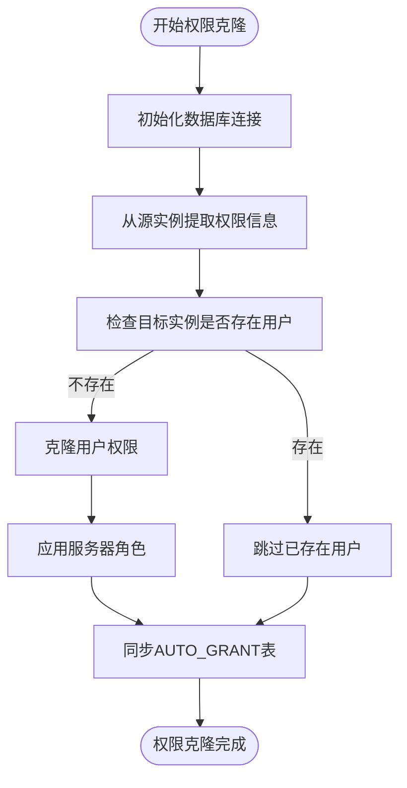
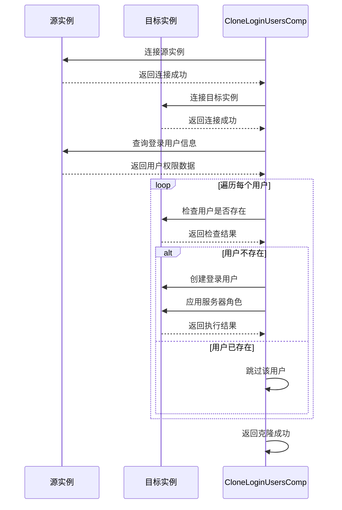
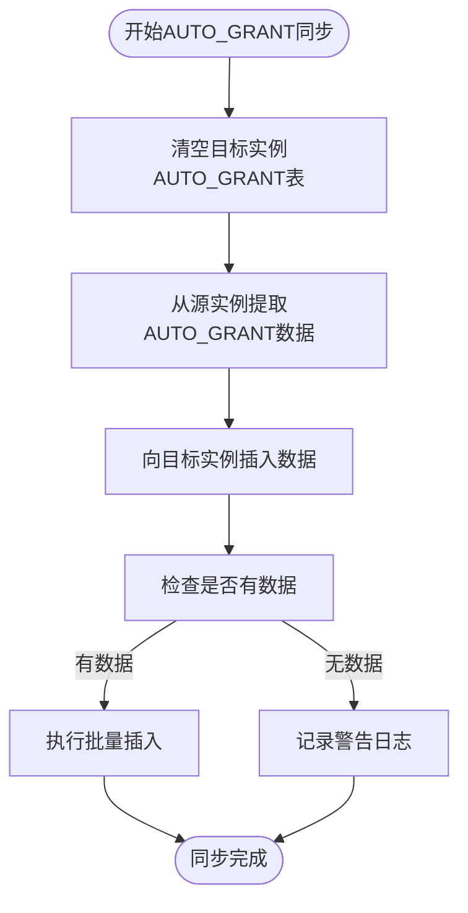

# 权限授权与克隆

<cite>
**本文档引用文件**   
- [clone_grants.go](file://dbm-services/sqlserver/db-tools/dbactuator/pkg/components/sqlserver/clone_grants.go)
- [clone_grants.go](file://dbm-services/sqlserver/db-tools/dbactuator/internal/subcmd/sqlservercmd/clone_grants.go)
- [const.go](file://dbm-services/sqlserver/db-tools/dbactuator/pkg/core/cst/const.go)
- [sqlserver.go](file://dbm-services/sqlserver/db-tools/dbactuator/pkg/util/sqlserver/sqlserver.go)
- [monitor_dbm.sql](file://dbm-services/sqlserver/db-tools/dbactuator/pkg/core/staticembed/monitor_dbm.sql)
</cite>

## 目录
1. [引言](#引言)
2. [权限克隆实现逻辑](#权限克隆实现逻辑)
3. [源实例权限提取](#源实例权限提取)
4. [目标实例权限应用](#目标实例权限应用)
5. [冲突处理策略](#冲突处理策略)
6. [AUTO_GRANT表同步机制](#auto_grant表同步机制)
7. [最小权限原则应用](#最小权限原则应用)
8. [权限审计实现](#权限审计实现)
9. [总结](#总结)

## 引言
本文档深入分析SQL Server权限授权机制，重点解析`clone_grants.go`中的权限克隆实现逻辑。通过分析代码实现，展示跨实例权限同步的技术细节，包括源实例权限提取、目标实例权限应用和冲突处理策略。同时讨论最小权限原则的应用和权限审计的实现方式。

## 权限克隆实现逻辑
SQL Server权限克隆功能通过`CloneLoginUsersComp`结构体实现，该结构体包含权限克隆的核心逻辑。权限克隆过程分为两个主要步骤：克隆登录用户权限和克隆AUTO_GRANT表数据。



**Diagram sources**
- [clone_grants.go](file://dbm-services/sqlserver/db-tools/dbactuator/pkg/components/sqlserver/clone_grants.go#L26-L31)

**Section sources**
- [clone_grants.go](file://dbm-services/sqlserver/db-tools/dbactuator/pkg/components/sqlserver/clone_grants.go#L26-L31)

## 源实例权限提取
权限克隆的第一步是从源实例提取用户权限信息。系统通过`GET_LOGIN_INFO`常量定义的SQL查询语句从源实例获取登录用户信息。

```go
const GET_LOGIN_INFO = "select a.name as login_name ,a.sid as sid, " +
    "password_hash,default_database_name,dbcreator,sysadmin, " +
    "securityadmin,serveradmin,setupadmin,processadmin,diskadmin,bulkadmin " +
    "from master.sys.sql_logins a left join sys.syslogins b " +
    "on a.name=b.name where principal_id>4 and a.name not in('%s') " +
    "and a.name not like '%s' and a.name not like '##%%##' "
```

提取的权限信息包括：
- **LoginName**: 登录用户名
- **Sid**: 安全标识符
- **PasswordHash**: 密码哈希值
- **DefaultDBName**: 默认数据库
- **SysAdmin**: 系统管理员角色
- **SecurityAdmin**: 安全管理员角色
- **ServerAdmin**: 服务器管理员角色
- **SetupAdmin**: 安装管理员角色
- **ProcessAdmin**: 进程管理员角色
- **DiskAdmin**: 磁盘管理员角色
- **Dbcreator**: 数据库创建者角色
- **BulkAdmin**: 批量操作管理员角色

**Section sources**
- [const.go](file://dbm-services/sqlserver/db-tools/dbactuator/pkg/core/cst/const.go#L162-L168)
- [clone_grants.go](file://dbm-services/sqlserver/db-tools/dbactuator/pkg/components/sqlserver/clone_grants.go#L56-L69)

## 目标实例权限应用
在提取源实例权限信息后，系统将这些权限应用到目标实例。权限应用过程通过`CloneGrant`方法实现，该方法遍历每个登录用户并执行相应的权限克隆操作。



**Diagram sources**
- [clone_grants.go](file://dbm-services/sqlserver/db-tools/dbactuator/pkg/components/sqlserver/clone_grants.go#L102-L151)

**Section sources**
- [clone_grants.go](file://dbm-services/sqlserver/db-tools/dbactuator/pkg/components/sqlserver/clone_grants.go#L102-L151)

## 冲突处理策略
权限克隆过程中，系统实现了完善的冲突处理策略，确保权限同步的安全性和一致性。

### 用户存在性检查
在克隆权限前，系统会检查目标实例是否已存在同名用户：

```go
checkCmd := fmt.Sprintf(
    "SELECT count(0) FROM SYS.syslogins WHERE name='%s' and sid = 0x%s;",
    info.LoginName, hex.EncodeToString(info.Sid),
)
```

如果用户已存在，则跳过该用户的克隆操作，避免重复创建。

### SID一致性验证
系统不仅检查用户名，还验证安全标识符(SID)的一致性。只有当用户名和SID都匹配时，才认为用户已存在。这种双重验证机制可以防止不同用户使用相同名称的情况。

### 错误处理机制
权限克隆过程中，系统实现了完善的错误处理机制：

```go
if _, err := c.LocalDB.ExecMore(execCmds); err != nil {
    logger.Error("clone grants failed %v", err)
    return err
}
```

当执行权限克隆命令失败时，系统会记录错误日志并返回错误，确保操作的可追溯性。

**Section sources**
- [clone_grants.go](file://dbm-services/sqlserver/db-tools/dbactuator/pkg/components/sqlserver/clone_grants.go#L123-L134)
- [clone_grants.go](file://dbm-services/sqlserver/db-tools/dbactuator/pkg/components/sqlserver/clone_grants.go#L145-L148)

## AUTO_GRANT表同步机制
除了登录用户权限，系统还同步`AUTO_GRANT`表中的数据库级权限信息。`AUTO_GRANT`表存储了自动授权规则，用于在新数据库创建时自动应用相应的权限。

### AUTO_GRANT表结构
```sql
CREATE TABLE [dbo].[AUTO_GRANT](
    [ACCOUNT] [varchar](200) NOT NULL,
    [GRANT_DB] [varchar](200) NOT NULL,
    [GRANT_TYPE] [varchar](200) NOT NULL,
    [UPDATE_TIME] [datetime] NOT NULL
)
```

### 同步流程


同步过程包括以下步骤：
1. 清空目标实例的`AUTO_GRANT`表
2. 从源实例提取`AUTO_GRANT`表数据
3. 将数据插入到目标实例

**Diagram sources**
- [monitor_dbm.sql](file://dbm-services/sqlserver/db-tools/dbactuator/pkg/core/staticembed/monitor_dbm.sql#L432-L438)
- [clone_grants.go](file://dbm-services/sqlserver/db-tools/dbactuator/pkg/components/sqlserver/clone_grants.go#L213-L247)

**Section sources**
- [clone_grants.go](file://dbm-services/sqlserver/db-tools/dbactuator/pkg/components/sqlserver/clone_grants.go#L213-L247)

## 最小权限原则应用
系统在权限管理中充分体现了最小权限原则，确保用户只拥有完成其工作所需的最小权限集。

### 服务器角色管理
系统通过`GetLoginCheckRoleName`函数精确控制服务器角色的分配：

```go
func GetLoginCheckRoleName(cmds []string, info LoginInfo) []string {
    if info.SysAdmin == 1 {
        cmds = append(cmds, fmt.Sprintf(
            "exec master.dbo.sp_addsrvrolemember @loginame = N'%s', @rolename = N'sysadmin'",
            info.LoginName,
        ))
    }
    // 其他角色处理...
    return cmds
}
```

### 系统账号过滤
在权限提取时，系统会过滤掉系统账号和临时账号：

```go
const GET_LOGIN_INFO = "... where principal_id>4 and a.name not in('%s') " +
    "and a.name not like '%s' and a.name not like '##%%##' "
```

其中：
- `principal_id>4` 排除系统内置账号
- `name not in('%s')` 排除指定的系统账号
- `name not like '%s'` 排除临时作业用户
- `name not like '##%%##'` 排除系统内部账号

### 权限模板化
系统使用预定义的SQL模板来创建和管理权限，确保权限分配的一致性和安全性：

```go
const EXEC_INIT_LOGIN_SQL = `
USE [master]
DECLARE @username NVARCHAR(50) = '%s'
DECLARE @pwd NVARCHAR(50) = '%s'
DECLARE @role NVARCHAR(50) = '%s'
...
`
```

**Section sources**
- [clone_grants.go](file://dbm-services/sqlserver/db-tools/dbactuator/pkg/components/sqlserver/clone_grants.go#L154-L206)
- [const.go](file://dbm-services/sqlserver/db-tools/dbactuator/pkg/core/cst/const.go#L224-L241)

## 权限审计实现
系统通过多种机制实现权限审计，确保权限变更的可追溯性和安全性。

### JOB_AUTO_GRANT存储过程
系统通过`JOB_AUTO_GRANT`存储过程实现自动权限授予：

```sql
CREATE PROC [dbo].[JOB_AUTO_GRANT]
AS
BEGIN
    SET NOCOUNT ON
    
    DECLARE @ACCOUNT VARCHAR(200),@GRANT_DB VARCHAR(200),@GRANT_TYPE VARCHAR(200)
    DECLARE list_cur cursor static forward_only Read_only for 
    select ACCOUNT,GRANT_DB,GRANT_TYPE from [Monitor].[dbo].[AUTO_GRANT] 
    where ACCOUNT IN(select name from master.sys.sql_logins where is_disabled=0)
    
    OPEN list_cur;
    FETCH NEXT FROM list_cur INTO @ACCOUNT,@GRANT_DB,@GRANT_TYPE
    WHILE @@FETCH_STATUS = 0
    BEGIN
        SET @SQL = ''
        SELECT @SQL = ISNULL(@SQL+'','')+'USE ['+name+'] 
        IF EXISTS (SELECT * FROM sys.database_principals WHERE name = N'''+@ACCOUNT+''') 
        BEGIN EXEC ['+name+'].dbo.sp_change_users_login ''AUTO_FIX'','''+@ACCOUNT+''' 
        END ELSE BEGIN CREATE USER ['+@ACCOUNT+'] FOR LOGIN ['+@ACCOUNT+'] 
        END;EXEC sp_addrolemember N'''+@GRANT_TYPE+''', N'''+@ACCOUNT+''';'
        from master.sys.databases where database_id>4 and name not in('Monitor') 
        and state=0 and is_read_only=0 and is_distributor = 0 and name like @GRANT_DB
        PRINT(@SQL)
        EXEC(@SQL)
        
        FETCH NEXT FROM list_cur INTO @ACCOUNT,@GRANT_DB,@GRANT_TYPE;
    END
    CLOSE list_cur;
    DEALLOCATE list_cur;
END
```

### TC_AUTO_GRANT作业
系统创建`TC_AUTO_GRANT` SQL Server作业，定期执行`JOB_AUTO_GRANT`存储过程：

```sql
EXEC @ReturnCode = msdb.dbo.sp_add_job @job_name=N'TC_AUTO_GRANT', 
    @enabled=1, 
    @description=N'No description available.', 
    @category_name=N'[Uncategorized (Local)]', 
    @owner_login_name=N'sa'
    
EXEC @ReturnCode = msdb.dbo.sp_add_jobstep @job_id=@jobId, @step_name=N'TC_AUTO_GRANT', 
    @subsystem=N'TSQL', 
    @command=N'EXEC Monitor.DBO.JOB_AUTO_GRANT'
    
EXEC @ReturnCode = msdb.dbo.sp_add_jobschedule @job_id=@jobId, @name=N'TC_AUTO_GRANT', 
    @freq_type=4, 
    @freq_interval=1, 
    @freq_subday_type=4, 
    @freq_subday_interval=1
```

该作业配置为每分钟执行一次，确保新创建的数据库能够及时获得相应的权限。

### 日志记录
系统在权限操作过程中记录详细的日志信息：

```go
logger.Info("[%s] login user already exists ,skip", info.LoginName)
logger.Warn("[%s:%d] there is no login user set here", c.Params.SourceHost, c.Params.SourcePort)
logger.Error("clone grants failed %v", err)
```

日志记录包括：
- 信息级别：记录正常操作
- 警告级别：记录潜在问题
- 错误级别：记录操作失败

**Section sources**
- [monitor_dbm.sql](file://dbm-services/sqlserver/db-tools/dbactuator/pkg/core/staticembed/monitor_dbm.sql#L753-L788)
- [monitor_dbm.sql](file://dbm-services/sqlserver/db-tools/dbactuator/pkg/core/staticembed/monitor_dbm.sql#L4152-L4195)
- [clone_grants.go](file://dbm-services/sqlserver/db-tools/dbactuator/pkg/components/sqlserver/clone_grants.go#L115-L116)
- [clone_grants.go](file://dbm-services/sqlserver/db-tools/dbactuator/pkg/components/sqlserver/clone_grants.go#L132-L133)
- [clone_grants.go](file://dbm-services/sqlserver/db-tools/dbactuator/pkg/components/sqlserver/clone_grants.go#L146-L147)

## 总结
本文档深入分析了SQL Server权限授权与克隆机制，重点解析了`clone_grants.go`中的实现逻辑。系统通过以下方式实现了安全、高效的权限管理：

1. **权限克隆机制**：通过提取源实例权限信息并应用到目标实例，实现跨实例权限同步。
2. **冲突处理策略**：通过用户存在性检查和SID验证，避免权限冲突。
3. **最小权限原则**：通过精确的服务器角色管理和系统账号过滤，确保权限分配的最小化。
4. **权限审计机制**：通过自动作业和详细日志记录，实现权限变更的可追溯性。

这些机制共同构成了一个完整的权限管理体系，确保了数据库环境的安全性和一致性。