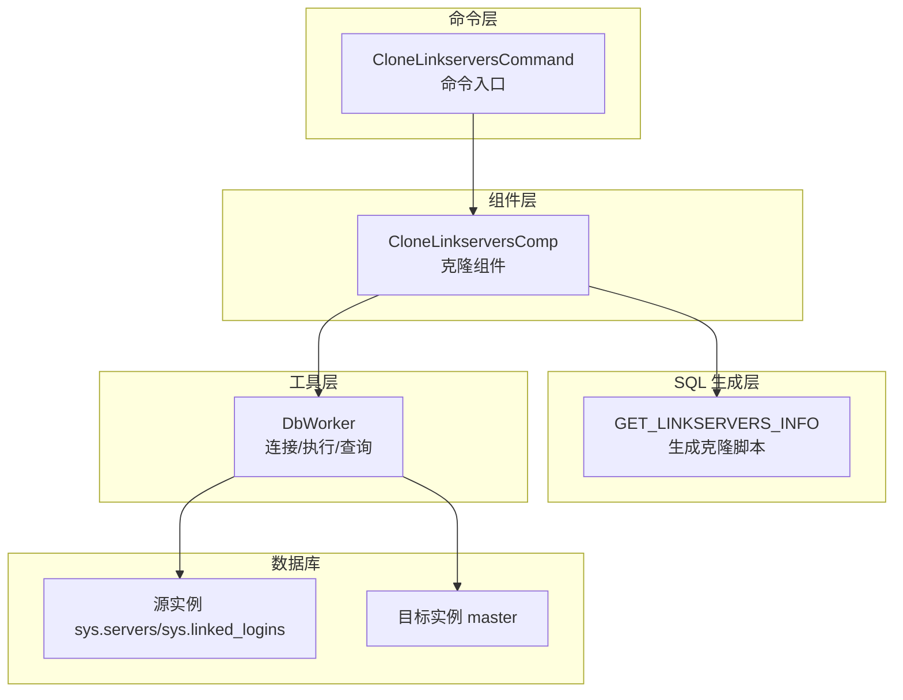
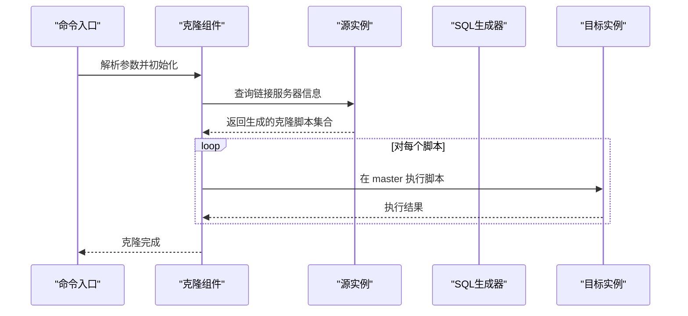
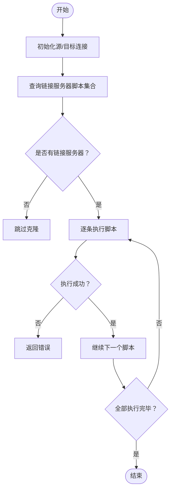
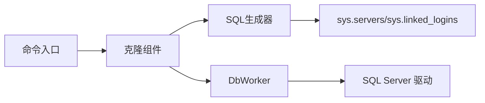

# 链接服务器配置

<cite>
**本文引用的文件**
- [clone_linkserver.go](file://dbm-services/sqlserver/db-tools/dbactuator/internal/subcmd/sqlservercmd/clone_linkserver.go)
- [clone_linkservers.go](file://dbm-services/sqlserver/db-tools/dbactuator/pkg/components/sqlserver/clone_linkservers.go)
- [get_linkservers_sql.go](file://dbm-services/sqlserver/db-tools/dbactuator/pkg/core/cst/get_linkservers_sql.go)
- [sqlserver.go](file://dbm-services/sqlserver/db-tools/dbactuator/pkg/util/sqlserver/sqlserver.go)
- [monitor_dbm.sql](file://dbm-services/sqlserver/db-tools/dbactuator/pkg/core/staticembed/monitor_dbm.sql)
</cite>

## 目录
1. [简介](#简介)
2. [项目结构](#项目结构)
3. [核心组件](#核心组件)
4. [架构总览](#架构总览)
5. [详细组件分析](#详细组件分析)
6. [依赖关系分析](#依赖关系分析)
7. [性能考虑](#性能考虑)
8. [故障排查指南](#故障排查指南)
9. [结论](#结论)
10. [附录](#附录)

## 简介
本文件围绕 SQL Server 链接服务器（Linked Server）的配置与管理进行系统化说明，重点解析仓库中与“克隆链接服务器”相关的实现，包括：
- 链接服务器的发现与生成脚本
- 从源实例到目标实例的克隆流程
- 测试与验证思路
- 跨服务器查询与分布式事务的配置要点
- 安全配置、性能优化与常见问题排查

该能力由命令层、组件层、SQL 生成层与数据库连接工具层协同完成，确保在不同实例间快速复制链接服务器及其登录映射与选项。

## 项目结构
与链接服务器克隆直接相关的模块分布如下：
- 命令层：提供 CLI 子命令入口，负责参数解析与步骤编排
- 组件层：封装克隆逻辑，负责连接源/目标实例并执行 SQL
- SQL 生成层：动态生成链接服务器创建与选项设置脚本
- 工具层：提供 SQL Server 数据库连接、执行与查询能力

图表来源
- [clone_linkserver.go](file://dbm-services/sqlserver/db-tools/dbactuator/internal/subcmd/sqlservercmd/clone_linkserver.go#L30-L84)
- [clone_linkservers.go](file://dbm-services/sqlserver/db-tools/dbactuator/pkg/components/sqlserver/clone_linkservers.go#L41-L92)
- [get_linkservers_sql.go](file://dbm-services/sqlserver/db-tools/dbactuator/pkg/core/cst/get_linkservers_sql.go#L13-L133)
- [sqlserver.go](file://dbm-services/sqlserver/db-tools/dbactuator/pkg/util/sqlserver/sqlserver.go#L86-L176)

章节来源
- [clone_linkserver.go](file://dbm-services/sqlserver/db-tools/dbactuator/internal/subcmd/sqlservercmd/clone_linkserver.go#L30-L84)
- [clone_linkservers.go](file://dbm-services/sqlserver/db-tools/dbactuator/pkg/components/sqlserver/clone_linkservers.go#L41-L92)
- [get_linkservers_sql.go](file://dbm-services/sqlserver/db-tools/dbactuator/pkg/core/cst/get_linkservers_sql.go#L13-L133)
- [sqlserver.go](file://dbm-services/sqlserver/db-tools/dbactuator/pkg/util/sqlserver/sqlserver.go#L86-L176)

## 核心组件
- 命令入口（CloneLinkserversCommand）：注册子命令，解析参数，调用组件执行克隆步骤
- 克隆组件（CloneLinkserversComp）：建立源/目标实例连接，查询生成的克隆脚本，逐条在目标实例执行
- SQL 生成器（GET_LINKSERVERS_INFO）：遍历 sys.servers 与 sys.linked_logins，拼装 sp_addlinkedserver、sp_addlinkedsrvlogin、sp_serveroption 等脚本
- 数据库连接工具（DbWorker）：封装连接、执行、查询、批量执行等通用能力

章节来源
- [clone_linkserver.go](file://dbm-services/sqlserver/db-tools/dbactuator/internal/subcmd/sqlservercmd/clone_linkserver.go#L30-L84)
- [clone_linkservers.go](file://dbm-services/sqlserver/db-tools/dbactuator/pkg/components/sqlserver/clone_linkservers.go#L27-L92)
- [get_linkservers_sql.go](file://dbm-services/sqlserver/db-tools/dbactuator/pkg/core/cst/get_linkservers_sql.go#L13-L133)
- [sqlserver.go](file://dbm-services/sqlserver/db-tools/dbactuator/pkg/util/sqlserver/sqlserver.go#L86-L176)

## 架构总览
下面的序列图展示了“克隆链接服务器”的完整流程，从命令入口到目标实例执行脚本。

图表来源
- [clone_linkserver.go](file://dbm-services/sqlserver/db-tools/dbactuator/internal/subcmd/sqlservercmd/clone_linkserver.go#L46-L83)
- [clone_linkservers.go](file://dbm-services/sqlserver/db-tools/dbactuator/pkg/components/sqlserver/clone_linkservers.go#L71-L92)
- [get_linkservers_sql.go](file://dbm-services/sqlserver/db-tools/dbactuator/pkg/core/cst/get_linkservers_sql.go#L13-L133)

## 详细组件分析

### 命令入口与步骤编排
- 注册子命令 CloneLinkservers，提供示例用法
- 初始化组件参数与运行时环境
- 将“克隆链接服务器”作为单一步骤执行

章节来源
- [clone_linkserver.go](file://dbm-services/sqlserver/db-tools/dbactuator/internal/subcmd/sqlservercmd/clone_linkserver.go#L30-L84)

### 克隆组件与执行流程
- 初始化：分别使用 SA 凭据连接源实例与目标实例
- 克隆流程：
  - 从源实例查询链接服务器脚本集合
  - 若无链接服务器，跳过；否则逐条在目标实例执行
- 错误处理：任一步失败即终止并返回错误

图表来源
- [clone_linkservers.go](file://dbm-services/sqlserver/db-tools/dbactuator/pkg/components/sqlserver/clone_linkservers.go#L41-L92)

章节来源
- [clone_linkservers.go](file://dbm-services/sqlserver/db-tools/dbactuator/pkg/components/sqlserver/clone_linkservers.go#L41-L92)

### SQL 生成器：链接服务器脚本生成
- 遍历 sys.servers，收集每个链接服务器的关键属性（产品名、数据源、选项等）
- 收集 sys.linked_logins 中的登录映射（含 useself 与 remote_name）
- 生成脚本片段：
  - 删除同名链接服务器（带 droplogins）
  - 添加链接服务器（根据数据源是否包含点决定是否传入 provider）
  - 添加链接服务器登录映射（useself=True，以及针对 sa 的映射）
  - 设置各类 server option（如 collation compatible、data access、rpc、rpc out、sub、connect timeout、lazy schema validation、query timeout、use remote collation、remote proc transaction promotion）

章节来源
- [get_linkservers_sql.go](file://dbm-services/sqlserver/db-tools/dbactuator/pkg/core/cst/get_linkservers_sql.go#L13-L133)

### 数据库连接工具：DbWorker
- 连接：基于 DSN 建立连接，Ping 校验超时
- 执行：支持单条/多条 SQL 执行，必要时以 sa 身份执行
- 查询：提供 Select/Get 接口
- 其他：导出 CSV、检查进程、获取实例信息等辅助能力

章节来源
- [sqlserver.go](file://dbm-services/sqlserver/db-tools/dbactuator/pkg/util/sqlserver/sqlserver.go#L86-L176)
- [sqlserver.go](file://dbm-services/sqlserver/db-tools/dbactuator/pkg/util/sqlserver/sqlserver.go#L178-L205)
- [sqlserver.go](file://dbm-services/sqlserver/db-tools/dbactuator/pkg/util/sqlserver/sqlserver.go#L207-L241)

## 依赖关系分析
- 命令层依赖组件层
- 组件层依赖 SQL 生成层与工具层
- 工具层依赖 SQL Server 驱动与第三方库
- 组件层与工具层均依赖 sys.servers 与 sys.linked_logins 系统视图

图表来源
- [clone_linkserver.go](file://dbm-services/sqlserver/db-tools/dbactuator/internal/subcmd/sqlservercmd/clone_linkserver.go#L30-L84)
- [clone_linkservers.go](file://dbm-services/sqlserver/db-tools/dbactuator/pkg/components/sqlserver/clone_linkservers.go#L41-L92)
- [get_linkservers_sql.go](file://dbm-services/sqlserver/db-tools/dbactuator/pkg/core/cst/get_linkservers_sql.go#L13-L133)
- [sqlserver.go](file://dbm-services/sqlserver/db-tools/dbactuator/pkg/util/sqlserver/sqlserver.go#L86-L111)

章节来源
- [clone_linkserver.go](file://dbm-services/sqlserver/db-tools/dbactuator/internal/subcmd/sqlservercmd/clone_linkserver.go#L30-L84)
- [clone_linkservers.go](file://dbm-services/sqlserver/db-tools/dbactuator/pkg/components/sqlserver/clone_linkservers.go#L41-L92)
- [get_linkservers_sql.go](file://dbm-services/sqlserver/db-tools/dbactuator/pkg/core/cst/get_linkservers_sql.go#L13-L133)
- [sqlserver.go](file://dbm-services/sqlserver/db-tools/dbactuator/pkg/util/sqlserver/sqlserver.go#L86-L111)

## 性能考虑
- 连接与超时：连接建立时设置超时，避免长时间阻塞
- 单连接批量执行：在需要时以同一连接批量执行 SQL，减少握手开销
- 仅在必要时切换身份：以 sa 身份执行需谨慎，尽量在最小范围内使用
- 生成脚本的幂等性：先删除再创建，避免重复导致的额外开销
- 监控与配置：可通过配置项开启跨数据库所有权链、远程访问等，便于分布式查询与事务场景

章节来源
- [sqlserver.go](file://dbm-services/sqlserver/db-tools/dbactuator/pkg/util/sqlserver/sqlserver.go#L86-L111)
- [sqlserver.go](file://dbm-services/sqlserver/db-tools/dbactuator/pkg/util/sqlserver/sqlserver.go#L122-L176)
- [monitor_dbm.sql](file://dbm-services/sqlserver/db-tools/dbactuator/pkg/core/staticembed/monitor_dbm.sql#L22-L47)

## 故障排查指南
- 连接失败
  - 检查 DSN 参数（主机、端口、凭据）
  - 使用 PingContext 校验网络连通性与超时
- 权限不足
  - 确认使用 SA 凭据
  - 在需要时以 sa 身份执行脚本
- 脚本执行失败
  - 查看每条脚本的返回信息
  - 确认链接服务器名称唯一且未被占用
- 登录映射问题
  - 确认 useself 与 remote_name 的组合正确
  - 验证本地登录与远程登录映射是否按预期设置
- 分布式事务与跨服务器查询
  - 确认已启用相关配置（如允许跨数据库所有权链、远程访问等）
  - 在分布式事务场景中，关注链接服务器选项（如 remote proc transaction promotion）与网络延迟

章节来源
- [sqlserver.go](file://dbm-services/sqlserver/db-tools/dbactuator/pkg/util/sqlserver/sqlserver.go#L86-L111)
- [sqlserver.go](file://dbm-services/sqlserver/db-tools/dbactuator/pkg/util/sqlserver/sqlserver.go#L122-L176)
- [get_linkservers_sql.go](file://dbm-services/sqlserver/db-tools/dbactuator/pkg/core/cst/get_linkservers_sql.go#L99-L122)
- [monitor_dbm.sql](file://dbm-services/sqlserver/db-tools/dbactuator/pkg/core/staticembed/monitor_dbm.sql#L22-L47)

## 结论
本实现通过“命令入口 + 组件 + SQL 生成 + 工具”的分层设计，实现了从源实例到目标实例的链接服务器克隆。其核心优势在于：
- 自动化生成脚本，覆盖链接服务器创建、登录映射与选项设置
- 严格的错误处理与步骤编排，保证克隆过程的可靠性
- 提供连接、执行、查询等通用能力，便于扩展其他 SQL Server 管理任务

在实际使用中，建议结合安全策略、性能配置与监控手段，确保链接服务器在生产环境中的稳定与高效。

## 附录

### 示例：配置跨服务器查询与分布式事务
- 开启必要的配置项以支持跨数据库查询与远程访问
- 在链接服务器上设置合适的选项（如 data access、rpc、rpc out、remote proc transaction promotion）
- 验证登录映射（useself 与 remote_name），确保访问权限正确
- 在分布式事务场景中，关注网络延迟与事务传播行为

章节来源
- [monitor_dbm.sql](file://dbm-services/sqlserver/db-tools/dbactuator/pkg/core/staticembed/monitor_dbm.sql#L22-L47)
- [get_linkservers_sql.go](file://dbm-services/sqlserver/db-tools/dbactuator/pkg/core/cst/get_linkservers_sql.go#L99-L122)