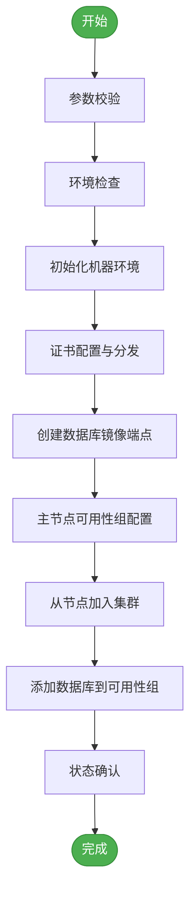
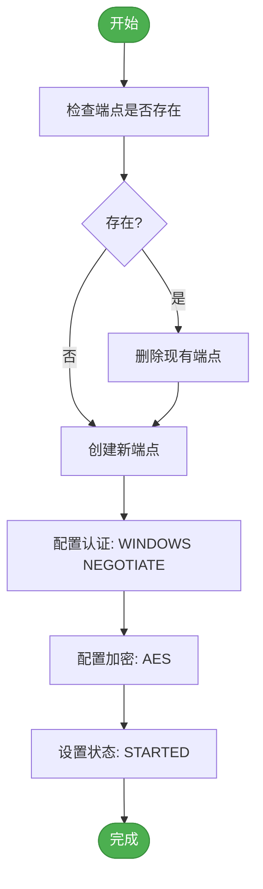
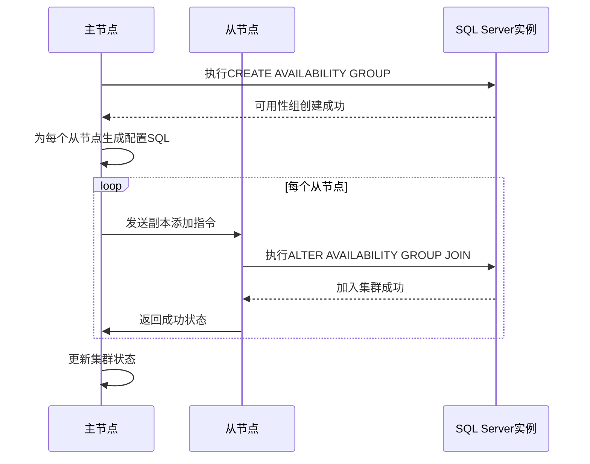
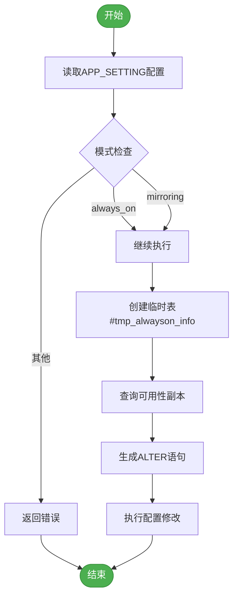

# AlwaysOn集群管理

<cite>
**本文档引用的文件**   
- [build_alwayson.go](file://dbm-services/sqlserver/db-tools/dbactuator/internal/subcmd/sqlservercmd/build_alwayson.go)
- [build_alwayson.go](file://dbm-services/sqlserver/db-tools/dbactuator/pkg/components/sqlserver/alwayson/build_alwayson.go)
- [create_always_on_sql.go](file://dbm-services/sqlserver/db-tools/dbactuator/pkg/core/cst/create_always_on_sql.go)
- [create_end_point_sql.go](file://dbm-services/sqlserver/db-tools/dbactuator/pkg/core/cst/create_end_point_sql.go)
- [init_machine_for_alwayson.go](file://dbm-services/sqlserver/db-tools/dbactuator/internal/subcmd/sqlservercmd/init_machine_for_alwayson.go)
- [monitor_dbm.sql](file://dbm-services/sqlserver/db-tools/dbactuator/pkg/core/staticembed/monitor_dbm.sql)
- [monitor_dbm_v2.sql](file://dbm-services/sqlserver/db-tools/dbactuator/pkg/core/staticembed/monitor_dbm_v2.sql)
</cite>

## 目录
1. [简介](#简介)
2. [AlwaysOn集群创建流程](#alwayson集群创建流程)
3. [核心组件分析](#核心组件分析)
4. [前置环境初始化](#前置环境初始化)
5. [证书与端点配置](#证书与端点配置)
6. [可用性组配置](#可用性组配置)
7. [配置同步机制](#配置同步机制)
8. [最佳实践与部署建议](#最佳实践与部署建议)
9. [常见问题排查](#常见问题排查)
10. [结论](#结论)

## 简介
SQL Server AlwaysOn高可用集群是企业级数据库系统中确保业务连续性的关键架构。本文档详细阐述了`db_services/sqlserver/cluster`模块如何处理AlwaysOn集群的生命周期管理，包括集群初始化、节点加入和配置同步等核心操作。通过深入分析`build_alwayson.go`中的实现细节，揭示了前置环境检查、证书配置与分发、数据库镜像端点创建以及可用性组配置等关键步骤的技术实现。文档还提供了集群创建的完整流程图，并讨论了副本同步模式选择、故障转移模式配置等最佳实践，以及证书信任问题和端点连接失败等常见部署问题的排查方法。

## AlwaysOn集群创建流程

**图示来源**
- [build_alwayson.go](file://dbm-services/sqlserver/db-tools/dbactuator/internal/subcmd/sqlservercmd/build_alwayson.go)
- [create_always_on_sql.go](file://dbm-services/sqlserver/db-tools/dbactuator/pkg/core/cst/create_always_on_sql.go)

## 核心组件分析

SQL Server AlwaysOn集群管理的核心实现位于`dbm-services/sqlserver/db-tools/dbactuator`模块中，主要由`build_alwayson.go`文件中的组件构成。该实现采用分层架构设计，将集群创建过程分解为多个可独立执行的步骤。

`BuildAlwaysOnAct`结构体作为命令行操作的入口点，负责接收用户输入参数并协调整个集群创建流程。它通过继承`BaseOptions`基类获取通用配置，并持有`BuildAlwaysOnComp`核心组件的实例来执行具体操作。

`BuildAlwaysOnComp`组件是集群创建逻辑的核心，包含三个主要方法：
- `Init()`：初始化阶段，建立与主从实例的数据库连接，获取实例信息，并计算端点监听端口
- `CreateEndPoint()`：创建数据库镜像端点，为AlwaysOn通信建立网络基础
- `BuildAlwayOn()`：构建AlwaysOn集群，执行可用性组的创建和节点加入操作

该组件通过`GeneralParam`和`Params`两个结构体分别管理运行时参数和业务参数，实现了配置与逻辑的分离。

**本节来源**
- [build_alwayson.go](file://dbm-services/sqlserver/db-tools/dbactuator/internal/subcmd/sqlservercmd/build_alwayson.go#L24-L88)
- [build_alwayson.go](file://dbm-services/sqlserver/db-tools/dbactuator/pkg/components/sqlserver/alwayson/build_alwayson.go#L23-L196)

## 前置环境初始化

在创建AlwaysOn集群之前，必须对参与集群的机器进行必要的环境初始化。`init_machine_for_alwayson.go`文件实现了这一关键的前置步骤，确保集群节点具备正确的网络和系统配置。

环境初始化主要包括两个核心操作：
1. **域名解析配置**：通过`AddHosts`方法在系统的hosts文件中添加必要的域名解析记录，确保集群节点之间可以通过主机名相互访问
2. **注册表配置**：通过`AddItemKey`方法在Windows注册表中添加特定的键值，为SQL Server AlwaysOn功能提供必要的系统级支持

这些初始化操作通过`InitMachineForAlwaysonAct`结构体实现，采用与集群创建相同的分步执行模式。每个操作都被封装为独立的函数，通过`steps.Run()`方法按顺序执行，确保了操作的原子性和可追溯性。

环境初始化是AlwaysOn集群部署的关键前提，缺少这些配置可能导致节点间通信失败或集群状态不稳定。

**本节来源**
- [init_machine_for_alwayson.go](file://dbm-services/sqlserver/db-tools/dbactuator/internal/subcmd/sqlservercmd/init_machine_for_alwayson.go#L23-L87)

## 证书与端点配置

AlwaysOn集群的安全通信依赖于正确的证书配置和数据库镜像端点的创建。系统通过预定义的SQL模板来实现这些关键配置。

### 端点创建
系统使用两个SQL模板来管理数据库镜像端点：
- `GET_DROP_END_POINT_SQL`：用于删除已存在的同名端点，确保配置的纯净性
- `GET_CREATE_END_POINT_SQL`：用于创建新的数据库镜像端点，配置监听端口和安全认证

端点创建过程首先在主节点执行（当`IsFirst`为true时），然后在所有从节点上执行。这种并行配置方式确保了所有集群节点都具备相同的端点配置，为后续的AlwaysOn通信奠定了基础。

### 证书配置
虽然具体的证书管理代码未在当前上下文中显示，但从系统设计可以看出，AlwaysOn通信采用Windows Negotiate认证和AES加密算法，这要求集群节点之间必须建立有效的证书信任链。证书的分发和信任配置通常在环境初始化阶段完成，确保所有节点都能通过安全认证进行通信。

**图示来源**
- [create_end_point_sql.go](file://dbm-services/sqlserver/db-tools/dbactuator/pkg/core/cst/create_end_point_sql.go)
- [build_alwayson.go](file://dbm-services/sqlserver/db-tools/dbactuator/pkg/components/sqlserver/alwayson/build_alwayson.go#L124-L145)

## 可用性组配置

可用性组的配置是AlwaysOn集群创建的核心环节，涉及主节点创建可用性组和从节点加入集群两个关键步骤。

### 主节点配置
主节点通过`CREATE_AlWAYS_ON_IN_DB` SQL模板创建可用性组，该模板包含以下关键配置：
- **自动备份偏好**：设置为PRIMARY，确保主节点负责备份操作
- **故障转移支持**：关闭DB_FAILOVER，采用手动故障转移模式
- **分布式事务**：禁用DTC_SUPPORT，简化事务管理
- **集群类型**：设置为NONE，适用于非Windows集群环境
- **同步要求**：REQUIRED_SYNCHRONIZED_SECONDARIES_TO_COMMIT设置为0，降低提交延迟

主节点还通过`CREATE_ALWAYS_ON_IN_DB_FOR_DR`模板为每个从节点添加副本配置，指定端点URL、故障转移模式、可用性模式等参数。

### 从节点配置
从节点通过`CREATE_AlWAYS_ON_IN_DR` SQL模板加入现有可用性组。该过程首先检查并清理可能存在的旧有可用性组配置，然后执行`ALTER AVAILABILITY GROUP ... JOIN`命令加入集群。

配置过程采用迭代方式，主节点依次为每个从节点执行配置操作。在首次配置时（`IsFirst`为true），主节点创建全新的可用性组；后续节点加入时，则在现有组中添加新副本。

**图示来源**
- [create_always_on_sql.go](file://dbm-services/sqlserver/db-tools/dbactuator/pkg/core/cst/create_always_on_sql.go)
- [build_alwayson.go](file://dbm-services/sqlserver/db-tools/dbactuator/pkg/components/sqlserver/alwayson/build_alwayson.go#L147-L195)

## 配置同步机制

AlwaysOn集群的配置同步机制确保了主从节点之间的一致性和可靠性。系统通过监控数据库中的特定表来管理和同步配置状态。

### 配置状态管理
系统使用`[Monitor].[dbo].[APP_SETTING]`表来存储和管理同步模式配置。通过查询`SYNCHRONOUS_MODE`字段，系统可以确定当前的同步模式：
- `always_on`：表示使用AlwaysOn同步模式
- `mirroring`：表示使用数据库镜像同步模式

如果既不是AlwaysOn也不是镜像模式，系统将返回错误，确保只有在正确的同步模式下才能执行相关操作。

### 动态配置调整
系统还包含动态调整可用性组配置的机制，可以在运行时修改以下参数：
- **可用性模式**：在同步提交(SYNCHRONOUS_COMMIT)和异步提交(ASYNCHRONOUS_COMMIT)之间切换
- **连接权限**：调整主角色和从角色的连接权限
- **同步要求**：修改提交所需的同步副本数量

这些调整通过动态生成的SQL语句实现，使用临时表`#tmp_alwayson_info`来存储需要修改的配置项，然后批量执行ALTER命令。

**图示来源**
- [monitor_dbm.sql](file://dbm-services/sqlserver/db-tools/dbactuator/pkg/core/staticembed/monitor_dbm.sql#L1867-L1886)
- [monitor_dbm_v2.sql](file://dbm-services/sqlserver/db-tools/dbactuator/pkg/core/staticembed/monitor_dbm_v2.sql#L1925-L1937)

## 最佳实践与部署建议

### 副本同步模式选择
- **同步提交模式**：适用于对数据一致性要求极高的场景，确保主从节点数据完全一致，但会增加事务提交延迟
- **异步提交模式**：适用于对性能要求较高的场景，主节点无需等待从节点确认即可提交事务，但存在数据丢失风险

建议根据业务需求选择合适的同步模式，关键业务系统推荐使用同步提交模式。

### 故障转移模式配置
- **手动故障转移**：系统默认采用手动模式，需要管理员显式执行故障转移操作，避免意外切换
- **自动故障转移**：仅在配置了同步提交模式且有见证服务器时可用，可实现快速自动切换

生产环境建议采用手动故障转移模式，通过监控系统和运维流程来控制故障转移时机。

### 性能优化建议
1. **端口规划**：为AlwaysOn端点分配专用端口，避免与其他服务冲突
2. **网络配置**：确保集群节点间有专用的高速网络连接，减少网络延迟
3. **资源分配**：为主从节点分配均衡的计算和存储资源，避免性能瓶颈
4. **监控配置**：部署完善的监控系统，实时跟踪集群状态和性能指标

**本节来源**
- [create_always_on_sql.go](file://dbm-services/sqlserver/db-tools/dbactuator/pkg/core/cst/create_always_on_sql.go)
- [build_alwayson.go](file://dbm-services/sqlserver/db-tools/dbactuator/pkg/components/sqlserver/alwayson/build_alwayson.go)

## 常见问题排查

### 证书信任问题
**现象**：节点间通信失败，出现安全认证错误
**排查步骤**：
1. 检查证书是否正确安装并导入到所有集群节点
2. 验证证书的信任链是否完整，根证书是否被所有节点信任
3. 确认证书的主机名与实际服务器名称匹配
4. 检查Windows事件日志中的安全相关错误

### 端点连接失败
**现象**：无法建立数据库镜像端点连接
**排查步骤**：
1. 验证端点是否已正确创建，使用`sys.database_mirroring_endpoints`视图检查
2. 检查防火墙设置，确保端点端口（默认5022）已开放
3. 验证网络连通性，使用telnet或ping测试节点间通信
4. 检查SQL Server服务账户权限，确保有足够的权限创建和管理端点

### 集群状态异常
**现象**：集群状态显示不正常或节点无法加入
**排查步骤**：
1. 检查`sys.availability_groups`和`sys.availability_replicas`系统视图中的配置
2. 验证主从节点的SQL Server版本和补丁级别是否一致
3. 检查系统资源使用情况，确保没有内存或CPU瓶颈
4. 查看SQL Server错误日志，寻找相关错误信息

**本节来源**
- [build_alwayson.go](file://dbm-services/sqlserver/db-tools/dbactuator/pkg/components/sqlserver/alwayson/build_alwayson.go)
- [monitor_dbm.sql](file://dbm-services/sqlserver/db-tools/dbactuator/pkg/core/staticembed/monitor_dbm.sql)

## 结论
SQL Server AlwaysOn高可用集群的创建与管理是一个复杂但高度自动化的过程。通过`db_services/sqlserver/cluster`模块的精心设计，系统实现了从环境初始化、证书配置、端点创建到可用性组配置的完整生命周期管理。`build_alwayson.go`中的实现展示了清晰的分层架构和模块化设计，将复杂的集群创建过程分解为可管理的独立步骤。

系统通过预定义的SQL模板和参数化配置，确保了操作的一致性和可重复性。同时，完善的错误处理和状态检查机制保证了部署过程的可靠性。对于运维人员而言，理解这些底层实现细节有助于更好地规划、部署和维护AlwaysOn集群，确保数据库系统的高可用性和业务连续性。