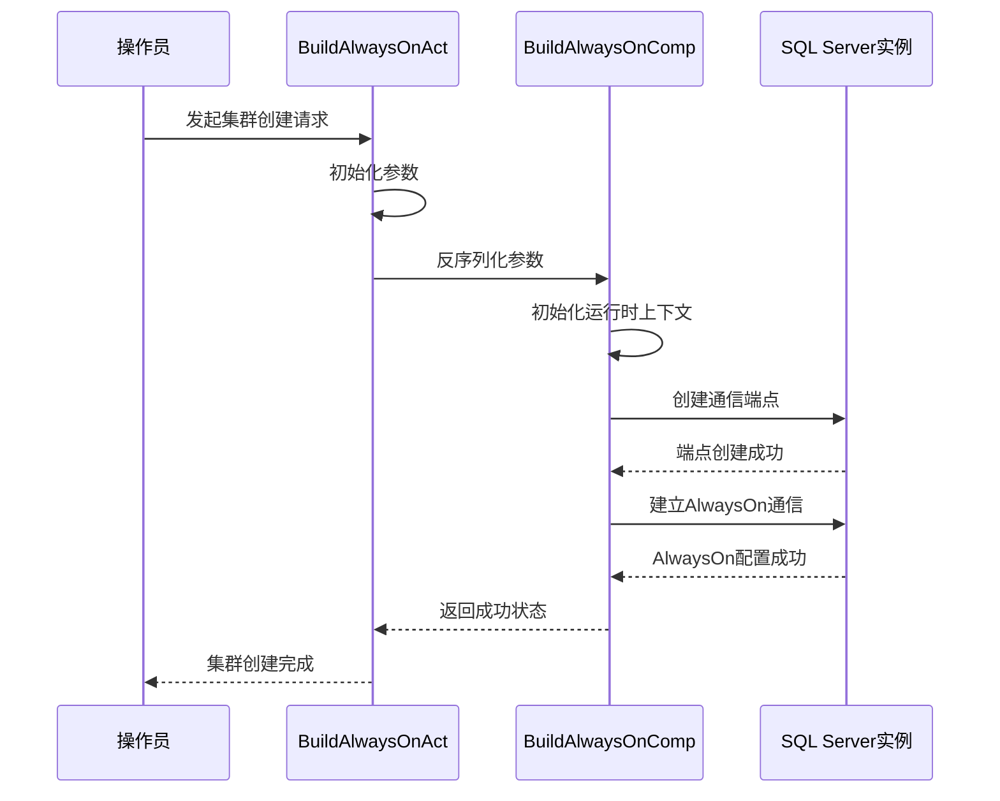
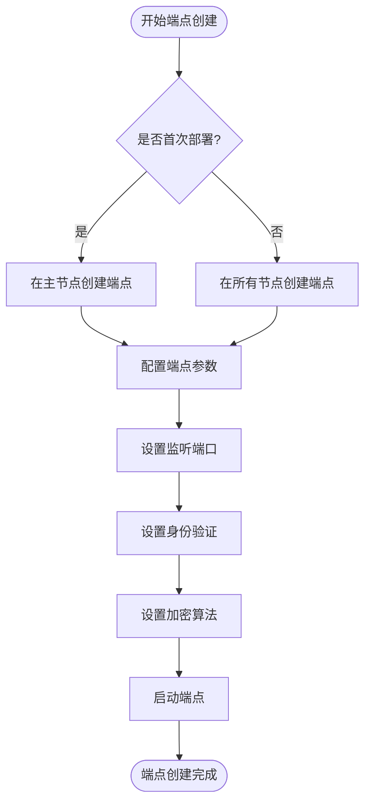
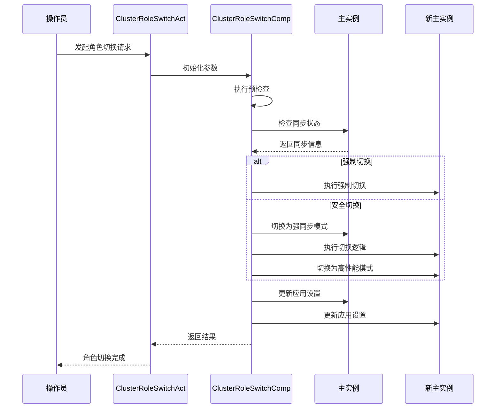
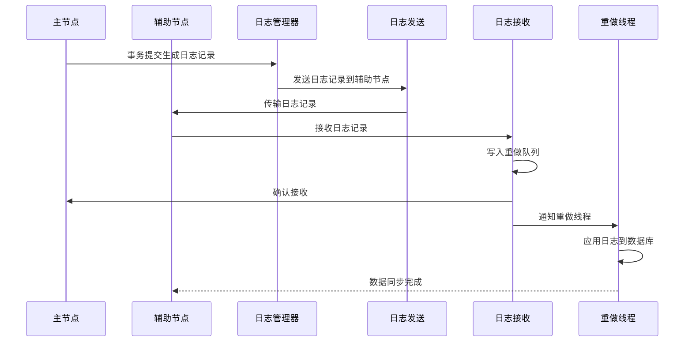
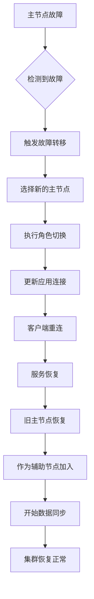

# SQL Server高可用模块

<cite>
**本文档引用的文件**
- [build_alwayson.go](file://dbm-services/sqlserver/db-tools/dbactuator/internal/subcmd/sqlservercmd/build_alwayson.go)
- [cluster_role_switch.go](file://dbm-services/sqlserver/db-tools/dbactuator/internal/subcmd/sqlservercmd/cluster_role_switch.go)
- [build_alwayson.go](file://dbm-services/sqlserver/db-tools/dbactuator/pkg/components/sqlserver/alwayson/build_alwayson.go)
- [cluster_role_switch.go](file://dbm-services/sqlserver/db-tools/dbactuator/pkg/components/sqlserver/cluster_role_switch.go)
- [sqlserver.go](file://dbm-services/sqlserver/db-tools/dbactuator/pkg/util/sqlserver/sqlserver.go)
- [cst.go](file://dbm-services/sqlserver/db-tools/dbactuator/pkg/core/cst/cst.go)
</cite>

## 目录
1. [引言](#引言)
2. [AlwaysOn高可用组实现机制](#alwayson高可用组实现机制)
3. [AlwaysOn集群创建与监控](#alwayson集群创建与监控)
4. [前置检查与证书配置](#前置检查与证书配置)
5. [端点创建实现细节](#端点创建实现细节)
6. [角色切换逻辑分析](#角色切换逻辑分析)
7. [数据同步与故障转移流程](#数据同步与故障转移流程)
8. [部署最佳实践](#部署最佳实践)
9. [常见问题排查](#常见问题排查)
10. [结论](#结论)

## 引言
本文档详细阐述SQL Server AlwaysOn高可用组的实现机制，重点分析`db_services/sqlserver/cluster`如何处理AlwaysOn集群的创建、监控和故障转移。通过深入分析相关代码实现，解释`build_alwayson.go`中前置检查、证书配置、端点创建的实现细节，以及`cluster_role_switch.go`中的角色切换逻辑。同时提供序列图展示从主节点到辅助节点的同步过程和故障转移流程，并讨论AlwaysOn部署的最佳实践和常见问题排查方法。

## AlwaysOn高可用组实现机制
SQL Server AlwaysOn高可用组是一种高可用性和灾难恢复解决方案，它允许将一组用户数据库作为单个单元进行故障转移。在蓝鲸DBM系统中，AlwaysOn高可用组的实现主要通过Go语言编写的自动化组件完成，这些组件负责集群的初始化、配置、监控和故障转移。

AlwaysOn高可用组的核心机制包括：
- **可用性组**：包含一个或多个用户数据库的集合，这些数据库将作为单个单元进行故障转移
- **副本**：每个可用性组可以有多个副本，分布在不同的SQL Server实例上
- **同步模式**：支持同步提交和异步提交两种模式，确保数据的一致性和可用性
- **故障转移**：当主副本不可用时，可以将其中一个辅助副本提升为新的主副本

在蓝鲸DBM系统中，AlwaysOn的实现通过一系列组件协同工作，确保高可用组的稳定运行和快速故障恢复。

**Section sources**
- [build_alwayson.go](file://dbm-services/sqlserver/db-tools/dbactuator/internal/subcmd/sqlservercmd/build_alwayson.go)
- [cluster_role_switch.go](file://dbm-services/sqlserver/db-tools/dbactuator/internal/subcmd/sqlservercmd/cluster_role_switch.go)

## AlwaysOn集群创建与监控
AlwaysOn集群的创建过程由`build_alwayson.go`文件中的`BuildAlwaysOnAct`组件负责。该组件通过一系列步骤完成集群的初始化和配置。

### 集群创建流程
集群创建主要分为两个关键步骤：
1. **端点创建**：建立实例间的通信端点
2. **AlwaysOn通信建立**：配置可用性组和副本关系



**Diagram sources**
- [build_alwayson.go](file://dbm-services/sqlserver/db-tools/dbactuator/internal/subcmd/sqlservercmd/build_alwayson.go#L70-L87)
- [build_alwayson.go](file://dbm-services/sqlserver/db-tools/dbactuator/pkg/components/sqlserver/alwayson/build_alwayson.go#L124-L145)

### 集群监控机制
集群监控主要通过定期检查副本状态、同步延迟和网络连接来实现。系统会持续监控以下关键指标：
- 副本连接状态
- 数据同步延迟
- 事务日志发送队列大小
- 事务日志重做队列大小

当监控到异常情况时，系统会触发告警并可能自动执行故障转移操作。

**Section sources**
- [build_alwayson.go](file://dbm-services/sqlserver/db-tools/dbactuator/internal/subcmd/sqlservercmd/build_alwayson.go)
- [build_alwayson.go](file://dbm-services/sqlserver/db-tools/dbactuator/pkg/components/sqlserver/alwayson/build_alwayson.go)

## 前置检查与证书配置
在创建AlwaysOn集群之前，系统会执行一系列前置检查以确保环境满足要求。这些检查由`build_alwayson.go`中的`Init`方法实现。

### 前置检查内容
前置检查主要包括：
- **实例连接验证**：确保所有参与实例都可以通过SA账户连接
- **版本兼容性检查**：验证所有实例的SQL Server版本是否兼容
- **网络连通性检查**：确认实例间的网络通信正常
- **端口可用性检查**：验证用于AlwaysOn通信的端口是否可用

```go
// 伪代码表示前置检查逻辑
func (b *BuildAlwaysOnComp) Init() error {
    // 初始化本地实例连接
    if LWork, err = sqlserver.NewDbWorker(...); err != nil {
        return err
    }
    
    // 初始化所有slave实例
    for _, i := range b.Params.AddSlaves {
        if DBWork, err = sqlserver.NewDbWorker(...); err != nil {
            return err
        }
        b.DRS = append(b.DRS, AlwaysonInstnce{...})
    }
    
    // 计算endpoint的端口号
    b.ListenPort = osutil.GetListenPort(b.Params.Port)
    
    return nil
}
```

### 证书配置
AlwaysOn通信需要配置证书以确保数据传输的安全性。系统通过以下方式处理证书配置：
- 自动生成或使用现有证书
- 在所有副本实例上安装相同的证书
- 配置端点使用证书进行身份验证

证书配置是通过SQL Server的`CREATE ENDPOINT`语句实现的，其中指定了`AUTHENTICATION = WINDOWS NEGOTIATE`和`ENCRYPTION = REQUIRED ALGORITHM AES`。

**Section sources**
- [build_alwayson.go](file://dbm-services/sqlserver/db-tools/dbactuator/pkg/components/sqlserver/alwayson/build_alwayson.go#L58-L122)

## 端点创建实现细节
端点创建是AlwaysOn配置的关键步骤，它建立了实例间的通信通道。该过程由`build_alwayson.go`中的`CreateEndPoint`方法实现。

### 端点创建流程
端点创建的具体实现如下：



**Diagram sources**
- [build_alwayson.go](file://dbm-services/sqlserver/db-tools/dbactuator/pkg/components/sqlserver/alwayson/build_alwayson.go#L124-L145)

### 端点配置参数
端点创建时使用的关键参数包括：
- **监听端口**：通过`osutil.GetListenPort`计算得出，通常为主实例端口+100
- **身份验证**：使用`WINDOWS NEGOTIATE`进行Windows身份验证
- **加密**：要求使用AES算法进行数据加密
- **角色**：设置为`PARTNER`，表示这是AlwaysOn伙伴实例

端点创建的SQL语句模板定义在`cst.go`常量中，通过`fmt.Sprintf`动态生成具体的SQL命令。

**Section sources**
- [build_alwayson.go](file://dbm-services/sqlserver/db-tools/dbactuator/pkg/components/sqlserver/alwayson/build_alwayson.go#L124-L145)
- [cst.go](file://dbm-services/sqlserver/db-tools/dbactuator/pkg/core/cst/cst.go)

## 角色切换逻辑分析
角色切换是AlwaysOn高可用性的核心功能，由`cluster_role_switch.go`文件中的`ClusterRoleSwitchComp`组件负责实现。

### 角色切换流程
角色切换分为预检查和执行切换两个阶段：



**Diagram sources**
- [cluster_role_switch.go](file://dbm-services/sqlserver/db-tools/dbactuator/internal/subcmd/sqlservercmd/cluster_role_switch.go#L70-L95)
- [cluster_role_switch.go](file://dbm-services/sqlserver/db-tools/dbactuator/pkg/components/sqlserver/cluster_role_switch.go#L100-L382)

### 预检查机制
预检查是确保切换安全的关键步骤，主要检查内容包括：
- **同步模式验证**：确认支持的同步模式（镜像或AlwaysOn）
- **数据库同步状态**：检查是否存在同步异常的数据库
- **延迟检查**：验证同步延迟是否在可接受范围内
- **副本完整性**：确保所有副本都正常连接

```go
// 伪代码表示预检查逻辑
func (c *ClusterRoleSwitchComp) PreCheck() error {
    // 检查同步模式是否支持
    if c.Params.SyncMode != cst.MIRRORING && c.Params.SyncMode != cst.ALWAYSON {
        return fmt.Errorf("不支持的同步模式")
    }
    
    // 检查是否为空实例
    if err := c.MasterDB.Queryx(&checkDBS, cst.GET_BUSINESS_DATABASE); err != nil {
        return fmt.Errorf("获取数据库列表失败")
    }
    
    // 根据不同同步模式执行特定检查
    switch c.Params.SyncMode {
    case cst.MIRRORING:
        c.MirroringPreCheck()
    case cst.ALWAYSON:
        c.AlwaysOnPreCheck()
    }
    
    return nil
}
```

### 切换执行逻辑
切换执行分为强制切换和安全切换两种模式：

**强制切换**（主节点故障时）：
- 直接在新主节点执行`Sys_AutoSwitch_LossOver`存储过程
- 其他从节点同步新的主节点

**安全切换**（计划内切换）：
1. 在旧主节点切换为强同步模式
2. 在新主节点执行切换逻辑
3. 将新主节点切换为高性能模式
4. 旧主节点和其他从节点同步新的主节点

**Section sources**
- [cluster_role_switch.go](file://dbm-services/sqlserver/db-tools/dbactuator/pkg/components/sqlserver/cluster_role_switch.go)

## 数据同步与故障转移流程
数据同步和故障转移是AlwaysOn高可用性的核心功能，确保在主节点故障时能够快速恢复服务。

### 数据同步流程
从主节点到辅助节点的数据同步过程如下：



**Diagram sources**
- [sqlserver.go](file://dbm-services/sqlserver/db-tools/dbactuator/pkg/util/sqlserver/sqlserver.go#L663-L677)
- [cluster_role_switch.go](file://dbm-services/sqlserver/db-tools/dbactuator/pkg/components/sqlserver/cluster_role_switch.go)

### 故障转移流程
当主节点发生故障时，故障转移流程如下：



故障转移的触发条件包括：
- 主节点实例崩溃
- 网络连接中断超过阈值
- 心跳检测超时
- 手动触发故障转移

**Section sources**
- [cluster_role_switch.go](file://dbm-services/sqlserver/db-tools/dbactuator/pkg/components/sqlserver/cluster_role_switch.go)
- [sqlserver.go](file://dbm-services/sqlserver/db-tools/dbactuator/pkg/util/sqlserver/sqlserver.go)

## 部署最佳实践
为了确保SQL Server AlwaysOn高可用组的稳定运行，建议遵循以下最佳实践：

### 网络配置
- **专用网络**：为AlwaysOn通信配置专用网络或VLAN
- **带宽要求**：确保网络带宽足以处理峰值事务日志流量
- **延迟要求**：网络延迟应低于5ms以确保良好的同步性能

### 硬件配置
- **对称配置**：主节点和辅助节点应具有相似的硬件配置
- **存储性能**：确保所有节点的存储I/O性能满足业务需求
- **内存配置**：为SQL Server分配足够的内存以优化性能

### 监控与维护
- **定期检查**：定期检查AlwaysOn健康状态和同步延迟
- **备份策略**：在辅助节点上执行只读备份以减轻主节点负载
- **性能监控**：监控关键性能指标，如日志发送/重做队列大小

### 安全考虑
- **证书管理**：定期更新和轮换AlwaysOn通信证书
- **访问控制**：限制对AlwaysOn端点的网络访问
- **审计日志**：启用并定期审查AlwaysOn相关操作日志

## 常见问题排查
在使用SQL Server AlwaysOn时，可能会遇到各种问题。以下是常见问题及其排查方法：

### 同步延迟过高
**症状**：辅助节点的数据同步延迟持续增加

**排查步骤**：
1. 检查网络带宽使用情况
2. 检查主节点的事务日志生成速率
3. 检查辅助节点的磁盘I/O性能
4. 查看`sys.dm_hadr_database_replica_states`视图中的队列大小

### 连接失败
**症状**：实例间无法建立AlwaysOn通信

**排查步骤**：
1. 检查防火墙设置是否允许AlwaysOn端口通信
2. 验证证书是否正确安装和配置
3. 检查SQL Server服务账户权限
4. 查看SQL Server错误日志中的相关错误信息

### 故障转移失败
**症状**：无法完成角色切换或故障转移

**排查步骤**：
1. 检查预检查是否通过
2. 验证所有副本的连接状态
3. 检查同步模式配置是否正确
4. 查看存储过程执行日志中的错误信息

### 性能问题
**症状**：主节点性能下降，影响业务

**排查步骤**：
1. 检查日志发送线程的CPU使用率
2. 监控网络带宽使用情况
3. 评估事务日志生成速率
4. 考虑调整同步模式为异步提交

## 结论
SQL Server AlwaysOn高可用组通过蓝鲸DBM系统的自动化组件实现了高效的集群管理、监控和故障转移功能。通过对`build_alwayson.go`和`cluster_role_switch.go`等核心文件的分析，我们深入了解了AlwaysOn的实现机制，包括前置检查、证书配置、端点创建和角色切换等关键环节。

系统通过精心设计的序列流程确保了高可用组的稳定运行，同时提供了完善的监控和故障转移机制。遵循本文档中的最佳实践和问题排查方法，可以有效提升AlwaysOn部署的可靠性和性能，为关键业务提供强有力的数据库高可用保障。