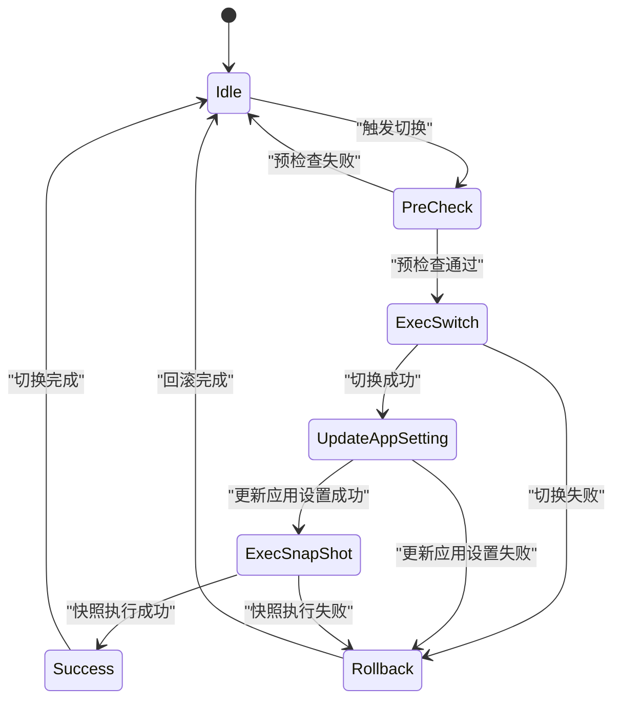

# 角色切换与故障转移

<cite>
**本文档引用的文件**   
- [cluster_role_switch.go](file://dbm-services/sqlserver/db-tools/dbactuator/internal/subcmd/sqlservercmd/cluster_role_switch.go)
- [cluster_role_switch.go](file://dbm-services/sqlserver/db-tools/dbactuator/pkg/components/sqlserver/cluster_role_switch.go)
- [const.go](file://dbm-services/sqlserver/db-tools/dbactuator/pkg/core/cst/const.go)
- [sqlserver.go](file://dbm-services/sqlserver/db-tools/dbactuator/pkg/util/sqlserver/sqlserver.go)
- [monitor_dbm.sql](file://dbm-services/sqlserver/db-tools/dbactuator/pkg/core/staticembed/monitor_dbm.sql)
- [monitor_dbm_v2.sql](file://dbm-services/sqlserver/db-tools/dbactuator/pkg/core/staticembed/monitor_dbm_v2.sql)
</cite>

## 目录
1. [引言](#引言)
2. [核心组件分析](#核心组件分析)
3. [角色切换实现逻辑](#角色切换实现逻辑)
4. [状态转换图](#状态转换图)
5. [故障转移测试与验证](#故障转移测试与验证)
6. [潜在风险与监控建议](#潜在风险与监控建议)
7. [结论](#结论)

## 引言
本文档深入分析SQL Server AlwaysOn高可用组的角色切换与故障转移机制，重点解析`cluster_role_switch.go`中的实现逻辑。文档详细阐述了主从角色切换的触发条件、切换过程中的状态检查、事务日志同步确认以及切换后的服务恢复流程。同时，文档解释了手动故障转移和自动故障转移的实现差异，以及如何保证数据一致性。通过状态转换图展示主节点、辅助节点在不同故障场景下的状态变迁，并提供故障转移的测试方法和验证步骤，讨论切换过程中的潜在风险，如脑裂问题、数据延迟等，并给出相应的监控和预警建议。

## 核心组件分析

SQL Server AlwaysOn高可用组的角色切换与故障转移机制主要由`cluster_role_switch.go`文件中的`ClusterRoleSwitchComp`组件实现。该组件负责处理集群角色切换的整个流程，包括预检查、执行切换、更新应用设置和执行快照等步骤。

**Section sources**
- [cluster_role_switch.go](file://dbm-services/sqlserver/db-tools/dbactuator/internal/subcmd/sqlservercmd/cluster_role_switch.go#L24-L95)
- [cluster_role_switch.go](file://dbm-services/sqlserver/db-tools/dbactuator/pkg/components/sqlserver/cluster_role_switch.go#L23-L446)

## 角色切换实现逻辑

### 触发条件
角色切换的触发条件主要包括：
- **手动切换**：管理员通过命令行或管理界面手动触发角色切换。
- **自动切换**：当主节点发生故障时，系统自动触发故障转移，将辅助节点提升为主节点。

### 切换过程
角色切换过程分为以下几个步骤：
1. **预检查**：检查同步模式是否支持，验证主节点和从节点的连接状态，确保没有异常情况。
2. **执行切换**：根据不同的同步模式（AlwaysOn或Mirroring），执行相应的切换逻辑。
3. **更新应用设置**：更新`APP_SETTING`表中的主节点信息，确保应用程序能够正确连接到新的主节点。
4. **执行快照**：在切换完成后，执行快照操作，确保数据的一致性。

### 数据一致性保证
为了保证数据一致性，系统在切换过程中会进行以下操作：
- **事务日志同步**：确保所有事务日志都已同步到辅助节点。
- **状态检查**：在切换前，检查主节点和辅助节点的状态，确保没有异常情况。
- **回滚机制**：如果切换过程中出现错误，系统会自动回滚到切换前的状态。

**Section sources**
- [cluster_role_switch.go](file://dbm-services/sqlserver/db-tools/dbactuator/pkg/components/sqlserver/cluster_role_switch.go#L100-L382)
- [const.go](file://dbm-services/sqlserver/db-tools/dbactuator/pkg/core/cst/const.go#L114-L157)

## 状态转换图

**Diagram sources **
- [cluster_role_switch.go](file://dbm-services/sqlserver/db-tools/dbactuator/pkg/components/sqlserver/cluster_role_switch.go#L70-L93)
- [cluster_role_switch.go](file://dbm-services/sqlserver/db-tools/dbactuator/pkg/components/sqlserver/cluster_role_switch.go#L201-L382)

## 故障转移测试与验证

### 测试方法
1. **手动触发**：通过命令行工具手动触发角色切换，观察切换过程和结果。
2. **模拟故障**：模拟主节点故障，观察系统是否能够自动触发故障转移。
3. **性能测试**：在高负载情况下进行角色切换，测试系统的性能和稳定性。

### 验证步骤
1. **检查日志**：查看系统日志，确认切换过程中的每一步都已成功执行。
2. **验证连接**：确认应用程序能够正确连接到新的主节点。
3. **数据一致性检查**：通过查询数据库，验证数据的一致性。

**Section sources**
- [cluster_role_switch.go](file://dbm-services/sqlserver/db-tools/dbactuator/pkg/components/sqlserver/cluster_role_switch.go#L384-L445)
- [sqlserver.go](file://dbm-services/sqlserver/db-tools/dbactuator/pkg/util/sqlserver/sqlserver.go#L662-L677)

## 潜在风险与监控建议

### 潜在风险
- **脑裂问题**：在网络分区的情况下，可能会出现两个节点都认为自己是主节点的情况。
- **数据延迟**：在高负载情况下，事务日志同步可能会出现延迟，导致数据不一致。

### 监控建议
- **实时监控**：实时监控主节点和辅助节点的状态，及时发现异常情况。
- **预警机制**：设置预警机制，当检测到异常情况时，及时通知管理员。
- **定期检查**：定期检查系统的配置和状态，确保系统的稳定性和可靠性。

**Section sources**
- [monitor_dbm.sql](file://dbm-services/sqlserver/db-tools/dbactuator/pkg/core/staticembed/monitor_dbm.sql#L1853-L2157)
- [monitor_dbm_v2.sql](file://dbm-services/sqlserver/db-tools/dbactuator/pkg/core/staticembed/monitor_dbm_v2.sql#L1752-L2064)

## 结论
SQL Server AlwaysOn高可用组的角色切换与故障转移机制通过`cluster_role_switch.go`文件中的`ClusterRoleSwitchComp`组件实现，确保了系统的高可用性和数据一致性。通过详细的预检查、状态检查和回滚机制，系统能够在各种故障场景下安全地进行角色切换。同时，通过实时监控和预警机制，可以及时发现和处理潜在风险，确保系统的稳定运行。