# 业务逻辑层架构

<cite>
**本文档引用的文件**
- [cluster.py](file://dbm-ui/backend/db_meta/models/cluster.py)
- [cluster_service_suite_test.go](file://dbm-services/k8s-dbs/metadata/dbaccess/testsuite/cluster_service_suite_test.go)
- [mysql_ha_apply_flow.py](file://dbm-ui/backend/flow/engine/bamboo/scene/mysql/mysql_ha_apply_flow.py)
- [mysql_single_destroy_flow.py](file://dbm-ui/backend/flow/engine/bamboo/scene/mysql/mysql_single_destroy_flow.py)
- [mysql_ha_destroy_flow.py](file://dbm-ui/backend/flow/engine/bamboo/scene/mysql/mysql_ha_destroy_flow.py)
- [deploy_peripheraltools/subflow.py](file://dbm-ui/backend/flow/engine/bamboo/scene/mysql/deploy_peripheraltools/subflow.py)
- [ClusterViewSet.py](file://dbm-ui/backend/db_services/mysql/cluster/views.py)
- [dbactuator](file://dbm-services/mysql/db-tools/dbactuator)
- [priv-service](file://dbm-services/mysql/db-priv)
- [dbconfig](file://dbm-services/common/db-config)
- [db-resource](file://dbm-services/common/db-resource)
- [cc.v3](file://dbm-services/common/go-pubpkg/cc.v3)
- [DBPrivManagerApi.py](file://dbm-ui/backend/components/mysql_priv_manager/client.py)
</cite>

## 目录
1. [项目结构](#项目结构)
2. [核心业务逻辑组件](#核心业务逻辑组件)
3. [服务层架构模式](#服务层架构模式)
4. [关键业务流程分析](#关键业务流程分析)
5. [事务管理与错误处理](#事务管理与错误处理)
6. [日志记录策略](#日志记录策略)
7. [外部服务集成](#外部服务集成)

## 项目结构

系统采用前后端分离的微服务架构，业务逻辑层主要分布在`dbm-ui/backend/db_services`（前端服务层）和`dbm-services`（后端微服务）两个主要目录中。

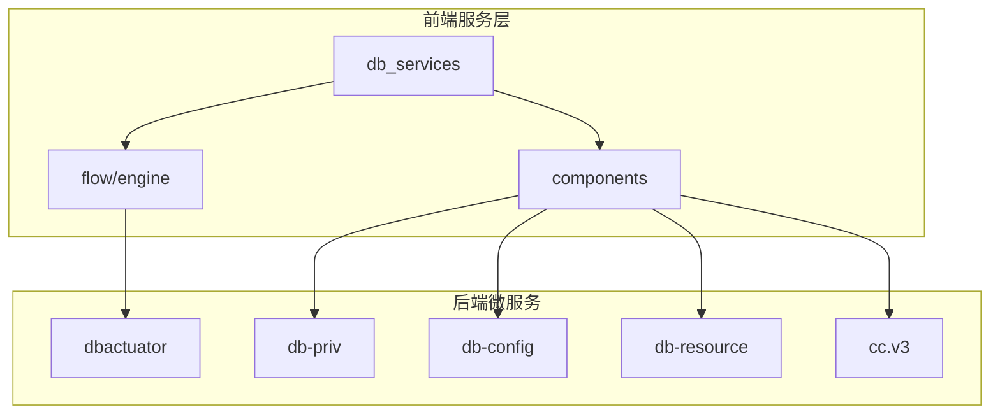

**图示来源**
- [db_services](file://dbm-ui/backend/db_services)
- [dbm-services](file://dbm-services)

## 核心业务逻辑组件

业务逻辑层的核心组件包括集群管理、权限管理、配置管理和资源管理等服务，这些服务协同工作以实现复杂的数据库管理用例。

### 集群管理服务

集群管理服务负责数据库集群的全生命周期管理，包括创建、部署、变更和销毁等操作。该服务通过流程引擎协调多个子流程来完成复杂的集群操作。

**关键功能包括：**
- 集群创建与部署
- 集群配置变更
- 集群销毁与清理
- 集群元信息维护

**组件来源**
- [mysql_ha_apply_flow.py](file://dbm-ui/backend/flow/engine/bamboo/scene/mysql/mysql_ha_apply_flow.py)
- [mysql_single_destroy_flow.py](file://dbm-ui/backend/flow/engine/bamboo/scene/mysql/mysql_single_destroy_flow.py)
- [cluster.py](file://dbm-ui/backend/db_meta/models/cluster.py)

### 权限管理服务

权限管理服务提供统一的数据库权限管理功能，支持账号创建、权限分配、密码管理等操作。该服务通过`DBPrivManagerApi`接口与其他组件集成。

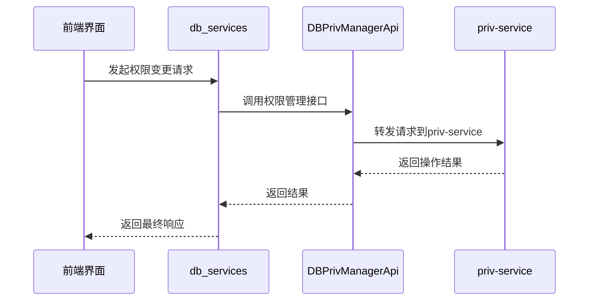

**图示来源**
- [DBPrivManagerApi.py](file://dbm-ui/backend/components/mysql_priv_manager/client.py)
- [priv-service](file://dbm-services/mysql/db-priv)

## 服务层架构模式

系统在服务层采用了多种设计模式来提高代码的可维护性和可扩展性。

### 服务模式

服务模式是系统中最主要的架构模式，每个业务领域都有对应的服务类来封装相关逻辑。例如，集群管理服务、权限管理服务等都遵循这一模式。

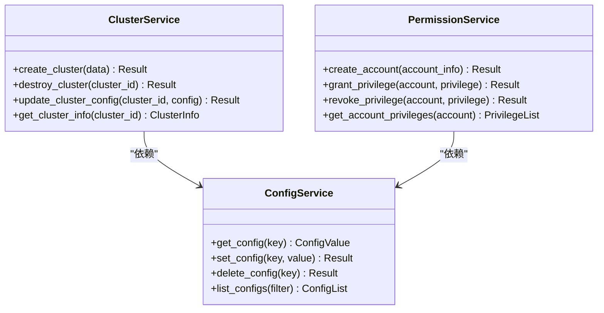

**图示来源**
- [db_services](file://dbm-ui/backend/db_services)
- [db-priv](file://dbm-services/mysql/db-priv)

### 工厂模式

工厂模式用于创建不同类型的数据库操作执行器。系统根据数据库类型（MySQL、Oracle、Redis等）动态创建相应的执行器实例。

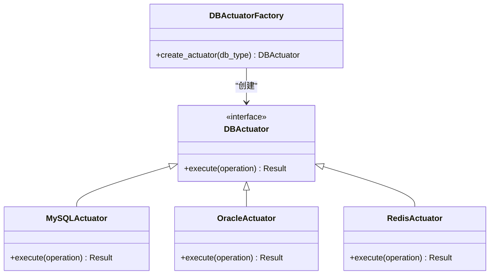

**图示来源**
- [dbactuator](file://dbm-services/mysql/db-tools/dbactuator)
- [dbm-services](file://dbm-services)

### 命令模式

命令模式用于封装数据库管理操作，使操作可以被序列化、排队和撤销。每个数据库操作都被封装为一个命令对象。

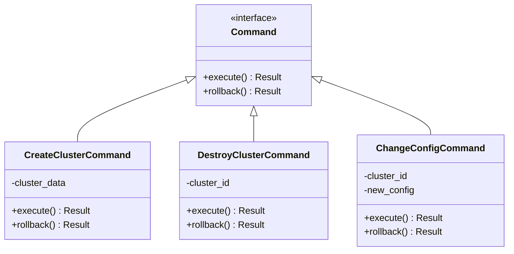

**图示来源**
- [flow/engine](file://dbm-ui/backend/flow/engine)
- [dbactuator](file://dbm-services/mysql/db-tools/dbactuator)

## 关键业务流程分析

### 部署MySQL实例流程

部署MySQL实例是一个复杂的业务流程，涉及多个系统的协同工作。以下是该流程的详细分析：

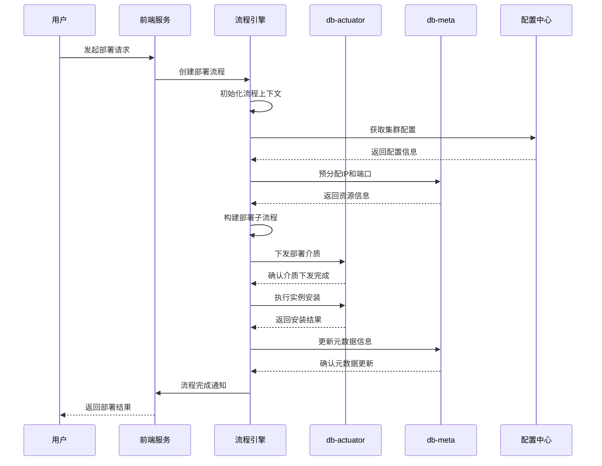

**图示来源**
- [mysql_ha_apply_flow.py](file://dbm-ui/backend/flow/engine/bamboo/scene/mysql/mysql_ha_apply_flow.py)
- [deploy_peripheraltools/subflow.py](file://dbm-ui/backend/flow/engine/bamboo/scene/mysql/deploy_peripheraltools/subflow.py)

### 创建数据库集群流程

创建数据库集群涉及多个步骤和系统的协调，确保集群的高可用性和正确配置。

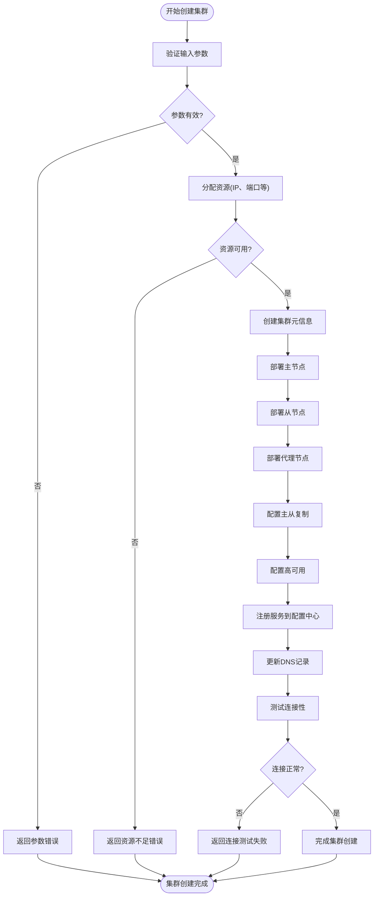

**图示来源**
- [mysql_ha_apply_flow.py](file://dbm-ui/backend/flow/engine/bamboo/scene/mysql/mysql_ha_apply_flow.py)
- [cluster_service_suite_test.go](file://dbm-services/k8s-dbs/metadata/dbaccess/testsuite/cluster_service_suite_test.go)

## 事务管理与错误处理

### 事务管理策略

系统采用分布式事务管理策略，确保跨多个服务的操作具有原子性。对于关键操作，系统使用两阶段提交模式来保证数据一致性。

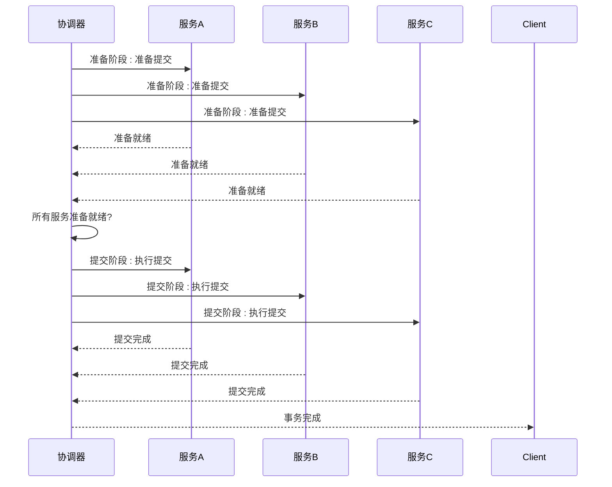

**图示来源**
- [flow/engine](file://dbm-ui/backend/flow/engine)
- [dbactuator](file://dbm-services/mysql/db-tools/dbactuator)

### 错误处理机制

系统实现了完善的错误处理机制，包括错误分类、重试策略和回滚机制。

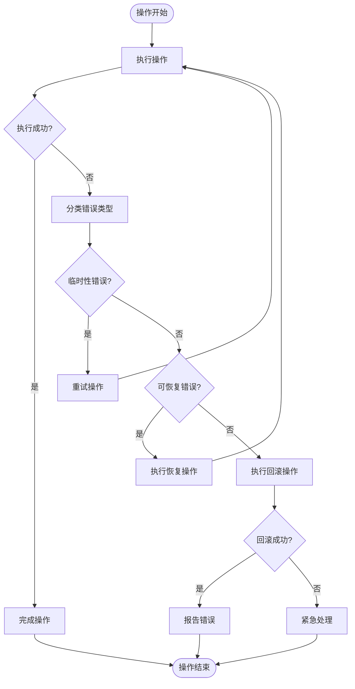

**图示来源**
- [mysql_single_destroy_flow.py](file://dbm-ui/backend/flow/engine/bamboo/scene/mysql/mysql_single_destroy_flow.py)
- [exec_switch_for_source_act.py](file://dbm-ui/backend/flow/plugins/components/collections/mysql/exec_switch_for_source_act.py)

## 日志记录策略

系统采用分层日志记录策略，确保操作的可追溯性和问题的可诊断性。

### 日志级别与分类

系统定义了多个日志级别和分类，便于不同场景下的日志分析。

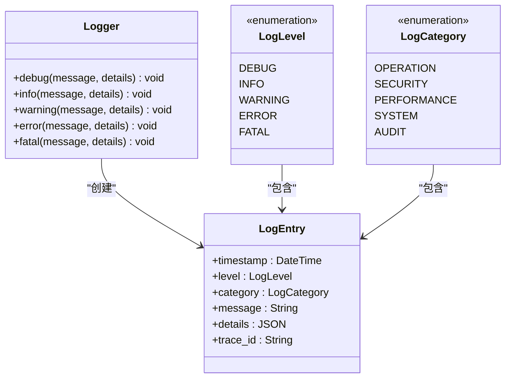

**图示来源**
- [logger](file://dbm-services/k8s-dbs/logger)
- [go-pubpkg/logger](file://dbm-services/common/go-pubpkg/logger)

### 分布式追踪

系统集成分布式追踪功能，通过trace_id关联跨服务的操作日志。

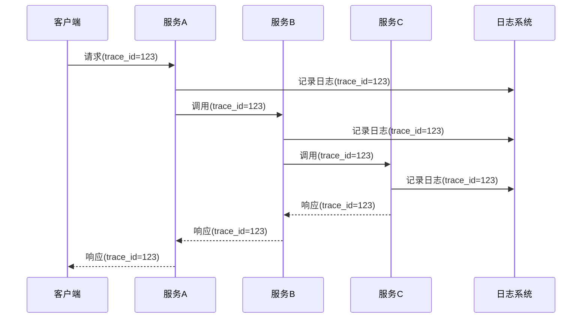

**图示来源**
- [otelgin](file://dbm-services/mysql/db-priv/go.mod)
- [logging](file://dbm-services/k8s-dbs/logger)

## 外部服务集成

### 配置中心集成

系统与配置中心紧密集成，实现配置的动态管理和服务发现。

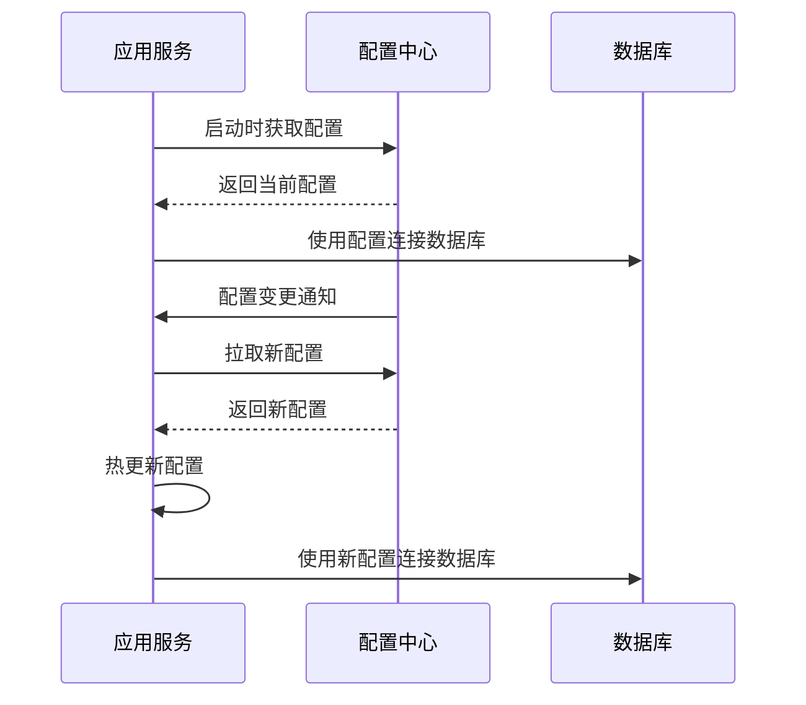

**图示来源**
- [db-config](file://dbm-services/common/db-config)
- [db-resource](file://dbm-services/common/db-resource)

### CMDB集成

系统与CMDB（配置管理数据库）集成，实现资源的统一管理和拓扑关系维护。

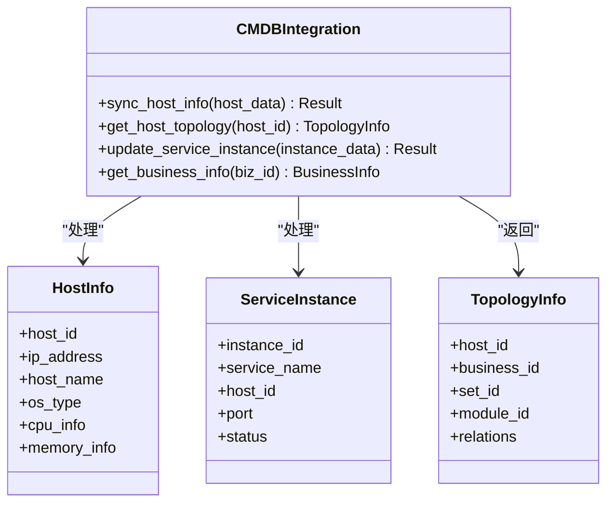

**图示来源**
- [cc.v3](file://dbm-services/common/go-pubpkg/cc.v3)
- [cmdb](file://dbm-ui/backend/db_services/cmdb)