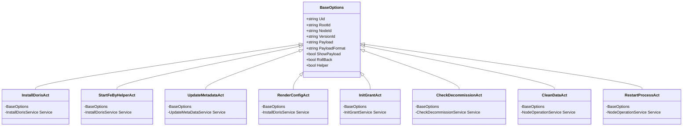
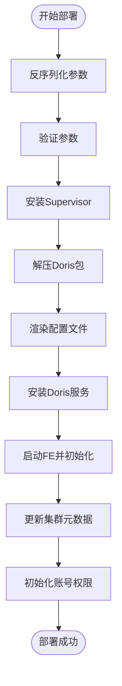

# Doris 服务管理

<cite>
**本文档引用的文件**
- [install_doris.go](file://dbm-services/bigdata/db-tools/dbactuator/internal/subcmd/doriscmd/install_doris.go)
- [start_fe_by_helper.go](file://dbm-services/bigdata/db-tools/dbactuator/internal/subcmd/doriscmd/start_fe_by_helper.go)
- [update_cluster_metadata.go](file://dbm-services/bigdata/db-tools/dbactuator/internal/subcmd/doriscmd/update_cluster_metadata.go)
- [render_config.go](file://dbm-services/bigdata/db-tools/dbactuator/internal/subcmd/doriscmd/render_config.go)
- [init_grant.go](file://dbm-services/bigdata/db-tools/dbactuator/internal/subcmd/doriscmd/init_grant.go)
- [check_decommission.go](file://dbm-services/bigdata/db-tools/dbactuator/internal/subcmd/doriscmd/check_decommission.go)
- [clean_data.go](file://dbm-services/bigdata/db-tools/dbactuator/internal/subcmd/doriscmd/clean_data.go)
- [restart_process.go](file://dbm-services/bigdata/db-tools/dbactuator/internal/subcmd/doriscmd/restart_process.go)
- [subcmd.go](file://dbm-services/bigdata/db-tools/dbactuator/internal/subcmd/subcmd.go)
- [cmd.go](file://dbm-services/bigdata/db-tools/dbactuator/cmd/cmd.go)
- [install_doris.go](file://dbm-services/bigdata/db-tools/dbactuator/pkg/components/doris/install_doris.go)
- [init_grant.go](file://dbm-services/bigdata/db-tools/dbactuator/pkg/components/doris/init_grant.go)
- [update_metadata.go](file://dbm-services/bigdata/db-tools/dbactuator/pkg/components/doris/update_metadata.go)
- [node_operation.go](file://dbm-services/bigdata/db-tools/dbactuator/pkg/components/doris/node_operation.go)
</cite>

## 目录
1. [简介](#简介)
2. [核心命令实现](#核心命令实现)
3. [Doris 集群部署流程](#doris-集群部署流程)
4. [配置渲染与初始化授权](#配置渲染与初始化授权)
5. [子命令机制与前端交互](#子命令机制与前端交互)
6. [节点下线与数据清理](#节点下线与数据清理)
7. [进程管理](#进程管理)
8. [完整部署示例](#完整部署示例)

## 简介
本文档详细介绍了 Doris 服务管理系统的实现机制，重点分析了 `dbactuator` 工具中 `doriscmd` 模块的各项操作命令。系统通过 `dbactuator` 命令行工具，实现了对 Doris 集群的全生命周期管理，包括集群的安装部署、配置管理、权限初始化、节点维护和进程控制等核心功能。`dbactuator` 作为后端执行引擎，通过 `subcmd` 子命令机制，为前端 `db_services/bigdata/doris` 模块提供稳定可靠的原子操作能力。

## 核心命令实现

`doriscmd` 模块中的每个操作命令都遵循统一的设计模式，通过 Cobra 库实现命令行接口。每个命令由一个结构体（如 `InstallDorisAct`）和一个命令创建函数（如 `InstallDorisCommand`）组成。结构体继承 `BaseOptions` 并包含一个服务接口，用于执行具体的业务逻辑。

**核心命令结构分析**


**Diagram sources**
- [install_doris.go](file://dbm-services/bigdata/db-tools/dbactuator/internal/subcmd/doriscmd/install_doris.go)
- [start_fe_by_helper.go](file://dbm-services/bigdata/db-tools/dbactuator/internal/subcmd/doriscmd/start_fe_by_helper.go)
- [update_cluster_metadata.go](file://dbm-services/bigdata/db-tools/dbactuator/internal/subcmd/doriscmd/update_cluster_metadata.go)
- [render_config.go](file://dbm-services/bigdata/db-tools/dbactuator/internal/subcmd/doriscmd/render_config.go)
- [init_grant.go](file://dbm-services/bigdata/db-tools/dbactuator/internal/subcmd/doriscmd/init_grant.go)
- [check_decommission.go](file://dbm-services/bigdata/db-tools/dbactuator/internal/subcmd/doriscmd/check_decommission.go)
- [clean_data.go](file://dbm-services/bigdata/db-tools/dbactuator/internal/subcmd/doriscmd/clean_data.go)
- [restart_process.go](file://dbm-services/bigdata/db-tools/dbactuator/internal/subcmd/doriscmd/restart_process.go)

**Section sources**
- [install_doris.go](file://dbm-services/bigdata/db-tools/dbactuator/internal/subcmd/doriscmd/install_doris.go)
- [start_fe_by_helper.go](file://dbm-services/bigdata/db-tools/dbactuator/internal/subcmd/doriscmd/start_fe_by_helper.go)
- [update_cluster_metadata.go](file://dbm-services/bigdata/db-tools/dbactuator/internal/subcmd/doriscmd/update_cluster_metadata.go)
- [render_config.go](file://dbm-services/bigdata/db-tools/dbactuator/internal/subcmd/doriscmd/render_config.go)
- [init_grant.go](file://dbm-services/bigdata/db-tools/dbactuator/internal/subcmd/doriscmd/init_grant.go)
- [check_decommission.go](file://dbm-services/bigdata/db-tools/dbactuator/internal/subcmd/doriscmd/check_decommission.go)
- [clean_data.go](file://dbm-services/bigdata/db-tools/dbactuator/internal/subcmd/doriscmd/clean_data.go)
- [restart_process.go](file://dbm-services/bigdata/db-tools/dbactuator/internal/subcmd/doriscmd/restart_process.go)

## Doris 集群部署流程

Doris 集群的部署是一个多步骤的原子化过程，主要涉及 FE（Frontend）和 BE（Backend）节点的安装与配置。整个流程由 `install_doris` 命令驱动，通过调用一系列底层服务来完成。

### 部署流程概述


**Diagram sources**
- [install_doris.go](file://dbm-services/bigdata/db-tools/dbactuator/internal/subcmd/doriscmd/install_doris.go)
- [install_doris.go](file://dbm-services/bigdata/db-tools/dbactuator/pkg/components/doris/install_doris.go)

**Section sources**
- [install_doris.go](file://dbm-services/bigdata/db-tools/dbactuator/internal/subcmd/doriscmd/install_doris.go)
- [install_doris.go](file://dbm-services/bigdata/db-tools/dbactuator/pkg/components/doris/install_doris.go)

### FE 节点启动与初始化
`start_fe_by_helper.go` 文件中的 `StartFeByHelperAct` 命令负责通过 helper 脚本启动 FE 节点并完成初始化。该过程包括：
1.  调用 `dorisutil.StartFeByHelper` 函数，通过 helper 脚本启动 FE 服务。
2.  使用 `CheckFrontEndStart` 方法通过 HTTP 接口检查 FE 服务是否正常启动。
3.  服务启动成功后，调用 `StopByFeHelper` 停止通过 helper 启动的服务，为后续的 Supervisor 管理做准备。

此命令是集群初始化的关键步骤，确保了 FE 节点能够正确加入集群并同步元数据。

**Section sources**
- [start_fe_by_helper.go](file://dbm-services/bigdata/db-tools/dbactuator/internal/subcmd/doriscmd/start_fe_by_helper.go)
- [install_doris.go](file://dbm-services/bigdata/db-tools/dbactuator/pkg/components/doris/install_doris.go)

### 集群元数据更新
`update_cluster_metadata.go` 文件中的 `UpdateMetadataAct` 命令用于更新 Doris 集群的节点元数据。当有新的 BE 节点加入或现有节点需要变更角色时，需要通过此命令将节点信息同步到 FE 的元数据中。

该命令的核心是 `UpdateMetaDataService.UpdateMetaData` 方法，它会遍历 `HostMap` 参数，对每个节点执行 `ALTER SYSTEM ADD BACKEND` 或 `ALTER SYSTEM DROP BACKEND` 等 SQL 语句，从而动态地管理集群的成员。

**Section sources**
- [update_cluster_metadata.go](file://dbm-services/bigdata/db-tools/dbactuator/internal/subcmd/doriscmd/update_cluster_metadata.go)
- [update_metadata.go](file://dbm-services/bigdata/db-tools/dbactuator/pkg/components/doris/update_metadata.go)

## 配置渲染与初始化授权

### 配置渲染
`render_config.go` 文件实现了 `RenderConfigAct` 命令，其核心功能是根据传入的参数动态生成 Doris 的配置文件（`fe.conf` 或 `be.conf`）。

该命令调用 `InstallDorisService.RenderConfig` 方法，该方法会：
1.  根据节点角色（FE/BE）确定配置文件的路径和名称。
2.  获取本机的 CIDR 网络信息，并将其设置为 `priority_networks` 参数，确保 Doris 服务只在指定网段内监听。
3.  根据服务器的内存大小，动态计算并设置 JVM 的堆内存大小（`-Xms` 和 `-Xmx`）。
4.  对于 BE 节点，还会扫描数据盘，并生成 `storage_root_path` 配置，指定数据存储目录。

**Section sources**
- [render_config.go](file://dbm-services/bigdata/db-tools/dbactuator/internal/subcmd/doriscmd/render_config.go)
- [install_doris.go](file://dbm-services/bigdata/db-tools/dbactuator/pkg/components/doris/install_doris.go)

### 初始化授权
`init_grant.go` 文件中的 `InitGrantAct` 命令负责在集群部署完成后，初始化数据库的账号和权限。

该命令调用 `InitGrantService.InitGrantTxn` 方法，在一个数据库事务中完成以下操作：
1.  修改默认 `root` 用户的密码。
2.  修改默认 `admin` 用户的密码。
3.  创建一个自定义用户，并授予 `admin` 角色和 `NODE_PRIV` 权限。
4.  为自定义用户设置资源标签（`resource_tags.location`），以便进行资源管理。

此过程确保了新部署的集群具有安全的默认访问凭证。

**Section sources**
- [init_grant.go](file://dbm-services/bigdata/db-tools/dbactuator/internal/subcmd/doriscmd/init_grant.go)
- [init_grant.go](file://dbm-services/bigdata/db-tools/dbactuator/pkg/components/doris/init_grant.go)

## 子命令机制与前端交互

`dbactuator` 通过 `subcmd` 机制实现了模块化的命令组织。`cmd.go` 是程序的入口，它通过 `NewDbActuatorCommand` 函数注册了所有可用的子命令模块，包括 `doriscmd.DorisCommand()`。

前端 `db_services/bigdata/doris` 模块通过调用 `dbactuator` 命令来执行操作。交互流程如下：
1.  前端构造一个包含操作参数的 JSON 对象。
2.  将 JSON 对象进行 Base64 编码，作为 `payload` 参数传递给 `dbactuator`。
3.  `dbactuator` 的 `BaseOptions.Deserialize` 方法负责解码并反序列化 `payload`，将其映射到具体的命令参数结构体上。
4.  命令执行完成后，将结果返回给前端。

这种设计实现了前后端的解耦，前端只需关注业务逻辑和参数构造，而复杂的执行逻辑则由后端的 `dbactuator` 统一处理。

**Section sources**
- [cmd.go](file://dbm-services/bigdata/db-tools/dbactuator/cmd/cmd.go)
- [subcmd.go](file://dbm-services/bigdata/db-tools/dbactuator/internal/subcmd/subcmd.go)

## 节点下线与数据清理

### 检查节点退役
`check_decommission.go` 文件中的 `CheckDecommissionAct` 命令用于检查 BE 节点是否可以安全下线。在执行节点退役操作前，此命令会验证该节点上的数据副本是否已成功迁移到其他节点，确保数据的完整性。

**Section sources**
- [check_decommission.go](file://dbm-services/bigdata/db-tools/dbactuator/internal/subcmd/doriscmd/check_decommission.go)

### 数据清理
`clean_data.go` 文件中的 `CleanDataAct` 命令用于在节点完全退役后，彻底清理该节点上的所有 Doris 相关数据和配置。

该命令调用 `NodeOperationService.CleanData` 方法，执行一系列清理操作：
1.  清除 `mysql` 用户的 crontab 任务。
2.  强制杀死所有与 Doris 相关的进程（如 `supervisord` 和 `java`）。
3.  删除 `/etc/supervisord.conf` 等软链接。
4.  删除 `/data/doris*` 目录下的所有安装文件。
5.  删除所有数据盘上的 `dorisdata*` 目录。

此命令是节点退役流程的最后一步，确保了退役节点的“干净”状态。

**Section sources**
- [clean_data.go](file://dbm-services/bigdata/db-tools/dbactuator/internal/subcmd/doriscmd/clean_data.go)
- [node_operation.go](file://dbm-services/bigdata/db-tools/dbactuator/pkg/components/doris/node_operation.go)

## 进程管理

`restart_process.go` 文件中的 `RestartProcessAct` 命令用于重启 Doris 的特定进程（如 `fe` 或 `be`）。

该命令调用 `NodeOperationService.StartStopComponent` 方法，该方法通过 `supervisorctl` 命令来控制进程。`Params.Operation` 字段指定了操作类型（如 `restart`），`Params.Component` 字段指定了目标组件。

**Section sources**
- [restart_process.go](file://dbm-services/bigdata/db-tools/dbactuator/internal/subcmd/doriscmd/restart_process.go)
- [node_operation.go](file://dbm-services/bigdata/db-tools/dbactuator/pkg/components/doris/node_operation.go)

## 完整部署示例

一个完整的 Doris 集群部署流程通常按以下顺序执行 `dbactuator` 命令：

```bash
# 1. 在所有节点上安装并配置Supervisor
dbactuator doris install_supervisor -p <base64_payload>

# 2. 在所有节点上解压Doris安装包
dbactuator doris decompress_doris_pkg -p <base64_payload>

# 3. 在所有节点上渲染配置文件
dbactuator doris render_config -p <base64_payload>

# 4. 在所有节点上安装Doris服务（添加Supervisor配置）
dbactuator doris install_doris -p <base64_payload>

# 5. 在主FE节点上通过helper启动并初始化
dbactuator doris start_fe_by_helper -p <base64_payload>

# 6. 在所有FE节点上更新集群元数据
dbactuator doris update_metadata -p <base64_payload>

# 7. 在主FE节点上初始化账号权限
dbactuator doris init_grant -p <base64_payload>

# 8. (可选) 重启所有节点上的进程以应用新配置
dbactuator doris restart_process -p <base64_payload>
```

每个命令的 `payload` 都是一个包含具体参数的 JSON 对象，`dbactuator` 会根据这些参数执行相应的操作，并通过标准输出和日志文件报告执行状态。