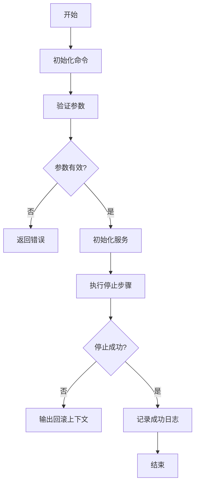
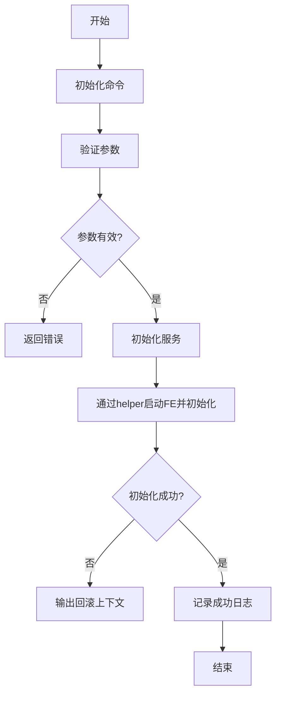
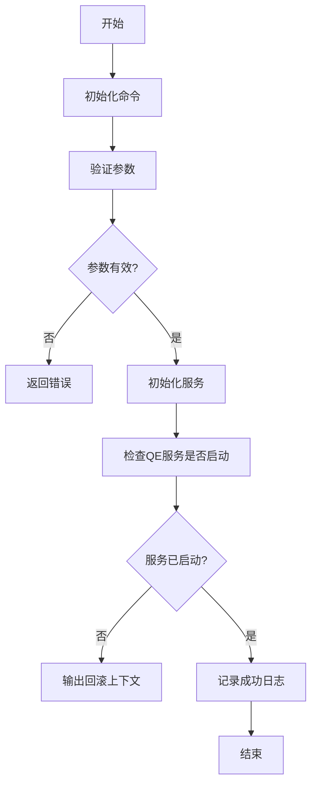

# Doris 生命周期管理

<cite>
**本文档引用的文件**
- [start_process.go](file://dbm-services/bigdata/db-tools/dbactuator/internal/subcmd/doriscmd/start_process.go)
- [stop_process.go](file://dbm-services/bigdata/db-tools/dbactuator/internal/subcmd/doriscmd/stop_process.go)
- [restart_process.go](file://dbm-services/bigdata/db-tools/dbactuator/internal/subcmd/doriscmd/restart_process.go)
- [start_fe_by_helper.go](file://dbm-services/bigdata/db-tools/dbactuator/internal/subcmd/doriscmd/start_fe_by_helper.go)
- [check_process_start.go](file://dbm-services/bigdata/db-tools/dbactuator/internal/subcmd/doriscmd/check_process_start.go)
- [cmd.go](file://dbm-services/bigdata/db-tools/dbactuator/internal/subcmd/doriscmd/cmd.go)
- [node_operation.go](file://dbm-services/bigdata/db-tools/dbactuator/pkg/components/doris/node_operation.go)
- [install_doris.go](file://dbm-services/bigdata/db-tools/dbactuator/pkg/components/doris/install_doris.go)
</cite>

## 目录
1. [简介](#简介)
2. [核心组件](#核心组件)
3. [进程启停控制](#进程启停控制)
4. [安全重启逻辑](#安全重启逻辑)
5. [FE 首次启动与故障恢复](#fe-首次启动与故障恢复)
6. [进程启动验证](#进程启动验证)
7. [操作顺序与最佳实践](#操作顺序与最佳实践)
8. [结论](#结论)

## 简介
本文档全面阐述了 Doris 数据库的生命周期管理机制，重点分析了 FE（Frontend）和 BE（Backend）进程的启动、停止、重启以及状态验证等关键操作。文档详细说明了 `start_process.go` 和 `stop_process.go` 文件对进程的启停控制，`restart_process.go` 的安全重启逻辑，`start_fe_by_helper.go` 在 FE 首次启动或故障恢复中的特殊作用，以及 `check_process_start.go` 如何验证进程是否成功启动。同时，文档提供了启停操作的顺序要求、超时处理和状态检查的最佳实践。

## 核心组件

Doris 生命周期管理的核心组件位于 `dbm-services/bigdata/db-tools/dbactuator` 项目中，主要由一系列 Go 语言编写的命令行工具构成。这些工具通过 Cobra 库实现，为 Doris 集群提供自动化运维能力。

**组件职责概述：**
- **`start_process.go`**: 负责启动指定的 Doris 进程（FE 或 BE）。
- **`stop_process.go`**: 负责停止指定的 Doris 进程（FE 或 BE）。
- **`restart_process.go`**: 负责安全地重启 Doris 进程，确保服务的连续性。
- **`start_fe_by_helper.go`**: 专门用于在集群初始化或 FE 故障后，通过辅助工具启动并初始化 FE 节点。
- **`check_process_start.go`**: 用于验证 Doris 进程是否已成功启动并正常运行。

这些组件共同构成了 Doris 集群自动化运维的基础，确保了集群的稳定性和可维护性。

**Section sources**
- [start_process.go](file://dbm-services/bigdata/db-tools/dbactuator/internal/subcmd/doriscmd/start_process.go#L1-L102)
- [stop_process.go](file://dbm-services/bigdata/db-tools/dbactuator/internal/subcmd/doriscmd/stop_process.go#L1-L102)
- [restart_process.go](file://dbm-services/bigdata/db-tools/dbactuator/internal/subcmd/doriscmd/restart_process.go#L1-L102)
- [start_fe_by_helper.go](file://dbm-services/bigdata/db-tools/dbactuator/internal/subcmd/doriscmd/start_fe_by_helper.go#L1-L106)
- [check_process_start.go](file://dbm-services/bigdata/db-tools/dbactuator/internal/subcmd/doriscmd/check_process_start.go#L1-L102)

## 进程启停控制

Doris 进程的启动和停止操作由 `start_process.go` 和 `stop_process.go` 两个文件分别实现。这两个文件的结构和逻辑高度相似，都遵循了统一的命令行工具框架。

### 启动流程 (start_process.go)

`start_process.go` 定义了 `StartProcessAct` 结构体和 `StartProcessCommand` 函数。其核心流程如下：

1.  **命令初始化**: `StartProcessCommand` 函数创建一个 Cobra 命令，其用法为 `start_process`，简短描述为“启动doris进程”。
2.  **参数验证**: 执行 `Validate()` 方法，继承自 `BaseOptions`，用于验证输入参数的有效性。
3.  **初始化**: `Init()` 方法负责反序列化传入的参数，并初始化 `NodeOperationService` 服务所需的通用参数和安装参数。
4.  **执行操作**: `Run()` 方法是核心执行逻辑。它定义了一个包含单个步骤的 `steps` 列表，该步骤调用 `d.Service.StartStopComponent` 函数来执行实际的启动操作。
5.  **结果处理**: 如果执行成功，记录日志“start_process successfully”；如果失败，则序列化回滚上下文并输出错误信息。

**Diagram sources**
- [start_process.go](file://dbm-services/bigdata/db-tools/dbactuator/internal/subcmd/doriscmd/start_process.go#L16-L102)

### 停止流程 (stop_process.go)

`stop_process.go` 的实现与 `start_process.go` 几乎完全相同，唯一的区别在于 `Run()` 方法中执行的步骤名称和调用的函数语义。

1.  **命令初始化**: 创建用法为 `stop_process` 的命令。
2.  **参数验证与初始化**: 流程与启动流程一致。
3.  **执行操作**: `Run()` 方法同样调用 `d.Service.StartStopComponent` 函数，但该函数内部会根据上下文判断是执行启动还是停止操作。
4.  **结果处理**: 成功时记录“stop_process successfully”。

**Diagram sources**
- [stop_process.go](file://dbm-services/bigdata/db-tools/dbactuator/internal/subcmd/doriscmd/stop_process.go#L16-L102)

**Section sources**
- [start_process.go](file://dbm-services/bigdata/db-tools/dbactuator/internal/subcmd/doriscmd/start_process.go#L16-L102)
- [stop_process.go](file://dbm-services/bigdata/db-tools/dbactuator/internal/subcmd/doriscmd/stop_process.go#L16-L102)

## 安全重启逻辑

`restart_process.go` 文件实现了 Doris 进程的安全重启功能。其设计目标是确保在重启过程中，服务的中断时间最短，并且能够正确处理异常情况。

### 重启流程分析

`RestartProcessAct` 结构体和 `RestartProcessCommand` 函数的实现模式与启停操作完全一致。

1.  **命令初始化**: 创建用法为 `restart_process` 的命令。
2.  **参数验证与初始化**: 流程与启动/停止流程相同。
3.  **执行操作**: `Run()` 方法的核心同样是调用 `d.Service.StartStopComponent` 函数。这里的“重启”逻辑并非简单的“停止后启动”，而是由底层的 `NodeOperationService` 服务根据传入的参数（如操作类型）来决定执行一个原子化的重启操作。这通常意味着服务会尝试优雅地停止进程，然后立即启动它，中间的间隔时间很短。
4.  **结果处理**: 成功时记录“restart_process successfully”。

**Diagram sources**
- [restart_process.go](file://dbm-services/bigdata/db-tools/dbactuator/internal/subcmd/doriscmd/restart_process.go#L16-L102)

**Section sources**
- [restart_process.go](file://dbm-services/bigdata/db-tools/dbactuator/internal/subcmd/doriscmd/restart_process.go#L16-L102)

## FE 首次启动与故障恢复

`start_fe_by_helper.go` 文件在 Doris 集群的生命周期中扮演着至关重要的角色，特别是在集群的首次部署或 FE 节点发生严重故障需要重建时。

### 特殊作用分析

与通用的 `start_process` 不同，`start_fe_by_helper` 专门用于处理 FE 节点的初始化启动。

1.  **命令初始化**: 创建用法为 `start_fe_by_helper` 的命令，描述为“doris 通过helper启动FE及初始化”。
2.  **服务类型**: 该操作使用的是 `InstallDorisService` 服务，而非 `NodeOperationService`。这表明其职责更偏向于“安装和初始化”而非“日常运维”。
3.  **核心操作**: `Run()` 方法中的步骤调用的是 `d.Service.StartFeByHelper` 函数。这个函数的语义非常明确，它会利用一个“helper”工具（可能是一个脚本或一个轻量级的服务）来完成 FE 的启动和初始化配置。这通常包括设置元数据、初始化系统表等关键步骤，这些步骤在集群首次启动时是必需的。
4.  **适用场景**: 此命令不应用于日常的 FE 进程重启。它主要用于：
    -   Doris 集群的首次部署和初始化。
    -   当 FE 的元数据损坏，需要从备份恢复并重新初始化时。
    -   新增一个 FE 节点并将其加入现有集群时。

**Diagram sources**
- [start_fe_by_helper.go](file://dbm-services/bigdata/db-tools/dbactuator/internal/subcmd/doriscmd/start_fe_by_helper.go#L16-L106)

**Section sources**
- [start_fe_by_helper.go](file://dbm-services/bigdata/db-tools/dbactuator/internal/subcmd/doriscmd/start_fe_by_helper.go#L16-L106)

## 进程启动验证

`check_process_start.go` 文件提供了验证 Doris 进程是否成功启动并正常运行的能力，这是确保运维操作成功的关键环节。

### 验证机制

1.  **命令初始化**: 创建用法为 `check_process_start` 的命令，描述为“检查节点是否正常启动”。
2.  **服务类型**: 与 `start_fe_by_helper` 一样，它使用 `InstallDorisService` 服务，表明其与初始化和健康检查相关。
3.  **核心操作**: `Run()` 方法调用 `d.Service.CheckQeServiceStart` 函数。这里的 `QeService` 指的是 Query Engine Service，即查询引擎服务。该函数会通过访问 Doris 的 HTTP 接口或检查进程状态等方式，来确认 BE 节点上的查询引擎是否已经启动并可以接受请求。
4.  **结果**: 如果检查通过，记录“check_decommission 执行成功”（此处日志信息可能有误，应为检查启动成功）；如果失败，则输出回滚上下文。

**Diagram sources**
- [check_process_start.go](file://dbm-services/bigdata/db-tools/dbactuator/internal/subcmd/doriscmd/check_process_start.go#L16-L102)

**Section sources**
- [check_process_start.go](file://dbm-services/bigdata/db-tools/dbactuator/internal/subcmd/doriscmd/check_process_start.go#L16-L102)

## 操作顺序与最佳实践

为了确保 Doris 集群的稳定和数据安全，在执行生命周期管理操作时，应遵循以下顺序和最佳实践。

### 操作顺序要求

1.  **启动顺序**: 在集群初始化或整体重启时，应先启动 FE 节点，待 FE 服务完全就绪后，再启动 BE 节点。BE 节点需要连接到 FE 来获取元数据和指令。
2.  **停止顺序**: 在停止集群时，应先停止所有 BE 节点，最后再停止 FE 节点。这样可以确保所有正在进行的查询都已结束，避免因 BE 突然断开导致 FE 出现异常。
3.  **滚动重启**: 对于生产环境，建议采用滚动重启的方式。即一次只重启一个节点（无论是 FE 还是 BE），待该节点恢复正常并加入集群后，再重启下一个节点。这可以最大限度地保证服务的可用性。

### 超时处理

-   所有启停操作都应设置合理的超时时间。如果在超时时间内操作未完成，应视为失败，并触发告警。
-   超时时间的设置应考虑节点的负载、数据量大小以及网络状况。例如，一个数据量巨大的 BE 节点启动可能需要数分钟。

### 状态检查最佳实践

1.  **操作后验证**: 每次执行 `start_process`、`stop_process` 或 `restart_process` 操作后，都应紧接着调用 `check_process_start` 来验证目标节点的状态。
2.  **健康检查集成**: 将 `check_process_start` 的逻辑集成到监控系统中，定期对所有 Doris 节点进行健康检查。
3.  **日志分析**: 结合 Doris 自身的日志（如 FE 的 fe.log, BE 的 be.INFO）来综合判断节点的运行状态，而不仅仅依赖进程是否存活。

## 结论

Doris 生命周期管理通过一系列精心设计的 Go 命令行工具实现，提供了对 FE 和 BE 进程的全面控制。`start_process.go` 和 `stop_process.go` 提供了基础的启停能力，`restart_process.go` 实现了安全的重启逻辑。`start_fe_by_helper.go` 在集群初始化和灾难恢复中发挥着不可替代的作用，而 `check_process_start.go` 则是确保操作成功的关键验证手段。遵循正确的操作顺序、设置合理的超时并严格执行状态检查，是保障 Doris 集群高可用和稳定运行的最佳实践。