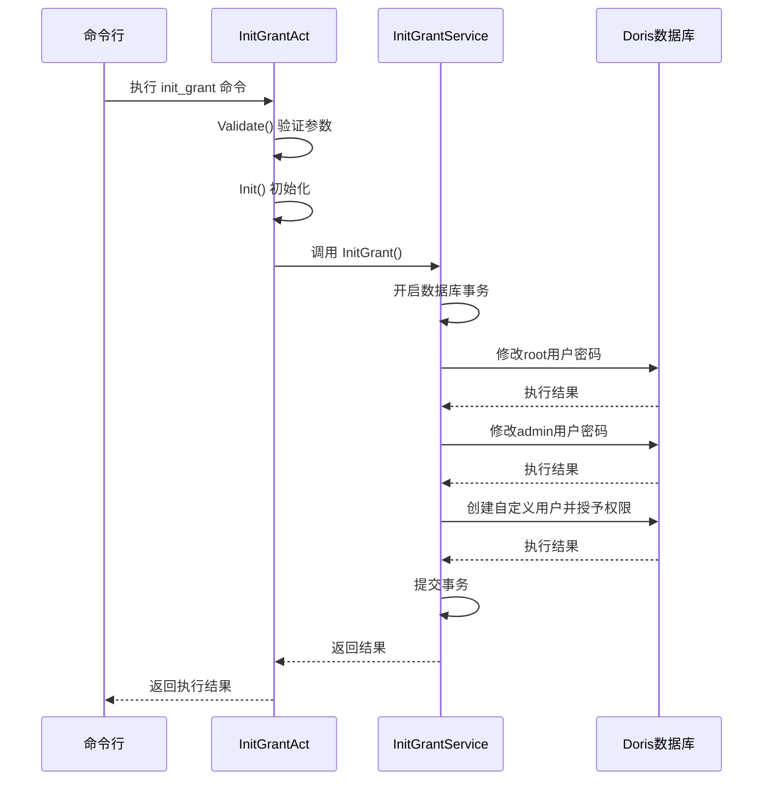
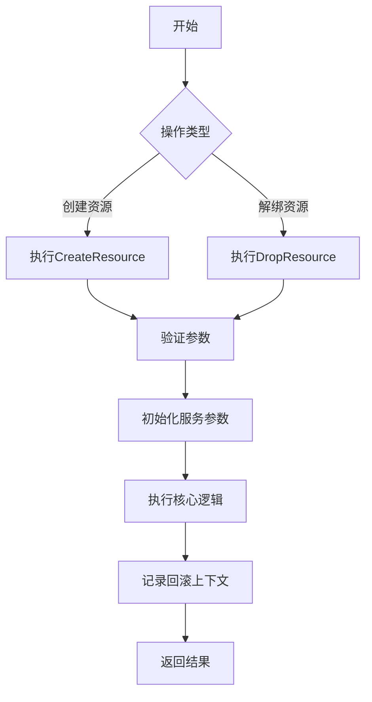

# Doris 配置管理

<cite>
**本文档引用的文件**  
- [render_config.go](file://dbm-services/bigdata/db-tools/dbactuator/internal/subcmd/doriscmd/render_config.go)
- [init_grant.go](file://dbm-services/bigdata/db-tools/dbactuator/pkg/components/doris/init_grant.go)
- [create_resource.go](file://dbm-services/bigdata/db-tools/dbactuator/internal/subcmd/doriscmd/create_resource.go)
- [drop_resource.go](file://dbm-services/bigdata/db-tools/dbactuator/internal/subcmd/doriscmd/drop_resource.go)
</cite>

## 目录
1. [简介](#简介)
2. [配置文件模板渲染机制](#配置文件模板渲染机制)
3. [初始化授权流程](#初始化授权流程)
4. [资源管理功能](#资源管理功能)
5. [自定义配置覆盖方法](#自定义配置覆盖方法)
6. [权限管理最佳实践](#权限管理最佳实践)

## 简介
本文档详细阐述了 Doris 集群在蓝鲸 DBM 系统中的配置管理机制。重点分析了配置文件的模板渲染、初始化授权流程以及冷存储资源的管理功能。通过深入解析相关代码实现，为运维人员和开发人员提供清晰的操作指导和技术参考。

## 配置文件模板渲染机制
Doris 配置文件的模板渲染机制通过 `render_config.go` 文件中的 `RenderConfigAct` 结构体实现。该机制根据 Doris 集群的拓扑结构动态生成 FE（Frontend）和 BE（Backend）节点的配置文件。

渲染过程首先通过反序列化获取执行参数，并初始化通用参数和安装参数。核心渲染逻辑封装在 `doris.InstallDorisService` 服务的 `RenderConfig` 方法中，该方法会根据集群拓扑信息（如节点 IP、端口、角色等）填充配置模板。

配置渲染支持多种参数定制，包括但不限于：
- 节点角色（FE/BE）
- 网络端口配置
- 存储路径设置
- 高可用相关参数

整个渲染过程被设计为可回滚的操作，通过 `Rollback` 方法支持配置错误时的恢复机制。执行流程采用步骤化设计，便于扩展和维护。

**Section sources**
- [render_config.go](file://dbm-services/bigdata/db-tools/dbactuator/internal/subcmd/doriscmd/render_config.go#L1-L107)

## 初始化授权流程
Doris 集群的初始化授权流程在 `init_grant.go` 文件中实现，主要通过 `InitGrantService` 结构体完成。该流程负责创建默认用户并分配相应权限，确保集群安全启动。

初始化授权的核心功能包括：

### root 用户密码设置
系统首先连接到 Doris 集群的 MySQL 兼容接口，使用默认空密码连接 root 用户，然后执行 `ALTER USER` 语句修改 root 用户密码。密码来源优先使用 `RootPassword` 参数，若未指定则使用通用密码。

### admin 用户密码设置
在 root 用户密码修改成功后，使用新的 root 密码连接数据库，修改 `admin` 用户的密码。同样支持密码参数的优先级选择。

### 自定义用户创建
系统支持创建自定义用户，并自动授予 `admin` 角色和 `NODE_PRIV` 权限。同时，为该用户设置资源标签属性 `resource_tags.location` 为 `cold,default`，以便于后续的冷热数据分层管理。

所有授权操作在一个数据库事务中执行，确保操作的原子性。如果任何一步失败，事务将回滚，避免出现部分授权的不一致状态。

**Diagram sources**
- [init_grant.go](file://dbm-services/bigdata/db-tools/dbactuator/pkg/components/doris/init_grant.go#L1-L179)

**Section sources**
- [init_grant.go](file://dbm-services/bigdata/db-tools/dbactuator/pkg/components/doris/init_grant.go#L1-L179)

## 资源管理功能
Doris 的资源管理功能主要包括冷存储资源的创建和解绑操作，通过 `create_resource.go` 和 `drop_resource.go` 两个文件实现。

### 创建资源
`CreateResourceAct` 结构体负责处理创建资源的操作。该功能通过 `CreateResourceService` 服务的 `CreateResource` 方法实现，主要完成以下任务：
- 反序列化获取资源创建参数
- 初始化通用参数和安装参数
- 执行资源创建逻辑，将 Doris 集群与冷存储资源关联

### 解绑资源
`DropResourceAct` 结构体负责处理解绑资源的操作。该功能通过 `DropResourceService` 服务的 `DropResource` 方法实现，主要完成以下任务：
- 反序列化获取资源解绑参数
- 初始化通用参数和安装参数
- 执行资源解绑逻辑，断开 Doris 集群与冷存储资源的关联

两个操作都支持回滚机制，确保在失败情况下可以恢复到之前的状态。操作流程采用统一的步骤化设计，便于维护和扩展。

**Diagram sources**
- [create_resource.go](file://dbm-services/bigdata/db-tools/dbactuator/internal/subcmd/doriscmd/create_resource.go#L1-L104)
- [drop_resource.go](file://dbm-services/bigdata/db-tools/dbactuator/internal/subcmd/doriscmd/drop_resource.go#L1-L105)

**Section sources**
- [create_resource.go](file://dbm-services/bigdata/db-tools/dbactuator/internal/subcmd/doriscmd/create_resource.go#L1-L104)
- [drop_resource.go](file://dbm-services/bigdata/db-tools/dbactuator/internal/subcmd/doriscmd/drop_resource.go#L1-L105)

## 自定义配置覆盖方法
在 Doris 配置管理中，自定义配置项的覆盖可以通过以下几种方式实现：

1. **参数优先级机制**：系统采用明确的参数优先级策略，如 `DefaultString` 函数所示，优先使用特定配置项，若不存在则使用通用配置。

2. **模板变量注入**：在配置文件模板中定义变量占位符，通过渲染时注入实际值来实现配置覆盖。

3. **运行时参数传递**：通过命令行参数或配置文件传递自定义配置，在初始化阶段加载并覆盖默认值。

4. **环境变量支持**：部分配置项支持从环境变量读取，便于在不同部署环境中灵活调整。

最佳实践建议将自定义配置集中管理，通过配置中心或版本控制系统维护，避免分散在多个地方导致管理混乱。

## 权限管理最佳实践
基于 Doris 的权限管理机制，推荐以下最佳实践：

1. **最小权限原则**：为每个用户分配完成其工作所需的最小权限，避免过度授权。

2. **角色继承机制**：合理利用角色继承，如将自定义用户授予 `admin` 角色，便于权限管理。

3. **定期密码轮换**：建立密码定期更换机制，提高系统安全性。

4. **审计日志**：启用并定期检查权限变更日志，及时发现异常操作。

5. **资源标签管理**：充分利用 `resource_tags` 功能，实现数据的冷热分层管理。

6. **事务性操作**：对批量权限操作使用事务，确保操作的原子性和一致性。

7. **自动化脚本**：将权限管理操作封装为自动化脚本，减少人为错误。

通过遵循这些最佳实践，可以有效提升 Doris 集群的安全性和可管理性。