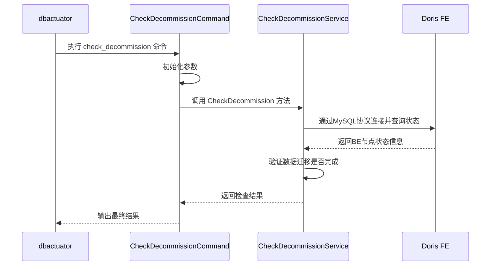
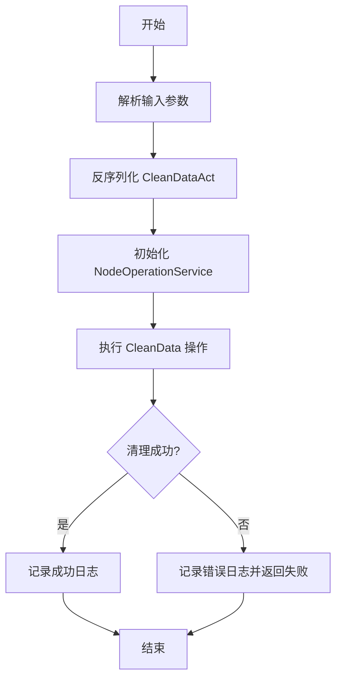
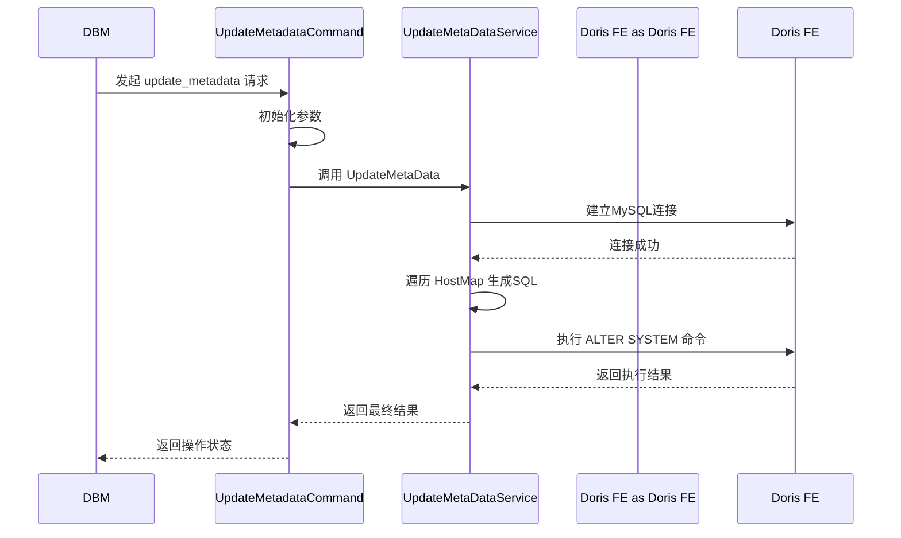

# Doris 集群维护

<cite>
**本文档引用文件**  
- [check_decommission.go](file://dbm-services/bigdata/db-tools/dbactuator/internal/subcmd/doriscmd/check_decommission.go)
- [clean_data.go](file://dbm-services/bigdata/db-tools/dbactuator/internal/subcmd/doriscmd/clean_data.go)
- [update_cluster_metadata.go](file://dbm-services/bigdata/db-tools/dbactuator/internal/subcmd/doriscmd/update_cluster_metadata.go)
- [first_launch.go](file://dbm-services/bigdata/db-tools/dbactuator/internal/subcmd/doriscmd/first_launch.go)
- [update_metadata.go](file://dbm-services/bigdata/db-tools/dbactuator/pkg/components/doris/update_metadata.go)
- [shrink_doris.go](file://dbm-services/bigdata/db-tools/dbactuator/pkg/components/doris/shrink_doris.go)
</cite>

## 目录
1. [简介](#简介)
2. [节点下线前的数据迁移检查](#节点下线前的数据迁移检查)
3. [节点移除后的数据清理流程](#节点移除后的数据清理流程)
4. [集群元数据同步机制](#集群元数据同步机制)
5. [集群首次启动初始化](#集群首次启动初始化)
6. [节点扩容与缩容操作指南](#节点扩容与缩容操作指南)
7. [元数据修复流程](#元数据修复流程)

## 简介
本文档详细阐述了Doris集群的维护机制，重点介绍节点下线、数据清理、元数据同步和集群初始化等关键操作的实现原理与操作流程。通过分析核心代码文件，为运维人员提供全面的技术指导。

## 节点下线前的数据迁移检查
在Doris集群中执行节点下线操作前，必须确保该节点上的数据已完整迁移到其他存活节点，以保障数据的完整性和服务的高可用性。`check_decommission.go` 文件实现了这一关键检查逻辑。

该功能通过 `CheckDecommissionAct` 结构体和 `CheckDecommissionCommand` 命令提供。其核心是调用 `doris.CheckDecommissionService` 服务的 `CheckDecommission` 方法。此过程会连接到Doris集群的FE（Frontend）节点，通过MySQL协议执行管理命令，验证目标BE（Backend）节点是否可以安全退役。检查内容包括该节点上所有tablet的副本是否已在其他节点上完成均衡和复制。

**图示来源**
- [check_decommission.go](file://dbm-services/bigdata/db-tools/dbactuator/internal/subcmd/doriscmd/check_decommission.go#L16-L102)
- [shrink_doris.go](file://dbm-services/bigdata/db-tools/dbactuator/pkg/components/doris/shrink_doris.go#L15-L31)

**本节来源**
- [check_decommission.go](file://dbm-services/bigdata/db-tools/dbactuator/internal/subcmd/doriscmd/check_decommission.go#L16-L102)

## 节点移除后的数据清理流程
当一个Doris节点被彻底从集群中移除后，需要清理其遗留的本地数据文件，以释放磁盘空间并避免资源浪费。`clean_data.go` 文件定义了执行此清理任务的逻辑。

该功能由 `CleanDataAct` 结构体和 `CleanDataCommand` 命令实现。其核心是调用 `doris.NodeOperationService` 服务的 `CleanData` 方法。该操作通常在确认节点已从集群元数据中移除后执行。它会直接访问目标节点的文件系统，定位并删除Doris数据目录（如`be/storage`）下的所有数据文件和日志文件。

**图示来源**
- [clean_data.go](file://dbm-services/bigdata/db-tools/dbactuator/internal/subcmd/doriscmd/clean_data.go#L17-L102)

**本节来源**
- [clean_data.go](file://dbm-services/bigdata/db-tools/dbactuator/internal/subcmd/doriscmd/clean_data.go#L17-L102)

## 集群元数据同步机制
`update_cluster_metadata.go` 文件负责将集群的节点变更信息同步到Doris的元数据中，这是实现节点扩容、缩容和故障恢复的核心步骤。

该功能通过 `UpdateMetadataAct` 结构体和 `UpdateMetadataCommand` 命令实现。其核心是调用 `doris.UpdateMetaDataService` 服务的 `UpdateMetaData` 方法。该服务会连接到集群的FE节点，并根据传入的 `HostMap` 参数，生成并执行相应的 `ALTER SYSTEM` SQL语句。

例如，当添加新节点时，会执行 `ALTER SYSTEM ADD BACKEND "ip:port"`；当移除节点时，会执行 `ALTER SYSTEM DECOMMISSION BACKEND "ip:port"`。此外，该服务还提供了 `UpdateBackendsTag` 方法，用于修改BE节点的标签（tag），实现数据分层存储等高级功能。

**图示来源**
- [update_cluster_metadata.go](file://dbm-services/bigdata/db-tools/dbactuator/internal/subcmd/doriscmd/update_cluster_metadata.go#L16-L101)
- [update_metadata.go](file://dbm-services/bigdata/db-tools/dbactuator/pkg/components/doris/update_metadata.go#L15-L136)

**本节来源**
- [update_cluster_metadata.go](file://dbm-services/bigdata/db-tools/dbactuator/internal/subcmd/doriscmd/update_cluster_metadata.go#L16-L101)
- [update_metadata.go](file://dbm-services/bigdata/db-tools/dbactuator/pkg/components/doris/update_metadata.go#L15-L136)

## 集群首次启动初始化
`first_launch.go` 文件处理Doris集群或其组件的首次启动任务，这是集群部署过程中的关键一步。

该功能由 `FirstLaunchAct` 结构体和 `FirstLaunchCommand` 命令提供。其核心是调用 `doris.NodeOperationService` 服务的 `FirstLaunch` 方法。此操作通常在新节点安装完成后执行，负责启动Doris的BE或FE进程。它会根据预设的安装参数和配置文件，调用系统命令（如`systemctl start`或直接执行二进制文件）来启动服务，并进行必要的初始化检查，确保进程正常运行。

**本节来源**
- [first_launch.go](file://dbm-services/bigdata/db-tools/dbactuator/internal/subcmd/doriscmd/first_launch.go#L17-L101)

## 节点扩容与缩容操作指南
节点的扩容（Scale-out）和缩容（Scale-in）是Doris集群弹性管理的核心能力。

### 扩容流程
1.  **准备节点**：在新机器上部署Doris软件包。
2.  **首次启动**：使用 `first_launch` 命令启动新节点上的BE服务。
3.  **同步元数据**：使用 `update_metadata` 命令，通过 `ADD BACKEND` 操作将新节点加入集群。
4.  **数据均衡**：集群会自动开始将数据分片（tablet）迁移到新节点。

### 缩容流程
1.  **检查迁移**：使用 `check_decommission` 命令，确保目标节点上的数据已全部迁移完毕。
2.  **退役节点**：使用 `update_metadata` 命令，通过 `DECOMMISSION BACKEND` 操作将节点从集群元数据中移除。
3.  **清理数据**：在确认节点已下线后，使用 `clean_data` 命令清理该节点上的本地数据文件。

## 元数据修复流程
当集群元数据出现不一致时（例如，节点状态异常），可以通过元数据同步命令进行修复。

1.  **诊断问题**：通过Doris的管理命令（如 `SHOW PROC '/backends'`）确认元数据状态。
2.  **执行修复**：使用 `update_metadata` 命令，传入正确的 `HostMap` 和 `operation` 参数（如 `ADD` 或 `DECOMMISSION`），强制同步元数据。
3.  **验证结果**：再次检查集群状态，确认问题已解决。