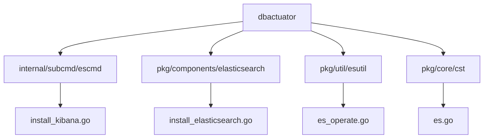
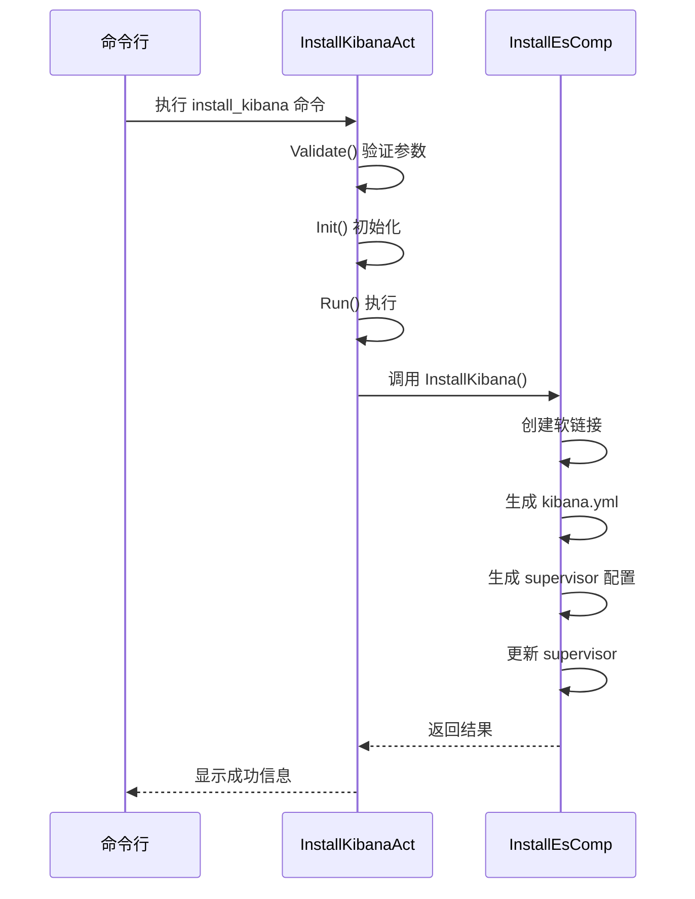
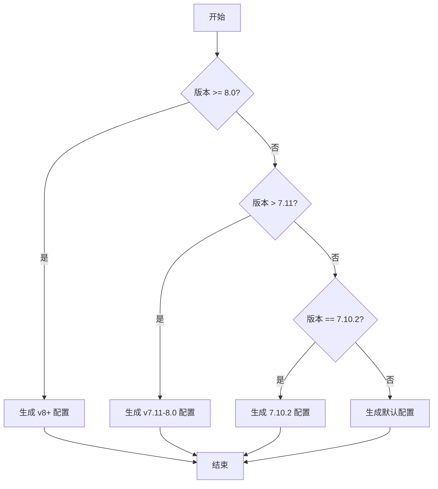
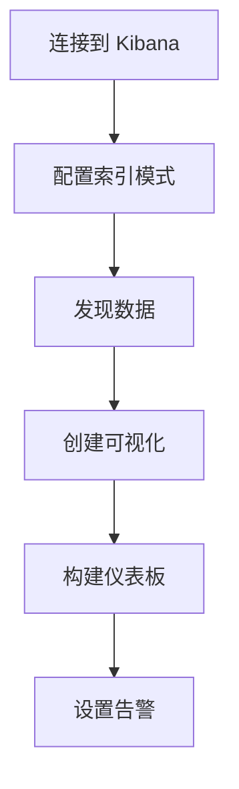

# Elasticsearch 可视化集成

<cite>
**本文档引用的文件**  
- [install_kibana.go](file://dbm-services/bigdata/db-tools/dbactuator/internal/subcmd/escmd/install_kibana.go)
- [install_elasticsearch.go](file://dbm-services/bigdata/db-tools/dbactuator/pkg/components/elasticsearch/install_elasticsearch.go)
- [es_operate.go](file://dbm-services/bigdata/db-tools/dbactuator/pkg/util/esutil/es_operate.go)
- [es.go](file://dbm-services/bigdata/db-tools/dbactuator/pkg/core/cst/es.go)
- [cmd.go](file://dbm-services/bigdata/db-tools/dbactuator/internal/subcmd/escmd/cmd.go)
</cite>

## 目录
1. [项目结构](#项目结构)
2. [核心组件](#核心组件)
3. [Kibana 安装流程](#kibana-安装流程)
4. [Kibana 配置参数](#kibana-配置参数)
5. [实际操作示例](#实际操作示例)
6. [数据探索与可视化](#数据探索与可视化)

## 项目结构

根据项目目录结构，Elasticsearch 相关的自动化操作主要位于 `dbm-services/bigdata/db-tools/dbactuator` 模块中，特别是 `internal/subcmd/escmd` 目录下的命令实现和 `pkg/components/elasticsearch` 目录下的组件逻辑。



**图源**  
- [install_kibana.go](file://dbm-services/bigdata/db-tools/dbactuator/internal/subcmd/escmd/install_kibana.go)
- [install_elasticsearch.go](file://dbm-services/bigdata/db-tools/dbactuator/pkg/components/elasticsearch/install_elasticsearch.go)
- [es_operate.go](file://dbm-services/bigdata/db-tools/dbactuator/pkg/util/esutil/es_operate.go)
- [es.go](file://dbm-services/bigdata/db-tools/dbactuator/pkg/core/cst/es.go)

## 核心组件

Elasticsearch 可视化集成的核心组件主要包括 `InstallKibanaAct` 结构体和 `InstallEsComp` 组件，它们分别负责 Kibana 的安装命令处理和具体安装逻辑的执行。

**组件源**  
- [install_kibana.go](file://dbm-services/bigdata/db-tools/dbactuator/internal/subcmd/escmd/install_kibana.go#L17-L20)
- [install_elasticsearch.go](file://dbm-services/bigdata/db-tools/dbactuator/pkg/components/elasticsearch/install_elasticsearch.go#L655-L694)

## Kibana 安装流程

Kibana 的安装流程通过 `dbactuator` 命令行工具自动化完成，主要步骤如下：

1. **命令注册**：在 `cmd.go` 文件中，`NewEsCommand` 函数将 `InstallKibanaCommand` 注册为可用命令
2. **参数验证**：`InstallKibanaAct.Validate` 方法验证输入参数
3. **初始化**：`InstallKibanaAct.Init` 方法反序列化参数并初始化默认配置
4. **执行安装**：`InstallKibanaAct.Run` 方法调用 `InstallEsComp.InstallKibana` 执行具体安装步骤
5. **回滚机制**：支持通过 `Rollback` 方法进行安装回滚



**图源**  
- [install_kibana.go](file://dbm-services/bigdata/db-tools/dbactuator/internal/subcmd/escmd/install_kibana.go)
- [install_elasticsearch.go](file://dbm-services/bigdata/db-tools/dbactuator/pkg/components/elasticsearch/install_elasticsearch.go#L655-L694)

## Kibana 配置参数

Kibana 的配置参数通过 `KibanaParam` 结构体定义，并根据 Elasticsearch 版本生成相应的 `kibana.yml` 配置文件。

### 配置参数说明

| 参数 | 说明 |
|------|------|
| BkBizID | 蓝鲸业务ID |
| DbType | 数据库类型 |
| ClusterName | 集群名称 |
| ServiceType | 服务类型 |
| Host | Elasticsearch 服务器地址 |
| HTTPPort | Elasticsearch HTTP 端口 |
| Username | 认证用户名 |
| Password | 认证密码 |
| Version | Kibana 版本号 |

### 版本差异化配置

根据 Elasticsearch 版本的不同，生成的 `kibana.yml` 配置有所区别：



**图源**  
- [es_operate.go](file://dbm-services/bigdata/db-tools/dbactuator/pkg/util/esutil/es_operate.go#L552-L626)
- [es.go](file://dbm-services/bigdata/db-tools/dbactuator/pkg/core/cst/es.go#L58-L63)

## 实际操作示例

以下是一个部署与 ES 集群集成的 Kibana 实例的实际操作示例：

### 部署命令

```bash
dbactuator es install_kibana --payload="base64_encoded_json"
```

### 配置参数示例

```json
{
  "bk_biz_id": 123,
  "db_type": "es",
  "cluster_name": "my-es-cluster",
  "service_type": "kibana",
  "host": "192.168.1.100",
  "http_port": 9200,
  "username": "admin",
  "password": "password123",
  "es_version": "8.0.0"
}
```

### 部署流程

1. 准备 Kibana 安装包并解压到 `/data/esenv/`
2. 创建版本软链接：`ln -sf /data/esenv/kibana-8.0.0-linux-x86_64 /data/esenv/kibana`
3. 生成 `kibana.yml` 配置文件
4. 创建 supervisor 配置文件 `kibana.ini`
5. 更新 supervisor 配置并启动 Kibana 服务

**操作源**  
- [install_elasticsearch.go](file://dbm-services/bigdata/db-tools/dbactuator/pkg/components/elasticsearch/install_elasticsearch.go#L655-L694)
- [es_operate.go](file://dbm-services/bigdata/db-tools/dbactuator/pkg/util/esutil/es_operate.go#L552-L626)

## 数据探索与可视化

部署完成后，可以通过 Kibana 进行数据探索、可视化仪表板创建和日志分析。

### 数据探索流程



### 主要功能

1. **Discover**：实时浏览和搜索 Elasticsearch 中的数据
2. **Visualize Library**：创建各种图表（柱状图、饼图、地图等）
3. **Dashboard**：将多个可视化组件组合成综合仪表板
4. **Stack Management**：管理索引、用户权限和 Kibana 设置

通过 `dbactuator` 自动化部署的 Kibana 实例已经预配置了与 ES 集群的连接，用户可以直接登录并开始数据探索和可视化工作。

**功能源**  
- [install_kibana.go](file://dbm-services/bigdata/db-tools/dbactuator/internal/subcmd/escmd/install_kibana.go)
- [install_elasticsearch.go](file://dbm-services/bigdata/db-tools/dbactuator/pkg/components/elasticsearch/install_elasticsearch.go)