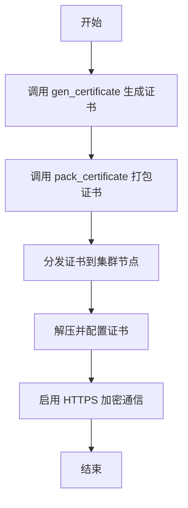
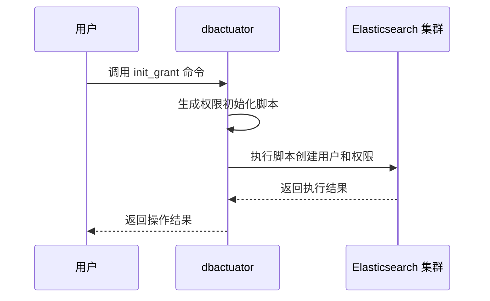

# Elasticsearch 安全管理

<cite>
**本文档引用的文件**
- [gen_certificate.go](file://dbm-services/bigdata/db-tools/dbactuator/internal/subcmd/escmd/gen_certificate.go)
- [pack_certificate.go](file://dbm-services/bigdata/db-tools/dbactuator/internal/subcmd/escmd/pack_certificate.go)
- [init_grant.go](file://dbm-services/bigdata/db-tools/dbactuator/internal/subcmd/escmd/init_grant.go)
- [gen_certificate.go](file://dbm-services/bigdata/db-tools/dbactuator/pkg/components/elasticsearch/gen_certificate.go)
- [pack_certificate.go](file://dbm-services/bigdata/db-tools/dbactuator/pkg/components/elasticsearch/pack_certificate.go)
- [install_elasticsearch.go](file://dbm-services/bigdata/db-tools/dbactuator/pkg/components/elasticsearch/install_elasticsearch.go)
- [es.go](file://dbm-services/bigdata/db-tools/dbactuator/pkg/core/cst/es.go)
- [es_operate.go](file://dbm-services/bigdata/db-tools/dbactuator/pkg/util/esutil/es_operate.go)
- [es_act_payload.py](file://dbm-ui/backend/flow/utils/es/es_act_payload.py)
</cite>

## 目录
1. [引言](#引言)
2. [证书生成与分发](#证书生成与分发)
3. [权限初始化](#权限初始化)
4. [安全集群部署示例](#安全集群部署示例)
5. [证书更新与轮换策略](#证书更新与轮换策略)
6. [总结](#总结)

## 引言
本文档详细阐述了在 BlueKing DBM 系统中如何为 Elasticsearch 集群实现全面的安全管理。文档重点分析了 `gen_certificate.go` 和 `pack_certificate.go` 文件在生成和分发 TLS/SSL 证书过程中的作用，解释了如何通过 `dbactuator` 工具为集群启用 HTTPS 加密通信。同时，文档深入解析了 `init_grant.go` 文件中实现的初始权限配置逻辑，说明了如何通过 `dbactuator` 为集群设置安全认证和访问控制。最后，提供了一个完整的示例，展示如何部署一个启用了证书认证和用户权限管理的安全 ES 集群，并说明了证书的更新和轮换策略。

## 证书生成与分发

### gen_certificate.go 的作用
`gen_certificate.go` 文件是 Elasticsearch 证书生成的核心组件。它根据 Elasticsearch 的版本选择不同的证书生成策略：
- 对于版本低于 7.14.2 的 ES 集群，使用 OpenSSL 工具生成证书。
- 对于版本 7.14.2 及以上的 ES 集群，使用 Elasticsearch 自带的 `elasticsearch-certutil` 工具生成证书。

该文件通过 `GenCerComp` 结构体实现了证书生成的逻辑，包括生成 CA 证书、节点证书、管理员证书，并根据版本生成相应的配置文件（如 `elasticsearch.yml.append`）。

**Section sources**
- [gen_certificate.go](file://dbm-services/bigdata/db-tools/dbactuator/internal/subcmd/escmd/gen_certificate.go#L1-L103)
- [gen_certificate.go](file://dbm-services/bigdata/db-tools/dbactuator/pkg/components/elasticsearch/gen_certificate.go#L1-L220)

### pack_certificate.go 的作用
`pack_certificate.go` 文件负责将生成的证书文件打包并分发到集群的各个节点。它根据 Elasticsearch 版本选择相应的证书文件列表，将证书文件和配置文件复制到 `/tmp` 目录下，并打包成 `es_cerfiles.tar.gz` 文件，以便后续分发。

该文件通过 `PackCerComp` 结构体实现了证书打包的逻辑，确保所有必要的证书文件和配置文件都被正确打包。

**Section sources**
- [pack_certificate.go](file://dbm-services/bigdata/db-tools/dbactuator/internal/subcmd/escmd/pack_certificate.go#L1-L105)
- [pack_certificate.go](file://dbm-services/bigdata/db-tools/dbactuator/pkg/components/elasticsearch/pack_certificate.go#L1-L121)

### 为 ES 集群启用 HTTPS 加密通信
通过 `gen_certificate.go` 和 `pack_certificate.go` 的协同工作，ES 集群可以启用 HTTPS 加密通信。具体步骤如下：
1. 调用 `dbactuator es gen_certificate` 命令生成证书。
2. 调用 `dbactuator es pack_certificate` 命令打包证书。
3. 将打包好的证书文件分发到集群的各个节点。
4. 在每个节点上解压证书文件，并配置 Elasticsearch 使用这些证书。



**Diagram sources**
- [gen_certificate.go](file://dbm-services/bigdata/db-tools/dbactuator/pkg/components/elasticsearch/gen_certificate.go#L35-L142)
- [pack_certificate.go](file://dbm-services/bigdata/db-tools/dbactuator/pkg/components/elasticsearch/pack_certificate.go#L35-L58)

## 权限初始化

### init_grant.go 的权限配置逻辑
`init_grant.go` 文件实现了 Elasticsearch 集群的初始权限配置逻辑。它通过 `InitGrantAct` 结构体调用 `InstallEsComp` 的 `InitGrant` 方法，生成并执行一个 shell 脚本，用于创建初始用户并分配相应的权限。

该文件通过 `InitGrantCommand` 函数定义了 `init_grant` 命令，允许用户通过 `dbactuator` 工具初始化集群的权限。

**Section sources**
- [init_grant.go](file://dbm-services/bigdata/db-tools/dbactuator/internal/subcmd/escmd/init_grant.go#L1-L105)
- [install_elasticsearch.go](file://dbm-services/bigdata/db-tools/dbactuator/pkg/components/elasticsearch/install_elasticsearch.go#L697-L723)

### 通过 dbactuator 设置安全认证和访问控制
通过 `dbactuator` 工具，可以为 ES 集群设置安全认证和访问控制。具体步骤如下：
1. 调用 `dbactuator es init_grant` 命令，传入用户名、密码和主机信息。
2. `dbactuator` 生成一个 shell 脚本，用于创建用户并分配权限。
3. 执行该脚本，完成权限初始化。



**Diagram sources**
- [init_grant.go](file://dbm-services/bigdata/db-tools/dbactuator/internal/subcmd/escmd/init_grant.go#L77-L104)
- [install_elasticsearch.go](file://dbm-services/bigdata/db-tools/dbactuator/pkg/components/elasticsearch/install_elasticsearch.go#L702-L723)

## 安全集群部署示例
以下是一个完整的示例，展示如何部署一个启用了证书认证和用户权限管理的安全 ES 集群：

1. **生成证书**：
   ```bash
   dbactuator es gen_certificate --es_version 7.14.2
   ```

2. **打包证书**：
   ```bash
   dbactuator es pack_certificate --es_version 7.14.2
   ```

3. **分发证书**：
   将生成的 `es_cerfiles.tar.gz` 文件分发到集群的各个节点。

4. **解压并配置证书**：
   在每个节点上解压证书文件，并配置 Elasticsearch 使用这些证书。

5. **初始化权限**：
   ```bash
   dbactuator es init_grant --username admin --password password --host 127.0.0.1 --es_version 7.14.2
   ```

6. **启动集群**：
   启动 Elasticsearch 集群，此时集群已启用 HTTPS 加密通信和用户权限管理。

**Section sources**
- [gen_certificate.go](file://dbm-services/bigdata/db-tools/dbactuator/internal/subcmd/escmd/gen_certificate.go#L27-L46)
- [pack_certificate.go](file://dbm-services/bigdata/db-tools/dbactuator/internal/subcmd/escmd/pack_certificate.go#L28-L47)
- [init_grant.go](file://dbm-services/bigdata/db-tools/dbactuator/internal/subcmd/escmd/init_grant.go#L23-L42)

## 证书更新与轮换策略
为了确保集群的安全性，需要定期更新和轮换证书。建议的策略如下：
1. **定期更新**：每 1-2 年更新一次证书，以防止证书过期。
2. **轮换策略**：采用滚动更新的方式，逐个节点更新证书，以减少对集群的影响。
3. **备份**：在更新证书前，备份现有的证书和配置文件，以便在出现问题时可以快速恢复。

**Section sources**
- [gen_certificate.go](file://dbm-services/bigdata/db-tools/dbactuator/pkg/components/elasticsearch/gen_certificate.go#L88-L98)
- [pack_certificate.go](file://dbm-services/bigdata/db-tools/dbactuator/pkg/components/elasticsearch/pack_certificate.go#L68-L74)

## 总结
本文档详细介绍了如何在 BlueKing DBM 系统中为 Elasticsearch 集群实现全面的安全管理。通过 `gen_certificate.go` 和 `pack_certificate.go` 文件，可以生成和分发 TLS/SSL 证书，启用 HTTPS 加密通信。通过 `init_grant.go` 文件，可以初始化集群的权限，设置安全认证和访问控制。通过遵循本文档提供的示例和策略，可以部署一个安全可靠的 Elasticsearch 集群。