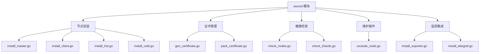
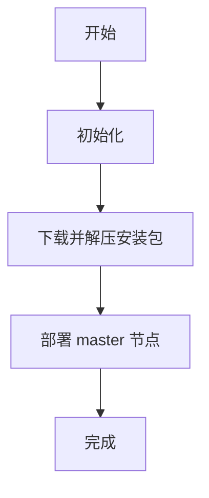
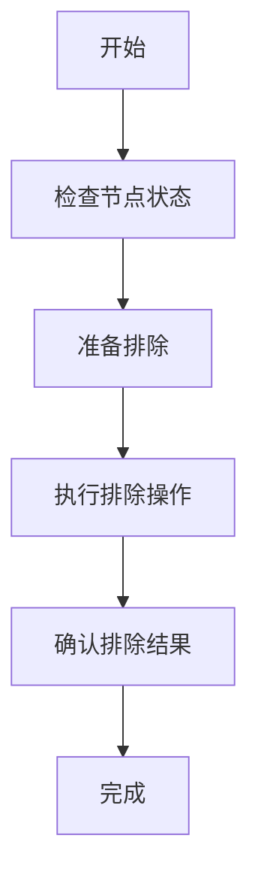

# Elasticsearch 服务管理

<cite>
**本文档中引用的文件**  
- [install_master.go](file://dbm-services/bigdata/db-tools/dbactuator/internal/subcmd/escmd/install_master.go)
- [install_client.go](file://dbm-services/bigdata/db-tools/dbactuator/internal/subcmd/escmd/install_client.go)
- [install_hot.go](file://dbm-services/bigdata/db-tools/dbactuator/internal/subcmd/escmd/install_hot.go)
- [install_cold.go](file://dbm-services/bigdata/db-tools/dbactuator/internal/subcmd/escmd/install_cold.go)
- [gen_certificate.go](file://dbm-services/bigdata/db-tools/dbactuator/internal/subcmd/escmd/gen_certificate.go)
- [pack_certificate.go](file://dbm-services/bigdata/db-tools/dbactuator/internal/subcmd/escmd/pack_certificate.go)
- [install_kibana.go](file://dbm-services/bigdata/db-tools/dbactuator/internal/subcmd/escmd/install_kibana.go)
- [check_nodes.go](file://dbm-services/bigdata/db-tools/dbactuator/internal/subcmd/escmd/check_nodes.go)
- [check_shards.go](file://dbm-services/bigdata/db-tools/dbactuator/internal/subcmd/escmd/check_shards.go)
- [exclude_node.go](file://dbm-services/bigdata/db-tools/dbactuator/internal/subcmd/escmd/exclude_node.go)
- [install_exporter.go](file://dbm-services/bigdata/db-tools/dbactuator/internal/subcmd/escmd/install_exporter.go)
- [install_telegraf.go](file://dbm-services/bigdata/db-tools/dbactuator/internal/subcmd/escmd/install_telegraf.go)
- [cmd.go](file://dbm-services/bigdata/db-tools/dbactuator/internal/subcmd/escmd/cmd.go)
</cite>

## 目录
1. [项目结构](#项目结构)
2. [核心组件](#核心组件)
3. [Elasticsearch 节点安装](#elasticsearch-节点安装)
4. [安全证书管理](#安全证书管理)
5. [Kibana 集成](#kibana-集成)
6. [健康检查机制](#健康检查机制)
7. [节点维护与排除](#节点维护与排除)
8. [监控集成](#监控集成)
9. [部署实例](#部署实例)

## 项目结构

Elasticsearch 服务管理功能主要位于 `dbm-services/bigdata/db-tools/dbactuator/internal/subcmd/escmd` 目录下，该模块提供了完整的 Elasticsearch 集群生命周期管理能力。

**图示来源**
- [install_master.go](file://dbm-services/bigdata/db-tools/dbactuator/internal/subcmd/escmd/install_master.go)
- [install_client.go](file://dbm-services/bigdata/db-tools/dbactuator/internal/subcmd/escmd/install_client.go)
- [install_hot.go](file://dbm-services/bigdata/db-tools/dbactuator/internal/subcmd/escmd/install_hot.go)
- [install_cold.go](file://dbm-services/bigdata/db-tools/dbactuator/internal/subcmd/escmd/install_cold.go)
- [gen_certificate.go](file://dbm-services/bigdata/db-tools/dbactuator/internal/subcmd/escmd/gen_certificate.go)
- [pack_certificate.go](file://dbm-services/bigdata/db-tools/dbactuator/internal/subcmd/escmd/pack_certificate.go)
- [check_nodes.go](file://dbm-services/bigdata/db-tools/dbactuator/internal/subcmd/escmd/check_nodes.go)
- [check_shards.go](file://dbm-services/bigdata/db-tools/dbactuator/internal/subcmd/escmd/check_shards.go)
- [exclude_node.go](file://dbm-services/bigdata/db-tools/dbactuator/internal/subcmd/escmd/exclude_node.go)
- [install_exporter.go](file://dbm-services/bigdata/db-tools/dbactuator/internal/subcmd/escmd/install_exporter.go)
- [install_telegraf.go](file://dbm-services/bigdata/db-tools/dbactuator/internal/subcmd/escmd/install_telegraf.go)

**章节来源**
- [cmd.go](file://dbm-services/bigdata/db-tools/dbactuator/internal/subcmd/escmd/cmd.go)

## 核心组件

`escmd` 模块通过 Cobra 命令行框架实现了 Elasticsearch 的全生命周期管理功能。每个操作都封装为独立的命令，通过统一的执行流程进行管理，包括参数验证、初始化、执行和回滚机制。

所有命令都遵循相同的结构模式：定义一个包含 `BaseOptions` 和服务组件的结构体，实现 `Validate`、`Init`、`Rollback` 和 `Run` 方法。执行流程通过 `steps.Run()` 按顺序执行各个安装步骤。

**章节来源**
- [cmd.go](file://dbm-services/bigdata/db-tools/dbactuator/internal/subcmd/escmd/cmd.go)
- [install_master.go](file://dbm-services/bigdata/db-tools/dbactuator/internal/subcmd/escmd/install_master.go)

## Elasticsearch 节点安装

`escmd` 模块支持多种 Elasticsearch 节点类型的安装，包括 master、client、hot 和 cold 节点，实现了冷热架构的完整支持。

### Master 节点安装

`install_master.go` 文件实现了 master 节点的安装流程，包括目录初始化、安装包解压和 master 节点部署等步骤。

**图示来源**
- [install_master.go](file://dbm-services/bigdata/db-tools/dbactuator/internal/subcmd/escmd/install_master.go)

**章节来源**
- [install_master.go](file://dbm-services/bigdata/db-tools/dbactuator/internal/subcmd/escmd/install_master.go)

### Client 节点安装

`install_client.go` 文件负责 client 节点的部署，主要执行 `InstallClient` 操作。

**章节来源**
- [install_client.go](file://dbm-services/bigdata/db-tools/dbactuator/internal/subcmd/escmd/install_client.go)

### Hot 节点安装

`install_hot.go` 文件实现了 hot 节点的安装，用于存储近期频繁访问的数据。

**章节来源**
- [install_hot.go](file://dbm-services/bigdata/db-tools/dbactuator/internal/subcmd/escmd/install_hot.go)

### Cold 节点安装

`install_cold.go` 文件负责 cold 节点的部署，用于存储访问频率较低的历史数据，实现冷热数据分离架构。

**章节来源**
- [install_cold.go](file://dbm-services/bigdata/db-tools/dbactuator/internal/subcmd/escmd/install_cold.go)

## 安全证书管理

### 证书生成

`gen_certificate.go` 文件实现了安全证书的生成功能。根据 Elasticsearch 版本的不同，采用不同的证书生成方式：
- 对于 7.10.2 版本，使用 openssl 生成证书
- 对于 7.14.2 版本，使用 elasticsearch-certutil 生成证书
生成的证书文件最终打包为 `/tmp/es_cerfiles.tar.gz`。

**章节来源**
- [gen_certificate.go](file://dbm-services/bigdata/db-tools/dbactuator/internal/subcmd/escmd/gen_certificate.go)

### 证书打包与分发

`pack_certificate.go` 文件负责证书的打包和分发。该模块将生成的密钥文件和 `elasticsearch.yml.append` 配置文件打包，并传输到其他节点，确保集群内所有节点都能获得必要的安全配置。

**章节来源**
- [pack_certificate.go](file://dbm-services/bigdata/db-tools/dbactuator/internal/subcmd/escmd/pack_certificate.go)

## Kibana 集成

`install_kibana.go` 文件实现了 Kibana 可视化工具的部署。通过 `InstallKibana` 操作，将 Kibana 与 Elasticsearch 集群集成，提供强大的数据可视化和分析能力。

**章节来源**
- [install_kibana.go](file://dbm-services/bigdata/db-tools/dbactuator/internal/subcmd/escmd/install_kibana.go)

## 健康检查机制

### 节点健康检查

`check_nodes.go` 文件实现了节点健康检查功能，主要用于检查集群扩容时的节点数量，确保集群配置的正确性。

**章节来源**
- [check_nodes.go](file://dbm-services/bigdata/db-tools/dbactuator/internal/subcmd/escmd/check_nodes.go)

### 分片健康检查

`check_shards.go` 文件提供了分片健康检查功能，用于检查 Elasticsearch 集群中分片的状态和分布情况。

**章节来源**
- [check_shards.go](file://dbm-services/bigdata/db-tools/dbactuator/internal/subcmd/escmd/check_shards.go)

## 节点维护与排除

`exclude_node.go` 文件实现了节点排除功能，允许在维护期间将特定节点从集群中剔除，确保维护操作不会影响集群的整体可用性。

**图示来源**
- [exclude_node.go](file://dbm-services/bigdata/db-tools/dbactuator/internal/subcmd/escmd/exclude_node.go)

**章节来源**
- [exclude_node.go](file://dbm-services/bigdata/db-tools/dbactuator/internal/subcmd/escmd/exclude_node.go)

## 监控集成

### Exporter 部署

`install_exporter.go` 文件负责部署监控 Exporter，用于收集 Elasticsearch 集群的性能指标。

**章节来源**
- [install_exporter.go](file://dbm-services/bigdata/db-tools/dbactuator/internal/subcmd/escmd/install_exporter.go)

### Telegraf 部署

`install_telegraf.go` 文件实现了 Telegraf 监控代理的部署，增强集群的监控能力。

**章节来源**
- [install_telegraf.go](file://dbm-services/bigdata/db-tools/dbactuator/internal/subcmd/escmd/install_telegraf.go)

## 部署实例

通过 `dbactuator` 命令可以部署一个完整的带有冷热架构和安全认证的 Elasticsearch 集群。典型的部署流程包括：

1. 生成安全证书 (`gen_certificate`)
2. 打包并分发证书 (`pack_certificate`)
3. 安装 master 节点 (`install_master`)
4. 安装 hot 节点 (`install_hot`)
5. 安装 cold 节点 (`install_cold`)
6. 安装 client 节点 (`install_client`)
7. 部署 Kibana (`install_kibana`)
8. 部署监控组件 (`install_exporter`, `install_telegraf`)

该流程确保了集群的安全性、高可用性和可监控性，同时通过冷热架构优化了存储成本和查询性能。

**章节来源**
- [cmd.go](file://dbm-services/bigdata/db-tools/dbactuator/internal/subcmd/escmd/cmd.go)
- [gen_certificate.go](file://dbm-services/bigdata/db-tools/dbactuator/internal/subcmd/escmd/gen_certificate.go)
- [pack_certificate.go](file://dbm-services/bigdata/db-tools/dbactuator/internal/subcmd/escmd/pack_certificate.go)
- [install_master.go](file://dbm-services/bigdata/db-tools/dbactuator/internal/subcmd/escmd/install_master.go)
- [install_hot.go](file://dbm-services/bigdata/db-tools/dbactuator/internal/subcmd/escmd/install_hot.go)
- [install_cold.go](file://dbm-services/bigdata/db-tools/dbactuator/internal/subcmd/escmd/install_cold.go)
- [install_client.go](file://dbm-services/bigdata/db-tools/dbactuator/internal/subcmd/escmd/install_client.go)
- [install_kibana.go](file://dbm-services/bigdata/db-tools/dbactuator/internal/subcmd/escmd/install_kibana.go)
- [install_exporter.go](file://dbm-services/bigdata/db-tools/dbactuator/internal/subcmd/escmd/install_exporter.go)
- [install_telegraf.go](file://dbm-services/bigdata/db-tools/dbactuator/internal/subcmd/escmd/install_telegraf.go)