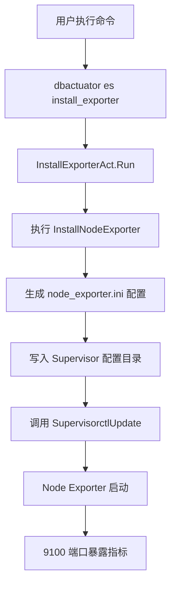
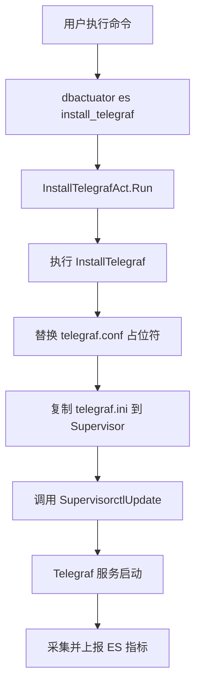
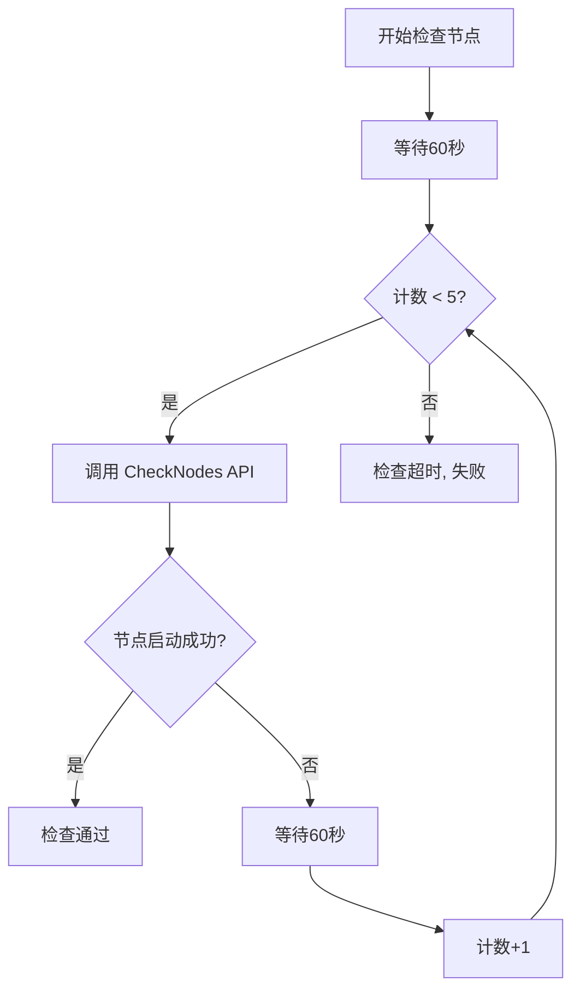
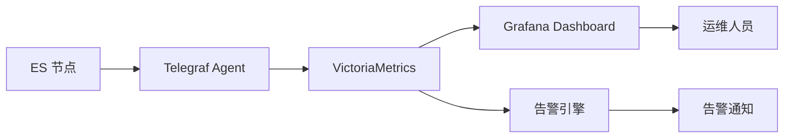

# Elasticsearch 监控集成

<cite>
**本文档引用文件**  
- [install_exporter.go](file://dbm-services/bigdata/db-tools/dbactuator/internal/subcmd/escmd/install_exporter.go)
- [install_telegraf.go](file://dbm-services/bigdata/db-tools/dbactuator/internal/subcmd/escmd/install_telegraf.go)
- [check_nodes.go](file://dbm-services/bigdata/db-tools/dbactuator/internal/subcmd/escmd/check_nodes.go)
- [check_shards.go](file://dbm-services/bigdata/db-tools/dbactuator/internal/subcmd/escmd/check_shards.go)
- [install_elasticsearch.go](file://dbm-services/bigdata/db-tools/dbactuator/pkg/components/elasticsearch/install_elasticsearch.go)
- [es_act_payload.py](file://dbm-ui/backend/flow/utils/es/es_act_payload.py)
- [es.json](file://dbm-ui/backend/bk_dataview/dashboards/json/es.json)
- [ES 集群状态.json](file://dbm-ui/backend/db_monitor/tpls/alarm/es/ES 集群状态.json)
</cite>

## 目录
1. [引言](#引言)
2. [监控组件部署机制](#监控组件部署机制)
3. [健康检查机制分析](#健康检查机制分析)
4. [统一监控平台集成](#统一监控平台集成)
5. [完整监控方案实例](#完整监控方案实例)
6. [关键指标与告警策略](#关键指标与告警策略)
7. [结论](#结论)

## 引言

本文档详细阐述了在 BlueKing DBM 系统中，如何为 Elasticsearch 集群实现全面的监控集成。文档重点分析了通过 `dbactuator` 工具部署 Prometheus Exporter 和 Telegraf 代理的机制，以及 `check_nodes.go` 和 `check_shards.go` 文件中实现的健康检查逻辑。同时，文档描述了如何将收集的指标接入统一的监控平台，并提供了一个完整的部署实例，说明关键监控指标的含义和告警阈值设置。

**本文档引用文件**  
- [install_exporter.go](file://dbm-services/bigdata/db-tools/dbactuator/internal/subcmd/escmd/install_exporter.go)
- [install_telegraf.go](file://dbm-services/bigdata/db-tools/dbactuator/internal/subcmd/escmd/install_telegraf.go)
- [check_nodes.go](file://dbm-services/bigdata/db-tools/dbactuator/internal/subcmd/escmd/check_nodes.go)
- [check_shards.go](file://dbm-services/bigdata/db-tools/dbactuator/internal/subcmd/escmd/check_shards.go)

## 监控组件部署机制

Elasticsearch 集群的监控数据采集通过部署两种代理组件实现：Prometheus Node Exporter 用于采集主机级别的系统指标，Telegraf 用于采集 Elasticsearch 服务本身的性能指标。

### Prometheus Exporter 集成

`install_exporter.go` 文件定义了部署 Prometheus Node Exporter 的命令行接口。该组件通过 `InstallExporterCommand` 函数注册为 `dbactuator es install_exporter` 命令。其核心逻辑由 `InstallEsComp` 结构体的 `InstallNodeExporter` 方法实现。

该方法的主要步骤如下：
1.  **配置生成**：创建一个名为 `node_exporter.ini` 的 Supervisor 配置文件，内容包含启动命令 `node_exporter --web.listen-address=":9100"`，并指定以 `mysql` 用户身份运行。
2.  **文件写入**：将生成的配置内容写入 `/data/esenv/supervisor/conf/node_exporter.ini` 文件。
3.  **服务注册**：调用 `SupervisorctlUpdate()` 方法，通知 Supervisor 重新加载配置，从而启动 Node Exporter 进程。

此过程确保了每个 ES 节点上都运行着一个暴露在 9100 端口的 Exporter，供 Prometheus 服务器抓取。

**图示来源**  
- [install_exporter.go](file://dbm-services/bigdata/db-tools/dbactuator/internal/subcmd/escmd/install_exporter.go#L77-104)
- [install_elasticsearch.go](file://dbm-services/bigdata/db-tools/dbactuator/pkg/components/elasticsearch/install_elasticsearch.go#L753-781)

### Telegraf 代理集成

`install_telegraf.go` 文件负责部署 Telegraf 代理。该组件通过 `InstallTelegrafCommand` 函数注册为 `dbactuator es install_telegraf` 命令。其核心逻辑由 `InstallEsComp` 结构体的 `InstallTelegraf` 方法实现。

该方法的主要步骤如下：
1.  **配置文件替换**：读取位于 `/data/esenv/telegraf/etc/telegraf/telegraf.conf` 的 Telegraf 配置模板文件。使用 `sed` 命令将模板中的占位符 `CLUSTER_NAME`、`HOSTNAME` 和 `ESHOST` 替换为实际的集群名、主机 IP 和 ES HTTP 服务地址。
2.  **服务注册**：将 `telegraf.ini` 配置文件复制到 Supervisor 的配置目录 `/data/esenv/supervisor/conf/`。
3.  **服务启动**：调用 `SupervisorctlUpdate()` 方法，使 Supervisor 加载并启动 Telegraf 服务。

通过这种方式，Telegraf 能够连接到本地的 ES 实例，采集其性能指标，并将数据发送到后端的监控系统（如 VictoriaMetrics）。

**图示来源**  
- [install_telegraf.go](file://dbm-services/bigdata/db-tools/dbactuator/internal/subcmd/escmd/install_telegraf.go#L77-104)
- [install_elasticsearch.go](file://dbm-services/bigdata/db-tools/dbactuator/pkg/components/elasticsearch/install_elasticsearch.go#L725-751)

## 健康检查机制分析

在集群扩容或维护后，系统需要验证节点和分片的状态是否正常。`check_nodes.go` 和 `check_shards.go` 文件实现了这一关键的健康检查功能。

### 节点状态检查 (`check_nodes.go`)

`check_nodes.go` 文件中的 `CheckEsNodes` 方法负责检查新加入节点的启动状态。其逻辑如下：
1.  **初始化**：接收目标节点的 IP、HTTP 端口、集群名等参数。
2.  **延迟等待**：在检查前，先等待 60 秒，给新节点留出启动时间。
3.  **循环检查**：最多进行 5 次检查，每次检查间隔 60 秒。
4.  **状态验证**：通过 `esutil.EsInsObject` 对象调用 `CheckNodes` 方法，向 ES 集群的 `_cluster/health` API 发送请求，验证目标节点是否已成功加入集群并处于活跃状态。
5.  **结果判定**：如果所有节点都成功启动，则检查通过；如果达到最大重试次数仍未成功，则检查失败并返回超时错误。

此机制确保了在后续操作执行前，所有新节点都已准备就绪。

**图示来源**  
- [check_nodes.go](file://dbm-services/bigdata/db-tools/dbactuator/internal/subcmd/escmd/check_nodes.go#L77-104)
- [check_nodes.go](file://dbm-services/bigdata/db-tools/dbactuator/pkg/components/elasticsearch/check_nodes.go#L50-84)

### 分片分配检查 (`check_shards.go`)

`check_shards.go` 文件中的 `CheckShards` 方法用于检查集群的分片分配情况。其主要逻辑是：
1.  **触发检查**：作为集群扩容或节点剔除流程的一部分被调用。
2.  **状态监控**：持续监控集群的分片分配状态，确保所有分片（尤其是主分片）都已成功分配到数据节点上。
3.  **平衡验证**：验证分片是否在集群中均匀分布，避免出现热点节点。
4.  **完成判定**：当所有分片都处于 `STARTED` 状态且分配均衡时，认为检查通过。

虽然具体实现细节在 `ExcludeEsNodeComp` 组件中，但 `check_shards.go` 提供了调用入口，确保了在关键运维操作后集群数据的完整性和可用性。

**图示来源**  
- [check_shards.go](file://dbm-services/bigdata/db-tools/dbactuator/internal/subcmd/escmd/check_shards.go#L77-104)

## 统一监控平台集成

通过 `dbactuator` 部署的监控组件，其采集的数据最终会接入到统一的监控平台进行可视化和告警。

### 数据流与接入

1.  **数据采集**：Telegraf 代理从 ES 节点采集指标，并将数据写入 VictoriaMetrics 等时序数据库。
2.  **数据存储**：指标数据被存储在名为 `exporter_dbm_elasticsearch_exporter` 的结果表中。
3.  **数据查询**：Grafana 仪表盘通过查询该结果表来获取数据。查询条件通常包括 `app`（业务应用）、`cluster_domain`（集群域名）、`es_data_node`（是否为数据节点）和 `__name`（指标名称）等标签。
4.  **可视化展示**：`es.json` 文件定义了 Grafana 仪表盘的布局和查询语句，将原始指标转化为直观的图表，如集群健康度、JVM 内存使用、分片数量等。

### 告警规则配置

告警规则在 `db_monitor/tpls/alarm/es/` 目录下定义。例如，`ES 集群状态.json` 文件配置了针对集群健康度的告警：
- **监控指标**：`elasticsearch_cluster_health_status`
- **触发条件**：当指标值等于 1（代表 `red` 状态）时触发。
- **告警级别**：一级告警。
- **检测策略**：连续 5 个检测周期（每个周期10分钟）都满足条件时触发告警。

**图示来源**  
- [es.json](file://dbm-ui/backend/bk_dataview/dashboards/json/es.json)
- [ES 集群状态.json](file://dbm-ui/backend/db_monitor/tpls/alarm/es/ES 集群状态.json)

## 完整监控方案实例

以下是一个部署带有完整监控方案的 ES 集群的典型流程：

1.  **初始化部署**：使用 `dbactuator` 执行 `install_master`, `install_hot`, `install_cold` 等命令部署 ES 集群的核心节点。
2.  **部署监控代理**：在每个 ES 节点上，依次执行：
    -   `dbactuator es install_exporter`：部署 Node Exporter。
    -   `dbactuator es install_telegraf`：部署 Telegraf 代理。
3.  **配置与启动**：上述命令会自动配置并启动两个代理服务，通过 Supervisor 进行管理。
4.  **验证健康状态**：集群启动后，执行 `dbactuator es check_nodes` 和 `dbactuator es check_shards` 命令，确保所有节点和分片都处于健康状态。
5.  **接入监控平台**：确认数据已成功写入 VictoriaMetrics，并在 Grafana 中查看预设的 ES 仪表盘，确认指标正常显示。

此流程确保了从集群部署到监控接入的自动化和标准化。

**图示来源**  
- [install_exporter.go](file://dbm-services/bigdata/db-tools/dbactuator/internal/subcmd/escmd/install_exporter.go)
- [install_telegraf.go](file://dbm-services/bigdata/db-tools/dbactuator/internal/subcmd/escmd/install_telegraf.go)
- [check_nodes.go](file://dbm-services/bigdata/db-tools/dbactuator/internal/subcmd/escmd/check_nodes.go)
- [check_shards.go](file://dbm-services/bigdata/db-tools/dbactuator/internal/subcmd/escmd/check_shards.go)

## 关键指标与告警策略

| 指标名称 | 指标含义 | 告警阈值 | 告警级别 | 说明 |
| :--- | :--- | :--- | :--- | :--- |
| `elasticsearch_cluster_health_status` | 集群健康度 | `= 1` (red) | 一级 | 集群处于红色状态，有主分片未分配，服务不可用。 |
| `elasticsearch_indices_shards_docs` | 分片中文档数量 | `>= 2e9` | 一级 | 分片文档数接近上限，可能导致性能下降或写入失败。 |
| `elasticsearch_jvm_memory_used_percent` | JVM 内存使用率 | `>= 85%` | 二级 | 内存压力大，有发生 GC 或 OOM 的风险。 |
| `elasticsearch_thread_pool_rejected_count` | 线程池拒绝计数 | `> 0` | 三级 | 请求被拒绝，系统负载过高。 |
| `elasticsearch_breakers_tripped` | 断路器触发次数 | `> 0` | 一级 | 断路器被触发，为防止 OOM 已拒绝部分请求。 |

这些告警策略基于 `db_monitor/tpls/alarm/es/` 目录下的 JSON 配置文件，确保了对 ES 集群关键风险的及时发现。

**图示来源**  
- [ES 集群状态.json](file://dbm-ui/backend/db_monitor/tpls/alarm/es/ES 集群状态.json)
- [ES shard doc数量.json](file://dbm-ui/backend/db_monitor/tpls/alarm/es/ES shard doc数量.json)

## 结论

本文档详细解析了 BlueKing DBM 系统中 Elasticsearch 监控集成的实现机制。通过 `dbactuator` 工具，系统能够自动化地部署 Prometheus Exporter 和 Telegraf 代理，实现对主机和 ES 服务的全面指标采集。`check_nodes.go` 和 `check_shards.go` 提供了关键的健康检查能力，确保了集群的稳定运行。最终，所有指标被统一接入到监控平台，通过 Grafana 进行可视化，并通过预设的告警规则实现主动监控。这一整套方案为 Elasticsearch 集群的可观测性提供了坚实的基础。