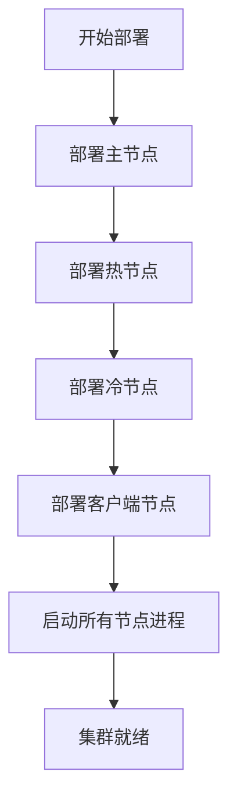
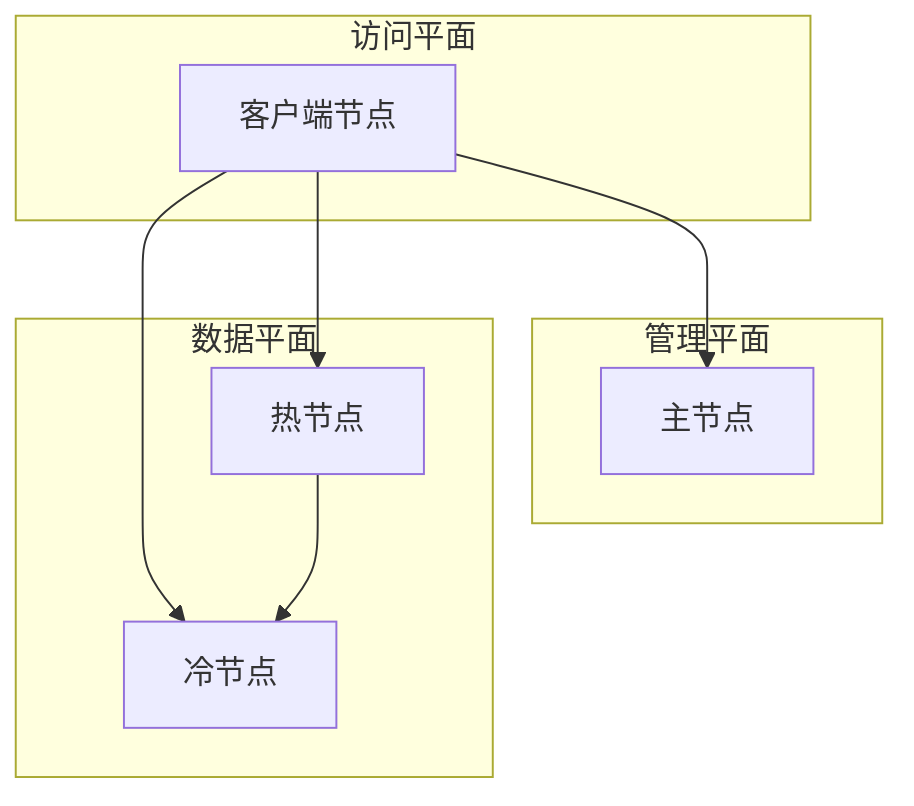

# Elasticsearch 节点管理

<cite>
**本文档引用的文件**  
- [install_master.go](file://dbm-services/bigdata/db-tools/dbactuator/internal/subcmd/escmd/install_master.go)
- [install_client.go](file://dbm-services/bigdata/db-tools/dbactuator/internal/subcmd/escmd/install_client.go)
- [install_hot.go](file://dbm-services/bigdata/db-tools/dbactuator/internal/subcmd/escmd/install_hot.go)
- [install_cold.go](file://dbm-services/bigdata/db-tools/dbactuator/internal/subcmd/escmd/install_cold.go)
- [start_process.go](file://dbm-services/bigdata/db-tools/dbactuator/internal/subcmd/escmd/start_process.go)
- [stop_process.go](file://dbm-services/bigdata/db-tools/dbactuator/internal/subcmd/escmd/stop_process.go)
- [restart_process.go](file://dbm-services/bigdata/db-tools/dbactuator/internal/subcmd/escmd/restart_process.go)
</cite>

## 目录
1. [简介](#简介)
2. [节点安装逻辑分析](#节点安装逻辑分析)
3. [节点生命周期管理](#节点生命周期管理)
4. [完整ES集群部署示例](#完整es集群部署示例)
5. [节点角色与协作方式](#节点角色与协作方式)
6. [总结](#总结)

## 简介
本文档详细分析了通过 `dbactuator` 工具管理 Elasticsearch 节点的实现机制。重点解析了主节点、客户端节点、热节点和冷节点的安装逻辑，以及节点进程的启动、停止和重启操作。文档还提供了部署完整ES集群的实际操作示例，并说明了各节点在集群中的角色和协作方式。

## 节点安装逻辑分析

### 主节点安装逻辑
主节点（Master Node）负责管理集群范围内的元数据，如索引的创建、删除，节点的加入和离开等。`install_master.go` 文件实现了主节点的安装流程，主要包括以下步骤：
1. 初始化Elasticsearch目录结构
2. 下载并解压安装包
3. 部署主节点实例

主节点的安装流程相对完整，包含了目录初始化和安装包处理等基础步骤。

**节 点来源**
- [install_master.go](file://dbm-services/bigdata/db-tools/dbactuator/internal/subcmd/escmd/install_master.go#L77-L112)

### 客户端节点安装逻辑
客户端节点（Client Node）主要负责处理客户端请求，进行请求的路由和结果的聚合。`install_client.go` 文件实现了客户端节点的安装流程，其核心步骤是直接部署客户端实例。

与其他节点类型相比，客户端节点的安装流程较为简单，专注于快速部署以响应客户端请求。

**节 点来源**
- [install_client.go](file://dbm-services/bigdata/db-tools/dbactuator/internal/subcmd/escmd/install_client.go#L77-L104)

### 热节点安装逻辑
热节点（Hot Node）用于存储和处理最近的、访问频率高的数据。`install_hot.go` 文件实现了热节点的安装流程，其主要步骤是部署热节点实例。

热节点通常配置高性能的存储和计算资源，以确保对热点数据的快速响应。

**节 点来源**
- [install_hot.go](file://dbm-services/bigdata/db-tools/dbactuator/internal/subcmd/escmd/install_hot.go#L77-L104)

### 冷节点安装逻辑
冷节点（Cold Node）用于存储历史的、访问频率较低的数据。`install_cold.go` 文件实现了冷节点的安装流程，其主要步骤是部署冷节点实例。

冷节点通常配置大容量、低成本的存储，以经济高效地存储大量历史数据。

**节 点来源**
- [install_cold.go](file://dbm-services/bigdata/db-tools/dbactuator/internal/subcmd/escmd/install_cold.go#L77-L104)

## 节点生命周期管理

### 启动进程管理
`start_process.go` 文件实现了Elasticsearch进程的启动功能。该操作通过调用 `StartStopProcessComp` 组件的 `StartProcess` 方法来启动ES进程。

启动流程是所有节点类型共用的基础操作，确保节点能够正常加入集群并开始提供服务。

**节 点来源**
- [start_process.go](file://dbm-services/bigdata/db-tools/dbactuator/internal/subcmd/escmd/start_process.go#L77-L98)

### 停止进程管理
`stop_process.go` 文件实现了Elasticsearch进程的停止功能。该操作通过调用 `StartStopProcessComp` 组件的 `StopProcess` 方法来安全地停止ES进程。

停止操作会确保节点在退出前完成必要的清理工作，避免数据损坏。

**节 点来源**
- [stop_process.go](file://dbm-services/bigdata/db-tools/dbactuator/internal/subcmd/escmd/stop_process.go#L77-L98)

### 重启进程管理
`restart_process.go` 文件实现了Elasticsearch进程的重启功能。该操作通过调用 `StartStopProcessComp` 组件的 `RestartProcess` 方法来重启ES进程。

重启操作是启动和停止操作的组合，用于在不中断服务的情况下应用配置变更。

**节 点来源**
- [restart_process.go](file://dbm-services/bigdata/db-tools/dbactuator/internal/subcmd/escmd/restart_process.go#L77-L98)

## 完整ES集群部署示例
通过 `dbactuator` 命令可以部署一个包含多种节点类型的完整ES集群。典型的部署流程如下：

1. 首先部署主节点，确保集群管理功能可用
2. 部署热节点和冷节点，构建数据存储层
3. 部署客户端节点，提供统一的访问入口
4. 依次启动所有节点的进程

每个部署步骤都通过相应的 `install_*.go` 文件实现，而节点控制则通过 `start_process.go` 等文件实现。

**图 来源**
- [install_master.go](file://dbm-services/bigdata/db-tools/dbactuator/internal/subcmd/escmd/install_master.go)
- [install_hot.go](file://dbm-services/bigdata/db-tools/dbactuator/internal/subcmd/escmd/install_hot.go)
- [install_cold.go](file://dbm-services/bigdata/db-tools/dbactuator/internal/subcmd/escmd/install_cold.go)
- [install_client.go](file://dbm-services/bigdata/db-tools/dbactuator/internal/subcmd/escmd/install_client.go)
- [start_process.go](file://dbm-services/bigdata/db-tools/dbactuator/internal/subcmd/escmd/start_process.go)

## 节点角色与协作方式
在一个完整的ES集群中，不同类型的节点各司其职，协同工作：

- **主节点**：负责集群管理，维护集群状态，处理元数据变更
- **热节点**：存储和处理近期的热点数据，提供高性能的读写服务
- **冷节点**：存储历史的冷数据，提供经济高效的长期存储
- **客户端节点**：作为请求的入口，负责请求的路由和结果的聚合

这种架构设计实现了计算与存储的分离，以及热点数据与冷数据的分层存储，提高了集群的整体性能和可扩展性。

**图 来源**
- [install_master.go](file://dbm-services/bigdata/db-tools/dbactuator/internal/subcmd/escmd/install_master.go)
- [install_hot.go](file://dbm-services/bigdata/db-tools/dbactuator/internal/subcmd/escmd/install_hot.go)
- [install_cold.go](file://dbm-services/bigdata/db-tools/dbactuator/internal/subcmd/escmd/install_cold.go)
- [install_client.go](file://dbm-services/bigdata/db-tools/dbactuator/internal/subcmd/escmd/install_client.go)

## 总结
本文档深入分析了 `dbactuator` 工具中Elasticsearch节点管理的实现细节。通过分析 `install_*.go` 系列文件，我们了解了不同类型节点的安装逻辑和配置差异。同时，通过分析 `start_process.go`、`stop_process.go` 和 `restart_process.go` 文件，我们掌握了节点生命周期的管理方法。最后，我们通过一个完整的部署示例，说明了如何构建一个包含多种节点类型的ES集群，以及各节点在集群中的角色和协作方式。