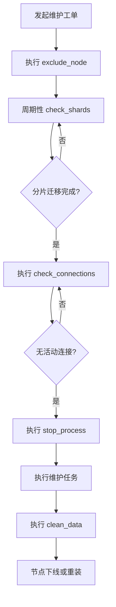

# Elasticsearch 集群维护

<cite>
**本文档引用的文件**   
- [exclude_node.go](file://dbm-services/bigdata/db-tools/dbactuator/internal/subcmd/escmd/exclude_node.go)
- [clean_data.go](file://dbm-services/bigdata/db-tools/dbactuator/internal/subcmd/escmd/clean_data.go)
- [exclude_node.go](file://dbm-services/bigdata/db-tools/dbactuator/pkg/components/elasticsearch/exclude_node.go)
- [clean_data.go](file://dbm-services/bigdata/db-tools/dbactuator/pkg/components/elasticsearch/clean_data.go)
- [es_helper.go](file://dbm-services/bigdata/db-tools/dbactuator/pkg/util/esutil/es_helper.go)
- [es_act_payload.py](file://dbm-ui/backend/flow/utils/es/es_act_payload.py)
- [es_shrink_flow.py](file://dbm-ui/backend/flow/engine/bamboo/scene/es/es_shrink_flow.py)
</cite>

## 目录
1. [引言](#引言)
2. [节点排除功能分析](#节点排除功能分析)
3. [数据清理功能分析](#数据清理功能分析)
4. [集群维护场景实例](#集群维护场景实例)
5. [维护流程总结](#维护流程总结)

## 引言
本文档详细阐述了在 BlueKing DBM 系统中对 Elasticsearch 集群进行维护的操作方法。核心内容包括如何安全地将特定节点从集群的分片分配中排除，以便进行升级或下线等维护操作，以及如何清理过期或无用的数据以优化集群性能。文档基于对 `exclude_node.go` 和 `clean_data.go` 等关键代码文件的分析，旨在为运维人员提供一个清晰、可靠的维护指南。

## 节点排除功能分析
Elasticsearch 集群的节点排除功能是进行安全维护操作的核心。该功能通过设置集群级别的动态配置，将指定节点标记为“不可分配”，从而触发集群自动将该节点上的所有分片（shard）迁移到其他健康节点上，确保数据的高可用性。

### 功能实现原理
节点排除功能的实现分为两个主要部分：命令接口和核心逻辑。
1.  **命令接口 (`exclude_node.go`)**: 位于 `dbm-services/bigdata/db-tools/dbactuator/internal/subcmd/escmd/` 目录下的 `exclude_node.go` 文件定义了一个名为 `exclude_node` 的 Cobra 命令。该命令接收维护所需的参数（如集群地址、端口、认证信息及要排除的节点列表），并调用底层的 `ExcludeEsNodeComp` 组件来执行具体操作。
2.  **核心逻辑 (`es_helper.go`)**: 排除操作的核心逻辑封装在 `pkg/util/esutil/es_helper.go` 文件的 `DoExclude` 方法中。该方法通过向 Elasticsearch 集群的 `/_cluster/settings` API 发送一个 HTTP PUT 请求来实现。请求体中包含一个动态设置：
    ```json
    {
        "transient": {
            "cluster.routing.allocation.exclude._ip": "node1_ip,node2_ip"
        }
    }
    ```
    此设置会立即生效（`transient` 级别），指示集群的分片分配器（shard allocation）不再将新的分片分配到指定 IP 的节点上，并开始将这些节点上已有的分片迁出。

### 参数说明
执行节点排除操作需要以下关键参数，这些参数在 `ExcludeEsNodeParams` 结构体中定义：
- **`host`**: 集群中一个可访问节点的 IP 地址，用于发起 API 调用。
- **`http_port`**: Elasticsearch HTTP 服务的端口（通常为 9200）。
- **`username` / `password`**: 用于访问 Elasticsearch API 的认证凭据。
- **`exclude_nodes`**: 一个字符串数组，包含所有需要被排除的节点的 IP 地址。

### 状态检查与验证
排除操作本身是异步的，分片迁移可能需要较长时间。因此，系统提供了配套的检查机制：
- **`CheckShards`**: 在 `exclude_node.go` 中定义，该方法会周期性地调用 `CheckEmptyOnetime`，通过 `_cat/allocation?format=json` API 查询指定节点上的分片数量。只有当所有目标节点的分片数量都为 0 时，才认为迁移完成，可以进行下一步操作。
- **`CheckConnections`**: 该方法用于检查目标节点上是否还有来自客户端的活动连接（ESTABLISHED 状态），确保在停止节点服务前没有正在进行的读写请求。

**Section sources**
- [exclude_node.go](file://dbm-services/bigdata/db-tools/dbactuator/internal/subcmd/escmd/exclude_node.go#L1-L105)
- [exclude_node.go](file://dbm-services/bigdata/db-tools/dbactuator/pkg/components/elasticsearch/exclude_node.go#L1-L163)
- [es_helper.go](file://dbm-services/bigdata/db-tools/dbactuator/pkg/util/esutil/es_helper.go#L37-L79)

## 数据清理功能分析
数据清理功能主要用于在节点维护的最后阶段，彻底清除节点上的所有 Elasticsearch 相关文件和配置，为节点的重新部署或下线做准备。

### 功能实现原理
数据清理功能同样由命令接口和核心逻辑组成。
1.  **命令接口 (`clean_data.go`)**: `internal/subcmd/escmd/clean_data.go` 文件定义了 `clean_data` 命令，用于触发清理流程。
2.  **核心逻辑 (`clean_data.go`)**: `pkg/components/elasticsearch/clean_data.go` 文件中的 `CleanData` 方法执行了以下一系列清理操作：
    - **清除定时任务**: 删除与 Elasticsearch 相关的 `crontab` 任务。
    - **终止进程**: 使用 `kill -9` 强制终止所有与 Elasticsearch 相关的进程（如 `java`, `supervisord` 等）。
    - **删除软件链接**: 移除 `/usr/local/bin/` 等目录下的相关软链接。
    - **清理环境变量**: 从 `/etc/profile` 中删除与 Elasticsearch 相关的环境变量配置。
    - **删除数据和日志目录**: 递归删除 `/data*/esdata*` 和 `/data*/eslog*` 等数据和日志目录。

### 作用与重要性
此功能确保了节点在重新加入集群或被回收时，不会残留旧的配置、数据或进程，避免了潜在的配置冲突和数据污染，保证了集群环境的纯净和一致性。

**Section sources**
- [clean_data.go](file://dbm-services/bigdata/db-tools/dbactuator/internal/subcmd/escmd/clean_data.go#L1-L99)
- [clean_data.go](file://dbm-services/bigdata/db-tools/dbactuator/pkg/components/elasticsearch/clean_data.go#L1-L103)

## 集群维护场景实例
以下是一个完整的维护场景实例，展示如何安全地对一个 Elasticsearch 集群中的节点进行维护。

### 维护流程
1.  **发起维护请求**: 运维人员通过 DBM 前端界面发起“缩容”或“替换”工单，指定需要维护的节点。
2.  **排除节点**:
    - 系统调用 `exclude_node` 命令，将目标节点的 IP 添加到 `cluster.routing.allocation.exclude._ip` 设置中。
    - 集群开始自动迁移该节点上的所有分片。
3.  **等待分片迁移**:
    - 系统周期性地调用 `check_shards` 命令，监控目标节点上的分片数量。
    - 直到所有分片都成功迁移到其他节点，此步骤才算完成。
4.  **检查连接状态**:
    - 调用 `check_connections` 命令，确认目标节点上已无活动的客户端连接。
5.  **停止节点服务**:
    - 调用 `stop_process` 命令，安全地停止 Elasticsearch 服务。
6.  **执行维护任务**:
    - 在节点上执行升级、修复等维护操作。
7.  **清理节点数据**:
    - 维护完成后，调用 `clean_data` 命令，彻底清理节点上的所有 ES 相关文件。
8.  **重新加入集群**:
    - 如果是升级或修复，可以重新安装并启动服务，使其作为新节点加入集群。
    - 如果是下线，则此节点被回收。

### 自动化流程
从代码 `es_shrink_flow.py` 可以看出，上述流程是高度自动化的。DBM 系统通过编排多个原子任务（如 `exclude_node`, `check_shards`, `stop_process`, `clean_data`）来构建一个完整的维护流水线，确保了操作的可靠性和一致性。



**Diagram sources**
- [es_act_payload.py](file://dbm-ui/backend/flow/utils/es/es_act_payload.py#L347-L379)
- [es_shrink_flow.py](file://dbm-ui/backend/flow/engine/bamboo/scene/es/es_shrink_flow.py#L159-L197)

## 维护流程总结
本文档详细分析了 BlueKing DBM 系统中 Elasticsearch 集群的维护机制。通过 `exclude_node` 功能，可以安全地将节点从分片分配中排除，实现数据的自动迁移，为节点的维护提供了保障。通过 `clean_data` 功能，可以在维护后彻底清理节点环境，确保集群的稳定。整个维护流程被设计为一个自动化流水线，极大地降低了人工操作的风险，提高了运维效率和集群的可靠性。

**Section sources**
- [es_shrink_flow.py](file://dbm-ui/backend/flow/engine/bamboo/scene/es/es_shrink_flow.py#L159-L197)
- [consts.py](file://dbm-ui/backend/flow/consts.py#L605-L627)