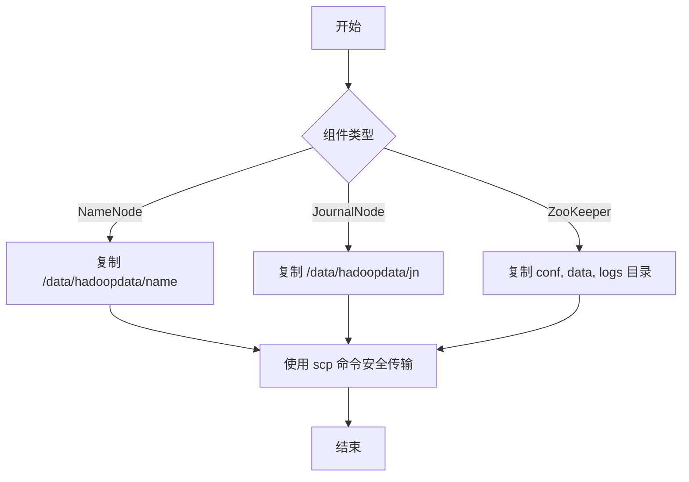

# HDFS 安全密钥管理

<cite>
**本文档引用文件**  
- [generate_key.go](file://dbm-services/bigdata/db-tools/dbactuator/internal/subcmd/hdfscmd/generate_key.go)
- [write_key.go](file://dbm-services/bigdata/db-tools/dbactuator/internal/subcmd/hdfscmd/write_key.go)
- [scp_dir.go](file://dbm-services/bigdata/db-tools/dbactuator/internal/subcmd/hdfscmd/scp_dir.go)
- [replace_hdfs.go](file://dbm-services/bigdata/db-tools/dbactuator/pkg/components/hdfs/replace_hdfs.go)
- [const.go](file://dbm-services/bigdata/db-tools/dbactuator/pkg/components/hdfs/const.go)
</cite>

## 目录
1. [引言](#引言)  
2. [密钥生成流程](#密钥生成流程)  
3. [密钥写入流程](#密钥写入流程)  
4. [密钥目录安全分发](#密钥目录安全分发)  
5. [HDFS 组件间身份验证应用](#hdfs-组件间身份验证应用)  
6. [密钥轮换与安全管理最佳实践](#密钥轮换与安全管理最佳实践)  
7. [总结](#总结)

## 引言
HDFS（Hadoop 分布式文件系统）在大规模数据存储与处理中扮演核心角色。为确保集群节点间通信的安全性，系统依赖 SSH 免密登录机制实现 NameNode、DataNode、JournalNode 等组件的自动化交互。本文档详细阐述了在 BlueKing DBM 系统中，HDFS 安全密钥的生成、写入与分发机制，涵盖 `generate_key.go`、`write_key.go` 和 `scp_dir.go` 三个核心模块的实现逻辑，并说明其在 HDFS 高可用架构中的实际应用场景，最后提供密钥轮换与安全管理的最佳实践建议。

## 密钥生成流程
`generate_key.go` 模块负责在指定主机上生成 SSH 密钥对，为后续的免密通信奠定基础。

该模块通过 `GenerateKeyAct` 结构体封装执行逻辑，其核心功能由 `GenerateKeyService` 实现。执行流程如下：

1. **参数初始化**：接收传入的主机 IP 地址参数，并进行格式校验。
2. **密钥生成**：调用系统命令 `ssh-keygen -t rsa -N '' -f ~/.ssh/id_rsa -q` 在目标主机的 `~/.ssh/` 目录下生成 RSA 密钥对（私钥 `id_rsa` 和公钥 `id_rsa.pub`）。若密钥已存在，则跳过此步骤。
3. **公钥读取与返回**：使用 `cat ~/.ssh/id_rsa.pub` 命令读取公钥内容，并将其封装在 `GenerateKeyResult` 结构体中，以 JSON 格式通过标准输出返回。

此过程确保了每个 HDFS 节点都具备唯一的身份标识（公钥），是构建信任关系的第一步。

**Section sources**
- [generate_key.go](file://dbm-services/bigdata/db-tools/dbactuator/internal/subcmd/hdfscmd/generate_key.go#L16-L102)
- [replace_hdfs.go](file://dbm-services/bigdata/db-tools/dbactuator/pkg/components/hdfs/replace_hdfs.go#L14-L57)

## 密钥写入流程
`write_key.go` 模块负责将生成的公钥写入目标主机的授权密钥文件，建立单向信任。

该模块通过 `WriteKeyAct` 结构体驱动，其核心逻辑由 `WriteKeyService` 完成。执行步骤如下：

1. **参数接收**：接收目标主机 IP 和待写入的公钥字符串。
2. **目录创建与写入**：以 HDFS 服务运行用户（默认为 `hadoop`）的身份执行命令 `mkdir -p ~/.ssh/` 确保 `.ssh` 目录存在，然后将公钥内容追加到 `~/.ssh/authorized_keys` 文件中。
3. **权限保障**：虽然代码未显式设置权限，但依赖系统默认行为或外部配置确保 `.ssh` 目录权限为 `700`，`authorized_keys` 文件权限为 `600`，以符合 SSH 安全要求。

通过此操作，源主机即可使用其私钥免密登录到目标主机，实现了节点间的初步信任建立。

**Section sources**
- [write_key.go](file://dbm-services/bigdata/db-tools/dbactuator/internal/subcmd/hdfscmd/write_key.go#L16-L102)
- [replace_hdfs.go](file://dbm-services/bigdata/db-tools/dbactuator/pkg/components/hdfs/replace_hdfs.go#L59-L81)

## 密钥目录安全分发
`scp_dir.go` 模块负责在集群初始化或扩容时，安全地将关键元数据目录从一个节点复制到其他节点。

该模块由 `ScpDirAct` 和 `ScpDirService` 协同工作，其核心功能是 `ScpDir()` 方法。其工作流程为：

1. **元数据目录识别**：根据传入的组件类型（`component`），调用 `GetMetaDataDirByRole()` 函数确定需要复制的目录。例如：
   - **NameNode**: `/data/hadoopdata/name`
   - **JournalNode**: `/data/hadoopdata/jn`
   - **ZooKeeper**: 包括配置、数据和日志目录。
2. **安全复制**：使用 `scp` 命令，以 `StrictHostKeyChecking no` 选项（在已建立信任的前提下）递归地（`-r`）将源主机的元数据目录复制到目标主机的相同路径下。命令以 HDFS 服务用户身份执行，确保文件所有权正确。

此过程确保了集群中所有相关节点的配置和状态数据保持一致，是构建高可用 HDFS 集群的关键步骤。

**Diagram sources**
- [scp_dir.go](file://dbm-services/bigdata/db-tools/dbactuator/internal/subcmd/hdfscmd/scp_dir.go#L16-L102)
- [replace_hdfs.go](file://dbm-services/bigdata/db-tools/dbactuator/pkg/components/hdfs/replace_hdfs.go#L83-L113)
- [const.go](file://dbm-services/bigdata/db-tools/dbactuator/pkg/components/hdfs/const.go#L30-L43)

## HDFS 组件间身份验证应用
HDFS 的安全密钥体系是其高可用（HA）和自动化运维的基石，主要应用于以下场景：

- **NameNode 高可用切换**：当 Active NameNode 发生故障时，Standby NameNode 需要通过 ZooKeeper Failover Controller (ZKFC) 进程进行故障转移。ZKFC 进程需要 SSH 到对端 NameNode 执行 `hdfs haadmin -failover` 命令，这依赖于预先配置的 SSH 免密登录。
- **集群节点管理**：运维工具（如本系统中的 `dbactuator`）需要批量启动、停止或重启 DataNode、JournalNode 等服务。这些操作通常通过 SSH 连接到各节点并执行命令来完成，免密登录是实现自动化批量操作的前提。
- **元数据同步**：在首次部署或恢复时，需要将 NameNode 或 JournalNode 的元数据目录同步到其他节点，`scp_dir.go` 模块正是为此场景设计。

该密钥体系构建了一个以 HDFS 服务用户为中心的信任网络，使得集群内部组件可以安全、高效地进行通信和协调。

**Section sources**
- [replace_hdfs.go](file://dbm-services/bigdata/db-tools/dbactuator/pkg/components/hdfs/replace_hdfs.go#L130-L178)
- [const.go](file://dbm-services/bigdata/db-tools/dbactuator/pkg/components/hdfs/const.go)

## 密钥轮换与安全管理最佳实践
尽管当前实现提供了基础的密钥管理功能，但在生产环境中，应遵循以下最佳实践以增强安全性：

1. **定期密钥轮换**：应制定策略定期（如每90天）轮换 SSH 密钥对。这可以降低长期密钥泄露带来的风险。轮换过程应自动化，包括生成新密钥、分发新公钥、验证连接和清理旧密钥。
2. **最小权限原则**：确保 `hadoop` 用户仅拥有运行 HDFS 服务所必需的最小系统权限。避免使用 root 用户进行服务间通信。
3. **强化 SSH 配置**：在 `sshd_config` 中禁用密码登录（`PasswordAuthentication no`），限制可登录的用户（`AllowUsers hadoop`），并考虑使用更安全的密钥类型（如 Ed25519）。
4. **集中化密钥管理**：在大型集群中，考虑使用配置管理工具（如 Ansible, Puppet）或专用的密钥管理系统来集中管理所有节点的 `authorized_keys` 文件，避免手动操作。
5. **审计与监控**：启用 SSH 登录日志审计，监控异常的登录尝试。定期审查 `authorized_keys` 文件的内容，确保没有未经授权的密钥。
6. **安全的传输通道**：在分发密钥或元数据时，确保网络通道的安全性，避免在不安全的网络中传输敏感信息。

## 总结
本文档详细解析了 BlueKing DBM 系统中 HDFS 安全密钥的管理机制。通过 `generate_key.go`、`write_key.go` 和 `scp_dir.go` 三个模块的协同工作，系统能够自动化地完成 SSH 密钥的生成、信任建立和元数据分发，为 HDFS 集群的部署、扩容和高可用提供了坚实的安全基础。理解这一流程对于维护一个稳定、安全的大数据平台至关重要。未来应结合密钥轮换和集中化管理等最佳实践，进一步提升系统的整体安全性。