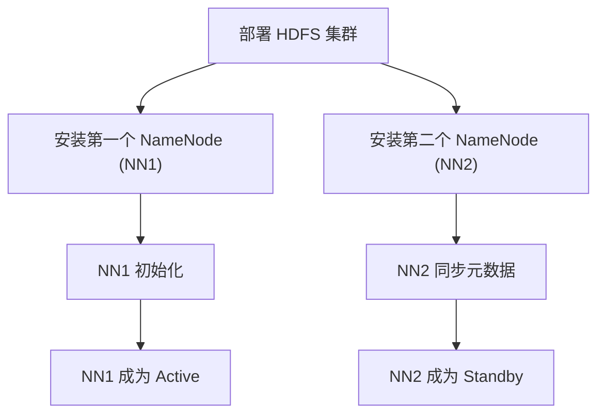
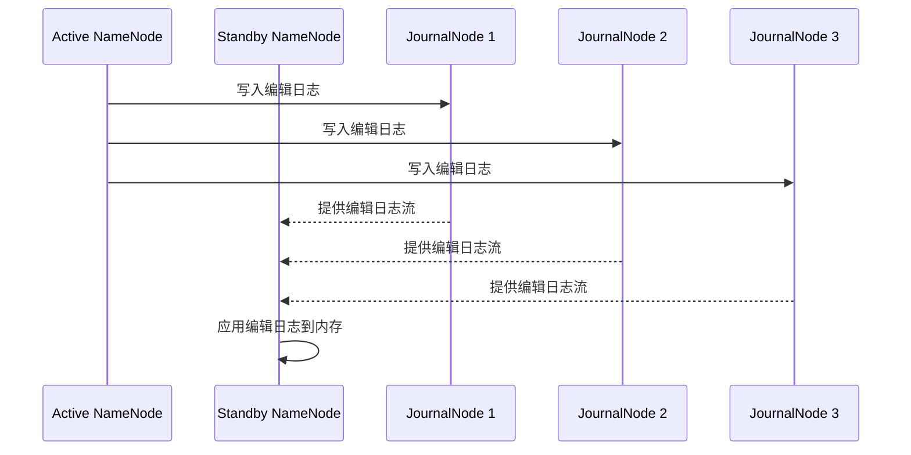
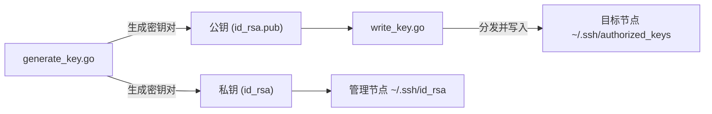
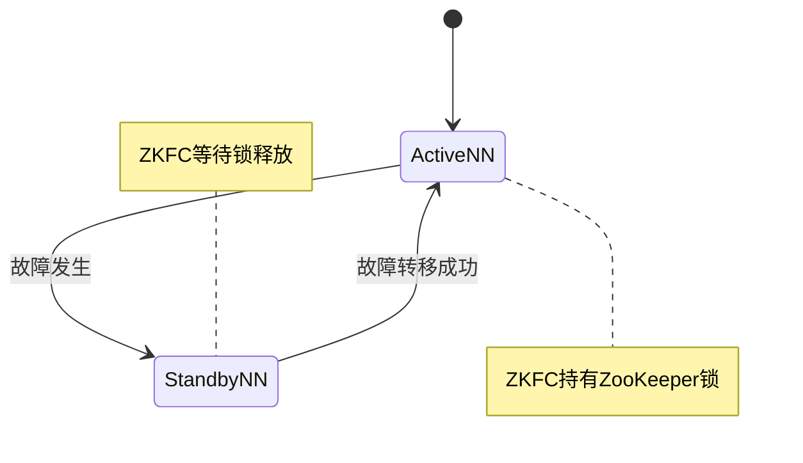
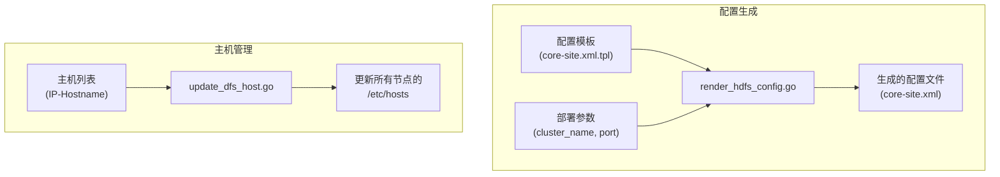

# HDFS 服务管理

<cite>
**本文档引用文件**  
- [install_first_namenode.go](file://dbm-services/bigdata/db-tools/dbactuator/internal/subcmd/hdfscmd/install_first_namenode.go)
- [install_second_namenode.go](file://dbm-services/bigdata/db-tools/dbactuator/internal/subcmd/hdfscmd/install_second_namenode.go)
- [install_journalnode.go](file://dbm-services/bigdata/db-tools/dbactuator/internal/subcmd/hdfscmd/install_journalnode.go)
- [generate_key.go](file://dbm-services/bigdata/db-tools/dbactuator/internal/subcmd/hdfscmd/generate_key.go)
- [write_key.go](file://dbm-services/bigdata/db-tools/dbactuator/internal/subcmd/hdfscmd/write_key.go)
- [install_zkfc.go](file://dbm-services/bigdata/db-tools/dbactuator/internal/subcmd/hdfscmd/install_zkfc.go)
- [render_hdfs_config.go](file://dbm-services/bigdata/db-tools/dbactuator/internal/subcmd/hdfscmd/render_hdfs_config.go)
- [update_dfs_host.go](file://dbm-services/bigdata/db-tools/dbactuator/internal/subcmd/hdfscmd/update_dfs_host.go)
- [refresh_nodes.go](file://dbm-services/bigdata/db-tools/dbactuator/internal/subcmd/hdfscmd/refresh_nodes.go)
- [check_active.go](file://dbm-services/bigdata/db-tools/dbactuator/internal/subcmd/hdfscmd/check_active.go)
- [check_decommission.go](file://dbm-services/bigdata/db-tools/dbactuator/internal/subcmd/hdfscmd/check_decommission.go)
- [install-hdfs.md](file://dbm-services/bigdata/db-tools/dbactuator/example/install-hdfs.md)
</cite>

## 目录
1. [HDFS 高可用架构概述](#hdfs-高可用架构概述)
2. [NameNode 高可用部署](#namenode-高可用部署)
3. [JournalNode 与共享编辑日志](#journalnode-与共享编辑日志)
4. [安全密钥管理](#安全密钥管理)
5. [ZKFC 与 ZooKeeper 故障转移](#zkfc-与-zookeeper-故障转移)
6. [配置管理与主机更新](#配置管理与主机更新)
7. [节点动态管理](#节点动态管理)
8. [状态检查与节点退役](#状态检查与节点退役)
9. [HDFS 集群部署示例](#hdfs-集群部署示例)

## HDFS 高可用架构概述

HDFS 高可用（HA）架构通过消除单点故障来确保 HDFS 集群的持续可用性。该架构依赖于多个核心组件的协同工作：两个 NameNode（主备模式）、JournalNode 集群、ZooKeeper 集群以及 ZKFC（ZooKeeper Failover Controller）。`dbactuator` 工具通过一系列命令行操作（subcommand）自动化了这些组件的部署与管理流程，确保了部署的一致性和可靠性。

**本节来源**
- [install-hdfs.md](file://dbm-services/bigdata/db-tools/dbactuator/example/install-hdfs.md)

## NameNode 高可用部署

在 HDFS 高可用架构中，存在两个 NameNode：一个处于 Active 状态，处理所有客户端请求；另一个处于 Standby 状态，作为热备节点。`install_first_namenode.go` 和 `install_second_namenode.go` 分别负责部署这两个节点。

`install_first_namenode.go` 文件定义了 `InstallNn1Act` 结构体和 `InstallNn1Command` 命令，用于安装第一个 NameNode（通常作为初始的 Active 节点）。该命令的执行流程通过 `Run` 方法实现，它定义了一个名为 "安装NN1" 的步骤，该步骤调用 `hdfs.InstallHdfsService` 服务的 `InstallNn1` 方法来完成具体的安装任务。

类似地，`install_second_namenode.go` 定义了 `InstallNn2Act` 和 `InstallNn2Command`，用于安装第二个 NameNode（通常作为 Standby 节点）。其执行流程与第一个 NameNode 相同，通过调用 `InstallNn2` 方法来完成安装。这两个命令的协同工作确保了 HDFS 集群中拥有两个功能完备的 NameNode，为高可用性奠定了基础。

**图示来源**
- [install_first_namenode.go](file://dbm-services/bigdata/db-tools/dbactuator/internal/subcmd/hdfscmd/install_first_namenode.go#L78-L105)
- [install_second_namenode.go](file://dbm-services/bigdata/db-tools/dbactuator/internal/subcmd/hdfscmd/install_second_namenode.go#L78-L105)

**本节来源**
- [install_first_namenode.go](file://dbm-services/bigdata/db-tools/dbactuator/internal/subcmd/hdfscmd/install_first_namenode.go)
- [install_second_namenode.go](file://dbm-services/bigdata/db-tools/dbactuator/internal/subcmd/hdfscmd/install_second_namenode.go)

## JournalNode 与共享编辑日志

为了实现 Active 和 Standby NameNode 之间的元数据同步，HDFS HA 使用了基于 JournalNode 的共享编辑日志（Shared Edit Log）机制。`install_journalnode.go` 文件负责部署和管理 JournalNode 服务。

该文件定义了 `InstallJournalNodeAct` 结构体和 `InstallJournalNodeCommand` 命令。其 `Run` 方法执行一个名为 "启动JournalNode" 的步骤，该步骤调用 `hdfs.InstallHdfsService` 服务的 `InstallJournalNode` 方法。当 Active NameNode 执行文件系统修改操作时，它会将编辑日志写入到一个由奇数个（通常为3或5个）JournalNode 组成的共享存储中。Standby NameNode 会持续监控并读取这些 JournalNode 上的编辑日志，并将这些修改应用到自己的命名空间中，从而保持与 Active NameNode 的元数据完全同步。这种机制确保了在发生故障转移时，Standby NameNode 拥有最新的元数据，可以无缝接管服务。

**图示来源**
- [install_journalnode.go](file://dbm-services/bigdata/db-tools/dbactuator/internal/subcmd/hdfscmd/install_journalnode.go#L78-L105)

**本节来源**
- [install_journalnode.go](file://dbm-services/bigdata/db-tools/dbactuator/internal/subcmd/hdfscmd/install_journalnode.go)

## 安全密钥管理

为了实现集群内节点间的免密通信，`dbactuator` 提供了生成和分发 SSH 密钥对的功能。这一过程由 `generate_key.go` 和 `write_key.go` 两个文件协同完成。

`generate_key.go` 定义了 `GenerateKeyAct` 和 `GenerateKeyCommand`，其核心功能是生成一对 SSH 公钥和私钥。`Run` 方法调用 `GenerateKey` 服务方法来执行生成操作。生成的密钥对是实现节点间自动化通信的基础。

`write_key.go` 定义了 `WriteKeyAct` 和 `WriteKeyCommand`，负责将生成的公钥写入到目标节点的 `~/.ssh/authorized_keys` 文件中。`Run` 方法调用 `WriteKey` 服务方法来完成分发和写入。通过这两个步骤的组合，可以实现从管理节点到所有 HDFS 节点的免密登录，这对于自动化部署和运维操作至关重要。

**图示来源**
- [generate_key.go](file://dbm-services/bigdata/db-tools/dbactuator/internal/subcmd/hdfscmd/generate_key.go#L80-L101)
- [write_key.go](file://dbm-services/bigdata/db-tools/dbactuator/internal/subcmd/hdfscmd/write_key.go#L80-L101)

**本节来源**
- [generate_key.go](file://dbm-services/bigdata/db-tools/dbactuator/internal/subcmd/hdfscmd/generate_key.go)
- [write_key.go](file://dbm-services/bigdata/db-tools/dbactuator/internal/subcmd/hdfscmd/write_key.go)

## ZKFC 与 ZooKeeper 故障转移

ZKFC（ZooKeeper Failover Controller）是实现 HDFS 自动故障转移的关键组件。`install_zkfc.go` 文件负责部署 ZKFC 服务。

该文件定义了 `InstallZKFCAct` 和 `InstallZKFCCommand`，其 `Run` 方法执行 "启动ZKFC" 步骤，调用 `InstallZKFC` 服务方法。每个 NameNode 节点上都会运行一个 ZKFC 进程。ZKFC 的主要职责有两个：一是健康监测，它会定期向 NameNode 发送健康检查请求，以判断其是否存活；二是会话管理，它会与 ZooKeeper 集群建立会话，并尝试获取一个特定的锁（通常是创建一个临时节点）。

在正常情况下，只有 Active NameNode 对应的 ZKFC 能够成功持有 ZooKeeper 中的锁。当 Active NameNode 发生故障时，其 ZKFC 将无法维持与 ZooKeeper 的会话，导致锁被释放。此时，Standby NameNode 对应的 ZKFC 会检测到锁的释放，并立即尝试获取该锁。一旦获取成功，它就会通过调用 `hdfs haadmin -failover` 命令，将自己从 Standby 状态提升为 Active 状态，从而完成故障转移。

**图示来源**
- [install_zkfc.go](file://dbm-services/bigdata/db-tools/dbactuator/internal/subcmd/hdfscmd/install_zkfc.go#L78-L105)

**本节来源**
- [install_zkfc.go](file://dbm-services/bigdata/db-tools/dbactuator/internal/subcmd/hdfscmd/install_zkfc.go)

## 配置管理与主机更新

HDFS 集群的配置管理是通过模板渲染和主机列表更新来实现的。`render_hdfs_config.go` 和 `update_dfs_host.go` 分别处理这两个任务。

`render_hdfs_config.go` 定义了 `RenderHdfsConfigAct` 和 `RenderHdfsConfigCommand`。其 `Run` 方法调用 `RenderHdfsConfig` 服务方法，该方法会读取预定义的配置模板（如 `core-site.xml`、`hdfs-site.xml`），并将从部署参数中获取的实际值（如 `cluster_name`、`rpc_port` 等）填充到模板中，最终生成适用于当前集群的配置文件。这确保了所有节点的配置一致且正确。

`update_dfs_host.go` 定义了 `UpdateDfsHostAct` 和 `UpdateDfsHostCommand`。其 `Run` 方法调用 `UpdateDfsHost` 服务方法，负责更新集群中所有节点的 `/etc/hosts` 文件或 DNS 配置，确保节点间可以通过主机名正确解析 IP 地址。这对于 HDFS 集群的正常通信至关重要。

**图示来源**
- [render_hdfs_config.go](file://dbm-services/bigdata/db-tools/dbactuator/internal/subcmd/hdfscmd/render_hdfs_config.go#L78-L105)
- [update_dfs_host.go](file://dbm-services/bigdata/db-tools/dbactuator/internal/subcmd/hdfscmd/update_dfs_host.go#L80-L101)

**本节来源**
- [render_hdfs_config.go](file://dbm-services/bigdata/db-tools/dbactuator/internal/subcmd/hdfscmd/render_hdfs_config.go)
- [update_dfs_host.go](file://dbm-services/bigdata/db-tools/dbactuator/internal/subcmd/hdfscmd/update_dfs_host.go)

## 节点动态管理

HDFS 支持对 DataNode 的动态管理，包括添加新节点和退役旧节点。`refresh_nodes.go` 文件提供了刷新节点列表的功能。

该文件定义了 `RefreshNodesAct` 和 `RefreshNodesCommand`。其 `Run` 方法调用 `RefreshNodes` 服务方法。当集群的 DataNode 列表发生变化（例如，通过 `include` 或 `exclude` 文件添加或移除了节点）后，需要通知 NameNode 刷新其节点列表。`refresh_nodes` 命令正是执行这一操作，它会触发 NameNode 重新读取配置文件，使新的节点配置生效，从而让新加入的 DataNode 能够加入集群，或让被标记为退役的 DataNode 开始数据迁移。

**本节来源**
- [refresh_nodes.go](file://dbm-services/bigdata/db-tools/dbactuator/internal/subcmd/hdfscmd/refresh_nodes.go)

## 状态检查与节点退役

运维人员需要能够检查集群的状态和节点的退役进度。`check_active.go` 和 `check_decommission.go` 提供了相应的检查功能。

`check_active.go` 定义了 `CheckActiveAct` 和 `CheckActiveCommand`。其 `Run` 方法调用 `CheckActive` 服务方法，用于查询当前哪个 NameNode 处于 Active 状态，哪个处于 Standby 状态。这对于监控集群的运行状态和进行手动故障转移操作非常有用。

`check_decommission.go` 定义了 `CheckDecommissionAct` 和 `CheckDecommissionCommand`。其 `Run` 方法调用 `CheckDatanodeDecommission` 服务方法，用于检查一个正在退役（Decommissioning）的 DataNode 的状态。该命令可以返回该节点上数据块的迁移进度，帮助运维人员判断是否可以安全地将该节点从集群中移除。

**本节来源**
- [check_active.go](file://dbm-services/bigdata/db-tools/dbactuator/internal/subcmd/hdfscmd/check_active.go)
- [check_decommission.go](file://dbm-services/bigdata/db-tools/dbactuator/internal/subcmd/hdfscmd/check_decommission.go)

## HDFS 集群部署示例

一个完整的 HDFS 集群部署流程通常遵循以下步骤：

1.  **环境准备**：使用 `generate_key` 和 `write_key` 命令在所有节点上配置免密登录。
2.  **配置渲染**：使用 `render_hdfs_config` 命令，根据集群参数生成 `core-site.xml`、`hdfs-site.xml` 等配置文件。
3.  **部署核心组件**：
    *   在 ZooKeeper 节点上部署 ZooKeeper 服务。
    *   在 JournalNode 节点上运行 `install-journalnode` 命令。
4.  **部署 NameNode**：
    *   在第一个 NameNode 服务器上运行 `install-nn1` 命令。
    *   在第二个 NameNode 服务器上运行 `install-nn2` 命令。
5.  **部署 ZKFC**：在两个 NameNode 服务器上分别运行 `install-zkfc` 命令。
6.  **更新主机信息**：使用 `dfs-host` 命令确保所有节点的 `/etc/hosts` 文件正确。
7.  **初始化与启动**：完成上述步骤后，通过管理工具初始化 HA 状态，并启动 HDFS 集群。
8.  **状态验证**：使用 `check-active` 命令确认 Active NameNode 的状态。

此流程确保了 HDFS 高可用集群的自动化、可靠部署。

**本节来源**
- [install-hdfs.md](file://dbm-services/bigdata/db-tools/dbactuator/example/install-hdfs.md)