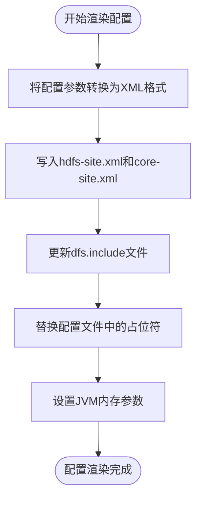
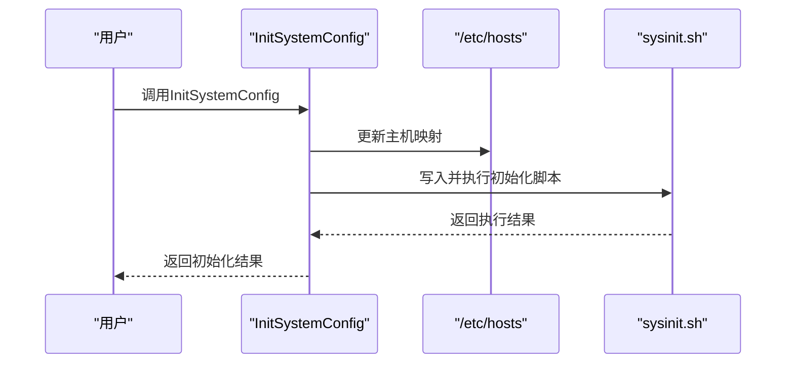
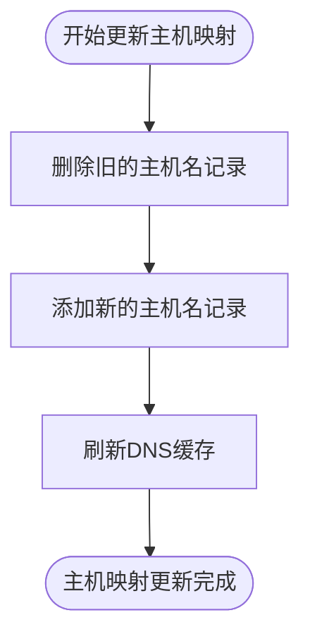

# HDFS 配置管理

<cite>
**本文档引用的文件**   
- [render_hdfs_config.go](file://dbm-services/bigdata/db-tools/dbactuator/internal/subcmd/hdfscmd/render_hdfs_config.go)
- [init_system_config.go](file://dbm-services/bigdata/db-tools/dbactuator/pkg/components/hdfs/init_system_config.go)
- [update_host_mappng.go](file://dbm-services/bigdata/db-tools/dbactuator/internal/subcmd/hdfscmd/update_host_mappng.go)
- [install_hdfs.go](file://dbm-services/bigdata/db-tools/dbactuator/pkg/components/hdfs/install_hdfs.go)
- [hadoop-env.sh](file://dbm-services/bigdata/db-tools/dbactuator/pkg/components/hdfs/config_tpl/hadoop-env.sh)
- [haproxy.cfg](file://dbm-services/bigdata/db-tools/dbactuator/pkg/components/hdfs/config_tpl/haproxy.cfg)
- [hdfs_data.up.sql](file://dbm-services/common/db-config/assets/migrations/000012_hdfs_data.up.sql)
</cite>

## 目录
1. [HDFS 配置模板渲染机制](#hdfs-配置模板渲染机制)
2. [系统级配置初始化](#系统级配置初始化)
3. [主机映射关系维护](#主机映射关系维护)
4. [配置项继承与覆盖规则](#配置项继承与覆盖规则)
5. [关键配置参数及其性能影响](#关键配置参数及其性能影响)

## HDFS 配置模板渲染机制

HDFS 配置模板渲染机制通过 `render_hdfs_config.go` 文件中的 `RenderHdfsConfig` 函数实现，该函数负责将变量注入到 `core-site.xml` 和 `hdfs-site.xml` 等配置文件中。渲染过程首先将传入的配置参数（如 `HdfsSite` 和 `CoreSite`）转换为 XML 格式，并写入到指定的配置目录。随后，通过 `sed` 命令对配置文件中的占位符进行替换，例如 `{{cluster_name}}`、`{{nn1_host}}`、`{{rpc_port}}` 等，确保配置文件中的变量被正确填充。

在渲染过程中，还会处理 `dfs.include` 文件，该文件包含了所有 DataNode 的主机名列表，用于 HDFS 集群的节点管理。此外，`RenderHdfsConfig` 函数还会根据实例的内存大小动态计算 NameNode 和 DataNode 的 JVM 内存参数，并将其注入到 `hadoop-env.sh` 文件中，以优化 JVM 性能。

**图示来源**
- [install_hdfs.go](file://dbm-services/bigdata/db-tools/dbactuator/pkg/components/hdfs/install_hdfs.go#L353-L465)
- [render_hdfs_config.go](file://dbm-services/bigdata/db-tools/dbactuator/internal/subcmd/hdfscmd/render_hdfs_config.go#L78-L105)

**章节来源**
- [install_hdfs.go](file://dbm-services/bigdata/db-tools/dbactuator/pkg/components/hdfs/install_hdfs.go#L353-L465)
- [render_hdfs_config.go](file://dbm-services/bigdata/db-tools/dbactuator/internal/subcmd/hdfscmd/render_hdfs_config.go#L78-L105)

## 系统级配置初始化

`init_system_config.go` 文件中的 `InitSystemConfig` 函数负责初始化系统级配置。该函数首先根据传入的 `HostMap` 参数更新 `/etc/hosts` 文件，确保集群中各节点的主机名解析正确。接着，该函数会执行一个系统初始化脚本，该脚本包含了安装和配置 HDFS 所需的各种系统级操作，如创建必要的目录、设置权限、安装依赖包等。

系统初始化脚本通过 `staticembed.SysInitHdfsScript` 从嵌入式资源中读取，并写入到 `/tmp/sysinit.sh` 文件中，然后通过 `bash` 命令执行。此过程确保了 HDFS 集群在安装前，所有节点的系统环境都已正确配置，为后续的 HDFS 安装和配置打下坚实的基础。

**图示来源**
- [init_system_config.go](file://dbm-services/bigdata/db-tools/dbactuator/pkg/components/hdfs/init_system_config.go#L29-L60)

**章节来源**
- [init_system_config.go](file://dbm-services/bigdata/db-tools/dbactuator/pkg/components/hdfs/init_system_config.go#L29-L60)

## 主机映射关系维护

`update_host_mappng.go` 文件中的 `UpdateHostMapping` 函数负责维护和更新主机映射关系。该函数通过 `HostMap` 参数获取 IP 地址与主机名的映射关系，并使用 `sed` 命令更新 `/etc/hosts` 文件。具体操作包括删除旧的主机名记录，然后添加新的主机名记录。更新完成后，调用 `nscd -i hosts` 命令刷新 DNS 缓存，确保主机名解析立即生效。

此机制确保了 HDFS 集群中各节点的主机名解析始终是最新的，避免了因主机名解析错误导致的通信问题。特别是在集群扩展或节点替换时，及时更新主机映射关系对于保持集群的稳定运行至关重要。

**图示来源**
- [update_host_mapping.go](file://dbm-services/bigdata/db-tools/dbactuator/pkg/components/hdfs/update_host_mapping.go#L25-L45)

**章节来源**
- [update_host_mapping.go](file://dbm-services/bigdata/db-tools/dbactuator/pkg/components/hdfs/update_host_mapping.go#L25-L45)

## 配置项继承与覆盖规则

HDFS 配置项的继承与覆盖规则主要通过配置文件的加载顺序和优先级来实现。配置项首先从数据库中读取默认值，然后根据集群的具体需求进行覆盖。例如，`hdfs-site.dfs.namenode.rpc-address.{{cluster_name}}.nn1` 的默认值为 `{{nn1_host}}:{{rpc_port}}`，但在实际部署时，会根据具体的 `nn1_host` 和 `rpc_port` 值进行替换。

配置项的覆盖优先级如下：
1. **集群级配置**：针对特定集群的配置，优先级最高。
2. **节点级配置**：针对特定节点的配置，优先级次之。
3. **默认配置**：从数据库中读取的默认配置，优先级最低。

此外，某些配置项在修改后需要重启服务才能生效，这些配置项在数据库中被标记为 `need_restart=1`。例如，`hdfs-site.dfs.namenode.service.handler.count` 和 `hdfs-site.dfs.datanode.handler.count` 等配置项在修改后需要重启 NameNode 和 DataNode 服务。

**章节来源**
- [hdfs_data.up.sql](file://dbm-services/common/db-config/assets/migrations/000012_hdfs_data.up.sql#L239-L258)

## 关键配置参数及其性能影响

HDFS 集群的性能受到多个关键配置参数的影响。以下是一些重要的配置参数及其对集群性能的影响：

| 配置参数 | 默认值 | 描述 | 性能影响 |
| --- | --- | --- | --- |
| `hdfs-site.dfs.namenode.service.handler.count` | 64 | NameNode 服务处理线程数 | 增加线程数可以提高 NameNode 的并发处理能力，但过多的线程可能导致上下文切换开销增加。 |
| `hdfs-site.dfs.datanode.handler.count` | 128 | DataNode 服务处理线程数 | 增加线程数可以提高 DataNode 的并发处理能力，但过多的线程可能导致上下文切换开销增加。 |
| `hdfs-site.dfs.datanode.max.transfer.threads` | 4096 | DataNode 数据传输最大线程数 | 增加线程数可以提高数据传输速度，但过多的线程可能导致网络拥塞。 |
| `hdfs-site.dfs.blocksize` | 128MB | HDFS 块大小 | 较大的块大小可以减少 NameNode 的元数据负担，但可能导致小文件存储效率降低。 |
| `hdfs-site.dfs.replication` | 3 | 数据副本数 | 增加副本数可以提高数据可靠性，但会增加存储开销。 |

此外，`hadoop-env.sh` 文件中的 JVM 参数也对性能有重要影响。例如，`-Xms` 和 `-Xmx` 参数设置 JVM 的初始和最大堆内存大小，合理的内存设置可以避免频繁的垃圾回收，提高服务的响应速度。

**章节来源**
- [hdfs_data.up.sql](file://dbm-services/common/db-config/assets/migrations/000012_hdfs_data.up.sql#L82-L246)
- [hadoop-env.sh](file://dbm-services/bigdata/db-tools/dbactuator/pkg/components/hdfs/config_tpl/hadoop-env.sh#L1-L28)