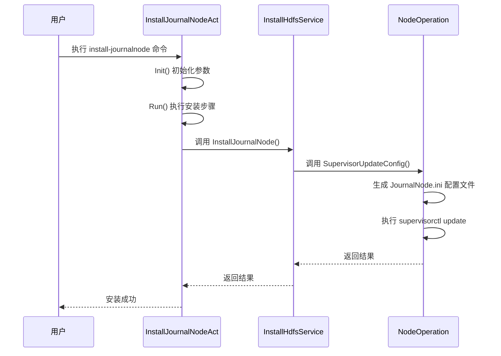
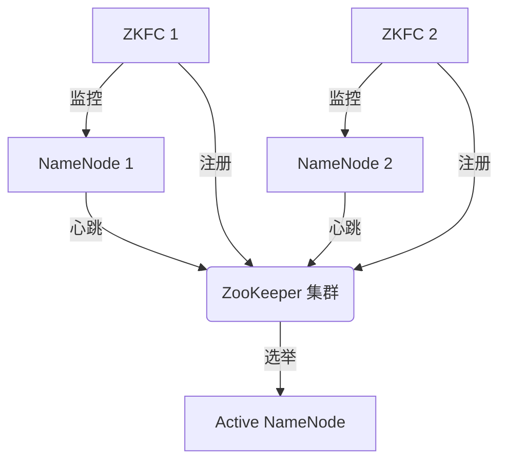
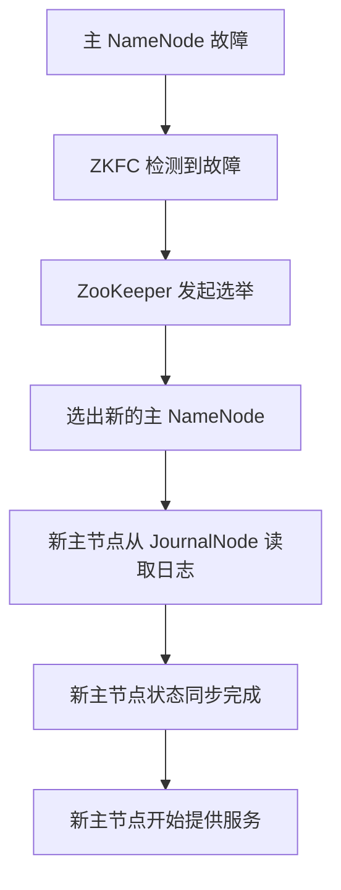

# JournalNode 集群管理

<cite>
**本文档引用的文件**   
- [install_journalnode.go](file://dbm-services/bigdata/db-tools/dbactuator/internal/subcmd/hdfscmd/install_journalnode.go)
- [update_zookeeper_config.go](file://dbm-services/bigdata/db-tools/dbactuator/internal/subcmd/hdfscmd/update_zookeeper_config.go)
- [install_hdfs.go](file://dbm-services/bigdata/db-tools/dbactuator/pkg/components/hdfs/install_hdfs.go)
- [node_operation.go](file://dbm-services/bigdata/db-tools/dbactuator/pkg/components/hdfs/node_operation.go)
- [hdfs_apply_flow_v2.py](file://dbm-ui/backend/flow/engine/bamboo/scene/hdfs/hdfs_apply_flow_v2.py)
</cite>

## 目录
1. [简介](#简介)
2. [JournalNode 部署与配置](#journalnode-部署与配置)
3. [ZooKeeper 集成与配置更新](#zookeeper-集成与配置更新)
4. [HDFS 高可用架构中的角色](#hdfs-高可用架构中的角色)
5. [部署最佳实践](#部署最佳实践)
6. [常见问题排查指南](#常见问题排查指南)

## 简介
JournalNode 是 HDFS 高可用（HA）架构中的关键组件，负责存储和管理 NameNode 的编辑日志（Edit Log），确保在主备 NameNode 切换时数据的一致性和完整性。本文档详细说明了如何通过 `install_journalnode.go` 部署和配置 JournalNode 服务，以及 `update_zookeeper_config.go` 在更新 ZooKeeper 配置列表中的作用。同时，阐述了 JournalNode 在 HDFS 高可用架构中的关键角色，包括日志同步机制和故障恢复流程，并提供了部署最佳实践和常见问题排查指南。

## JournalNode 部署与配置

`install_journalnode.go` 文件定义了安装和启动 JournalNode 的命令和逻辑。该文件通过 Cobra 库定义了一个名为 `install-journalnode` 的命令，用于在指定主机上安装和启动 JournalNode 服务。

### 安装流程
1. **初始化**：`Init` 方法负责反序列化传入的参数，并初始化 `InstallHdfsService` 实例。它设置了通用参数和默认的安装参数。
2. **执行**：`Run` 方法定义了执行步骤，当前仅包含一个步骤，即启动 JournalNode。
3. **启动 JournalNode**：调用 `InstallHdfsService` 的 `InstallJournalNode` 方法，该方法最终通过 `SupervisorUpdateConfig` 更新 Supervisor 配置并启动 JournalNode 进程。

### 核心方法
- **InstallJournalNode**：该方法位于 `install_hdfs.go` 文件中，负责启动 JournalNode。它通过调用 `SupervisorUpdateConfig` 方法来更新 Supervisor 的配置文件，并启动 JournalNode 进程。
- **SupervisorUpdateConfig**：该方法位于 `node_operation.go` 文件中，负责生成 Supervisor 的配置文件（`.ini` 文件），并调用 `supervisorctl update` 命令来更新 Supervisor 的配置。

**图示来源**
- [install_journalnode.go](file://dbm-services/bigdata/db-tools/dbactuator/internal/subcmd/hdfscmd/install_journalnode.go#L78-L105)
- [install_hdfs.go](file://dbm-services/bigdata/db-tools/dbactuator/pkg/components/hdfs/install_hdfs.go#L156-L158)
- [node_operation.go](file://dbm-services/bigdata/db-tools/dbactuator/pkg/components/hdfs/node_operation.go#L146-L165)

**本节来源**
- [install_journalnode.go](file://dbm-services/bigdata/db-tools/dbactuator/internal/subcmd/hdfscmd/install_journalnode.go)
- [install_hdfs.go](file://dbm-services/bigdata/db-tools/dbactuator/pkg/components/hdfs/install_hdfs.go)
- [node_operation.go](file://dbm-services/bigdata/db-tools/dbactuator/pkg/components/hdfs/node_operation.go)

## ZooKeeper 集成与配置更新

JournalNode 与 ZooKeeper 集群紧密集成，用于实现 NameNode 的故障转移（Failover）。ZooKeeper 负责监控 NameNode 的状态，并在主 NameNode 发生故障时，协调备 NameNode 提升为主节点。

### 配置更新
`update_zookeeper_config.go` 文件定义了更新 ZooKeeper 配置的命令和逻辑。该文件通过 Cobra 库定义了一个名为 `update-zk-conf` 的命令，用于更新 ZooKeeper 的配置。

#### 更新流程
1. **初始化**：`Init` 方法负责反序列化传入的参数，并初始化 `UpdateZooKeeperConfigService` 实例。
2. **执行**：`Run` 方法定义了执行步骤，即调用 `UpdateZooKeeperConfig` 方法来更新 ZooKeeper 配置。
3. **更新配置**：`UpdateZooKeeperConfig` 方法位于 `install_hdfs.go` 文件中，负责更新 ZooKeeper 的配置文件，并重启 ZooKeeper 服务。

### 集成机制
- **ZooKeeper Quorum**：在 HDFS 配置文件 `hdfs-site.xml` 中，通过 `dfs.ha.zookeeper.quorum` 参数指定 ZooKeeper 集群的地址列表。
- **故障转移控制器（ZKFC）**：每个 NameNode 节点上都运行一个 ZKFC 进程，它负责与 ZooKeeper 集群通信，监控 NameNode 的健康状况，并在必要时进行故障转移。

**图示来源**
- [update_zookeeper_config.go](file://dbm-services/bigdata/db-tools/dbactuator/internal/subcmd/hdfscmd/update_zookeeper_config.go)
- [install_hdfs.go](file://dbm-services/bigdata/db-tools/dbactuator/pkg/components/hdfs/install_hdfs.go#L353-L425)

**本节来源**
- [update_zookeeper_config.go](file://dbm-services/bigdata/db-tools/dbactuator/internal/subcmd/hdfscmd/update_zookeeper_config.go)
- [install_hdfs.go](file://dbm-services/bigdata/db-tools/dbactuator/pkg/components/hdfs/install_hdfs.go)

## HDFS 高可用架构中的角色

JournalNode 在 HDFS 高可用架构中扮演着至关重要的角色，主要负责共享编辑日志的存储和同步。

### 日志同步机制
- **共享编辑日志**：当主 NameNode 执行文件系统操作时，它会将操作记录写入本地的编辑日志文件，并同时将这些记录发送到所有 JournalNode。
- **Quorum 写入**：为了确保数据的可靠性，写入操作需要得到大多数 JournalNode（Quorum）的确认。例如，在一个由 3 个 JournalNode 组成的集群中，至少需要 2 个 JournalNode 确认写入成功。
- **日志读取**：备 NameNode 定期从 JournalNode 读取编辑日志，并将其应用到自己的内存状态中，从而保持与主 NameNode 的状态同步。

### 故障恢复流程
1. **故障检测**：ZKFC 进程通过心跳机制检测主 NameNode 的健康状况。如果主 NameNode 失去响应，ZKFC 会通知 ZooKeeper 集群。
2. **故障转移**：ZooKeeper 集群发起一次新的选举，选出一个新的主 NameNode。
3. **状态同步**：新的主 NameNode 从 JournalNode 读取最新的编辑日志，确保其状态是最新的。
4. **服务恢复**：新的主 NameNode 开始对外提供服务，客户端请求被重定向到新的主节点。

**图示来源**
- [install_hdfs.go](file://dbm-services/bigdata/db-tools/dbactuator/pkg/components/hdfs/install_hdfs.go#L186-L190)
- [hdfs_apply_flow_v2.py](file://dbm-ui/backend/flow/engine/bamboo/scene/hdfs/hdfs_apply_flow_v2.py#L110-L135)

**本节来源**
- [install_hdfs.go](file://dbm-services/bigdata/db-tools/dbactuator/pkg/components/hdfs/install_hdfs.go)
- [hdfs_apply_flow_v2.py](file://dbm-ui/backend/flow/engine/bamboo/scene/hdfs/hdfs_apply_flow_v2.py)

## 部署最佳实践
1. **集群规模**：建议部署奇数个 JournalNode（如 3 或 5 个），以确保在发生网络分区时能够形成多数派（Quorum）。
2. **硬件配置**：JournalNode 对磁盘 I/O 性能要求较高，建议使用高性能的 SSD 磁盘，并确保有足够的磁盘空间存储编辑日志。
3. **网络配置**：确保 JournalNode 之间的网络延迟较低，以保证日志同步的效率。
4. **监控与告警**：部署监控系统，实时监控 JournalNode 的运行状态、磁盘使用率和网络延迟，并设置相应的告警规则。
5. **定期维护**：定期检查 JournalNode 的日志文件，清理过期的日志，避免磁盘空间耗尽。

## 常见问题排查指南
1. **JournalNode 无法启动**
   - 检查 `supervisor` 服务是否正常运行。
   - 检查 `journalnode.ini` 配置文件是否正确生成。
   - 查看 JournalNode 的日志文件，定位具体的错误信息。
2. **日志同步延迟高**
   - 检查 JournalNode 之间的网络延迟。
   - 检查磁盘 I/O 性能是否成为瓶颈。
   - 检查 NameNode 的负载是否过高。
3. **故障转移失败**
   - 检查 ZooKeeper 集群的状态是否正常。
   - 检查 ZKFC 进程是否正常运行。
   - 检查网络连接是否正常。

**本节来源**
- [install_journalnode.go](file://dbm-services/bigdata/db-tools/dbactuator/internal/subcmd/hdfscmd/install_journalnode.go)
- [install_hdfs.go](file://dbm-services/bigdata/db-tools/dbactuator/pkg/components/hdfs/install_hdfs.go)
- [node_operation.go](file://dbm-services/bigdata/db-tools/dbactuator/pkg/components/hdfs/node_operation.go)