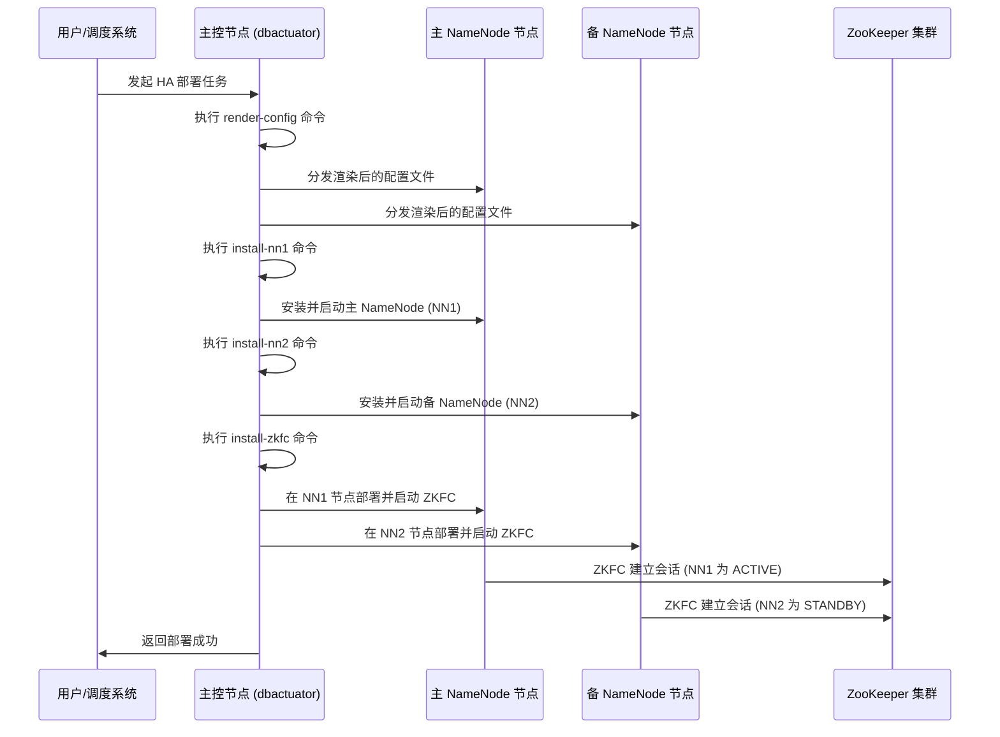

# NameNode 高可用部署

<cite>
**本文档引用的文件**   
- [install_first_namenode.go](file://dbm-services/bigdata/db-tools/dbactuator/internal/subcmd/hdfscmd/install_first_namenode.go)
- [install_second_namenode.go](file://dbm-services/bigdata/db-tools/dbactuator/internal/subcmd/hdfscmd/install_second_namenode.go)
- [install_zkfc.go](file://dbm-services/bigdata/db-tools/dbactuator/internal/subcmd/hdfscmd/install_zkfc.go)
- [check_active.go](file://dbm-services/bigdata/db-tools/dbactuator/internal/subcmd/hdfscmd/check_active.go)
- [render_hdfs_config.go](file://dbm-services/bigdata/db-tools/dbactuator/internal/subcmd/hdfscmd/render_hdfs_config.go)
- [install_hdfs.go](file://dbm-services/bigdata/db-tools/dbactuator/pkg/components/hdfs/install_hdfs.go)
- [hdfs.go](file://dbm-services/bigdata/db-tools/dbactuator/pkg/components/hdfs/hdfs.go)
- [config_tpl.go](file://dbm-services/bigdata/db-tools/dbactuator/pkg/components/hdfs/config_tpl/config_tpl.go)
</cite>

## 目录
1. [简介](#简介)
2. [主备 NameNode 初始化流程](#主备-namenode-初始化流程)
3. [ZooKeeper Failover Controller 部署](#zookeeper-failover-controller-部署)
4. [活跃 NameNode 健康检查机制](#活跃-namenode-健康检查机制)
5. [HA 配置参数详解](#ha-配置参数详解)
6. [HDFS 配置文件动态渲染](#hdfs-配置文件动态渲染)
7. [部署流程时序图](#部署流程时序图)
8. [总结](#总结)

## 简介
本文档详细阐述了在 BlueKing DBM 系统中实现 HDFS NameNode 高可用（HA）部署的技术细节。文档深入分析了主备 NameNode 的初始化过程、ZooKeeper Failover Controller（ZKFC）的部署机制、活跃 NameNode 的健康检查，以及 HDFS 高可用配置参数的生成和配置文件的动态渲染过程。通过本文档，运维人员和开发人员可以全面理解 NameNode 高可用架构的实现原理和部署流程。

## 主备 NameNode 初始化流程

NameNode 高可用部署的核心是正确初始化主备两个 NameNode 节点。系统通过两个独立的命令分别处理主 NameNode（NN1）和备 NameNode（NN2）的安装过程。

`install_first_namenode.go` 文件定义了主 NameNode 的安装命令和执行流程。该组件通过 `InstallNn1Act` 结构体实现，其主要职责是执行主 NameNode 的安装步骤。在初始化阶段，它会反序列化传入的参数，并设置通用的运行时参数和默认安装参数。执行阶段，它调用 `InstallNn1` 函数来完成主 NameNode 的实际安装工作。

`install_second_namenode.go` 文件则负责备 NameNode 的初始化。与主 NameNode 类似，它通过 `InstallNn2Act` 结构体实现，其核心功能是调用 `InstallNn2` 函数来安装备 NameNode。两个安装流程的设计保持了高度的一致性，都遵循了相同的命令行接口（CLI）模式和执行框架，确保了代码的可维护性和一致性。

主备 NameNode 的初始化分工明确，通过独立的命令进行操作，这使得部署过程更加清晰和可控。这种设计允许在部署过程中对主备节点进行独立的配置和故障排查。

**Section sources**
- [install_first_namenode.go](file://dbm-services/bigdata/db-tools/dbactuator/internal/subcmd/hdfscmd/install_first_namenode.go#L1-L106)
- [install_second_namenode.go](file://dbm-services/bigdata/db-tools/dbactuator/internal/subcmd/hdfscmd/install_second_namenode.go#L1-L106)
- [install_hdfs.go](file://dbm-services/bigdata/db-tools/dbactuator/pkg/components/hdfs/install_hdfs.go#L1-L200)

## ZooKeeper Failover Controller 部署

ZooKeeper Failover Controller（ZKFC）是实现 NameNode 自动故障转移的关键组件。`install_zkfc.go` 文件专门负责 ZKFC 的部署。

该文件定义了 `InstallZKFCAct` 结构体和 `InstallZKFCCommand` 命令。当执行 `dbactuator hdfs install-zkfc` 命令时，系统会初始化 `InstallZKFCAct` 实例，并最终调用 `Service.InstallZKFC` 函数来启动 ZKFC 进程。

ZKFC 进程运行在每个运行 NameNode 的物理节点上，其主要职责包括：
1. **健康监测**：定期调用本地 NameNode 的 `healthMonitor` 子系统，检查 NameNode 的健康状况。
2. **会话管理**：与 ZooKeeper 集群建立会话，并在本地 NameNode 健康时，维护一个持久的会话。
3. **故障转移**：当主 NameNode 发生故障时，ZKFC 会通过 ZooKeeper 的选举机制，将备 NameNode 提升为主节点，从而实现自动故障转移。

通过独立的 `install_zkfc` 命令，系统可以灵活地在需要的节点上部署 ZKFC，确保高可用架构的完整性。

**Section sources**
- [install_zkfc.go](file://dbm-services/bigdata/db-tools/dbactuator/internal/subcmd/hdfscmd/install_zkfc.go#L1-L106)
- [install_hdfs.go](file://dbm-services/bigdata/db-tools/dbactuator/pkg/components/hdfs/install_hdfs.go#L201-L300)

## 活跃 NameNode 健康检查机制

`check_active.go` 文件实现了对当前活跃 NameNode 节点的健康检查机制。该功能由 `CheckActiveAct` 结构体和 `CheckActiveCommand` 命令提供。

健康检查的核心是 `CheckActiveService.CheckActive` 方法。该方法通过执行 HDFS 命令来查询集群的状态，确定当前哪个 NameNode 处于 ACTIVE（活跃）状态，哪个处于 STANDBY（备用）状态。这通常通过调用 `hdfs haadmin -getServiceState <namenode>` 命令来实现。

此检查机制在以下场景中至关重要：
- **部署后验证**：在完成 HA 部署后，验证主备节点的状态是否符合预期。
- **故障转移监控**：在发生故障转移后，确认新的主节点已成功激活。
- **日常巡检**：作为日常运维的一部分，定期检查 NameNode 的状态，确保高可用性。

该检查流程是自动化运维的重要组成部分，为上层的监控和告警系统提供了可靠的数据支持。

**Section sources**
- [check_active.go](file://dbm-services/bigdata/db-tools/dbactuator/internal/subcmd/hdfscmd/check_active.go#L1-L102)
- [hdfs.go](file://dbm-services/bigdata/db-tools/dbactuator/pkg/components/hdfs/hdfs.go#L50-L100)

## HA 配置参数详解

HDFS 高可用的实现依赖于一系列核心配置参数，这些参数在 `config_tpl.go` 模板文件中定义，并在部署时动态生成。

关键的 HA 配置参数包括：

| 配置项 | 说明 | 生成逻辑 |
| :--- | :--- | :--- |
| `dfs.nameservices` | 定义命名服务的逻辑名称 | 由部署流程中的集群标识生成，例如 `mycluster` |
| `dfs.ha.namenodes.[nameservice]` | 列出该命名服务下的所有 NameNode ID | 固定为 `nn1,nn2`，对应主备节点 |
| `dfs.namenode.rpc-address.[nameservice].[namenode_id]` | 指定每个 NameNode 的 RPC 地址 | 结合 `nn1`/`nn2` 的 ID 和预设的端口（如 8020）以及对应的主机 IP 生成 |
| `dfs.namenode.http-address.[nameservice].[namenode_id]` | 指定每个 NameNode 的 HTTP 地址 | 结合 `nn1`/`nn2` 的 ID 和预设的端口（如 50070）以及对应的主机 IP 生成 |
| `dfs.namenode.shared.edits.dir` | 指定共享编辑日志的存储位置，通常指向 JournalNodes | 格式为 `qjournal://<jn1>:8485;<jn2>:8485;<jn3>:8485/mycluster`，由 JournalNode 的主机列表和端口生成 |
| `dfs.client.failover.proxy.provider.[nameservice]` | 指定客户端故障转移的代理类 | 固定为 `org.apache.hadoop.hdfs.server.namenode.ha.ConfiguredFailoverProxyProvider` |
| `dfs.ha.fencing.methods` | 定义隔离（fencing）方法，防止脑裂 | 通常配置为 `sshfence` 和 `shell` 脚本的组合 |

这些参数的正确配置是 NameNode HA 能够正常工作的基础。系统通过模板引擎将这些参数动态注入到 `hdfs-site.xml` 配置文件中。

**Section sources**
- [config_tpl.go](file://dbm-services/bigdata/db-tools/dbactuator/pkg/components/hdfs/config_tpl/config_tpl.go#L1-L200)
- [render_hdfs_config.go](file://dbm-services/bigdata/db-tools/dbactuator/internal/subcmd/hdfscmd/render_hdfs_config.go#L1-L106)

## HDFS 配置文件动态渲染

`render_hdfs_config.go` 文件负责 HDFS 集群配置文件的动态渲染。该功能由 `RenderHdfsConfigAct` 结构体和 `RenderHdfsConfigCommand` 命令实现。

其核心流程如下：
1. **参数接收**：接收来自上层调度系统的部署参数，包括集群拓扑、主机 IP、端口、目录路径等。
2. **模板加载**：从 `config_tpl` 目录加载预定义的配置模板文件，如 `hdfs-site.xml.tpl`、`core-site.xml.tpl` 等。
3. **数据填充**：将接收到的部署参数与模板中的占位符进行匹配和填充。例如，将 `{{.NameNode1IP}}` 替换为实际的主 NameNode IP 地址。
4. **文件生成**：将渲染后的配置内容写入目标主机的指定路径（如 `$HADOOP_CONF_DIR`）。

这个过程是整个部署流程的基石，它确保了每个节点都能获得一份准确、一致且符合当前部署环境的配置文件。通过模板化的方式，极大地提高了配置管理的灵活性和可靠性。

**Section sources**
- [render_hdfs_config.go](file://dbm-services/bigdata/db-tools/dbactuator/internal/subcmd/hdfscmd/render_hdfs_config.go#L1-L106)
- [config_tpl.go](file://dbm-services/bigdata/db-tools/dbactuator/pkg/components/hdfs/config_tpl/config_tpl.go#L1-L200)
- [hdfs.go](file://dbm-services/bigdata/db-tools/dbactuator/pkg/components/hdfs/hdfs.go#L1-L50)

## 部署流程时序图

以下时序图展示了 NameNode 高可用部署的主要流程，包括配置渲染、主备 NameNode 安装和 ZKFC 部署。

**Diagram sources**
- [render_hdfs_config.go](file://dbm-services/bigdata/db-tools/dbactuator/internal/subcmd/hdfscmd/render_hdfs_config.go#L78-L105)
- [install_first_namenode.go](file://dbm-services/bigdata/db-tools/dbactuator/internal/subcmd/hdfscmd/install_first_namenode.go#L78-L105)
- [install_second_namenode.go](file://dbm-services/bigdata/db-tools/dbactuator/internal/subcmd/hdfscmd/install_second_namenode.go#L78-L105)
- [install_zkfc.go](file://dbm-services/bigdata/db-tools/dbactuator/internal/subcmd/hdfscmd/install_zkfc.go#L78-L105)

## 总结

本文档详细解析了 BlueKing DBM 系统中 NameNode 高可用部署的实现机制。通过 `install_first_namenode.go` 和 `install_second_namenode.go` 实现了主备 NameNode 的分工初始化，通过 `install_zkfc.go` 部署了实现自动故障转移的 ZKFC 组件，并通过 `check_active.go` 提供了健康检查能力。`render_hdfs_config.go` 结合配置模板，实现了 HDFS 配置文件的动态渲染，确保了 `dfs.ha.namenodes`、`dfs.namenode.rpc-address` 等核心 HA 参数的准确生成。这一系列组件协同工作，构建了一个健壮、可靠的 HDFS 高可用架构。