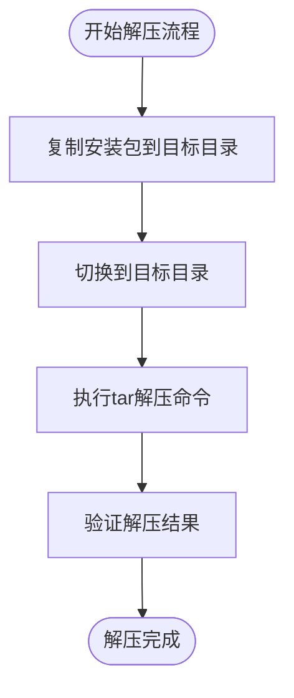
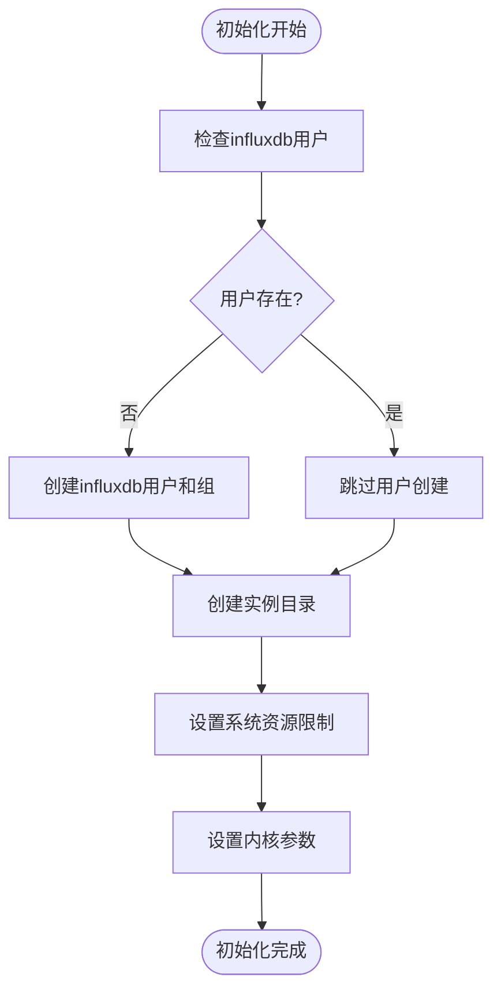
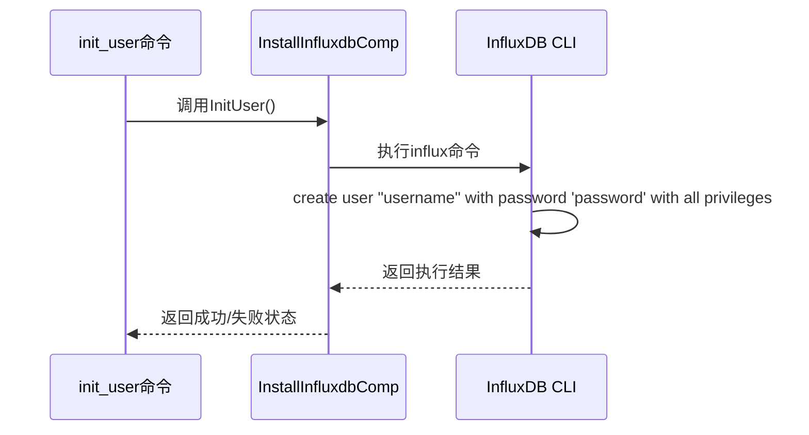
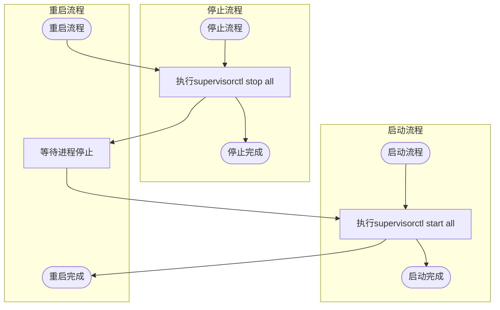
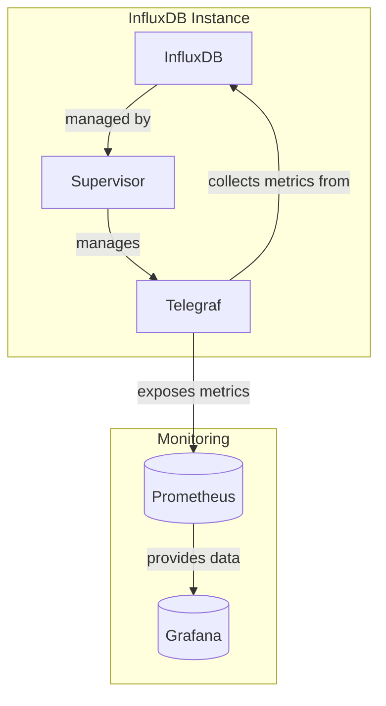

# InfluxDB 服务管理

<cite>
**本文档引用的文件**
- [install_influxdb.go](file://dbm-services/bigdata/db-tools/dbactuator/internal/subcmd/influxdbcmd/install_influxdb.go)
- [decompress_influxdb_pkg.go](file://dbm-services/bigdata/db-tools/dbactuator/internal/subcmd/influxdbcmd/decompress_influxdb_pkg.go)
- [init.go](file://dbm-services/bigdata/db-tools/dbactuator/internal/subcmd/influxdbcmd/init.go)
- [init_user.go](file://dbm-services/bigdata/db-tools/dbactuator/internal/subcmd/influxdbcmd/init_user.go)
- [start_process.go](file://dbm-services/bigdata/db-tools/dbactuator/internal/subcmd/influxdbcmd/start_process.go)
- [stop_process.go](file://dbm-services/bigdata/db-tools/dbactuator/internal/subcmd/influxdbcmd/stop_process.go)
- [restart_process.go](file://dbm-services/bigdata/db-tools/dbactuator/internal/subcmd/influxdbcmd/restart_process.go)
- [install_supervisor.go](file://dbm-services/bigdata/db-tools/dbactuator/internal/subcmd/influxdbcmd/install_supervisor.go)
- [install_telegraf.go](file://dbm-services/bigdata/db-tools/dbactuator/internal/subcmd/influxdbcmd/install_telegraf.go)
- [install_influxdb.go](file://dbm-services/bigdata/db-tools/dbactuator/pkg/components/influxdb/install_influxdb.go)
- [startstop_process.go](file://dbm-services/bigdata/db-tools/dbactuator/pkg/components/influxdb/startstop_process.go)
</cite>

## 目录
1. [InfluxDB 部署与管理概述](#influxdb-部署与管理概述)
2. [安装流程分析](#安装流程分析)
3. [包解压逻辑](#包解压逻辑)
4. [数据库初始化](#数据库初始化)
5. [用户创建](#用户创建)
6. [进程控制机制](#进程控制机制)
7. [监控与数据采集集成](#监控与数据采集集成)
8. [实例部署示例](#实例部署示例)

## InfluxDB 部署与管理概述

InfluxDB 服务管理通过 `influxdbcmd` 模块实现，该模块提供了完整的 InfluxDB 实例生命周期管理功能。`dbactuator` 工具通过一系列子命令来部署和管理 InfluxDB 实例，包括安装、初始化、进程控制和监控集成等操作。这些功能被组织在 `influxdbcmd` 包中，每个操作对应一个独立的命令实现。

**本节来源**
- [install_influxdb.go](file://dbm-services/bigdata/db-tools/dbactuator/internal/subcmd/influxdbcmd/install_influxdb.go)
- [influxdbcmd.go](file://dbm-services/bigdata/db-tools/dbactuator/internal/subcmd/influxdbcmd/influxdbcmd.go)

## 安装流程分析

`install_influxdb.go` 文件实现了 InfluxDB 实例的部署流程。该流程通过 `InstallInfluxdbAct` 结构体和 `InstallInfluxdbCommand` 函数实现，遵循标准的 `dbactuator` 命令执行模式。安装过程包括参数验证、初始化和执行三个主要阶段。

安装流程的核心是 `Run` 方法，它定义了执行步骤：
1. 首先进行参数反序列化和验证
2. 设置通用运行时参数
3. 执行安装步骤

安装步骤通过 `subcmd.Steps` 结构体定义，目前包含一个主要步骤："部署Influxdb"，该步骤调用 `InstallInfluxdbComp` 组件的 `InstallInfluxdb` 方法。

**本节来源**
- [install_influxdb.go](file://dbm-services/bigdata/db-tools/dbactuator/internal/subcmd/influxdbcmd/install_influxdb.go)
- [install_influxdb.go](file://dbm-services/bigdata/db-tools/dbactuator/pkg/components/influxdb/install_influxdb.go)

## 包解压逻辑

`decompress_influxdb_pkg.go` 文件实现了 InfluxDB 安装包的解压逻辑。该功能通过 `DecompressInfluxdbPkgAct` 结构体和 `DecompressInfluxdbPkgCommand` 函数实现，其执行流程与其他命令保持一致。

解压流程的核心是 `DecompressInfluxdbPkg` 方法，该方法执行以下操作：
1. 将指定版本的 InfluxDB 安装包从安装目录复制到目标环境目录
2. 使用 tar 命令解压安装包
3. 验证解压后的目录是否存在

该流程确保了 InfluxDB 二进制文件能够正确地解压到指定的环境目录中，为后续的安装和配置做好准备。

**本节来源**
- [decompress_influxdb_pkg.go](file://dbm-services/bigdata/db-tools/dbactuator/internal/subcmd/influxdbcmd/decompress_influxdb_pkg.go)
- [install_influxdb.go](file://dbm-services/bigdata/db-tools/dbactuator/pkg/components/influxdb/install_influxdb.go#L132-L154)

## 数据库初始化

`init.go` 文件实现了 InfluxDB 数据库的初始化功能。该功能通过 `InitAct` 结构体和 `InitCommand` 函数实现，主要负责创建 InfluxDB 实例所需的系统用户、目录结构和系统参数配置。

初始化流程的核心是 `InitInfluxdbNode` 方法，该方法执行以下关键操作：
1. 检查并创建 `influxdb` 系统用户和用户组
2. 创建 InfluxDB 环境目录并设置正确的权限
3. 配置系统参数，包括文件描述符限制和内核参数

这些操作确保了 InfluxDB 实例运行所需的系统环境已经正确配置，为后续的安装和运行提供了基础支持。

**本节来源**
- [init.go](file://dbm-services/bigdata/db-tools/dbactuator/internal/subcmd/influxdbcmd/init.go)
- [install_influxdb.go](file://dbm-services/bigdata/db-tools/dbactuator/pkg/components/influxdb/install_influxdb.go#L75-L124)

## 用户创建

`init_user.go` 文件实现了 InfluxDB 用户的创建功能。该功能通过 `InitUserAct` 结构体和 `InitUserCommand` 函数实现，主要负责在已安装的 InfluxDB 实例中创建具有管理员权限的用户。

用户创建流程的核心是 `InitUser` 方法，该方法执行以下操作：
1. 使用 InfluxDB 的命令行工具 `influx`
2. 通过 `-execute` 参数直接执行创建用户的 SQL 命令
3. 创建指定用户名和密码的用户，并赋予所有权限

该流程确保了 InfluxDB 实例在部署后能够立即通过认证访问，提高了系统的安全性。

**本节来源**
- [init_user.go](file://dbm-services/bigdata/db-tools/dbactuator/internal/subcmd/influxdbcmd/init_user.go)
- [install_influxdb.go](file://dbm-services/bigdata/db-tools/dbactuator/pkg/components/influxdb/install_influxdb.go#L400-L417)

## 进程控制机制

InfluxDB 的进程控制通过三个相关文件实现：`start_process.go`、`stop_process.go` 和 `restart_process.go`。这些文件分别实现了启动、停止和重启 InfluxDB 进程的功能。

### 启动进程

`start_process.go` 文件实现了进程启动功能，通过 `StartProcessAct` 结构体和 `StartProcessCommand` 函数实现。其核心是 `StartProcess` 方法，该方法使用 `supervisorctl start all` 命令启动所有由 Supervisor 管理的进程。

### 停止进程

`stop_process.go` 文件实现了进程停止功能，通过 `StopProcessAct` 结构体和 `StopProcessCommand` 函数实现。其核心是 `StopProcess` 方法，该方法使用 `supervisorctl stop all` 命令停止所有由 Supervisor 管理的进程。

### 重启进程

`restart_process.go` 文件实现了进程重启功能，通过 `RestartProcessAct` 结构体和 `RestartProcessCommand` 函数实现。其核心是 `RestartProcess` 方法，该方法首先停止所有进程，然后重新启动所有进程。

**本节来源**
- [start_process.go](file://dbm-services/bigdata/db-tools/dbactuator/internal/subcmd/influxdbcmd/start_process.go)
- [stop_process.go](file://dbm-services/bigdata/db-tools/dbactuator/internal/subcmd/influxdbcmd/stop_process.go)
- [restart_process.go](file://dbm-services/bigdata/db-tools/dbactuator/internal/subcmd/influxdbcmd/restart_process.go)
- [startstop_process.go](file://dbm-services/bigdata/db-tools/dbactuator/pkg/components/influxdb/startstop_process.go)

## 监控与数据采集集成

InfluxDB 服务通过 `install_supervisor.go` 和 `install_telegraf.go` 文件实现了监控与数据采集的集成。

### Supervisor 集成

`install_supervisor.go` 文件实现了 Supervisor 的部署和配置。Supervisor 用于管理 InfluxDB 进程的生命周期，确保进程的稳定运行。该功能的核心是 `InstallSupervisor` 方法，它执行以下操作：
1. 创建必要的符号链接，将 InfluxDB 环境中的 Supervisor 组件链接到系统路径
2. 配置 Supervisor 的主配置文件
3. 设置 Supervisor 的启动脚本和监控机制
4. 配置定时任务以确保 Supervisor 进程的高可用性

### Telegraf 集成

`install_telegraf.go` 文件实现了 Telegraf 的部署和配置。Telegraf 用于采集 InfluxDB 实例的性能指标并将其发送到监控系统。该功能的核心是 `InstallTelegraf` 方法，它执行以下操作：
1. 渲染 Telegraf 配置文件，包含集群信息、主机信息和端口信息
2. 生成 Telegraf 的 Supervisor 配置文件
3. 更新 Supervisor 配置以管理 Telegraf 进程

**本节来源**
- [install_supervisor.go](file://dbm-services/bigdata/db-tools/dbactuator/internal/subcmd/influxdbcmd/install_supervisor.go)
- [install_telegraf.go](file://dbm-services/bigdata/db-tools/dbactuator/internal/subcmd/influxdbcmd/install_telegraf.go)
- [install_influxdb.go](file://dbm-services/bigdata/db-tools/dbactuator/pkg/components/influxdb/install_influxdb.go)

## 实例部署示例

使用 `dbactuator` 快速部署 InfluxDB 实例的流程如下：

1. **准备参数文件**：创建包含部署参数的 JSON 文件，包括版本号、端口、用户名、密码等信息
2. **执行安装命令**：使用 `dbactuator influxdb install_influxdb` 命令部署实例
3. **初始化数据库**：使用 `dbactuator influxdb init` 命令创建必要的目录结构和系统配置
4. **解压安装包**：使用 `dbactuator influxdb decompress_pkg` 命令解压 InfluxDB 安装包
5. **配置Supervisor**：使用 `dbactuator influxdb install_supervisor` 命令部署和配置进程管理器
6. **创建用户**：使用 `dbactuator influxdb init_user` 命令创建管理员用户
7. **部署Telegraf**：使用 `dbactuator influxdb install_telegraf` 命令配置监控采集
8. **启动服务**：使用 `dbactuator influxdb start_process` 命令启动 InfluxDB 服务

这个流程展示了如何使用 `dbactuator` 工具的各个子命令来完成 InfluxDB 实例的完整部署，从环境准备到服务启动的全过程。

**本节来源**
- [install_influxdb.go](file://dbm-services/bigdata/db-tools/dbactuator/internal/subcmd/influxdbcmd/install_influxdb.go)
- [init.go](file://dbm-services/bigdata/db-tools/dbactuator/internal/subcmd/influxdbcmd/init.go)
- [decompress_influxdb_pkg.go](file://dbm-services/bigdata/db-tools/dbactuator/internal/subcmd/influxdbcmd/decompress_influxdb_pkg.go)
- [install_supervisor.go](file://dbm-services/bigdata/db-tools/dbactuator/internal/subcmd/influxdbcmd/install_supervisor.go)
- [init_user.go](file://dbm-services/bigdata/db-tools/dbactuator/internal/subcmd/influxdbcmd/init_user.go)
- [install_telegraf.go](file://dbm-services/bigdata/db-tools/dbactuator/internal/subcmd/influxdbcmd/install_telegraf.go)
- [start_process.go](file://dbm-services/bigdata/db-tools/dbactuator/internal/subcmd/influxdbcmd/start_process.go)