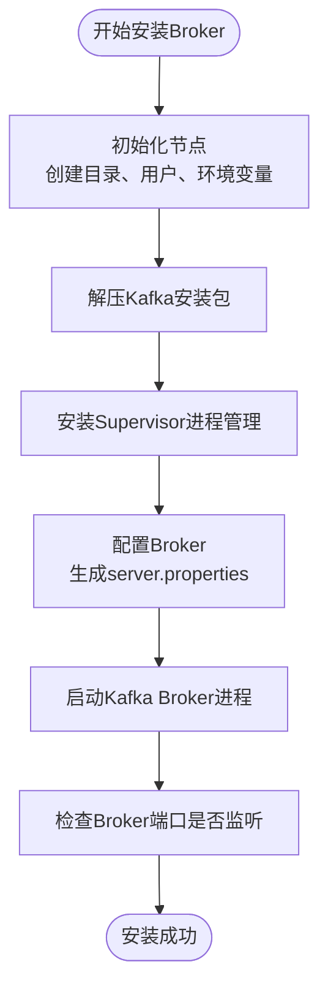
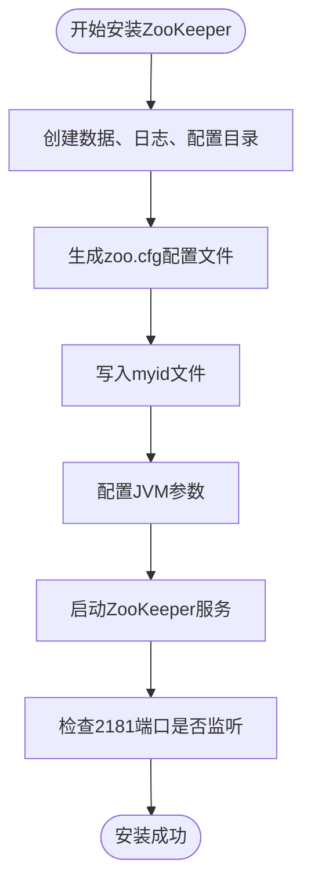
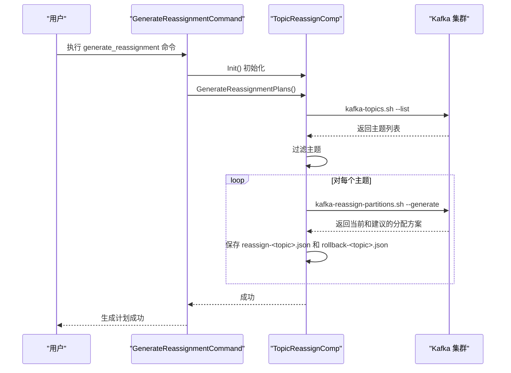

# Kafka 服务管理

<cite>
**本文档引用的文件**
- [install_broker.go](file://dbm-services/bigdata/db-tools/dbactuator/internal/subcmd/kafkacmd/install_broker.go)
- [install_zookeeper.go](file://dbm-services/bigdata/db-tools/dbactuator/internal/subcmd/kafkacmd/install_zookeeper.go)
- [install_kafkaui.go](file://dbm-services/bigdata/db-tools/dbactuator/internal/subcmd/kafkacmd/install_kafkaui.go)
- [install_manager.go](file://dbm-services/bigdata/db-tools/dbactuator/internal/subcmd/kafkacmd/install_manager.go)
- [gen_plan.go](file://dbm-services/bigdata/db-tools/dbactuator/internal/subcmd/kafkacmd/gen_plan.go)
- [exec_plan.go](file://dbm-services/bigdata/db-tools/dbactuator/internal/subcmd/kafkacmd/exec_plan.go)
- [reconfig_add.go](file://dbm-services/bigdata/db-tools/dbactuator/internal/subcmd/kafkacmd/reconfig_add.go)
- [reconfig_remove.go](file://dbm-services/bigdata/db-tools/dbactuator/internal/subcmd/kafkacmd/reconfig_remove.go)
- [check_broker_empty.go](file://dbm-services/bigdata/db-tools/dbactuator/internal/subcmd/kafkacmd/check_broker_empty.go)
- [replace_broker.go](file://dbm-services/bigdata/db-tools/dbactuator/internal/subcmd/kafkacmd/replace_broker.go)
- [init_kafkaUser.go](file://dbm-services/bigdata/db-tools/dbactuator/internal/subcmd/kafkacmd/init_kafkaUser.go)
- [install_kafka.go](file://dbm-services/bigdata/db-tools/dbactuator/pkg/components/kafka/install_kafka.go)
- [topic_reassign.go](file://dbm-services/bigdata/db-tools/dbactuator/pkg/components/kafka/topic_reassign.go)
- [reconfig.go](file://dbm-services/bigdata/db-tools/dbactuator/pkg/components/kafka/reconfig.go)
- [decom_broker.go](file://dbm-services/bigdata/db-tools/dbactuator/pkg/components/kafka/decom_broker.go)
</cite>

## 目录
1. [Kafka 集群部署](#kafka-集群部署)
2. [管理工具集成](#管理工具集成)
3. [集群重平衡管理](#集群重平衡管理)
4. [Broker 动态配置](#broker-动态配置)
5. [Broker 安全下线与替换](#broker-安全下线与替换)
6. [用户权限初始化](#用户权限初始化)
7. [集群扩容实例](#集群扩容实例)

## Kafka 集群部署

`kafkacmd` 模块提供了完整的 Kafka 集群部署能力，通过一系列子命令实现组件的独立安装与配置。

### Broker 节点安装

`install_broker.go` 文件定义了 `InstallKafkaBrokerAct` 结构体和 `InstallBrokerCommand` 命令，用于部署 Kafka Broker 实例。该命令的执行流程包括参数校验、初始化和执行安装步骤。核心的安装逻辑由 `kafka.InstallKafkaComp` 组件的 `InstallBroker` 方法实现，该方法负责：
- 创建 Kafka 实例相关的数据和日志目录
- 解压 Kafka 安装包
- 生成 `server.properties` 配置文件
- 配置 JVM 参数和安全认证（SASL）
- 启动 Kafka 服务并进行端口检查

**Diagram sources**
- [install_broker.go](file://dbm-services/bigdata/db-tools/dbactuator/internal/subcmd/kafkacmd/install_broker.go#L1-L105)
- [install_kafka.go](file://dbm-services/bigdata/db-tools/dbactuator/pkg/components/kafka/install_kafka.go#L544-L711)

**Section sources**
- [install_broker.go](file://dbm-services/bigdata/db-tools/dbactuator/internal/subcmd/kafkacmd/install_broker.go#L1-L105)
- [install_kafka.go](file://dbm-services/bigdata/db-tools/dbactuator/pkg/components/kafka/install_kafka.go#L544-L711)

### ZooKeeper 依赖部署

`install_zookeeper.go` 文件定义了 `InstallKafkaZookeeperAct` 结构体和 `InstallZookeeperCommand` 命令，用于部署 ZooKeeper 实例。ZooKeeper 是 Kafka 的核心依赖，用于集群协调和元数据存储。其安装流程包括：
- 创建 ZooKeeper 的数据、日志和配置目录
- 生成 `zoo.cfg` 配置文件，包含 `tickTime`、`initLimit` 等关键参数
- 写入 `myid` 文件以标识集群中的节点
- 配置 JVM 参数
- 通过 Supervisor 启动 ZooKeeper 服务

**Diagram sources**
- [install_zookeeper.go](file://dbm-services/bigdata/db-tools/dbactuator/internal/subcmd/kafkacmd/install_zookeeper.go#L1-L105)
- [install_kafka.go](file://dbm-services/bigdata/db-tools/dbactuator/pkg/components/kafka/install_kafka.go#L368-L449)

**Section sources**
- [install_zookeeper.go](file://dbm-services/bigdata/db-tools/dbactuator/internal/subcmd/kafkacmd/install_zookeeper.go#L1-L105)
- [install_kafka.go](file://dbm-services/bigdata/db-tools/dbactuator/pkg/components/kafka/install_kafka.go#L368-L449)

## 管理工具集成

为了便于 Kafka 集群的可视化管理和监控，`kafkacmd` 模块集成了 KafkaUI 和 Kafka Manager 两种管理工具。

### KafkaUI 部署

`install_kafkaui.go` 文件定义了 `InstallKafkaUIAct` 结构体和 `InstallKafkaUICommand` 命令，用于部署轻量级的 KafkaUI 管理界面。该命令的执行流程与其他安装命令一致，其核心功能是通过 `kafka.InstallKafkaComp` 组件的 `InstallKafkaUI` 方法来完成。虽然具体实现细节未在提供的代码中展示，但其设计模式与 Broker 和 ZooKeeper 的安装保持一致，确保了操作的统一性。

**Section sources**
- [install_kafkaui.go](file://dbm-services/bigdata/db-tools/dbactuator/internal/subcmd/kafkacmd/install_kafkaui.go#L1-L128)

### Kafka Manager 部署

`install_manager.go` 文件定义了 `InstallKafkaManagerAct` 结构体和 `InstallManagerCommand` 命令，用于部署功能更强大的 Kafka Manager。Kafka Manager 提供了更全面的集群监控、主题管理和消费者组管理功能。其部署流程同样遵循标准的 `Init` 和 `Run` 模式，由 `kafka.InstallKafkaComp` 组件的 `InstallManager` 方法执行具体的安装逻辑。

**Section sources**
- [install_manager.go](file://dbm-services/bigdata/db-tools/dbactuator/internal/subcmd/kafkacmd/install_manager.go#L1-L105)

## 集群重平衡管理

集群重平衡（Reassignment）是 Kafka 运维中的关键操作，用于在 Broker 扩容、缩容或故障替换后重新分配分区，以保证数据的均衡分布。

### 重平衡规划

`gen_plan.go` 文件定义了 `GenerateReassignmentAct` 结构体和 `GenerateReassignmentCommand` 命令，用于生成重平衡计划。该命令的核心是 `kafka.TopicReassignComp` 组件的 `GenerateReassignmentPlans` 方法。该方法的执行逻辑如下：
1.  **清理旧文件**：删除上一次生成的计划文件。
2.  **确定连接方式**：根据 Kafka 版本判断是使用 `--zookeeper` 还是 `--bootstrap-server` 参数。
3.  **获取主题列表**：调用 `kafka-topics.sh --list` 命令获取所有主题，并根据用户提供的模式进行过滤。
4.  **生成分配计划**：对于每个目标主题，调用 `kafka-reassign-partitions.sh --generate` 命令，基于指定的 Broker 列表生成新的分区副本分配方案。
5.  **生成回滚计划**：同时生成当前分区分配的快照，作为回滚依据。

**Diagram sources**
- [gen_plan.go](file://dbm-services/bigdata/db-tools/dbactuator/internal/subcmd/kafkacmd/gen_plan.go#L1-L96)
- [topic_reassign.go](file://dbm-services/bigdata/db-tools/dbactuator/pkg/components/kafka/topic_reassign.go#L73-L439)

**Section sources**
- [gen_plan.go](file://dbm-services/bigdata/db-tools/dbactuator/internal/subcmd/kafkacmd/gen_plan.go#L1-L96)
- [topic_reassign.go](file://dbm-services/bigdata/db-tools/dbactuator/pkg/components/kafka/topic_reassign.go#L73-L439)

### 重平衡执行

`exec_plan.go` 文件定义了 `ExecuteReassignmentAct` 结构体和 `ExecuteReassignmentCommand` 命令，用于执行已生成的重平衡计划。其核心是 `kafka.TopicReassignComp` 组件的 `ExecuteReassignment` 方法。该方法的执行流程为：
1.  **读取主题列表**：从 `topic_list.txt` 文件中读取需要重平衡的主题。
2.  **执行重平衡**：循环遍历每个主题，调用 `kafka-reassign-partitions.sh --execute` 命令，并指定 `--throttle` 参数来控制数据迁移速度，避免对集群性能造成过大影响。
3.  **验证状态**：通过 `kafka-reassign-partitions.sh --verify` 命令轮询检查重平衡任务是否完成。
4.  **标记完成**：任务完成后，将主题名写入 `done.txt` 文件，防止重复执行。

**Section sources**
- [exec_plan.go](file://dbm-services/bigdata/db-tools/dbactuator/internal/subcmd/kafkacmd/exec_plan.go#L1-L96)
- [topic_reassign.go](file://dbm-services/bigdata/db-tools/dbactuator/pkg/components/kafka/topic_reassign.go#L442-L570)

## Broker 动态配置

`kafkacmd` 模块支持对 ZooKeeper 集群进行动态配置变更，无需重启服务即可增加或减少节点。

### 增加 ZooKeeper 节点

`reconfig_add.go` 文件定义了 `ReconfigAddAct` 结构体和 `ReconfigAddCommand` 命令，用于向 ZooKeeper 集群中添加新节点。其核心逻辑在 `kafka.ReconfigComp` 组件的 `ReconfigAdd` 方法中实现，通过执行 `zkCli.sh reconfig -file` 命令，读取包含新节点信息的动态配置文件来完成添加操作。

**Section sources**
- [reconfig_add.go](file://dbm-services/bigdata/db-tools/dbactuator/internal/subcmd/kafkacmd/reconfig_add.go#L1-L99)
- [reconfig.go](file://dbm-services/bigdata/db-tools/dbactuator/pkg/components/kafka/reconfig.go#L40-L52)

### 减少 ZooKeeper 节点

`reconfig_remove.go` 文件定义了 `ReconfigRemoveAct` 结构体和 `ReconfigRemoveCommand` 命令，用于从 ZooKeeper 集群中移除节点。其核心逻辑在 `kafka.ReconfigComp` 组件的 `ReconfigRemove` 方法中实现，通过执行 `zkCli.sh reconfig -remove` 命令，指定要移除的节点主机名来完成操作。

**Section sources**
- [reconfig_remove.go](file://dbm-services/bigdata/db-tools/dbactuator/internal/subcmd/kafkacmd/reconfig_remove.go#L1-L99)
- [reconfig.go](file://dbm-services/bigdata/db-tools/dbactuator/pkg/components/kafka/reconfig.go#L59-L71)

## Broker 安全下线与替换

在进行 Broker 维护或替换时，必须确保其上的所有分区都已迁移走，以避免数据丢失。

### 安全下线检查

`check_broker_empty.go` 文件定义了 `CheckBrokerEmptyAct` 结构体和 `CheckBrokerEmptyCommand` 命令，用于检查指定 Broker 是否为空（即不承载任何分区）。其核心逻辑在 `kafka.DecomBrokerComp` 组件的 `DoEmptyCheck` 方法中实现。该方法会查询集群元数据，确认目标 Broker 上没有分区副本，只有在检查通过后，才能安全地将其从集群中移除。

**Section sources**
- [check_broker_empty.go](file://dbm-services/bigdata/db-tools/dbactuator/internal/subcmd/kafkacmd/check_broker_empty.go#L1-L96)

### 故障替换机制

`replace_broker.go` 文件定义了 `ReplaceBrokerAct` 结构体和 `ReplaceBrokerCommand` 命令，用于执行 Broker 的替换操作。其核心逻辑在 `kafka.DecomBrokerComp` 组件的 `DoReplaceBrokers` 方法中实现。该流程通常结合重平衡功能：
1.  先使用 `check_broker_empty` 确认旧 Broker 为空。
2.  然后通过 `gen_plan` 和 `exec_plan` 将旧 Broker 上的分区迁移到新 Broker。
3.  最后调用 `replace_broker` 命令完成新旧节点的替换和集群配置的更新。

**Section sources**
- [replace_broker.go](file://dbm-services/bigdata/db-tools/dbactuator/internal/subcmd/kafkacmd/replace_broker.go#L1-L99)

## 用户权限初始化

`init_kafkaUser.go` 文件定义了 `InitKafkaUserAct` 结构体和 `InitKafkaUserCommand` 命令，用于初始化 Kafka 用户的权限。其核心逻辑在 `kafka.InstallKafkaComp` 组件的 `InitKafkaUser` 方法中实现。该方法通过调用 `kafka-configs.sh` 和 `kafka-acls.sh` 命令行工具，完成以下操作：
- 为指定的用户名（如 `admin`）配置 SCRAM-SHA-256 和 SCRAM-SHA-512 认证凭据。
- 授予该用户对所有主题（`*`）和消费者组（`*`）的 `All` 操作权限。

**Section sources**
- [init_kafkaUser.go](file://dbm-services/bigdata/db-tools/dbactuator/internal/subcmd/kafkacmd/init_kafkaUser.go#L1-L105)
- [install_kafka.go](file://dbm-services/bigdata/db-tools/dbactuator/pkg/components/kafka/install_kafka.go#L502-L542)

## 集群扩容实例

使用 `dbactuator` 扩容 Kafka 集群的典型流程如下：
1.  **部署新 Broker**：在新机器上执行 `dbactuator kafka install_broker` 命令，安装 Kafka Broker。
2.  **生成重平衡计划**：在任意一个集群节点上执行 `dbactuator kafka generate_reassignment` 命令，指定新 Broker 的 IP 列表，生成将分区迁移到新 Broker 的计划。
3.  **执行重平衡**：执行 `dbactuator kafka execute_reassignment` 命令，应用上一步生成的计划，开始数据迁移。
4.  **验证结果**：等待执行完成，通过管理工具或命令行检查分区分布，确认扩容成功。

此流程确保了扩容操作的自动化和安全性，最小化了对线上业务的影响。