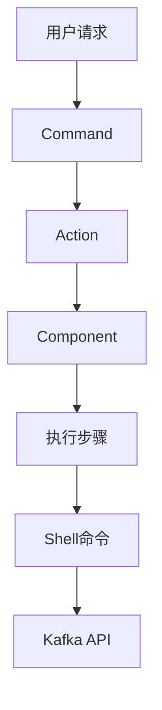
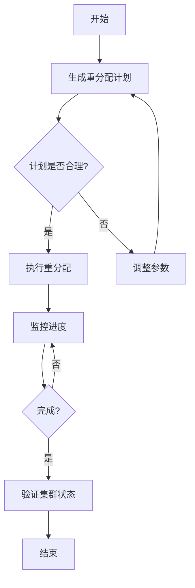
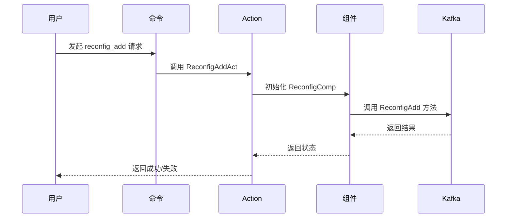

# Kafka 集群扩缩容

<cite>
**本文档引用的文件**   
- [gen_plan.go](file://dbm-services/bigdata/db-tools/dbactuator/internal/subcmd/kafkacmd/gen_plan.go)
- [exec_plan.go](file://dbm-services/bigdata/db-tools/dbactuator/internal/subcmd/kafkacmd/exec_plan.go)
- [reconfig_add.go](file://dbm-services/bigdata/db-tools/dbactuator/internal/subcmd/kafkacmd/reconfig_add.go)
- [reconfig_remove.go](file://dbm-services/bigdata/db-tools/dbactuator/internal/subcmd/kafkacmd/reconfig_remove.go)
- [reduce_broker.go](file://dbm-services/bigdata/db-tools/dbactuator/internal/subcmd/kafkacmd/reduce_broker.go)
- [replace_broker.go](file://dbm-services/bigdata/db-tools/dbactuator/internal/subcmd/kafkacmd/replace_broker.go)
- [kafka.go](file://dbm-services/bigdata/db-tools/dbactuator/pkg/components/kafka/kafka.go)
- [install_kafka.go](file://dbm-services/bigdata/db-tools/dbactuator/pkg/components/kafka/install_kafka.go)
- [kafkautil.go](file://dbm-services/bigdata/db-tools/dbactuator/pkg/util/kafkautil/kafkautil.go)
- [kafka.go](file://dbm-services/bigdata/db-tools/dbactuator/pkg/core/cst/kafka.go)
</cite>

## 目录
1. [引言](#引言)
2. [核心组件分析](#核心组件分析)
3. [扩缩容流程详解](#扩缩容流程详解)
4. [分区重分配计划生成](#分区重分配计划生成)
5. [执行重分配计划](#执行重分配计划)
6. [Broker 动态配置变更](#broker-动态配置变更)
7. [Broker 安全下线与替换](#broker-安全下线与替换)
8. [在线扩容案例](#在线扩容案例)
9. [结论](#结论)

## 引言
本文档详细阐述了 Kafka 集群扩缩容功能的实现机制。通过分析 `gen_plan.go`、`exec_plan.go` 等核心文件，深入解析了分区重分配计划的生成与执行过程，以及 Broker 动态配置变更、安全下线和硬件故障替换的技术细节。文档旨在为运维人员提供一套完整的 Kafka 集群管理方案。

## 核心组件分析
Kafka 集群扩缩容功能主要由 `dbactuator` 工具中的 `kafkacmd` 子命令实现。核心组件包括 `TopicReassignComp` 用于处理主题重新分配，`ReconfigComp` 用于管理配置变更，以及 `DecomBrokerComp` 用于处理 Broker 的下线和替换。

**组件关系图**


**组件来源**
- [kafkacmd.go](file://dbm-services/bigdata/db-tools/dbactuator/internal/subcmd/kafkacmd/kafkacmd.go)
- [kafka.go](file://dbm-services/bigdata/db-tools/dbactuator/pkg/components/kafka/kafka.go)

## 扩缩容流程详解
Kafka 集群的扩缩容遵循严格的流程，确保数据安全和系统稳定。流程包括规划、执行、验证三个阶段。规划阶段生成最优的分区重分配方案；执行阶段应用该方案并监控进度；验证阶段确认集群状态正常。



**流程来源**
- [gen_plan.go](file://dbm-services/bigdata/db-tools/dbactuator/internal/subcmd/kafkacmd/gen_plan.go)
- [exec_plan.go](file://dbm-services/bigdata/db-tools/dbactuator/internal/subcmd/kafkacmd/exec_plan.go)

## 分区重分配计划生成
`gen_plan.go` 文件中的 `GenerateReassignmentAct` 结构体负责生成分区重分配计划。该过程首先验证输入参数，然后初始化 `TopicReassignComp` 组件，最后调用 `GenerateReassignmentPlans` 方法生成计划。

**生成计划步骤**
1. 参数验证
2. 组件初始化
3. 调用 `GenerateReassignmentPlans` 方法
4. 输出计划文件

**代码路径**
- [gen_plan.go](file://dbm-services/bigdata/db-tools/dbactuator/internal/subcmd/kafkacmd/gen_plan.go#L74-L95)

## 执行重分配计划
`exec_plan.go` 文件中的 `ExecuteReassignmentAct` 结构体负责执行已生成的重分配计划。执行过程同样包含参数验证和组件初始化，然后调用 `ExecuteReassignment` 方法来启动重分配任务。

**执行计划步骤**
1. 参数验证
2. 组件初始化
3. 调用 `ExecuteReassignment` 方法
4. 监控执行进度

**代码路径**
- [exec_plan.go](file://dbm-services/bigdata/db-tools/dbactuator/internal/subcmd/kafkacmd/exec_plan.go#L74-L95)

## Broker 动态配置变更
`reconfig_add.go` 和 `reconfig_remove.go` 文件实现了 Broker 的动态配置变更功能。`ReconfigAddAct` 用于增加 ZooKeeper 节点，而 `ReconfigRemoveAct` 用于减少节点。两者都通过 `ReconfigComp` 组件的相应方法来完成操作。

**配置变更流程**


**文件来源**
- [reconfig_add.go](file://dbm-services/bigdata/db-tools/dbactuator/internal/subcmd/kafkacmd/reconfig_add.go)
- [reconfig_remove.go](file://dbm-services/bigdata/db-tools/dbactuator/internal/subcmd/kafkacmd/reconfig_remove.go)

## Broker 安全下线与替换
`reduce_broker.go` 和 `replace_broker.go` 文件分别处理 Broker 的安全下线和硬件故障替换。`ReduceBrokerAct` 调用 `DoDecomBrokers` 方法安全迁移数据后下线 Broker，而 `ReplaceBrokerAct` 调用 `DoReplaceBrokers` 方法在新节点上恢复数据。

**下线与替换对比**
| 操作 | 目的 | 方法 | 回滚机制 |
| :--- | :--- | :--- | :--- |
| 缩容 | 减少集群节点 | DoDecomBrokers | 支持 |
| 替换 | 更换故障节点 | DoReplaceBrokers | 支持 |

**代码路径**
- [reduce_broker.go](file://dbm-services/bigdata/db-tools/dbactuator/internal/subcmd/kafkacmd/reduce_broker.go#L77-L83)
- [replace_broker.go](file://dbm-services/bigdata/db-tools/dbactuator/internal/subcmd/kafkacmd/replace_broker.go#L77-L83)

## 在线扩容案例
本案例展示如何在线扩容两个 Broker 节点。首先使用 `generate_reassignment` 命令生成重分配计划，然后通过 `execute_reassignment` 命令执行该计划。在整个过程中，集群保持在线状态，不影响业务运行。

**扩容操作流程**
1. 准备新节点环境
2. 生成重分配计划
3. 执行重分配计划
4. 验证新节点状态
5. 更新集群配置

**操作命令示例**
```bash
# 生成重分配计划
dbactuator kafka generate_reassignment --params-file=plan_params.json

# 执行重分配计划
dbactuator kafka execute_reassignment --params-file=exec_params.json
```

**案例来源**
- [gen_plan.go](file://dbm-services/bigdata/db-tools/dbactuator/internal/subcmd/kafkacmd/gen_plan.go)
- [exec_plan.go](file://dbm-services/bigdata/db-tools/dbactuator/internal/subcmd/kafkacmd/exec_plan.go)

## 结论
本文档全面解析了 Kafka 集群扩缩容的各项功能。通过 `gen_plan.go` 和 `exec_plan.go` 实现了安全的分区重分配，`reconfig_add.go` 和 `reconfig_remove.go` 提供了动态配置能力，`reduce_broker.go` 和 `replace_broker.go` 确保了节点变更的安全性。这些功能共同构成了一个完整的 Kafka 集群管理解决方案，能够有效支持业务的弹性伸缩需求。