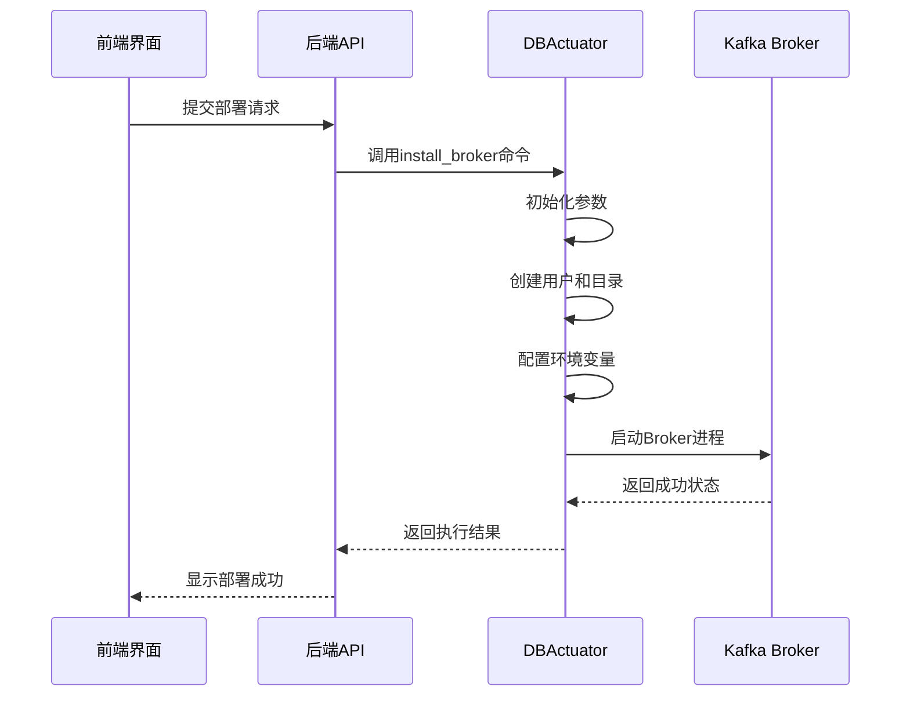
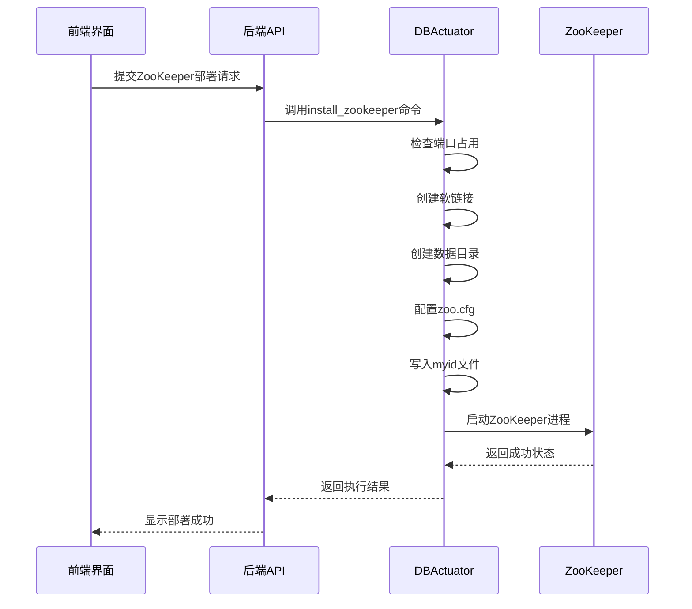
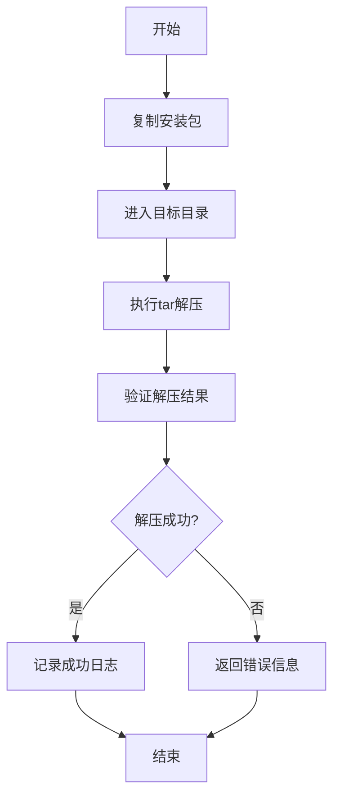
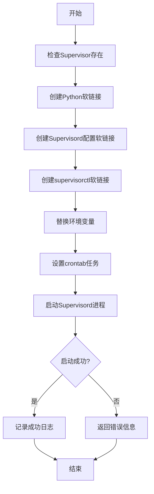
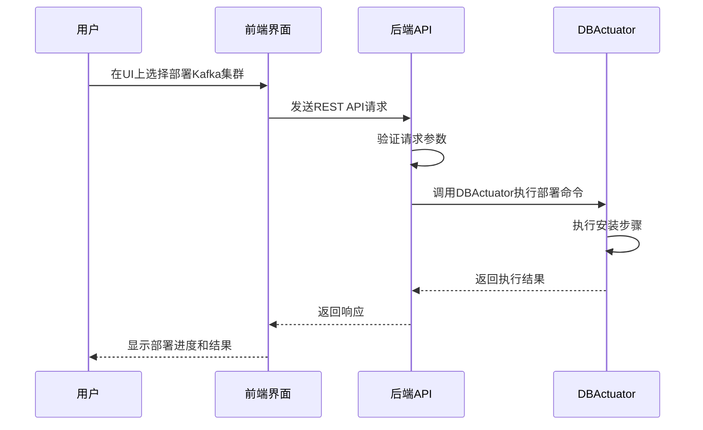
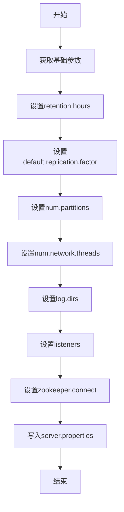

# Kafka 集群部署

<cite>
**本文档引用文件**  
- [install_broker.go](file://dbm-services/bigdata/db-tools/dbactuator/internal/subcmd/kafkacmd/install_broker.go)
- [install_zookeeper.go](file://dbm-services/bigdata/db-tools/dbactuator/internal/subcmd/kafkacmd/install_zookeeper.go)
- [decompress_kafka_pkg.go](file://dbm-services/bigdata/db-tools/dbactuator/internal/subcmd/kafkacmd/decompress_kafka_pkg.go)
- [install_supervisor.go](file://dbm-services/bigdata/db-tools/dbactuator/internal/subcmd/kafkacmd/install_supervisor.go)
- [install_kafka.go](file://dbm-services/bigdata/db-tools/dbactuator/pkg/components/kafka/install_kafka.go)
- [kafka.go](file://dbm-services/bigdata/db-tools/dbactuator/pkg/components/kafka/kafka.go)
- [kafka.py](file://dbm-ui/backend/db_services/bigdata/kafka/views.py)
</cite>

## 目录
1. [简介](#简介)
2. [核心组件分析](#核心组件分析)
3. [Kafka Broker 安装流程](#kafka-broker-安装流程)
4. [ZooKeeper 部署流程](#zookeeper-部署流程)
5. [介质解压与 Supervisor 进程管理](#介质解压与-supervisor-进程管理)
6. [前端调用后端 API 流程](#前端调用后端-api-流程)
7. [三节点 Kafka 集群部署实战](#三节点-kafka-集群部署实战)
8. [配置文件生成逻辑与关键参数](#配置文件生成逻辑与关键参数)
9. [总结](#总结)

## 简介
本文档详细描述了在 BlueKing DBM 系统中部署 Kafka 集群的完整流程。重点分析 `install_broker.go` 中如何解压安装包、配置 Broker 参数并启动服务，以及 `install_zookeeper.go` 对 ZooKeeper 依赖的部署流程。同时说明 `decompress_kafka_pkg.go` 在介质解压中的作用和 `install_supervisor.go` 如何通过 Supervisor 管理进程。结合 `dbm-ui` 的 `views.py` 说明前端调用后端 API 触发部署的完整流程。最后提供一个从零开始部署三节点 Kafka 集群的实战示例，并解释各配置文件的生成逻辑和关键参数。

## 核心组件分析

**Section sources**
- [install_broker.go](file://dbm-services/bigdata/db-tools/dbactuator/internal/subcmd/kafkacmd/install_broker.go)
- [install_zookeeper.go](file://dbm-services/bigdata/db-tools/dbactuator/internal/subcmd/kafkacmd/install_zookeeper.go)
- [decompress_kafka_pkg.go](file://dbm-services/bigdata/db-tools/dbactuator/internal/subcmd/kafkacmd/decompress_kafka_pkg.go)
- [install_supervisor.go](file://dbm-services/bigdata/db-tools/dbactuator/internal/subcmd/kafkacmd/install_supervisor.go)

## Kafka Broker 安装流程

**Diagram sources**
- [install_broker.go](file://dbm-services/bigdata/db-tools/dbactuator/internal/subcmd/kafkacmd/install_broker.go)
- [install_kafka.go](file://dbm-services/bigdata/db-tools/dbactuator/pkg/components/kafka/install_kafka.go)

**Section sources**
- [install_broker.go](file://dbm-services/bigdata/db-tools/dbactuator/internal/subcmd/kafkacmd/install_broker.go)
- [install_kafka.go](file://dbm-services/bigdata/db-tools/dbactuator/pkg/components/kafka/install_kafka.go)

## ZooKeeper 部署流程

**Diagram sources**
- [install_zookeeper.go](file://dbm-services/bigdata/db-tools/dbactuator/internal/subcmd/kafkacmd/install_zookeeper.go)
- [install_kafka.go](file://dbm-services/bigdata/db-tools/dbactuator/pkg/components/kafka/install_kafka.go)

**Section sources**
- [install_zookeeper.go](file://dbm-services/bigdata/db-tools/dbactuator/internal/subcmd/kafkacmd/install_zookeeper.go)
- [install_kafka.go](file://dbm-services/bigdata/db-tools/dbactuator/pkg/components/kafka/install_kafka.go)

## 介质解压与 Supervisor 进程管理

**Diagram sources**
- [decompress_kafka_pkg.go](file://dbm-services/bigdata/db-tools/dbactuator/internal/subcmd/kafkacmd/decompress_kafka_pkg.go)
- [install_supervisor.go](file://dbm-services/bigdata/db-tools/dbactuator/internal/subcmd/kafkacmd/install_supervisor.go)
- [install_kafka.go](file://dbm-services/bigdata/db-tools/dbactuator/pkg/components/kafka/install_kafka.go)

**Section sources**
- [decompress_kafka_pkg.go](file://dbm-services/bigdata/db-tools/dbactuator/internal/subcmd/kafkacmd/decompress_kafka_pkg.go)
- [install_supervisor.go](file://dbm-services/bigdata/db-tools/dbactuator/internal/subcmd/kafkacmd/install_supervisor.go)
- [install_kafka.go](file://dbm-services/bigdata/db-tools/dbactuator/pkg/components/kafka/install_kafka.go)

## 前端调用后端 API 流程

**Diagram sources**
- [views.py](file://dbm-ui/backend/db_services/bigdata/kafka/views.py)
- [install_broker.go](file://dbm-services/bigdata/db-tools/dbactuator/internal/subcmd/kafkacmd/install_broker.go)

**Section sources**
- [views.py](file://dbm-ui/backend/db_services/bigdata/kafka/views.py)

## 三节点 Kafka 集群部署实战
本节提供一个从零开始部署三节点 Kafka 集群的完整示例。

### 准备工作
1. 确保三台服务器已安装操作系统并配置好网络
2. 确保服务器之间可以互相SSH访问
3. 准备Kafka和ZooKeeper安装包

### 部署步骤
1. **部署ZooKeeper集群**
   - 在每个节点上执行 `install_zookeeper` 命令
   - 配置 `zoo.cfg` 文件中的服务器列表
   - 在每个节点的 `myid` 文件中写入对应的ID（1, 2, 3）

2. **解压Kafka安装包**
   - 在每个节点上执行 `decompress_pkg` 命令
   - 将Kafka安装包解压到 `/data/kafkaenv` 目录

3. **安装Supervisor**
   - 在每个节点上执行 `install_supervisor` 命令
   - 配置Supervisor的crontab任务以确保进程监控

4. **部署Kafka Broker**
   - 在每个节点上执行 `install_broker` 命令
   - 配置 `server.properties` 文件中的关键参数
   - 启动Kafka Broker进程

5. **验证集群状态**
   - 使用Kafka自带的命令行工具检查集群状态
   - 确认所有Broker都已成功加入集群

**Section sources**
- [install_broker.go](file://dbm-services/bigdata/db-tools/dbactuator/internal/subcmd/kafkacmd/install_broker.go)
- [install_zookeeper.go](file://dbm-services/bigdata/db-tools/dbactuator/internal/subcmd/kafkacmd/install_zookeeper.go)
- [decompress_kafka_pkg.go](file://dbm-services/bigdata/db-tools/dbactuator/internal/subcmd/kafkacmd/decompress_kafka_pkg.go)
- [install_supervisor.go](file://dbm-services/bigdata/db-tools/dbactuator/internal/subcmd/kafkacmd/install_supervisor.go)

## 配置文件生成逻辑与关键参数

### server.properties 配置文件
该文件是Kafka Broker的核心配置文件，由 `install_kafka.go` 中的 `InstallBroker` 方法生成。

**关键参数说明：**
- **broker.id**: Broker的唯一标识符
- **listeners**: 监听地址和端口
- **log.dirs**: 日志数据存储目录
- **zookeeper.connect**: ZooKeeper连接字符串
- **log.retention.hours**: 日志保留时间（小时）
- **default.replication.factor**: 默认副本数
- **num.partitions**: 默认分区数

### zoo.cfg 配置文件
该文件是ZooKeeper的核心配置文件，由 `install_kafka.go` 中的 `configZookeeper` 方法生成。

**关键参数说明：**
- **tickTime**: ZooKeeper的基本时间单位（毫秒）
- **initLimit**: Follower初始化连接到Leader的最大心跳数
- **syncLimit**: Follower与Leader之间发送消息的最大时间间隔
- **dataDir**: 内存数据库快照存放位置
- **clientPort**: 客户端连接端口
- **server.x**: 集群中每个服务器的配置

**Diagram sources**
- [install_kafka.go](file://dbm-services/bigdata/db-tools/dbactuator/pkg/components/kafka/install_kafka.go)
- [kafka.go](file://dbm-services/bigdata/db-tools/dbactuator/pkg/components/kafka/kafka.go)

**Section sources**
- [install_kafka.go](file://dbm-services/bigdata/db-tools/dbactuator/pkg/components/kafka/install_kafka.go)
- [kafka.go](file://dbm-services/bigdata/db-tools/dbactuator/pkg/components/kafka/kafka.go)

## 总结
本文档详细介绍了在 BlueKing DBM 系统中部署 Kafka 集群的完整流程。通过分析 `install_broker.go`、`install_zookeeper.go`、`decompress_kafka_pkg.go` 和 `install_supervisor.go` 等核心组件，我们了解了从介质解压到服务启动的全过程。同时，通过分析 `dbm-ui` 的 `views.py` 文件，我们理解了前端如何通过 API 调用触发后端部署流程。最后，我们提供了一个三节点 Kafka 集群的部署实战示例，并解释了关键配置文件的生成逻辑和参数含义。这些内容为运维人员提供了完整的 Kafka 集群部署指南。