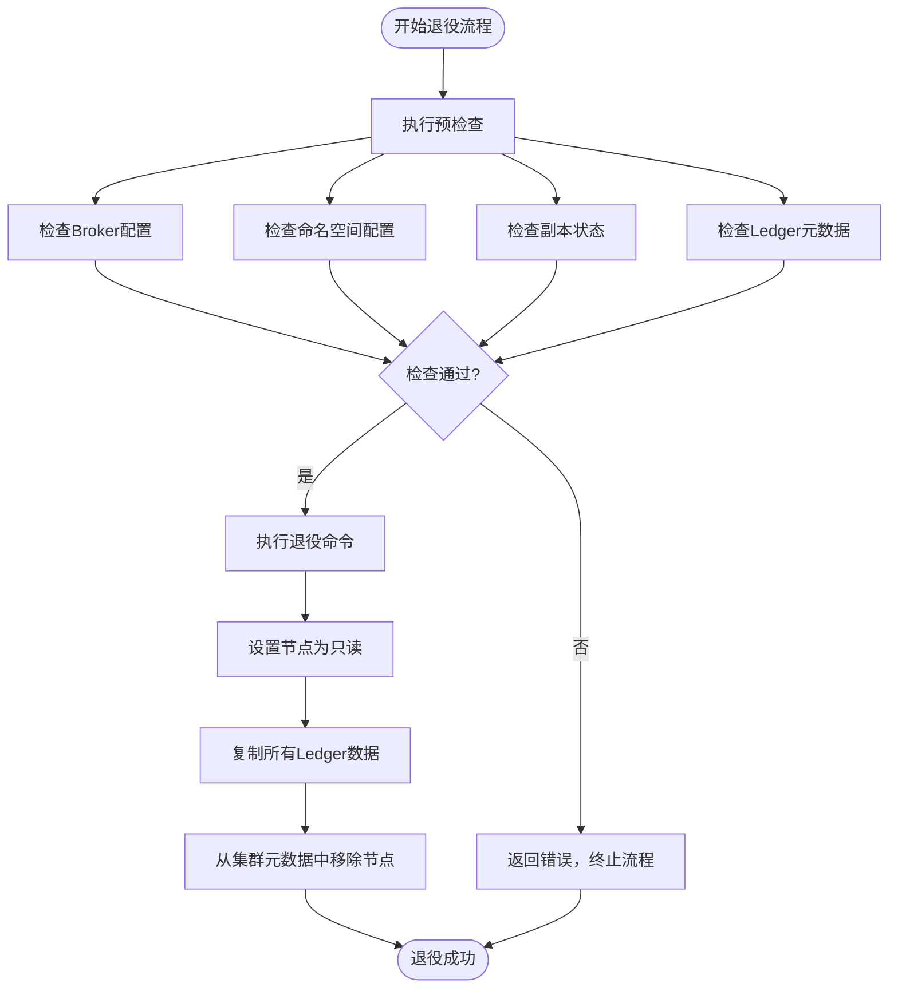
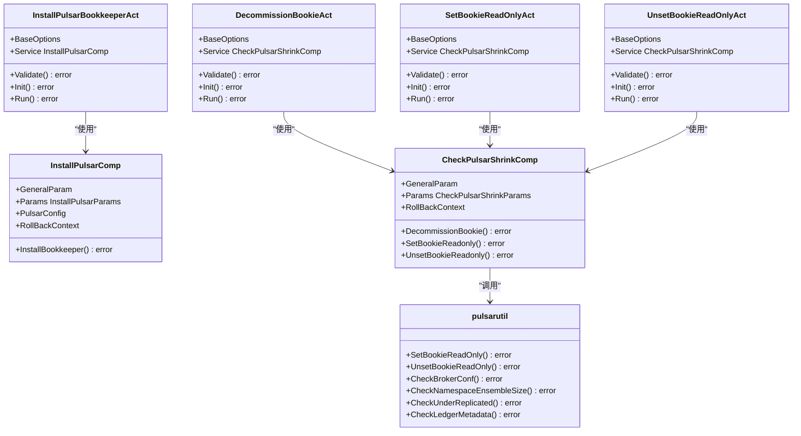

# Bookie 管理

<cite>
**本文档引用的文件**  
- [install_bookkeeper.go](file://dbm-services/bigdata/db-tools/dbactuator/internal/subcmd/pulsarcmd/install_bookkeeper.go)
- [decommission_bookie.go](file://dbm-services/bigdata/db-tools/dbactuator/internal/subcmd/pulsarcmd/decommission_bookie.go)
- [set_bookie_readonly.go](file://dbm-services/bigdata/db-tools/dbactuator/internal/subcmd/pulsarcmd/set_bookie_readonly.go)
- [unset_bookie_readonly.go](file://dbm-services/bigdata/db-tools/dbactuator/internal/subcmd/pulsarcmd/unset_bookie_readonly.go)
- [install_pulsar.go](file://dbm-services/bigdata/db-tools/dbactuator/pkg/components/pulsar/install_pulsar.go)
- [check_shrink.go](file://dbm-services/bigdata/db-tools/dbactuator/pkg/components/pulsar/check_shrink.go)
- [pulsar_operate.go](file://dbm-services/bigdata/db-tools/dbactuator/pkg/util/pulsarutil/pulsar_operate.go)
- [pulsar_helper.go](file://dbm-services/bigdata/db-tools/dbactuator/pkg/util/pulsarutil/pulsar_helper.go)
- [pulsar.go](file://dbm-services/bigdata/db-tools/dbactuator/pkg/core/cst/pulsar.go)
</cite>

## 目录
1. [简介](#简介)
2. [Bookie 部署](#bookie-部署)
3. [Bookie 安全退役](#bookie-安全退役)
4. [只读模式管理](#只读模式管理)
5. [完整操作流程示例](#完整操作流程示例)
6. [核心组件分析](#核心组件分析)

## 简介
本文档详细介绍了 Bookie 节点的全生命周期管理，包括部署、维护和退役操作。通过分析 `dbactuator` 工具中的相关实现，阐述了如何使用自动化工具管理 Pulsar 的 Bookie 服务。文档重点解析了 `install_bookkeeper.go`、`decommission_bookie.go`、`set_bookie_readonly.go` 和 `unset_bookie_readonly.go` 四个核心组件的工作原理，为运维人员提供完整的操作指南和底层实现细节。

## Bookie 部署
`install_bookkeeper.go` 文件实现了 Bookie 服务的自动化部署功能。该功能通过 `InstallPulsarBookkeeperAct` 结构体和 `InstallPulsarBookkeeperCommand` 命令提供，是 `dbactuator` 工具的一部分。

部署过程主要通过 `InstallPulsarComp` 组件的 `InstallBookkeeper` 方法实现，该方法执行以下关键步骤：

1. **目录初始化**：创建必要的数据和日志目录（如 `/data/pulsardata`），并设置正确的权限。
2. **配置生成**：从数据库配置中获取 `bk_configs`，生成 `bookkeeper.conf` 配置文件，并替换其中的变量，如本地 IP、ZooKeeper 地址列表和数据目录路径。
3. **内存配置**：根据系统内存大小自动计算并设置 JVM 堆内存和直接内存大小。
4. **服务注册**：生成 Supervisor 配置文件（`bookkeeper.ini`），将 Bookie 服务注册到进程管理器中。
5. **服务启动**：通过 Supervisor 启动 Bookie 服务，并等待其完全启动。

整个部署流程被设计为一个可执行的命令行操作，通过参数化配置实现了高度的灵活性和可重复性。

**Section sources**
- [install_bookkeeper.go](file://dbm-services/bigdata/db-tools/dbactuator/internal/subcmd/pulsarcmd/install_bookkeeper.go#L1-L105)
- [install_pulsar.go](file://dbm-services/bigdata/db-tools/dbactuator/pkg/components/pulsar/install_pulsar.go#L301-L389)

## Bookie 安全退役
`decommission_bookie.go` 文件实现了 Bookie 节点的安全退役功能。该功能通过 `DecommissionBookieAct` 结构体和 `DecommissionBookieCommand` 命令提供。

安全退役是一个关键的维护操作，旨在确保在移除 Bookie 节点时不会丢失任何 ledger 数据。其工作原理如下：

1. **预检查**：在执行退役操作前，系统会进行一系列检查以确保操作的安全性：
   - **Broker 配置检查**：验证剩余 Bookie 节点数量是否满足 `Num(RemainBookie) >= EnsembleSize >= WriteQuorum >= AckQuorum` 的要求。
   - **命名空间检查**：检查所有命名空间的持久化策略，确保没有命名空间的配置会因节点减少而失效。
   - **副本检查**：确认没有处于“under replicated”（副本不足）状态的 ledger。
   - **Ledger 元数据检查**：检查所有打开状态的 ledger，确保其 ensemble size 和 write quorum 不会超过剩余的 Bookie 节点数量。

2. **执行退役**：只有当所有预检查都通过后，才会执行实际的退役命令。该命令调用 Pulsar 自带的 `bookkeeper shell decommissionbookie` 工具，该工具会：
   - 将目标 Bookie 节点标记为只读状态。
   - 将该节点上所有 ledger 的数据复制到其他健康的 Bookie 节点上。
   - 在所有数据复制完成后，从集群的元数据中移除该节点。

这个过程确保了数据的完整性和服务的连续性，是安全移除节点的标准做法。



**Diagram sources**
- [decommission_bookie.go](file://dbm-services/bigdata/db-tools/dbactuator/internal/subcmd/pulsarcmd/decommission_bookie.go#L77-L90)
- [check_shrink.go](file://dbm-services/bigdata/db-tools/dbactuator/pkg/components/pulsar/check_shrink.go#L59-L68)
- [pulsar_helper.go](file://dbm-services/bigdata/db-tools/dbactuator/pkg/util/pulsarutil/pulsar_helper.go#L19-L126)

**Section sources**
- [decommission_bookie.go](file://dbm-services/bigdata/db-tools/dbactuator/internal/subcmd/pulsarcmd/decommission_bookie.go#L1-L105)
- [check_shrink.go](file://dbm-services/bigdata/db-tools/dbactuator/pkg/components/pulsar/check_shrink.go#L59-L68)
- [pulsar_helper.go](file://dbm-services/bigdata/db-tools/dbactuator/pkg/util/pulsarutil/pulsar_helper.go#L19-L126)

## 只读模式管理
`set_bookie_readonly.go` 和 `unset_bookie_readonly.go` 文件实现了 Bookie 节点只读模式的切换功能。这两个操作对于执行维护任务（如磁盘维护、软件升级）至关重要，可以在不影响数据安全的前提下暂停节点的写入操作。

### 设置只读模式
`set_bookie_readonly.go` 通过 `SetBookieReadOnlyAct` 结构体提供设置只读模式的功能。其核心实现是 `SetBookieReadOnly` 函数，该函数会：
1. 读取位于 `/data/pulsarenv/bookkeeper/conf/bookkeeper.conf` 的 Bookie 配置文件。
2. 在配置文件中设置或更新两个关键参数：
   - `readOnlyModeEnabled=true`：启用只读模式。
   - `forceReadOnlyBookie=true`：强制 Bookie 进入只读状态。
3. 保存修改后的配置文件。

设置完成后，Bookie 节点将拒绝所有新的写入请求，但仍然可以处理读取请求和复制操作。

### 取消只读模式
`unset_bookie_readonly.go` 通过 `UnsetBookieReadOnlyAct` 结构体提供取消只读模式的功能。其核心实现是 `UnsetBookieReadOnly` 函数，该函数会：
1. 读取 Bookie 配置文件。
2. 将 `forceReadOnlyBookie` 参数设置为 `false`。
3. 保存配置文件。

取消只读模式后，Bookie 节点将恢复正常的读写功能。

**Section sources**
- [set_bookie_readonly.go](file://dbm-services/bigdata/db-tools/dbactuator/internal/subcmd/pulsarcmd/set_bookie_readonly.go#L1-L97)
- [unset_bookie_readonly.go](file://dbm-services/bigdata/db-tools/dbactuator/internal/subcmd/pulsarcmd/unset_bookie_readonly.go#L1-L97)
- [pulsar_operate.go](file://dbm-services/bigdata/db-tools/dbactuator/pkg/util/pulsarutil/pulsar_operate.go#L130-L203)

## 完整操作流程示例
以下是一个 Bookie 节点从部署到退役的完整操作流程示例：

1. **部署 Bookie 节点**
   ```bash
   dbactuator pulsar install_bookkeeper --payload '{"zk_host": "zk1:2181,zk2:2181,zk3:2181", "cluster_name": "pulsar-cluster", "pulsar_version": "2.10.1", "host": "192.168.1.10", "role": "bookkeeper", "bk_configs": "{\"journalDirectory\": \"/data/pulsardata/journal\", \"ledgerDirectories\": \"/data/pulsardata/ledgers\"}"}'
   ```

2. **执行维护前设置为只读**
   ```bash
   dbactuator pulsar set_bookie_readonly --payload '{"host": "192.168.1.10"}'
   ```
   此时，该节点不再接受新的写入，可以安全地进行维护操作。

3. **维护完成后取消只读**
   ```bash
   dbactuator pulsar unset_bookie_readonly --payload '{"host": "192.168.1.10"}'
   ```
   节点恢复正常的读写功能。

4. **安全退役节点**
   ```bash
   dbactuator pulsar decommission_bookie --payload '{"http_port": 8080, "host": "192.168.1.10", "bookkeeper_ip": ["192.168.1.10"], "bookkeeper_num": 5}'
   ```
   系统会先进行一系列安全检查，然后启动数据复制和节点移除流程。

## 核心组件分析
本节深入分析管理 Bookie 的核心组件及其交互关系。



**Diagram sources**
- [install_bookkeeper.go](file://dbm-services/bigdata/db-tools/dbactuator/internal/subcmd/pulsarcmd/install_bookkeeper.go#L17-L20)
- [decommission_bookie.go](file://dbm-services/bigdata/db-tools/dbactuator/internal/subcmd/pulsarcmd/decommission_bookie.go#L17-L20)
- [set_bookie_readonly.go](file://dbm-services/bigdata/db-tools/dbactuator/internal/subcmd/pulsarcmd/set_bookie_readonly.go#L17-L20)
- [unset_bookie_readonly.go](file://dbm-services/bigdata/db-tools/dbactuator/internal/subcmd/pulsarcmd/unset_bookie_readonly.go#L17-L20)
- [install_pulsar.go](file://dbm-services/bigdata/db-tools/dbactuator/pkg/components/pulsar/install_pulsar.go#L23-L28)
- [check_shrink.go](file://dbm-services/bigdata/db-tools/dbactuator/pkg/components/pulsar/check_shrink.go#L15-L19)
- [pulsar_operate.go](file://dbm-services/bigdata/db-tools/dbactuator/pkg/util/pulsarutil/pulsar_operate.go#L130-L203)
- [pulsar_helper.go](file://dbm-services/bigdata/db-tools/dbactuator/pkg/util/pulsarutil/pulsar_helper.go#L19-L208)

**Section sources**
- [install_bookkeeper.go](file://dbm-services/bigdata/db-tools/dbactuator/internal/subcmd/pulsarcmd/install_bookkeeper.go#L1-L105)
- [decommission_bookie.go](file://dbm-services/bigdata/db-tools/dbactuator/internal/subcmd/pulsarcmd/decommission_bookie.go#L1-L105)
- [set_bookie_readonly.go](file://dbm-services/bigdata/db-tools/dbactuator/internal/subcmd/pulsarcmd/set_bookie_readonly.go#L1-L97)
- [unset_bookie_readonly.go](file://dbm-services/bigdata/db-tools/dbactuator/internal/subcmd/pulsarcmd/unset_bookie_readonly.go#L1-L97)
- [install_pulsar.go](file://dbm-services/bigdata/db-tools/dbactuator/pkg/components/pulsar/install_pulsar.go#L1-L843)
- [check_shrink.go](file://dbm-services/bigdata/db-tools/dbactuator/pkg/components/pulsar/check_shrink.go#L1-L80)
- [pulsar_operate.go](file://dbm-services/bigdata/db-tools/dbactuator/pkg/util/pulsarutil/pulsar_operate.go#L1-L204)
- [pulsar_helper.go](file://dbm-services/bigdata/db-tools/dbactuator/pkg/util/pulsarutil/pulsar_helper.go#L1-L209)