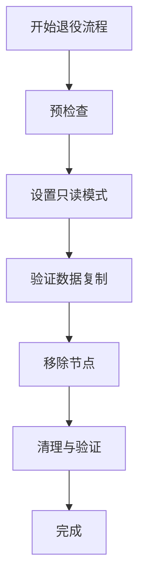
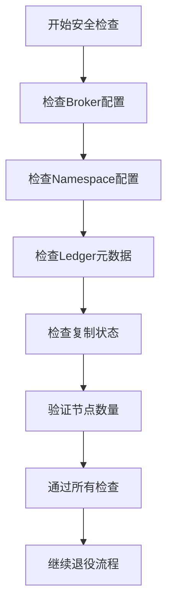
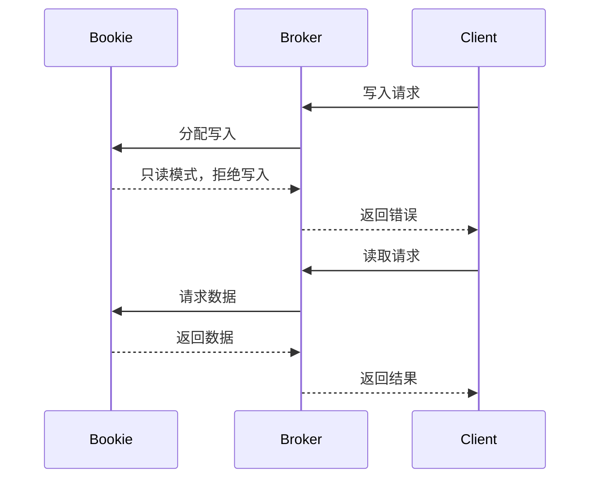
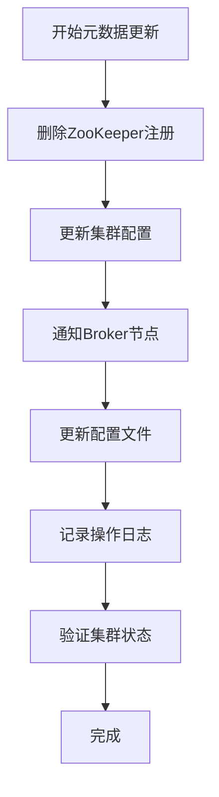
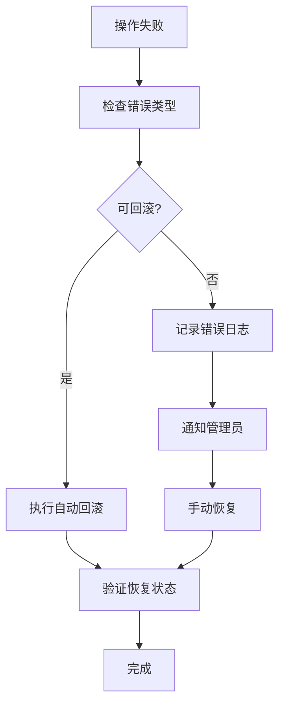

# Bookie 退役

<cite>
**本文档引用的文件**
- [decommission_bookie.go](file://dbm-services/bigdata/db-tools/dbactuator/internal/subcmd/pulsarcmd/decommission_bookie.go)
- [pulsar.go](file://dbm-services/bigdata/db-tools/dbactuator/pkg/components/pulsar/pulsar.go)
- [pulsar_operate.go](file://dbm-services/bigdata/db-tools/dbactuator/pkg/util/pulsarutil/pulsar_operate.go)
- [pulsar_helper.go](file://dbm-services/bigdata/db-tools/dbactuator/pkg/util/pulsarutil/pulsar_helper.go)
- [pulsarutil.go](file://dbm-services/bigdata/db-tools/dbactuator/pkg/util/pulsarutil/pulsarutil.go)
- [cst/pulsar.go](file://dbm-services/bigdata/db-tools/dbactuator/pkg/core/cst/pulsar.go)
</cite>

## 目录
1. [引言](#引言)
2. [Bookie 退役流程概述](#bookie-退役流程概述)
3. [核心组件分析](#核心组件分析)
4. [退役流程详细步骤](#退役流程详细步骤)
5. [安全检查机制](#安全检查机制)
6. [数据迁移与复制验证](#数据迁移与复制验证)
7. [集群元数据更新](#集群元数据更新)
8. [故障恢复与回滚](#故障恢复与回滚)
9. [操作注意事项](#操作注意事项)
10. [结论](#结论)

## 引言

Bookie 退役是 Apache Pulsar 集群管理中的关键操作，用于安全地将一个 Bookie 节点从集群中移除。本文档深入分析 `decommission_bookie.go` 文件的实现，详细描述其内部机制，包括如何检查 ledger 数据的复制状态、确保所有数据都已安全迁移到其他节点，以及最终从集群元数据中删除该节点。通过本文档，读者将全面了解 Pulsar 集群中 Bookie 节点的安全退役流程。

**本文档引用的文件**
- [decommission_bookie.go](file://dbm-services/bigdata/db-tools/dbactuator/internal/subcmd/pulsarcmd/decommission_bookie.go)
- [pulsar.go](file://dbm-services/bigdata/db-tools/dbactuator/pkg/components/pulsar/pulsar.go)

## Bookie 退役流程概述

Bookie 退役流程是一个多阶段的安全操作，旨在确保在移除节点时不会丢失任何数据。该流程主要包括以下几个关键阶段：

1. **预检查阶段**：验证集群状态和配置，确保满足退役条件
2. **只读模式设置**：将目标 Bookie 节点设置为只读状态，防止新数据写入
3. **数据复制验证**：检查所有 ledger 数据的复制状态，确保数据已安全迁移到其他节点
4. **节点移除**：从集群元数据中删除该 Bookie 节点
5. **清理与验证**：完成退役后的清理工作并验证操作结果

整个流程通过 `DecommissionBookieAct` 结构体实现，该结构体继承自 `BaseOptions` 并包含 `CheckPulsarShrinkComp` 服务组件，负责执行具体的退役操作。



**本文档引用的文件**
- [decommission_bookie.go](file://dbm-services/bigdata/db-tools/dbactuator/internal/subcmd/pulsarcmd/decommission_bookie.go)
- [pulsar.go](file://dbm-services/bigdata/db-tools/dbactuator/pkg/components/pulsar/pulsar.go)

## 核心组件分析

### DecommissionBookieAct 结构体

`DecommissionBookieAct` 是 Bookie 退役操作的核心结构体，它定义了退役过程所需的所有组件和方法。该结构体包含两个主要字段：

- `BaseOptions`：继承自基础选项，提供通用的命令行参数和配置
- `Service`：类型为 `CheckPulsarShrinkComp`，负责执行具体的退役逻辑

该结构体实现了 Cobra 命令行框架所需的接口，包括 `Validate`、`Init`、`Rollback` 和 `Run` 方法。

### CheckPulsarShrinkComp 接口

`CheckPulsarShrinkComp` 接口定义了 Bookie 缩容所需的所有操作，包括：

- `PreCheck`：执行预检查，验证集群状态
- `DecommissionBookie`：执行实际的退役操作
- `Init`：初始化组件状态

这些方法共同确保了退役操作的安全性和可靠性。

**本文档引用的文件**
- [decommission_bookie.go](file://dbm-services/bigdata/db-tools/dbactuator/internal/subcmd/pulsarcmd/decommission_bookie.go)
- [pulsar.go](file://dbm-services/bigdata/db-tools/dbactuator/pkg/components/pulsar/pulsar.go)

## 退役流程详细步骤

### 初始化阶段

退役流程的初始化阶段主要完成以下工作：

1. 反序列化输入参数
2. 初始化服务组件
3. 设置通用运行时参数

在 `Init` 方法中，系统首先记录初始化日志，然后通过 `Deserialize` 方法反序列化传入的参数，最后调用服务组件的 `Init` 方法完成初始化。

### 执行阶段

执行阶段是退役流程的核心，通过 `Run` 方法实现。该方法定义了一个步骤列表，每个步骤包含一个名称和对应的函数。目前主要包含一个步骤：

- "pulsar 缩容bookie"：调用 `DecommissionBookie` 方法执行实际的退役操作

如果执行过程中发生错误，系统会尝试输出回滚上下文，以便进行故障恢复。

```mermaid
sequenceDiagram
participant 用户
participant DecommissionBookieAct
participant CheckPulsarShrinkComp
用户->>DecommissionBookieAct : 启动退役命令
DecommissionBookieAct->>DecommissionBookieAct : Validate()
DecommissionBookieAct->>DecommissionBookieAct : Init()
DecommissionBookieAct->>CheckPulsarShrinkComp : DecommissionBookie()
CheckPulsarShrinkComp-->>DecommissionBookieAct : 返回结果
DecommissionBookieAct-->>用户 : 显示结果
```

**本文档引用的文件**
- [decommission_bookie.go](file://dbm-services/bigdata/db-tools/dbactuator/internal/subcmd/pulsarcmd/decommission_bookie.go)
- [pulsar.go](file://dbm-services/bigdata/db-tools/dbactuator/pkg/components/pulsar/pulsar.go)

## 安全检查机制

### 配置预检查

在退役操作开始前，系统会进行一系列安全检查，确保操作的安全性。这些检查包括：

1. **Broker 配置检查**：通过 `CheckBrokerConf` 方法验证 Broker 的配置参数
2. **Namespace 配置检查**：检查所有 Namespace 的 Ensemble Size 配置
3. **Ledger 元数据检查**：验证所有打开状态 Ledger 的元数据

### 复制状态检查

系统会检查集群中是否存在复制中的 Ledger，确保所有数据都已正确复制。通过执行 `listunderreplicated` 命令，系统可以检测到任何未完全复制的数据。

### 节点数量验证

在退役操作中，系统会验证剩余 Bookie 节点的数量是否满足以下条件：
- 剩余节点数 ≥ Ensemble Size
- Ensemble Size ≥ Write Quorum
- Write Quorum ≥ Ack Quorum

这些条件确保了集群在移除节点后仍能保持数据的高可用性和一致性。



**本文档引用的文件**
- [pulsar_helper.go](file://dbm-services/bigdata/db-tools/dbactuator/pkg/util/pulsarutil/pulsar_helper.go)
- [pulsar_operate.go](file://dbm-services/bigdata/db-tools/dbactuator/pkg/util/pulsarutil/pulsar_operate.go)

## 数据迁移与复制验证

### Ledger 数据检查

系统通过 `CheckLedgerMetadata` 方法检查所有打开状态 Ledger 的元数据，确保：

1. Ensemble Size 不超过剩余 Bookie 节点数量
2. Write Quorum 不超过剩余 Bookie 节点数量
3. Write Quorum 大于 1，防止数据丢失

### 数据复制验证

通过执行 BookKeeper Shell 命令，系统可以验证数据的复制状态：

1. `listledgers -m`：列出所有 Ledger 及其元数据
2. `listunderreplicated`：列出所有未完全复制的 Ledger

这些命令帮助系统确认所有数据都已安全迁移到其他节点。

### 只读模式设置

在数据迁移过程中，系统会将目标 Bookie 节点设置为只读模式，通过修改 `bookkeeper.conf` 配置文件实现：

1. 设置 `readOnlyModeEnabled=true`
2. 设置 `forceReadOnlyBookie=true`

这确保了该节点不再接受新的写入请求，只允许读取操作。



**本文档引用的文件**
- [pulsar_helper.go](file://dbm-services/bigdata/db-tools/dbactuator/pkg/util/pulsarutil/pulsar_helper.go)
- [pulsar_operate.go](file://dbm-services/bigdata/db-tools/dbactuator/pkg/util/pulsarutil/pulsar_operate.go)

## 集群元数据更新

### 节点移除操作

当所有安全检查通过且数据迁移完成后，系统会执行节点移除操作。这包括：

1. 从 ZooKeeper 中删除 Bookie 节点的注册信息
2. 更新集群的配置元数据
3. 通知所有 Broker 节点更新其 Bookie 列表

### 配置文件更新

系统会更新相关的配置文件，确保退役操作的持久性：

1. 更新 `bookkeeper.conf` 配置
2. 更新集群的全局配置
3. 记录操作日志和审计信息

### 状态验证

在元数据更新后，系统会进行状态验证，确保：

1. 节点已从集群中正确移除
2. 集群服务正常运行
3. 数据访问不受影响



**本文档引用的文件**
- [pulsar.go](file://dbm-services/bigdata/db-tools/dbactuator/pkg/components/pulsar/pulsar.go)
- [cst/pulsar.go](file://dbm-services/bigdata/db-tools/dbactuator/pkg/core/cst/pulsar.go)

## 故障恢复与回滚

### 回滚机制

系统实现了完善的回滚机制，确保在退役操作失败时能够恢复到原始状态：

1. 通过 `Rollback` 方法实现回滚逻辑
2. 使用 `RollBackContext` 记录操作上下文
3. 在失败时自动触发回滚流程

### 错误处理

系统采用统一的错误处理策略：

1. 使用 `util.CheckErr` 方法检查和处理错误
2. 记录详细的错误日志
3. 提供清晰的错误信息给用户

### 恢复流程

当需要手动恢复时，可以执行以下步骤：

1. 检查回滚上下文
2. 手动恢复配置文件
3. 重启相关服务
4. 验证集群状态



**本文档引用的文件**
- [decommission_bookie.go](file://dbm-services/bigdata/db-tools/dbactuator/internal/subcmd/pulsarcmd/decommission_bookie.go)
- [pulsar.go](file://dbm-services/bigdata/db-tools/dbactuator/pkg/components/pulsar/pulsar.go)

## 操作注意事项

### 前置条件

在执行 Bookie 退役操作前，必须确保：

1. 集群处于健康状态
2. 有足够的剩余 Bookie 节点
3. 所有数据都已正确复制
4. 系统有足够的维护窗口

### 最佳实践

1. **分阶段操作**：建议分阶段退役多个节点，避免同时移除多个节点
2. **监控指标**：密切监控集群的性能指标和错误率
3. **备份数据**：在操作前备份重要数据
4. **测试环境**：先在测试环境验证操作流程

### 常见问题

1. **复制延迟**：如果发现复制延迟，应暂停退役操作
2. **网络问题**：确保网络连接稳定
3. **磁盘空间**：检查剩余节点的磁盘空间是否充足
4. **权限问题**：确保操作账户有足够的权限

### 性能影响

退役操作可能会对集群性能产生以下影响：

1. 增加剩余节点的负载
2. 暂时增加网络流量
3. 可能导致短暂的性能下降

建议在业务低峰期执行退役操作。

**本文档引用的文件**
- [decommission_bookie.go](file://dbm-services/bigdata/db-tools/dbactuator/internal/subcmd/pulsarcmd/decommission_bookie.go)
- [pulsar_helper.go](file://dbm-services/bigdata/db-tools/dbactuator/pkg/util/pulsarutil/pulsar_helper.go)

## 结论

Bookie 退役是一个复杂但至关重要的操作，需要谨慎执行。通过深入分析 `decommission_bookie.go` 文件的实现，我们了解了 Pulsar 集群中 Bookie 节点安全退役的完整流程。该流程通过多层次的安全检查、数据迁移验证和元数据更新，确保了在移除节点时不会丢失任何数据。

关键要点包括：

1. **安全第一**：通过严格的预检查确保操作的安全性
2. **数据完整性**：确保所有数据都已正确复制到其他节点
3. **自动化**：通过 Cobra 命令行框架实现操作的自动化
4. **可恢复性**：提供完善的回滚机制，确保操作的可逆性

建议在执行 Bookie 退役操作时，遵循本文档描述的最佳实践，确保集群的稳定性和数据的安全性。

**本文档引用的文件**
- [decommission_bookie.go](file://dbm-services/bigdata/db-tools/dbactuator/internal/subcmd/pulsarcmd/decommission_bookie.go)
- [pulsar.go](file://dbm-services/bigdata/db-tools/dbactuator/pkg/components/pulsar/pulsar.go)
- [pulsar_helper.go](file://dbm-services/bigdata/db-tools/dbactuator/pkg/util/pulsarutil/pulsar_helper.go)