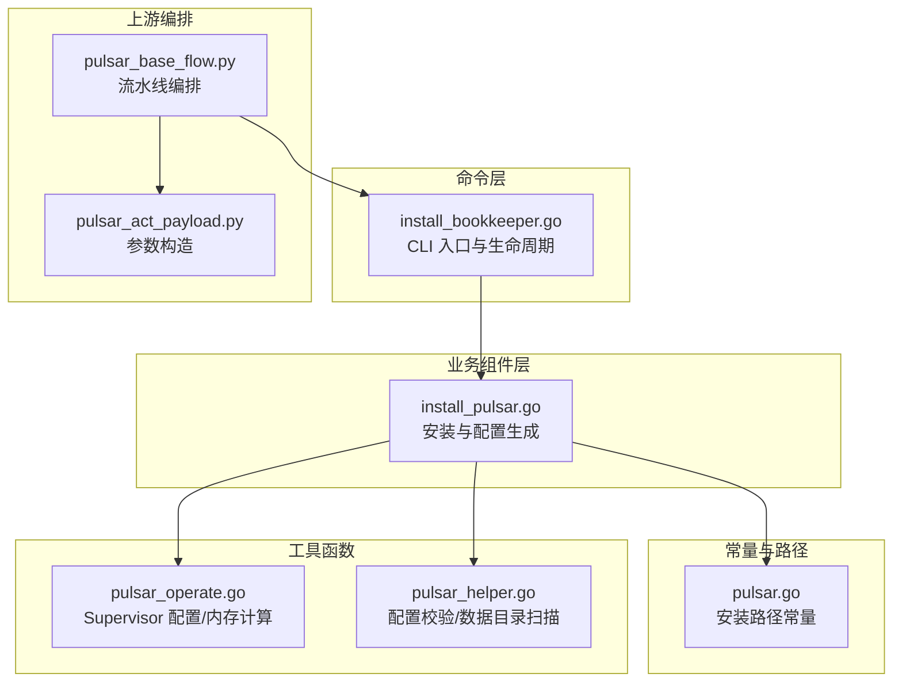
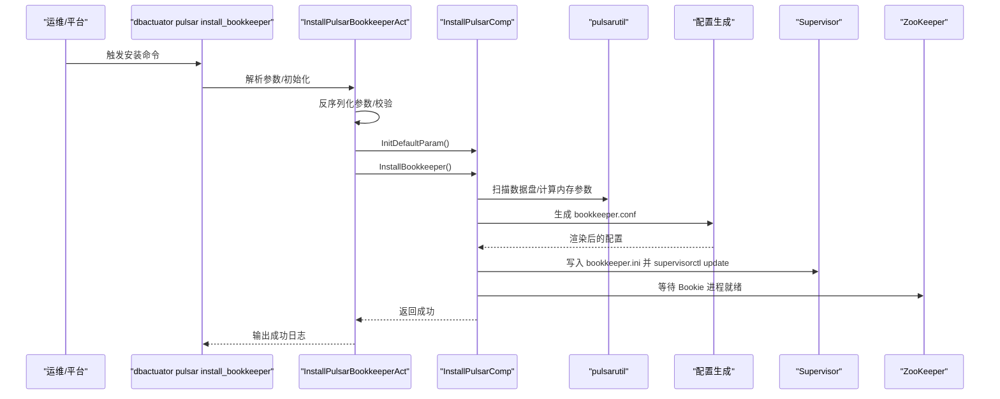
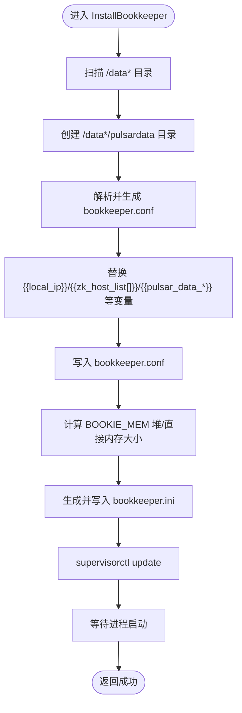
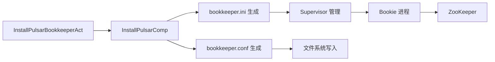

# Bookie 部署

<cite>
**本文引用的文件**
- [install_bookkeeper.go](file://dbm-services/bigdata/db-tools/dbactuator/internal/subcmd/pulsarcmd/install_bookkeeper.go)
- [install_pulsar.go](file://dbm-services/bigdata/db-tools/dbactuator/pkg/components/pulsar/install_pulsar.go)
- [pulsar.go](file://dbm-services/bigdata/db-tools/dbactuator/pkg/core/cst/pulsar.go)
- [pulsar_helper.go](file://dbm-services/bigdata/db-tools/dbactuator/pkg/util/pulsarutil/pulsar_helper.go)
- [pulsar_operate.go](file://dbm-services/bigdata/db-tools/dbactuator/pkg/util/pulsarutil/pulsar_operate.go)
- [pulsar_base_flow.py](file://dbm-ui/backend/flow/engine/bamboo/scene/pulsar/pulsar_base_flow.py)
- [pulsar_act_payload.py](file://dbm-ui/backend/flow/utils/pulsar/pulsar_act_payload.py)
</cite>

## 目录
1. [简介](#简介)
2. [项目结构](#项目结构)
3. [核心组件](#核心组件)
4. [架构总览](#架构总览)
5. [详细组件分析](#详细组件分析)
6. [依赖关系分析](#依赖关系分析)
7. [性能与容量规划](#性能与容量规划)
8. [故障排查指南](#故障排查指南)
9. [结论](#结论)
10. [附录：从零部署 Bookie 的完整步骤](#附录从零部署-bookie-的完整步骤)

## 简介
本文件面向需要在生产环境中部署 Bookie（Apache BookKeeper）节点的工程师，围绕 dbm-services 中的 dbactuator 工具链，系统性梳理从命令入口到实际安装执行的全流程，重点解析 install_bookkeeper.go 的职责与调用链路，说明其如何通过配置注入、模板渲染、Supervisor 管理与 ZooKeeper 协同，完成 Bookie 的安装与启动。同时给出从零开始部署的可操作步骤与排障建议，帮助读者快速、安全地完成 Bookie 节点上线。

## 项目结构
与 Bookie 部署直接相关的模块分布如下：
- 命令层：internal/subcmd/pulsarcmd 下的 install_bookkeeper.go 提供 CLI 入口与生命周期控制（校验、初始化、执行、回滚）
- 业务组件层：pkg/components/pulsar/install_pulsar.go 实现具体的安装逻辑（目录准备、配置生成、Supervisor 配置、启动）
- 常量与路径：pkg/core/cst/pulsar.go 定义安装目录、配置文件路径等常量
- 工具函数：pkg/util/pulsarutil 下的 pulsar_helper.go 和 pulsar_operate.go 提供配置校验、内存计算、Supervisor 配置生成等辅助能力
- 上游编排：dbm-ui 中的 pulsar_base_flow.py 与 pulsar_act_payload.py 定义了调用 dbactuator 的编排动作与参数构造

图表来源
- [install_bookkeeper.go](file://dbm-services/bigdata/db-tools/dbactuator/internal/subcmd/pulsarcmd/install_bookkeeper.go#L1-L105)
- [install_pulsar.go](file://dbm-services/bigdata/db-tools/dbactuator/pkg/components/pulsar/install_pulsar.go#L296-L389)
- [pulsar.go](file://dbm-services/bigdata/db-tools/dbactuator/pkg/core/cst/pulsar.go#L1-L40)
- [pulsar_operate.go](file://dbm-services/bigdata/db-tools/dbactuator/pkg/util/pulsarutil/pulsar_operate.go#L1-L128)
- [pulsar_helper.go](file://dbm-services/bigdata/db-tools/dbactuator/pkg/util/pulsarutil/pulsar_helper.go#L146-L161)
- [pulsar_base_flow.py](file://dbm-ui/backend/flow/engine/bamboo/scene/pulsar/pulsar_base_flow.py#L253-L280)
- [pulsar_act_payload.py](file://dbm-ui/backend/flow/utils/pulsar/pulsar_act_payload.py#L137-L166)

章节来源
- [install_bookkeeper.go](file://dbm-services/bigdata/db-tools/dbactuator/internal/subcmd/pulsarcmd/install_bookkeeper.go#L1-L105)
- [install_pulsar.go](file://dbm-services/bigdata/db-tools/dbactuator/pkg/components/pulsar/install_pulsar.go#L296-L389)
- [pulsar.go](file://dbm-services/bigdata/db-tools/dbactuator/pkg/core/cst/pulsar.go#L1-L40)
- [pulsar_operate.go](file://dbm-services/bigdata/db-tools/dbactuator/pkg/util/pulsarutil/pulsar_operate.go#L1-L128)
- [pulsar_helper.go](file://dbm-services/bigdata/db-tools/dbactuator/pkg/util/pulsarutil/pulsar_helper.go#L146-L161)
- [pulsar_base_flow.py](file://dbm-ui/backend/flow/engine/bamboo/scene/pulsar/pulsar_base_flow.py#L253-L280)
- [pulsar_act_payload.py](file://dbm-ui/backend/flow/utils/pulsar/pulsar_act_payload.py#L137-L166)

## 核心组件
- 命令入口 InstallPulsarBookkeeperAct
  - 负责命令行参数校验、反序列化、初始化运行时参数、执行安装步骤、错误时输出回滚上下文
- 业务组件 InstallPulsarComp
  - 负责安装目录初始化、配置生成、Supervisor 配置写入、进程管理、等待与健康检查
- 常量与路径
  - 定义安装根目录、各组件配置文件路径、Supervisor 配置目录等
- 工具函数
  - 计算堆与直接内存大小、生成 Supervisor 配置片段、扫描数据盘路径、配置一致性校验

章节来源
- [install_bookkeeper.go](file://dbm-services/bigdata/db-tools/dbactuator/internal/subcmd/pulsarcmd/install_bookkeeper.go#L16-L104)
- [install_pulsar.go](file://dbm-services/bigdata/db-tools/dbactuator/pkg/components/pulsar/install_pulsar.go#L22-L53)
- [pulsar.go](file://dbm-services/bigdata/db-tools/dbactuator/pkg/core/cst/pulsar.go#L1-L40)
- [pulsar_operate.go](file://dbm-services/bigdata/db-tools/dbactuator/pkg/util/pulsarutil/pulsar_operate.go#L25-L45)

## 架构总览
下图展示了从 dbactuator CLI 到 Bookie 安装的端到端调用链与关键数据流。

图表来源
- [install_bookkeeper.go](file://dbm-services/bigdata/db-tools/dbactuator/internal/subcmd/pulsarcmd/install_bookkeeper.go#L22-L104)
- [install_pulsar.go](file://dbm-services/bigdata/db-tools/dbactuator/pkg/components/pulsar/install_pulsar.go#L296-L389)
- [pulsar_operate.go](file://dbm-services/bigdata/db-tools/dbactuator/pkg/util/pulsarutil/pulsar_operate.go#L47-L90)
- [pulsar_helper.go](file://dbm-services/bigdata/db-tools/dbactuator/pkg/util/pulsarutil/pulsar_helper.go#L146-L161)

## 详细组件分析

### 命令入口：InstallPulsarBookkeeperAct
- 职责
  - 命令注册与示例展示
  - 参数校验、反序列化、初始化运行时参数
  - 步骤编排：调用 InstallBookkeeper
  - 错误处理：输出回滚上下文
- 关键行为
  - 使用 Cobra 注册 install_bookkeeper 子命令
  - 在 Run 中按顺序执行步骤，若失败则输出 JSON 形式的回滚上下文

章节来源
- [install_bookkeeper.go](file://dbm-services/bigdata/db-tools/dbactuator/internal/subcmd/pulsarcmd/install_bookkeeper.go#L22-L104)

### 业务组件：InstallPulsarComp.InstallBookkeeper
- 职责
  - 准备数据目录（/data*/pulsardata）
  - 生成并写入 bookkeeper.conf（基于传入的 BkConfigs）
  - 替换配置中的占位符（本地 IP、ZooKeeper 列表、多数据目录等）
  - 生成并写入 bookkeeper.ini，通过 supervisorctl update 生效
  - 等待进程启动
- 关键实现要点
  - 数据目录扫描：遍历根目录以识别 /data* 目录，统一创建 pulsardata、journal、ledgers 子目录
  - 配置渲染：将传入的 JSON 配置转换为 key=value 文本，再进行字符串替换
  - 内存参数：根据系统内存动态计算 BOOKIE_MEM 的堆与直接内存大小
  - Supervisor：生成 program:bookkeeper 条目并更新

图表来源
- [install_pulsar.go](file://dbm-services/bigdata/db-tools/dbactuator/pkg/components/pulsar/install_pulsar.go#L296-L389)
- [pulsar_operate.go](file://dbm-services/bigdata/db-tools/dbactuator/pkg/util/pulsarutil/pulsar_operate.go#L25-L45)
- [pulsar_operate.go](file://dbm-services/bigdata/db-tools/dbactuator/pkg/util/pulsarutil/pulsar_operate.go#L74-L90)

章节来源
- [install_pulsar.go](file://dbm-services/bigdata/db-tools/dbactuator/pkg/components/pulsar/install_pulsar.go#L296-L389)
- [pulsar_operate.go](file://dbm-services/bigdata/db-tools/dbactuator/pkg/util/pulsarutil/pulsar_operate.go#L25-L45)
- [pulsar_operate.go](file://dbm-services/bigdata/db-tools/dbactuator/pkg/util/pulsarutil/pulsar_operate.go#L74-L90)

### 配置参数与渲染
- 传入参数（InstallPulsarParams）
  - 必填：pulsar_version、host
  - 与 Bookie 相关：bk_configs（JSON 字符串，作为模板输入）、zk_host、cluster_name、domain 等
- 渲染规则
  - 本地 IP：{{local_ip}}
  - ZooKeeper 列表：{{zk_host_list[0..N]}}
  - 多数据目录：{{pulsar_data_dir}}、{{pulsar_data_journal_dir}}、{{pulsar_data_ledgers_dir}}
- 生成与写入
  - 将 JSON 配置转为文本后逐项替换，最终写入到默认路径

章节来源
- [install_pulsar.go](file://dbm-services/bigdata/db-tools/dbactuator/pkg/components/pulsar/install_pulsar.go#L30-L53)
- [install_pulsar.go](file://dbm-services/bigdata/db-tools/dbactuator/pkg/components/pulsar/install_pulsar.go#L317-L347)
- [pulsar.go](file://dbm-services/bigdata/db-tools/dbactuator/pkg/core/cst/pulsar.go#L22-L33)

### 与 ZooKeeper 的交互
- Bookie 启动前无需显式初始化 ZK；但配置中需包含 ZK 地址列表
- 安装完成后，Bookie 会连接 ZK 完成元数据注册与心跳
- 若 ZK 未就绪，Bookie 启动会失败；可通过 supervisor 日志定位

章节来源
- [install_pulsar.go](file://dbm-services/bigdata/db-tools/dbactuator/pkg/components/pulsar/install_pulsar.go#L304-L329)
- [pulsar_base_flow.py](file://dbm-ui/backend/flow/engine/bamboo/scene/pulsar/pulsar_base_flow.py#L253-L280)

### 与 Broker 的协作
- Broker 侧会使用相同的 ZK 地址列表与集群信息
- Broker 配置中包含 token、集群名、分区与副本参数等，这些参数由上层编排传入

章节来源
- [install_pulsar.go](file://dbm-services/bigdata/db-tools/dbactuator/pkg/components/pulsar/install_pulsar.go#L396-L469)
- [pulsar_act_payload.py](file://dbm-ui/backend/flow/utils/pulsar/pulsar_act_payload.py#L137-L166)

## 依赖关系分析
- 组件耦合
  - InstallPulsarBookkeeperAct 仅负责命令生命周期，不直接操作配置，降低耦合度
  - InstallPulsarComp 将“配置生成”“Supervisor 管理”“进程等待”封装为原子步骤，便于扩展
- 外部依赖
  - Supervisor：通过 supervisorctl update 生效配置
  - Shell 命令：mkdir、sed、ln、sleep 等
  - 文件系统：/data* 目录、/etc/profile、/etc/hosts 等
- 潜在风险
  - 配置渲染失败或变量替换不全会导致进程无法启动
  - Supervisor 配置缺失或权限不足会导致进程无法拉起

图表来源
- [install_bookkeeper.go](file://dbm-services/bigdata/db-tools/dbactuator/internal/subcmd/pulsarcmd/install_bookkeeper.go#L76-L104)
- [install_pulsar.go](file://dbm-services/bigdata/db-tools/dbactuator/pkg/components/pulsar/install_pulsar.go#L296-L389)
- [pulsar_operate.go](file://dbm-services/bigdata/db-tools/dbactuator/pkg/util/pulsarutil/pulsar_operate.go#L74-L90)

## 性能与容量规划
- 数据目录
  - 自动扫描 /data* 目录，分别在每个挂载点创建 pulsardata、journal、ledgers 子目录，建议将热数据与冷数据分盘
- 内存参数
  - BOOKIE_MEM 的堆与直接内存按系统内存动态分配，避免手动指定导致资源浪费或 OOM
- 进程管理
  - 使用 Supervisor 管理进程，具备自动重启与日志轮转能力

章节来源
- [install_pulsar.go](file://dbm-services/bigdata/db-tools/dbactuator/pkg/components/pulsar/install_pulsar.go#L308-L347)
- [pulsar_operate.go](file://dbm-services/bigdata/db-tools/dbactuator/pkg/util/pulsarutil/pulsar_operate.go#L25-L45)

## 故障排查指南
- 常见问题与定位
  - 配置渲染失败：检查传入的 bk_configs 是否为合法 JSON，确认占位符是否齐全
  - Supervisor 未生效：确认 /data/pulsarenv/supervisor/conf 下存在 ini 文件并执行 supervisorctl update
  - 进程未启动：查看 /data/pulsarenv/bookkeeper/bookkeeper_startup.log
  - ZK 连接失败：确认 zk_host_list 与 ZK 状态
- 建议排查步骤
  - 确认 /data* 目录存在且可写
  - 检查 bookkeeper.conf 是否包含正确的 {{local_ip}} 与 {{zk_host_list[]}} 值
  - 查看 supervisor 日志与进程 PID
  - 如需回滚，使用命令输出的回滚上下文进行恢复

章节来源
- [install_pulsar.go](file://dbm-services/bigdata/db-tools/dbactuator/pkg/components/pulsar/install_pulsar.go#L317-L353)
- [install_bookkeeper.go](file://dbm-services/bigdata/db-tools/dbactuator/internal/subcmd/pulsarcmd/install_bookkeeper.go#L92-L100)

## 结论
install_bookkeeper.go 通过清晰的命令生命周期与 InstallPulsarComp 的安装逻辑，实现了对 Bookie 的自动化部署。其关键优势在于：
- 参数驱动的配置渲染，减少手工维护成本
- 自动化的目录与内存参数管理
- 与 Supervisor 的无缝集成，保障进程稳定性
- 与 ZooKeeper 的协同，确保元数据正确注册

在实际部署中，建议结合容量规划与监控策略，配合回滚机制，确保变更可控、可追溯。

## 附录：从零部署 Bookie 的完整步骤
以下步骤基于 dbactuator 的命令与组件实现，适用于首次部署 Bookie 节点。

- 准备阶段
  - 确保目标主机已安装并启用 Supervisor，具备写入 /data* 与 /data/pulsarenv 的权限
  - 准备 Pulsar 安装包（版本号与路径由上层编排传入）
  - 准备 Bookie 配置模板（bk_configs），包含必要的存储、网络与副本参数
  - 准备 ZooKeeper 地址列表（zk_host），确保可达
- 执行安装
  - 在目标主机执行安装命令（示例命令由 CLI 提供）
  - 命令会自动：
    - 反序列化参数并初始化运行时参数
    - 扫描 /data* 目录并创建 pulsardata/journal/ledgers
    - 生成并写入 bookkeeper.conf
    - 生成并写入 bookkeeper.ini，通过 supervisorctl update 生效
    - 等待进程启动
- 验证与收尾
  - 检查 Bookie 进程状态与日志
  - 确认 Bookie 已在 ZooKeeper 中注册
  - 如需回滚，使用命令输出的回滚上下文进行恢复

章节来源
- [install_bookkeeper.go](file://dbm-services/bigdata/db-tools/dbactuator/internal/subcmd/pulsarcmd/install_bookkeeper.go#L22-L104)
- [install_pulsar.go](file://dbm-services/bigdata/db-tools/dbactuator/pkg/components/pulsar/install_pulsar.go#L296-L389)
- [pulsar_operate.go](file://dbm-services/bigdata/db-tools/dbactuator/pkg/util/pulsarutil/pulsar_operate.go#L74-L90)
- [pulsar_base_flow.py](file://dbm-ui/backend/flow/engine/bamboo/scene/pulsar/pulsar_base_flow.py#L253-L280)
- [pulsar_act_payload.py](file://dbm-ui/backend/flow/utils/pulsar/pulsar_act_payload.py#L137-L166)