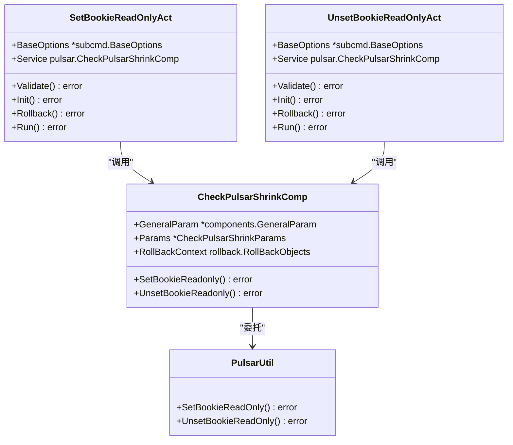
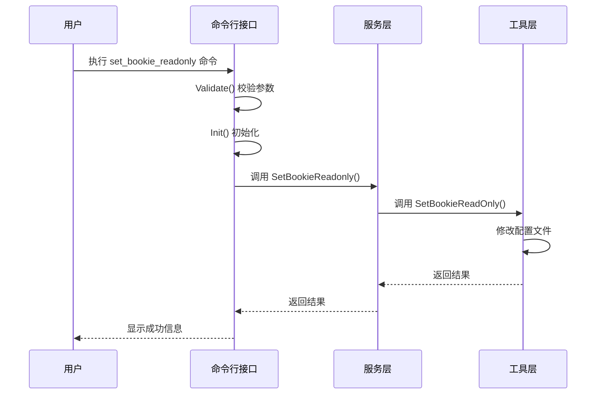
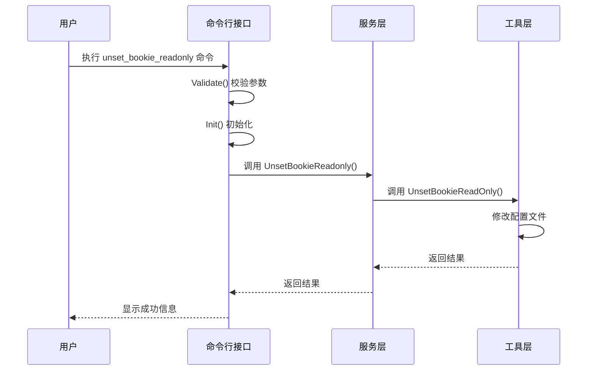
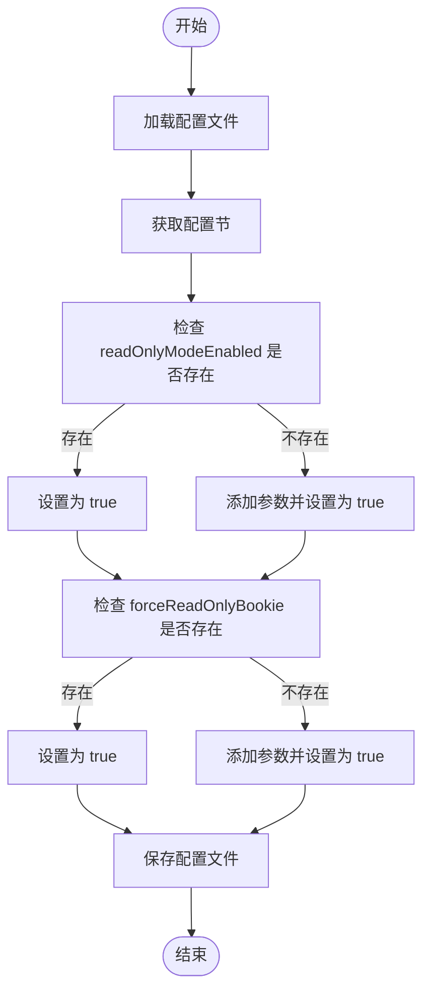
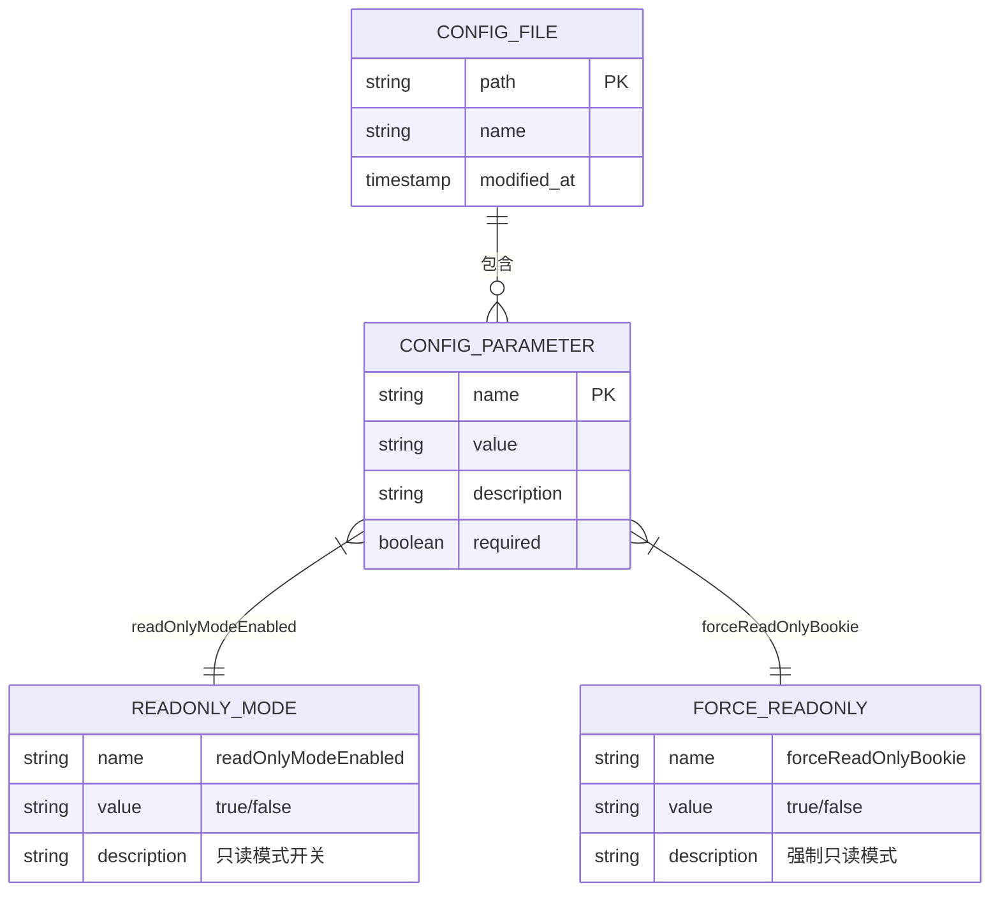
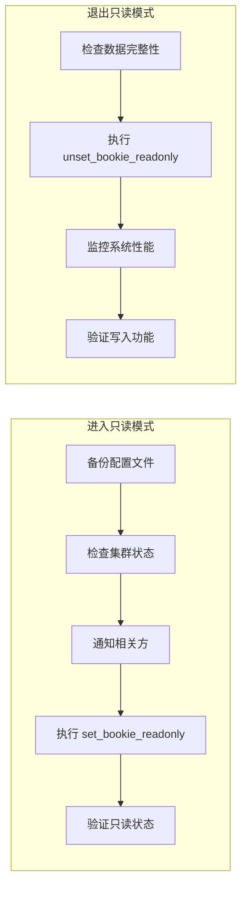

# 只读模式管理

<cite>
**本文档引用的文件**   
- [set_bookie_readonly.go](file://dbm-services/bigdata/db-tools/dbactuator/internal/subcmd/pulsarcmd/set_bookie_readonly.go)
- [unset_bookie_readonly.go](file://dbm-services/bigdata/db-tools/dbactuator/internal/subcmd/pulsarcmd/unset_bookie_readonly.go)
- [pulsar_operate.go](file://dbm-services/bigdata/db-tools/dbactuator/pkg/util/pulsarutil/pulsar_operate.go)
- [check_shrink.go](file://dbm-services/bigdata/db-tools/dbactuator/pkg/components/pulsar/check_shrink.go)
</cite>

## 目录
1. [简介](#简介)
2. [核心组件分析](#核心组件分析)
3. [只读模式工作原理](#只读模式工作原理)
4. [配置文件修改机制](#配置文件修改机制)
5. [操作流程与最佳实践](#操作流程与最佳实践)
6. [维护与升级场景应用](#维护与升级场景应用)
7. [安全进入和退出只读模式](#安全进入和退出只读模式)

## 简介
本文档详细说明了 Pulsar Bookie 节点只读模式的管理机制，重点分析 `set_bookie_readonly.go` 和 `unset_bookie_readonly.go` 两个文件的工作原理。文档阐述了如何通过修改 Bookie 的配置文件来实现节点的只读状态切换，并解释了该功能在系统维护、升级和数据迁移等关键场景下的重要性。

**Section sources**
- [set_bookie_readonly.go](file://dbm-services/bigdata/db-tools/dbactuator/internal/subcmd/pulsarcmd/set_bookie_readonly.go#L1-L97)
- [unset_bookie_readonly.go](file://dbm-services/bigdata/db-tools/dbactuator/internal/subcmd/pulsarcmd/unset_bookie_readonly.go#L1-L97)

## 核心组件分析

### 命令行接口实现
`set_bookie_readonly.go` 和 `unset_bookie_readonly.go` 文件实现了 Pulsar Bookie 只读模式的命令行接口。这两个文件定义了 `SetBookieReadOnlyAct` 和 `UnsetBookieReadOnlyAct` 结构体，分别用于设置和取消 Bookie 的只读状态。

`SetBookieReadOnlyCommand` 函数创建了一个 Cobra 命令，该命令的使用方式为 `dbactuator pulsar set_bookie_readonly --payload xxxxx`，用于将 Bookie 节点设置为只读状态。类似地，`UnsetBookieReadOnlyCommand` 函数创建了用于取消只读状态的命令。

**Section sources**
- [set_bookie_readonly.go](file://dbm-services/bigdata/db-tools/dbactuator/internal/subcmd/pulsarcmd/set_bookie_readonly.go#L16-L43)
- [unset_bookie_readonly.go](file://dbm-services/bigdata/db-tools/dbactuator/internal/subcmd/pulsarcmd/unset_bookie_readonly.go#L16-L43)

### 组件服务层实现
`check_shrink.go` 文件中的 `CheckPulsarShrinkComp` 结构体包含了设置和取消 Bookie 只读状态的核心方法。该结构体通过 `SetBookieReadonly` 和 `UnsetBookieReadonly` 方法，调用底层的 `pulsarutil` 包来执行实际的配置修改操作。

**Diagram sources **
- [set_bookie_readonly.go](file://dbm-services/bigdata/db-tools/dbactuator/internal/subcmd/pulsarcmd/set_bookie_readonly.go#L16-L20)
- [unset_bookie_readonly.go](file://dbm-services/bigdata/db-tools/dbactuator/internal/subcmd/pulsarcmd/unset_bookie_readonly.go#L16-L20)
- [check_shrink.go](file://dbm-services/bigdata/db-tools/dbactuator/pkg/components/pulsar/check_shrink.go#L14-L19)

**Section sources**
- [check_shrink.go](file://dbm-services/bigdata/db-tools/dbactuator/pkg/components/pulsar/check_shrink.go#L71-L79)

## 只读模式工作原理

### 状态设置流程
当执行 `set_bookie_readonly` 命令时，系统会按照以下步骤执行：

1. 首先调用 `Validate` 方法进行参数校验
2. 然后执行 `Init` 方法进行初始化，反序列化传入的参数
3. 最后在 `Run` 方法中执行实际的只读状态设置操作

`Run` 方法通过 `steps.Run()` 执行一系列操作步骤，其中核心步骤是调用 `d.Service.SetBookieReadonly` 方法。

**Diagram sources **
- [set_bookie_readonly.go](file://dbm-services/bigdata/db-tools/dbactuator/internal/subcmd/pulsarcmd/set_bookie_readonly.go#L76-L95)
- [check_shrink.go](file://dbm-services/bigdata/db-tools/dbactuator/pkg/components/pulsar/check_shrink.go#L72-L74)

**Section sources**
- [set_bookie_readonly.go](file://dbm-services/bigdata/db-tools/dbactuator/internal/subcmd/pulsarcmd/set_bookie_readonly.go#L76-L95)

### 状态取消流程
取消只读模式的流程与设置流程类似，但执行的是相反的操作。`unset_bookie_readonly` 命令会调用 `UnsetBookieReadonly` 方法，将 Bookie 节点从只读状态恢复为可读写状态。

**Diagram sources **
- [unset_bookie_readonly.go](file://dbm-services/bigdata/db-tools/dbactuator/internal/subcmd/pulsarcmd/unset_bookie_readonly.go#L76-L95)
- [check_shrink.go](file://dbm-services/bigdata/db-tools/dbactuator/pkg/components/pulsar/check_shrink.go#L76-L78)

**Section sources**
- [unset_bookie_readonly.go](file://dbm-services/bigdata/db-tools/dbactuator/internal/subcmd/pulsarcmd/unset_bookie_readonly.go#L76-L95)

## 配置文件修改机制

### 配置文件操作
`pulsar_operate.go` 文件中的 `SetBookieReadOnly` 和 `UnsetBookieReadOnly` 函数负责实际的配置文件修改操作。这些函数使用 `ini` 包来读取、修改和保存 Bookie 的配置文件。

`SetBookieReadOnly` 函数会将配置文件中的 `readOnlyModeEnabled` 和 `forceReadOnlyBookie` 两个参数设置为 `true`，从而将 Bookie 节点设置为只读模式。如果配置文件中不存在这些参数，函数会创建它们。

**Diagram sources **
- [pulsar_operate.go](file://dbm-services/bigdata/db-tools/dbactuator/pkg/util/pulsarutil/pulsar_operate.go#L130-L170)

**Section sources**
- [pulsar_operate.go](file://dbm-services/bigdata/db-tools/dbactuator/pkg/util/pulsarutil/pulsar_operate.go#L130-L170)

### 配置参数说明
只读模式主要通过两个配置参数来控制：

- `readOnlyModeEnabled`: 启用只读模式的主开关
- `forceReadOnlyBookie`: 强制 Bookie 进入只读状态

这两个参数都位于 Bookie 的主配置文件中，路径由 `cst.DefaultPulsarBkConf` 常量定义。

**Diagram sources **
- [pulsar_operate.go](file://dbm-services/bigdata/db-tools/dbactuator/pkg/util/pulsarutil/pulsar_operate.go#L144-L155)
- [pulsar_operate.go](file://dbm-services/bigdata/db-tools/dbactuator/pkg/util/pulsarutil/pulsar_operate.go#L186-L188)

**Section sources**
- [pulsar_operate.go](file://dbm-services/bigdata/db-tools/dbactuator/pkg/util/pulsarutil/pulsar_operate.go#L130-L203)

## 操作流程与最佳实践

### 安全进入只读模式
在将 Bookie 节点设置为只读模式之前，应遵循以下最佳实践：

1. **备份配置文件**：在修改配置文件之前，先备份原始配置文件
2. **检查集群状态**：确保集群整体健康，没有正在进行的关键操作
3. **通知相关方**：提前通知所有可能受影响的团队和用户
4. **选择合适时机**：在业务低峰期执行此操作，以最小化对业务的影响

### 安全退出只读模式
在取消 Bookie 的只读状态时，应注意以下事项：

1. **验证数据完整性**：在恢复写入权限前，检查数据是否完整
2. **逐步恢复**：如果是多节点集群，建议逐个节点恢复写入权限
3. **监控系统性能**：恢复写入后密切监控系统性能和资源使用情况
4. **验证功能**：执行一些写入操作以验证系统功能正常

**Diagram sources **
- [set_bookie_readonly.go](file://dbm-services/bigdata/db-tools/dbactuator/internal/subcmd/pulsarcmd/set_bookie_readonly.go#L76-L95)
- [unset_bookie_readonly.go](file://dbm-services/bigdata/db-tools/dbactuator/internal/subcmd/pulsarcmd/unset_bookie_readonly.go#L76-L95)

**Section sources**
- [set_bookie_readonly.go](file://dbm-services/bigdata/db-tools/dbactuator/internal/subcmd/pulsarcmd/set_bookie_readonly.go#L76-L95)
- [unset_bookie_readonly.go](file://dbm-services/bigdata/db-tools/dbactuator/internal/subcmd/pulsarcmd/unset_bookie_readonly.go#L76-L95)

## 维护与升级场景应用

### 系统维护
在进行系统维护时，将 Bookie 节点设置为只读模式可以防止在维护过程中发生意外的数据写入。这为执行磁盘检查、文件系统维护等操作提供了安全保障。

### 版本升级
在升级 Pulsar 集群版本时，可以先将 Bookie 节点设置为只读模式，完成升级后再恢复写入权限。这种分阶段的升级策略可以降低升级风险，确保数据一致性。

### 数据迁移
在进行数据迁移或集群缩容时，将待迁移或下线的 Bookie 节点设置为只读模式是关键步骤。这可以确保这些节点不再接收新的写入请求，同时允许完成正在进行的读取操作，为安全地迁移数据或下线节点创造条件。

**Diagram sources **
- [set_bookie_readonly.go](file://dbm-services/bigdata/db-tools/dbactuator/internal/subcmd/pulsarcmd/set_bookie_readonly.go#L76-L95)
- [unset_bookie_readonly.go](file://dbm-services/bigdata/db-tools/dbactuator/internal/subcmd/pulsarcmd/unset_bookie_readonly.go#L76-L95)

**Section sources**
- [set_bookie_readonly.go](file://dbm-services/bigdata/db-tools/dbactuator/internal/subcmd/pulsarcmd/set_bookie_readonly.go#L76-L95)
- [unset_bookie_readonly.go](file://dbm-services/bigdata/db-tools/dbactuator/internal/subcmd/pulsarcmd/unset_bookie_readonly.go#L76-L95)

## 安全进入和退出只读模式

### 进入只读模式的安全检查
在执行 `set_bookie_readonly` 命令前，系统会自动进行一系列安全检查：

1. **配置文件可读性检查**：确保能够成功读取 Bookie 的配置文件
2. **配置节完整性检查**：验证配置文件的结构是否完整
3. **文件写入权限检查**：确认有权限修改和保存配置文件

这些检查由 `Validate` 方法和 `Init` 方法共同完成，确保在修改配置前系统处于可操作状态。

### 退出只读模式的安全验证
在执行 `unset_bookie_readonly` 命令后，应进行以下安全验证：

1. **配置文件更新验证**：确认配置文件中的只读参数已正确修改
2. **服务重启验证**：确保 Bookie 服务已正确重启并应用了新配置
3. **功能测试验证**：执行写入操作以验证节点已恢复正常写入功能

这些验证步骤对于确保系统稳定性和数据完整性至关重要。

**Section sources**
- [set_bookie_readonly.go](file://dbm-services/bigdata/db-tools/dbactuator/internal/subcmd/pulsarcmd/set_bookie_readonly.go#L45-L59)
- [unset_bookie_readonly.go](file://dbm-services/bigdata/db-tools/dbactuator/internal/subcmd/pulsarcmd/unset_bookie_readonly.go#L45-L59)