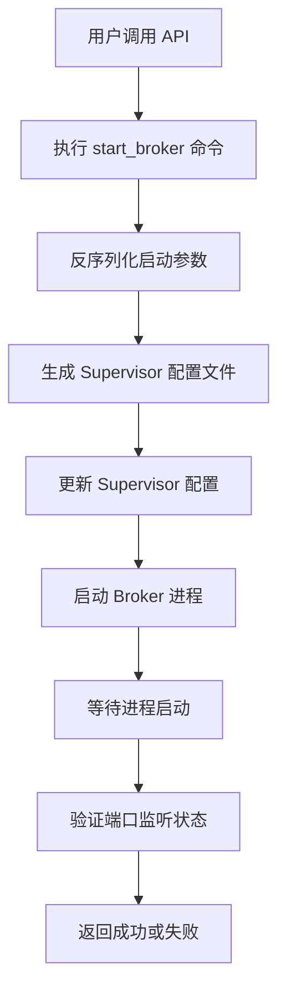
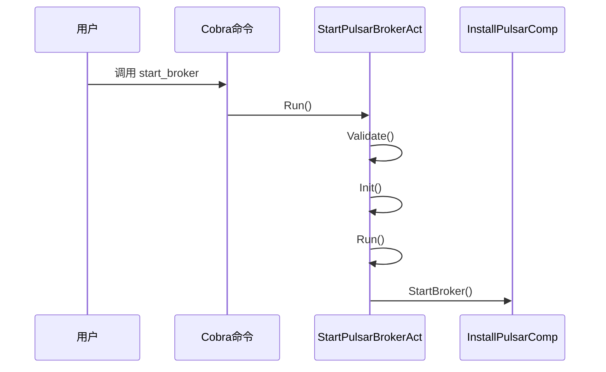

# Broker 启动

<cite>
**本文档中引用的文件**  
- [start_broker.go](file://dbm-services/bigdata/db-tools/dbactuator/internal/subcmd/pulsarcmd/start_broker.go)
- [install_pulsar.go](file://dbm-services/bigdata/db-tools/dbactuator/pkg/components/pulsar/install_pulsar.go)
- [pulsar_operate.go](file://dbm-services/bigdata/db-tools/dbactuator/pkg/util/pulsarutil/pulsar_operate.go)
- [pulsar.go](file://dbm-services/bigdata/db-tools/dbactuator/pkg/core/cst/pulsar.go)
- [install_supervisor.go](file://dbm-services/bigdata/db-tools/dbactuator/internal/subcmd/pulsarcmd/install_supervisor.go)
- [start_process.go](file://dbm-services/bigdata/db-tools/dbactuator/internal/subcmd/pulsarcmd/start_process.go)
- [stop_process.go](file://dbm-services/bigdata/db-tools/dbactuator/internal/subcmd/pulsarcmd/stop_process.go)
</cite>

## 目录
1. [引言](#引言)
2. [Broker 启动流程概览](#broker-启动流程概览)
3. [核心组件分析](#核心组件分析)
4. [启动命令构造与执行](#启动命令构造与执行)
5. [Supervisor 进程管理机制](#supervisor-进程管理机制)
6. [JVM 参数配置逻辑](#jvm-参数配置逻辑)
7. [日志重定向机制](#日志重定向机制)
8. [端口监听验证](#端口监听验证)
9. [启动超时与端口冲突处理](#启动超时与端口冲突处理)
10. [完整启动案例分析](#完整启动案例分析)
11. [结论](#结论)

## 引言

本文档详细阐述了 Pulsar Broker 的启动流程，重点分析了 `start_broker.go` 文件的实现机制。文档深入探讨了如何通过命令行工具构造并执行启动 Pulsar Broker 的 shell 命令，如何利用 Supervisor 进程管理工具来守护 Broker 进程，以及如何验证 Broker 进程是否成功启动并监听指定端口。同时，文档解释了启动脚本中 JVM 参数的配置逻辑，以及日志重定向的实现方式。最后，通过一个实际案例展示了从调用 API 到 Broker 成功加入集群的完整过程，并说明了启动超时或端口冲突等异常情况的处理机制。

## Broker 启动流程概览

Pulsar Broker 的启动是一个多步骤的自动化流程，由 `dbactuator` 工具驱动。整个流程始于一个命令行调用，最终通过 Supervisor 工具将 Broker 进程作为守护进程启动。该流程不仅包括进程的启动，还涵盖了环境初始化、配置文件生成、JVM 参数设置、日志管理以及健康检查等多个环节。

**图示来源**  
- [start_broker.go](file://dbm-services/bigdata/db-tools/dbactuator/internal/subcmd/pulsarcmd/start_broker.go#L77-L104)
- [install_pulsar.go](file://dbm-services/bigdata/db-tools/dbactuator/pkg/components/pulsar/install_pulsar.go#L478-L495)

## 核心组件分析

### StartPulsarBrokerAct 结构体

`StartPulsarBrokerAct` 是启动 Pulsar Broker 的核心动作结构体，它继承了基础选项并持有一个 `InstallPulsarComp` 服务实例。

**组件属性定义**  
- `BaseOptions`: 继承自 `subcmd.BaseOptions`，包含通用的命令行选项。
- `Service`: 类型为 `pulsar.InstallPulsarComp`，是实际执行安装和启动操作的组件。

**Section sources**
- [start_broker.go](file://dbm-services/bigdata/db-tools/dbactuator/internal/subcmd/pulsarcmd/start_broker.go#L17-L20)

### InstallPulsarComp 组件

`InstallPulsarComp` 是 Pulsar 安装和配置的核心组件，负责处理包括 Broker 在内的所有 Pulsar 组件的生命周期管理。

**核心属性**  
- `GeneralParam`: 通用参数对象。
- `Params`: 启动参数，包含集群名、ZooKeeper 地址、端口等关键信息。
- `PulsarConfig`: Pulsar 的配置信息，如安装目录。
- `RollBackContext`: 用于回滚操作的上下文。

**Section sources**
- [install_pulsar.go](file://dbm-services/bigdata/db-tools/dbactuator/pkg/components/pulsar/install_pulsar.go#L23-L28)

## 启动命令构造与执行

### 命令注册与初始化

`StartPulsarBrokerCommand` 函数注册了 `start_broker` 命令，并设置了其使用说明和执行逻辑。当命令被调用时，会依次执行 `Validate`、`Init` 和 `Run` 方法。

**图示来源**  
- [start_broker.go](file://dbm-services/bigdata/db-tools/dbactuator/internal/subcmd/pulsarcmd/start_broker.go#L23-L42)
- [start_broker.go](file://dbm-services/bigdata/db-tools/dbactuator/internal/subcmd/pulsarcmd/start_broker.go#L78-L104)

### 启动流程执行

`Run` 方法定义了启动的步骤，目前仅包含一个步骤：调用 `d.Service.StartBroker`。该方法通过 `steps.Run()` 执行，并在失败时输出回滚上下文。

**Section sources**
- [start_broker.go](file://dbm-services/bigdata/db-tools/dbactuator/internal/subcmd/pulsarcmd/start_broker.go#L78-L104)

## Supervisor 进程管理机制

### Supervisor 配置文件生成

`StartBroker` 方法首先调用 `pulsarutil.GenBrokerIni()` 生成 Supervisor 的配置文件内容。该函数返回一个字节数组，包含了 `[program:broker]` 段落的完整配置。

**配置内容**  
- `command`: 启动命令为 `/data/pulsarenv/broker/bin/pulsar broker`。
- `autostart`: 设置为 `true`，表示 Supervisor 启动时自动启动 Broker。
- `autorestart`: 设置为 `true`，表示进程意外退出后自动重启。
- `user`: 以 `mysql` 用户身份运行。
- `stdout_logfile`: 标准输出日志文件路径为 `/data/pulsarenv/broker/broker_startup.log`。

**Section sources**
- [install_pulsar.go](file://dbm-services/bigdata/db-tools/dbactuator/pkg/components/pulsar/install_pulsar.go#L478-L485)
- [pulsar_operate.go](file://dbm-services/bigdata/db-tools/dbactuator/pkg/util/pulsarutil/pulsar_operate.go#L92-L107)

### Supervisor 配置更新

生成配置文件后，代码将其写入 `DefaultPulsarSupervisorConfDir` 目录下的 `broker.ini` 文件。随后，调用 `pulsarutil.SupervisorctlUpdate()` 执行 `supervisorctl update` 命令，通知 Supervisor 重新加载配置。

**Section sources**
- [install_pulsar.go](file://dbm-services/bigdata/db-tools/dbactuator/pkg/components/pulsar/install_pulsar.go#L486-L489)

## JVM 参数配置逻辑

JVM 参数的配置是在 `InstallBroker` 方法中完成的，该方法在安装阶段设置，但对启动有直接影响。

### 内存参数计算

`GetHeapAndDirectMemInMi` 函数根据系统总内存动态计算 JVM 的堆内存（`-Xms`, `-Xmx`）和直接内存（`-XX:MaxDirectMemorySize`）大小。

**计算逻辑**  
- 如果系统内存大于 128GB，则堆和直接内存均设置为 30GB。
- 否则，堆内存占系统内存的 1/6，直接内存占 1/3。

**Section sources**
- [install_pulsar.go](file://dbm-services/bigdata/db-tools/dbactuator/pkg/components/pulsar/install_pulsar.go#L433-L443)
- [pulsar_operate.go](file://dbm-services/bigdata/db-tools/dbactuator/pkg/util/pulsarutil/pulsar_operate.go#L25-L44)

### 参数写入配置文件

计算出的内存值通过 `sed` 命令写入 `pulsar_env.sh` 文件，替换原有的 `PULSAR_MEM` 变量定义。

**Section sources**
- [install_pulsar.go](file://dbm-services/bigdata/db-tools/dbactuator/pkg/components/pulsar/install_pulsar.go#L438-L444)

## 日志重定向机制

日志重定向由 Supervisor 配置文件直接控制。在 `GenBrokerIni` 函数中，通过 `stdout_logfile` 指令将 Broker 进程的标准输出和错误输出重定向到 `/data/pulsarenv/broker/broker_startup.log` 文件。

此外，`redirect_stderr=true` 确保了标准错误流也被重定向到同一个文件。

**Section sources**
- [pulsar_operate.go](file://dbm-services/bigdata/db-tools/dbactuator/pkg/util/pulsarutil/pulsar_operate.go#L103-L105)

## 端口监听验证

虽然 `StartBroker` 方法本身没有直接进行端口验证，但其调用后有一个 10 秒的 `Sleep`，这为 Broker 进程的启动和端口绑定提供了时间窗口。真正的端口验证通常在更高层的流程中进行，例如在 `start_process.go` 中。

**Section sources**
- [install_pulsar.go](file://dbm-services/bigdata/db-tools/dbactuator/pkg/components/pulsar/install_pulsar.go#L492-L493)

## 启动超时与端口冲突处理

### 启动超时

当前的 `StartBroker` 实现通过 `time.Sleep(10 * time.Second)` 来等待 Broker 启动。这是一种简单的超时机制，但缺乏主动的健康检查。如果 10 秒内 Broker 未能成功启动，后续的流程可能会失败。

### 端口冲突

代码中没有显式的端口冲突检测逻辑。如果指定的端口已被占用，Broker 进程在启动时会因 `BindException` 而失败。Supervisor 会记录此错误，但由于 `autorestart=true`，它会不断尝试重启，导致循环失败。

**异常处理建议**  
应在启动前增加端口检查步骤，例如使用 `netstat` 或 `lsof` 命令检查端口占用情况，并在发现冲突时立即返回错误。

**Section sources**
- [install_pulsar.go](file://dbm-services/bigdata/db-tools/dbactuator/pkg/components/pulsar/install_pulsar.go#L492-L493)

## 完整启动案例分析

以下是一个从 API 调用到 Broker 成功启动的完整流程示例：

1.  **API 调用**: 用户通过 API 发送启动 Broker 的请求，包含集群名、ZooKeeper 地址、端口等参数。
2.  **参数反序列化**: `StartPulsarBrokerAct.Init()` 方法将 JSON 参数反序列化到 `Service.Params` 中。
3.  **配置生成**: `StartBroker` 方法调用 `GenBrokerIni()` 生成 Supervisor 配置。
4.  **配置写入**: 将生成的配置写入 `broker.ini` 文件。
5.  **Supervisor 更新**: 执行 `supervisorctl update` 命令，使新配置生效。
6.  **进程启动**: Supervisor 根据配置启动 `pulsar broker` 进程。
7.  **等待与验证**: 主流程等待 10 秒，假定 Broker 已启动并开始监听端口。
8.  **结果返回**: 若所有步骤成功，返回 "start broker successfully"。

**Section sources**
- [start_broker.go](file://dbm-services/bigdata/db-tools/dbactuator/internal/subcmd/pulsarcmd/start_broker.go#L77-L104)
- [install_pulsar.go](file://dbm-services/bigdata/db-tools/dbactuator/pkg/components/pulsar/install_pulsar.go#L478-L495)

## 结论

Pulsar Broker 的启动流程通过 `dbactuator` 工具实现了高度的自动化。它利用 Supervisor 作为进程守护工具，确保了 Broker 进程的稳定运行。JVM 参数的配置考虑了系统资源，实现了动态调整。日志重定向机制便于问题排查。然而，当前的实现对启动超时和端口冲突的处理较为简单，建议增加更主动的健康检查和端口占用检测机制，以提高系统的健壮性和用户体验。