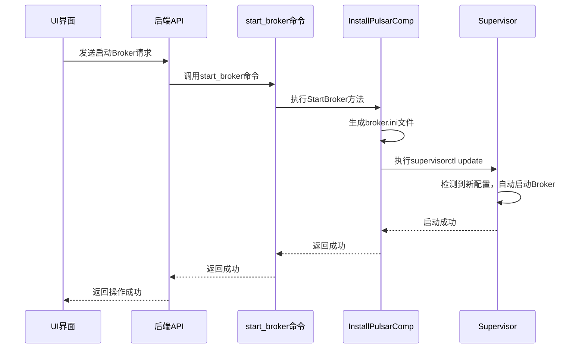
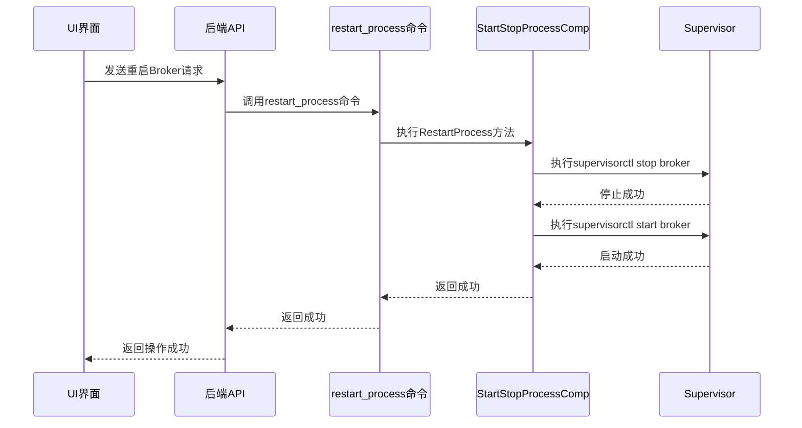

# Broker 管理

<cite>
**本文档中引用的文件**  
- [install_broker.go](file://dbm-services/bigdata/db-tools/dbactuator/internal/subcmd/pulsarcmd/install_broker.go)
- [start_broker.go](file://dbm-services/bigdata/db-tools/dbactuator/internal/subcmd/pulsarcmd/start_broker.go)
- [restart_process.go](file://dbm-services/bigdata/db-tools/dbactuator/internal/subcmd/pulsarcmd/restart_process.go)
- [install_pulsar.go](file://dbm-services/bigdata/db-tools/dbactuator/pkg/components/pulsar/install_pulsar.go)
- [startstop_process.go](file://dbm-services/bigdata/db-tools/dbactuator/pkg/components/pulsar/startstop_process.go)
- [pulsar.go](file://dbm-services/bigdata/db-tools/dbactuator/pkg/core/cst/pulsar.go)
- [pulsar_operate.go](file://dbm-services/bigdata/db-tools/dbactuator/pkg/util/pulsarutil/pulsar_operate.go)
</cite>

## 目录
1. [简介](#简介)
2. [Broker 安装流程](#broker-安装流程)
3. [Broker 启动与重启机制](#broker-启动与重启机制)
4. [配置文件生成与端口绑定](#配置文件生成与端口绑定)
5. [日志目录与系统环境设置](#日志目录与系统环境设置)
6. [部署、启动与重启流程示例](#部署启动与重启流程示例)
7. [UI 操作触发方式](#ui-操作触发方式)
8. [总结](#总结)

## 简介
本文档详细阐述了在 BlueKing DBM 系统中对 Pulsar Broker 节点的管理机制。重点分析了 `install_broker.go` 如何实现 Pulsar 包的下载、解压与 Broker 服务的安装配置，`start_broker.go` 如何启动 Broker 进程，以及 `restart_process.go` 如何协同工作以实现服务的重启。同时，文档描述了 Broker 配置文件的生成、端口绑定、日志目录设置等关键步骤，并通过实例展示完整的部署、启动和重启流程，以及在 UI 界面中如何触发这些操作。

## Broker 安装流程

`install_broker.go` 文件定义了 `InstallPulsarBrokerAct` 结构体和 `InstallPulsarBrokerCommand` 命令，用于执行 Broker 的安装任务。该流程的核心是 `InstallPulsarComp` 组件中的 `InstallBroker` 方法。

安装流程主要分为以下几个步骤：
1.  **初始化参数**：通过 `InitDefaultParam` 方法设置默认的安装路径，如 `/data` 作为安装根目录，`/data/pulsarenv` 作为环境目录。
2.  **创建系统用户**：检查并创建名为 `mysql` 的系统用户，用于运行 Pulsar 服务。
3.  **创建目录结构**：创建必要的数据、日志和配置目录（如 `/data/pulsardata`, `/data/pulsarlog`），并赋予 `mysql` 用户相应的权限。
4.  **解压安装包**：调用 `DecompressPulsarPkg` 方法，从指定路径（如 `/data/install/pulsarpack-2.10.1.tar.gz`）解压 Pulsar 安装包到 `/data/pulsarenv` 目录。
5.  **生成配置文件**：根据从 DBConfig 获取的 `BrokerConfigs` 配置信息，动态生成 `broker.conf` 配置文件。此过程会替换模板中的占位符，如 `{{local_ip}}`、`{{zk_host_list[0]}}` 和 `{{token}}`。
6.  **配置 JVM 参数**：根据服务器内存大小，自动计算并设置 Broker 进程的 JVM 堆内存（`-Xms`, `-Xmx`）和直接内存（`-XX:MaxDirectMemorySize`）大小。
7.  **生成 Supervisor 配置**：生成 `broker.ini` 文件，用于 Supervisor 进程管理器管理 Broker 进程的启动、停止和监控。
8.  **更新 Supervisor 配置**：调用 `supervisorctl update` 命令，使新生成的 `broker.ini` 配置生效。

**Section sources**
- [install_broker.go](file://dbm-services/bigdata/db-tools/dbactuator/internal/subcmd/pulsarcmd/install_broker.go#L1-L105)
- [install_pulsar.go](file://dbm-services/bigdata/db-tools/dbactuator/pkg/components/pulsar/install_pulsar.go#L391-L470)

## Broker 启动与重启机制

### 启动机制
`start_broker.go` 文件定义了 `StartPulsarBrokerAct` 结构体和 `StartPulsarBrokerCommand` 命令，用于启动已安装的 Broker 服务。其核心逻辑在 `InstallPulsarComp` 组件的 `StartBroker` 方法中。

启动流程非常简洁：
1.  **生成 Supervisor 配置**：重新生成 `broker.ini` 文件（即使文件未改变，也会重新写入）。
2.  **更新 Supervisor 配置**：执行 `supervisorctl update` 命令，确保 Supervisor 知晓最新的配置。
3.  **等待启动**：调用 `time.Sleep(10 * time.Second)` 等待 Broker 进程完全启动。

值得注意的是，`StartBroker` 方法本身并不直接调用 `supervisorctl start` 命令。这是因为 `broker.ini` 配置文件中设置了 `autostart=true`，一旦配置被更新，Supervisor 会自动启动 Broker 进程。

**Diagram sources**
- [start_broker.go](file://dbm-services/bigdata/db-tools/dbactuator/internal/subcmd/pulsarcmd/start_broker.go#L1-L105)
- [install_pulsar.go](file://dbm-services/bigdata/db-tools/dbactuator/pkg/components/pulsar/install_pulsar.go#L473-L496)
- [pulsar_operate.go](file://dbm-services/bigdata/db-tools/dbactuator/pkg/util/pulsarutil/pulsar_operate.go#L92-L107)

### 重启机制
`restart_process.go` 文件定义了 `RestartProcessAct` 结构体和 `RestartProcessCommand` 命令，用于重启 Pulsar 的任何进程（包括 Broker）。其核心逻辑在 `StartStopProcessComp` 组件的 `RestartProcess` 方法中。

重启流程是显式控制的：
1.  **停止进程**：执行 `supervisorctl stop <role>` 命令（例如 `supervisorctl stop broker`）来停止指定角色的进程。
2.  **启动进程**：紧接着执行 `supervisorctl start <role>` 命令来重新启动该进程。

这种方式提供了更直接的控制，确保服务被完全重启。

**Diagram sources**
- [restart_process.go](file://dbm-services/bigdata/db-tools/dbactuator/internal/subcmd/pulsarcmd/restart_process.go#L1-L99)
- [startstop_process.go](file://dbm-services/bigdata/db-tools/dbactuator/pkg/components/pulsar/startstop_process.go#L71-L95)

## 配置文件生成与端口绑定

Broker 的配置文件 `broker.conf` 是通过 `InstallPulsarComp.InstallBroker` 方法动态生成的。该方法从 `InstallPulsarParams` 结构体中获取配置参数，并替换模板中的占位符。

关键的配置项包括：
- **`brokerServicePort`**: Broker 的服务端口，由 `BrokerWebServicePort` 参数指定。
- **`zookeeperServers`**: ZooKeeper 集群地址，由 `ZkHost` 参数提供。
- **`clusterName`**: Pulsar 集群名称，由 `ClusterName` 参数指定。
- **`authenticationEnabled` 和 `authorizationEnabled`**: 认证和授权开关，通常为 `true`。
- **`superUserRoles`**: 超级用户角色，用于管理权限。
- **`token`**: 用于认证的令牌，由 `Token` 参数提供。

端口绑定是在 `broker.conf` 文件中通过 `brokerServicePort` 配置项完成的。当 Broker 进程启动时，它会读取此配置并绑定到指定的端口上。

**Section sources**
- [install_pulsar.go](file://dbm-services/bigdata/db-tools/dbactuator/pkg/components/pulsar/install_pulsar.go#L396-L430)

## 日志目录与系统环境设置

系统环境的设置是通过 `InitPulsarDirs` 方法完成的，该方法在安装流程的早期阶段被调用。

主要设置包括：
1.  **创建日志目录**：在 `/data` 分区下创建 `/data/pulsarlog` 目录，用于存放所有 Pulsar 组件的日志。
2.  **创建数据目录**：在 `/data` 分区下创建 `/data/pulsardata` 目录，用于存放 BookKeeper 的数据。
3.  **设置系统用户**：创建 `mysql` 用户，并将所有 Pulsar 相关目录的所有权赋予该用户。
4.  **配置环境变量**：生成一个名为 `pulsarprofile` 的脚本，设置 `JAVA_HOME`、`PATH` 等环境变量，并将其写入 `/etc/profile`，确保所有用户都能使用正确的 Java 环境。
5.  **设置文件句柄限制**：在 `pulsarprofile` 脚本中通过 `ulimit -n 500000` 命令提高系统对文件句柄数的限制，以满足高并发场景的需求。

这些设置确保了 Pulsar 服务能够在稳定、安全的环境中运行。

**Section sources**
- [install_pulsar.go](file://dbm-services/bigdata/db-tools/dbactuator/pkg/components/pulsar/install_pulsar.go#L85-L154)
- [pulsar.go](file://dbm-services/bigdata/db-tools/dbactuator/pkg/core/cst/pulsar.go#L1-L40)

## 部署、启动与重启流程示例

以下是一个完整的 Broker 节点部署、启动和重启的流程示例：

1.  **部署 (Deploy)**:
    *   在 UI 上选择“部署 Pulsar Broker”操作。
    *   系统调用 `install_broker` 命令。
    *   执行 `InstallBroker` 流程，完成解压、配置生成、目录创建等所有安装步骤。
    *   最终输出 "install broker successfully"。

2.  **启动 (Start)**:
    *   在 UI 上选择“启动 Broker”操作。
    *   系统调用 `start_broker` 命令。
    *   执行 `StartBroker` 流程，更新 Supervisor 配置。
    *   Supervisor 根据 `autostart=true` 的配置自动启动 Broker 进程。
    *   最终输出 "start broker successfully"。

3.  **重启 (Restart)**:
    *   在 UI 上选择“重启 Broker”操作。
    *   系统调用 `restart_process` 命令，并传入 `role=broker` 参数。
    *   执行 `RestartProcess` 流程，先停止再启动 Broker 进程。
    *   最终输出 "restart_process successfully"。

**Section sources**
- [install_broker.go](file://dbm-services/bigdata/db-tools/dbactuator/internal/subcmd/pulsarcmd/install_broker.go#L78-L104)
- [start_broker.go](file://dbm-services/bigdata/db-tools/dbactuator/internal/subcmd/pulsarcmd/start_broker.go#L78-L104)
- [restart_process.go](file://dbm-services/bigdata/db-tools/dbactuator/internal/subcmd/pulsarcmd/restart_process.go#L78-L98)

## UI 操作触发方式

在 DBM 的 UI 界面中，用户可以通过以下方式触发 Broker 的管理操作：

1.  **选择目标节点**：在集群管理页面，选择需要操作的 Broker 节点。
2.  **选择操作类型**：在操作菜单中，选择“安装”、“启动”、“停止”或“重启”等选项。
3.  **参数配置**：对于“安装”等复杂操作，UI 会引导用户填写必要的参数，如 Pulsar 版本、ZooKeeper 地址、集群名称、端口等。
4.  **提交任务**：用户确认后，UI 将这些参数封装成一个请求，发送给后端 API。
5.  **后端执行**：后端 API 接收到请求后，会根据操作类型，调用相应的 `dbactuator` 命令（如 `install_broker`, `start_broker`, `restart_process`），并将用户提供的参数作为输入。
6.  **状态反馈**：`dbactuator` 执行完成后，将结果返回给 API，API 再将执行状态（成功或失败）以及日志信息反馈给 UI，供用户查看。

这种设计实现了 UI 与底层执行引擎的解耦，使得 UI 只需关注用户交互，而复杂的运维逻辑由 `dbactuator` 统一处理。

## 总结

本文档深入分析了 BlueKing DBM 系统中 Pulsar Broker 的管理机制。通过 `install_broker.go`、`start_broker.go` 和 `restart_process.go` 等核心文件，系统实现了从安装、配置到启动、重启的全生命周期自动化管理。整个流程依赖于 `dbactuator` 框架，通过定义清晰的命令和组件，结合 Supervisor 进程管理器，确保了 Pulsar 服务的稳定部署和高效运维。UI 界面作为用户入口，通过调用后端 API 来触发这些自动化流程，为用户提供了便捷的操作体验。